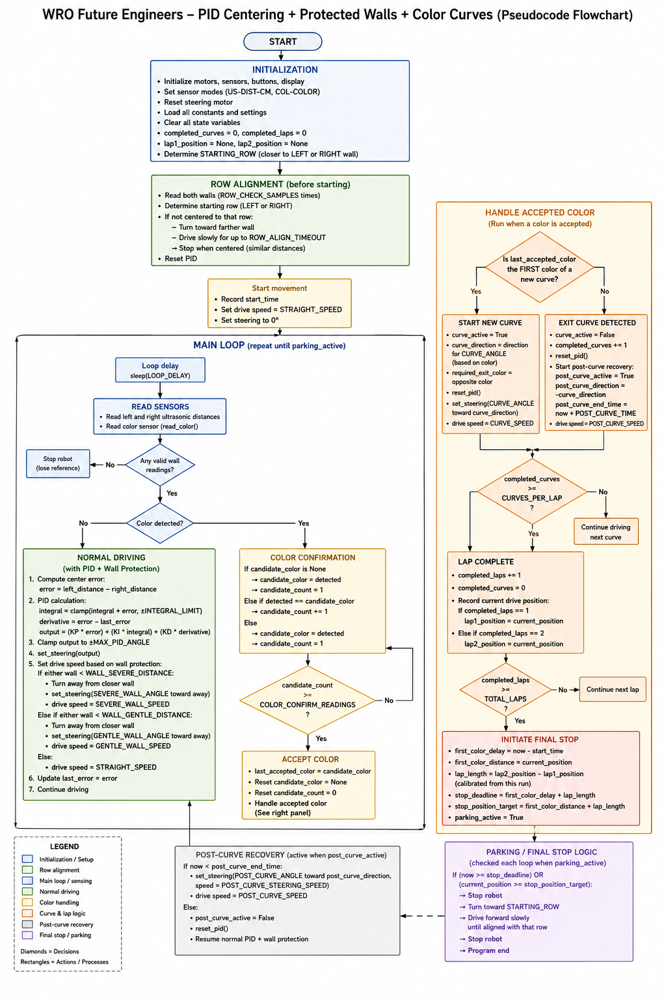

<h1 align="center">🧀 Welcome to the Go!Cheese Repository 🧀</h1>

━━━━━━━━━━━━━━━━━━━━━━━━━━━━━━━━━━━━

━━━━━━━━━━━━━━━━━━━━━━━━━━━━━━━━━━━━

<h3 align="center"><em>"Cheese does run away from rats, right?"</em></h3>

  
  
  

  
  
  
  

---

Welcome to the official repository of **Go!Cheese**, a robotics team from San Miguelito, Panama, competing in the **WRO Future Engineers 2026** season. This repo documents the full engineering journey behind our self-driving vehicle, from the first chassis sketch to the code that runs on the track.

| | |
|---|---|
| 🏆 **Competition** | WRO Future Engineers 2026 |
| 📍 **Region** | San Miguelito, Panama |
| 🧠 **Controller** | LEGO Mindstorms EV3 |
| 💻 **Language** | Python 3 (ev3dev2) + C++ (Arduino Nano) |
| 👁️ **Vision** | HuskyLens camera |
| 🤖 **Steering** | Ackermann geometry |

---
<h3 align="center">Check us out! 👇</h3>

  
  
  

---

# General Index
## WRO2026_FE_Go!Cheese

- [Meet the Team](#meet-the-team)
- [Robot Overview](#robot-overview)
- [1. Mobility & Mechanical Design](#1-mobility--mechanical-design)
  - [Driving base & chassis](#-driving-base--chassis)
  - [Motor selection & torque reasoning](#motor-selection--torque-reasoning)
  - [Steering mechanism](#steering-mechanism-ackermann)
  - [Chassis iterations](#chassis-iterations)
    - [Chassis modifications](#chassis-modifications)
    - [Vision & obstacle readiness](#vision--obstacle-readiness)
- [2. Power & Sensor Architecture](#2-power--sensor-architecture)
  - [Power supply & EV3 brick specs](#power-supply--ev3-brick-specs)
  - [Wiring diagram](#wiring-diagram)
  - [Sensor selection & placement](#sensor-selection--placement)
  - [Sensor calibration](#sensor-calibration)
- [3. Software Architecture & Obstacle Strategy](#3-software-architecture--obstacle-strategy)
  - [Algorithm description](#algorithm-description)
  - [Flowchart](#flowchart)
  - [Open Challenge logic](#open-challenge-logic)
  - [Obstacle Challenge strategy](#obstacle-challenge-strategy)
  - [Corner & edge handling](#corner--edge-handling)
  - [Tuning process](#tuning-process)
- [4. Engineering Decisions](#4-engineering-decisions)
  - [Design decision log](#design-decision-log)
  - [What didn't work](#what-didnt-work)
- [5. Reproducibility](#5-reproducibility)
  - [Bill of Materials](#bill-of-materials)
  - [Build instructions](#build-instructions)
- [Vehicle Photos](#vehicle-photos)
- [Team Photos](#team-photos)
- [Performance Video](#performance-videos)
- [Resources](#resources)

---

## 📌 Project Rundown

### Code Structure & Goal

Cheese runs on a **priority-based decision system**. Instead of following a fixed set of instructions in order, the code checks the situation on every loop and runs the most important action for that moment, which lets the robot react to walls, corners and obstacles in real time.

At its core is a steering controller that keeps the robot centered by measuring how far it is from the walls and correcting its path continuously. On top of that, higher-priority situations, like an upcoming corner or an obstacle, can take over control when needed.

For the **v3** version, we are keeping this same logic but refining it: tuning how the robot reacts to corners, how sharply it steers, and how it manages speed, aiming for smoother and more consistent laps.

> The full technical breakdown of the algorithm, the priority levels and the tuning data is documented in the Software Architecture & Obstacle Strategy section below.

---

### Team Goals (Road to the National Finals)

Beyond just competing, our goals this season are built around the engineering process and improving where it matters most.

**Freeze the code early.** We plan to lock our final obstacle and parking builds at least two weeks before the competition, so we have a real window to test, collect data and tune on the track instead of fixing new problems on competition day.

**Make our documentation count.** Last season we scored 15/30 on documentation. This year our goal is a journal where every decision and iteration is clearly explained and backed by data, directly improving on the areas where we lost the most points.

**Earn our place at the National Finals.** We want this repository to show our full engineering journey across all three versions of the robot, proving the depth of our work and not just the final result.

## 🏎️ Meet the Big Cheese! — Robot Overview

  

### 1. Dimension Table
*Cheese* has been engineered to comply strictly with the official physical constraints dictated by the WRO Future Engineers rulebook (30 x 20 x 30 cm):

| Dimension Parameter | Vehicle Metric (v3) | WRO Maximum Limit | Verification Status |
| :--- | :--- | :--- | :--- |
| **Total Length** | ~28.0 cm | 30.0 cm | 🟩 Fully Compliant |
| **Total Width** | ~13.0 cm | 20.0 cm | 🟩 Fully Compliant |
| **Total Height** | ~27.0 cm | 30.0 cm | 🟩 Fully Compliant |
| **Chassis Weight** | **888.1 g** | - | ⚡ Weight-Optimized |

---

### 2. Feature Table
A quick technical summary of the main technical specifications embedded into our platform:

| Core Subsystem | Technical Implementation Specifications |
| :--- | :--- |
| **Main Controller** | LEGO Mindstorms EV3 Brick running Python 3 (`ev3dev2`) |
| **Co-Processing Unit** | Arduino Nano (ATmega328) running C++ |
| **Vision Sensor** | HuskyLens AI Smart Camera via high-speed I2C communication |
| **Propulsion System** | Rear-wheel drive driven by a LEGO EV3 Large Motor |
| **Steering Assembly** | Front-axle Ackermann steering geometry driven by a LEGO EV3 Medium Motor |
| **Sensing** | 2x Ultrasonic + Color sensor + HuskyLens camera |
| **Sensing Array** | 2x Ultrasonic sensors (wall-following) + 1x Color sensor (corner timing) |

---

### 3. Achievements & Track Milestones

* **Regional experience:** We competed in the regional stage, which became a turning point for us. It gave us our documentation baseline of 15/30 and, just as importantly, showed us exactly where we were losing points. Seeing a 0 in Software & Obstacle Strategy made it clear where to focus this season, and that feedback shaped almost every decision we made afterward.

* **Stronger, more stable chassis:** Our redesign added structural reinforcements, including cross-bracing and a central liftarm spine that ties the front and rear of the car together. This noticeably improved rigidity and stopped the frame from twisting during sharp turns. It did raise the weight from 763.5 g (v2) to 888.1 g (v3), but we accepted that tradeoff on purpose, since a steady, predictable robot mattered more to us than saving a few grams at our current speed.

* **Smarter sensing setup:** We reworked how the robot senses the track. The HuskyLens camera runs its own image processing and connects through an Arduino Nano, which keeps that work off the EV3 so it stays free for navigation. We also replaced our unreliable front ultrasonic with a color sensor for corner timing, which made the robot read the track far more consistently.

---

### 4. Structural Evolution (v1, v2, & v3)

*Cheese* went through three versions before reaching its current form, and each one was a direct response to the problems we ran into with the version before it. Our changes were never random: every redesign chased more stability, more reliable sensing, or a fix to something that had failed on the track. Along the way we reworked the position of the EV3, rebuilt the steering so the motor could actually move it, swapped tires and sensors, added a camera, and reinforced the chassis, gaining a bit of weight in exchange for a much steadier robot. Here is a quick overview of how it evolved, with the full reasoning behind each change explained further down in the documentation.

| Aspect | v1 (digital model) | v2 (first regional) | v3 (current) |
| :--- | :--- | :--- | :--- |
| **Stage** | BrickLink model, never fully built | First physical build | Current competition build |
| **EV3 position** | Vertical | Horizontal | Horizontal |
| **Sensors** | 2 ultrasonic + 1 infrared | 3 ultrasonic | 2 ultrasonic + 1 color |
| **Rear tires** | Same size front/rear | 56 x 28 ZR | 56 x 28 ZR |
| **Camera** | None | None | HuskyLens on custom mount |
| **Chassis** | Compact | Compact | Lengthened front |
| **Weight** | Not measurable (model only) | 763.5 g | 888.1 g |

In short: v1 was only a digital model that proved unstable when built, v2 became our first real robot with a stable steering base, and v3 added vision and a color sensor for reliable corner timing, trading a little extra weight for noticeably more stability.

---

### 5. Cheese's logic (Flowchart Logic)

This flowchart represents the full decision cycle used by *Cheese* during the WRO Future Engineers run and circuit. The robot first initializes its motors, sensors, steering position, constants, and lap counters. Before starting, it performs a row-alignment routine by reading both ultrasonic sensors to determine if it's closer to the left or right wall and adjust its position to start the laps.

Once the run begins, the main loop repeats continuously. In every cycle, the robot reads the ultrasonic sensors and the color sensor, then decides which behavior has priority. During normal driving, the ultrasonic sensors feed a PID system that keeps the robot between the walls. If a wall is too close, wall-protection logic overrule the normal PID and applies stronger steering corrections, continiung the logic during all three laps.

When the color sensor detects a valid color, the robot confirms it through multiple readings to avoid false detections. Accepted colors are used to start or finish curves. A first color starts a curve, while the opposite color ends it, increases the curve counter, and activates recovery after the curve has been succesfully executed. After each set of curves, the robot updates the lap counter.

After completing the number of laps, the robot enters the final stop and parking logic. It uses timing and position references recorded during the run to stop near its starting row, realign itself, and finish the program.

  

> **Note**: This flowchart was made using artificial inteligence as a support tool, keeping the logic used to develop the functioning of Cheese.
---
## 6. Cheese's Angles

This section shows the labeled angle views of **Cheese v3**. These images identify the main mechanical, electrical, and sensing components from different perspectives, making it easier to understand how the robot is physically organized.

Instead of only showing plain photos, these named angles act as a visual map of the robot. They allow readers to see where each subsystem is placed, how the components are distributed across the chassis, and how the final v3 layout supports stability, sensor access, wiring organization, and future obstacle detection.

  

<em>Front named angle: shows the front layout, HuskyLens camera, helping lamp, ultrasonic sensors, color sensor, Arduino Nano, and steering area.</em>

### Quick View Index

| Angle | Jump to view |
| :--- | :---: |
| Front angle | [View front](#-front-named-angle-) |
| Left angle | [View left](#-left-named-angle-) |
| Back angle | [View back](#-back-named-angle-) |
| Right angle | [View right](#-right-named-angle-) |
| Top angle | [View top](#-top-named-angle-) |
| Bottom angle | [View bottom](#-bottom-named-angle-) |

---

  

<em>Left named angle: shows the side structure, EV3 Brick placement, motors, sensor alignment, lighting system, and chassis support.</em>

---

  

<em>Back named angle: shows the rear structure, Large Motor position, Arduino Nano, HuskyLens camera, wiring area, and lighting battery.</em>

---

  

<em>Right named angle: shows the right-side component layout, motors, sensors, EV3 Brick position, and support structure.</em>

---

  

<em>Top named angle: shows the top-down organization, wiring path, camera system, Arduino Nano placement, and rear motor area.</em>

---

  

<em>Bottom named angle: shows the underside structure, wheelbase, chassis support, EV3 position, sensor visibility, and motor placement.</em>

---

## Meet the Team

We are **Go!Cheese**, a robotics team of two from San Miguelito, Panama, competing in the WRO Future Engineers 2026 season. Romina and Caylee work collaboratively: Romina handles the changes and builds on the robot itself, while Caylee handles the documentation. Our roles complement each other step by step, since we constantly rely on one another, sharing observations and feedback to keep improving and moving forward.

  

---

### Caylee Rios

- **Age:** 16
- **Description:** Hii! My name is Caylee and this is my first time competing in WRO. I'm really happy to be part of a sport that pushes you toward hard work and personal growth. I'm in charge of the software and the documentation. I love smiling, asking lots of questions, and having people I care about around me who inspire me and push me to be better every day.

[Instagram](https://www.instagram.com/caymrr) · [Email](mailto:cayleerios@gmail.com)

  

---

### Romina Mora

- **Age:** 16
- **Description:** Helloo!!! I'm Romina, a very passionate gamer. I enjoy anything that represents a challenge, including this project. Since 2025 I've shown interest in robotics in general, and I finally managed to join a team in 2026. I wish to learn plenty to improve my skills next year. My role is programmer and robot builder.

*No socials, so reach out through my partner.*

  

---

<h2 align="center">🧀 Why "Cheese"? 🧀</h2>

  <em>"From a childhood rhyme to the competition track."</em>

────────୨ৎ────────

Our name comes from a little recess rhyme we used to play back when we were kids. It always stuck with us, so when it came time to name our team, we picked something that carries a piece of that memory with us. That is how **Go!Cheese** was born, a name that reminds us of where we started and of the season of our lives we are living right now.

Our robot is named **Cheese** as a pun on our team name. The idea is simple, and it is the heart of everything we build:

  <strong>Cheese is the one who goes.</strong>

────────୨ৎ────────

