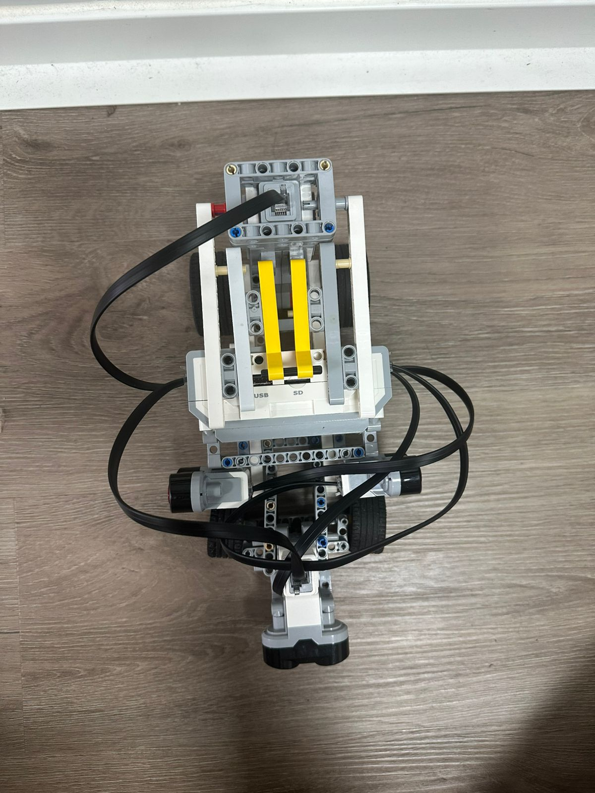

<h1 align="center">🧀 Welcome to the Go!Cheese Repository 🧀</h1>

━━━━━━━━━━━━━━━━━━━━━━━━━━━━━━━━━━━━

━━━━━━━━━━━━━━━━━━━━━━━━━━━━━━━━━━━━

<h3 align="center"><em>"Cheese does run away from rats, right?"</em></h3>

  
  
  

  
  
  
  

---

Welcome to the official repository of **Go!Cheese**, a robotics team from San Miguelito, Panama, competing in the **WRO Future Engineers 2026** season. This repo documents the full engineering journey behind our self-driving vehicle, from the first chassis sketch to the code that runs on the track.

| | |
|---|---|
| 🏆 **Competition** | WRO Future Engineers 2026 |
| 📍 **Region** | San Miguelito, Panama |
| 🧠 **Controller** | LEGO Mindstorms EV3 |
| 💻 **Language** | Python 3 (ev3dev2) + C++ (Arduino Nano) |
| 👁️ **Vision** | HuskyLens camera |
| 🤖 **Steering** | Ackermann geometry |

---
<h3 align="center">Check us out! 👇</h3>

  
  
  

━━━━━━━━━━━━━━━━━━━━━━━━━━━━━━━━━━━━
---

---

## 📌 Project Rundown

### 💻 Code Structure & Goal
Our software architecture preserves the logical core of our original codebase: a **priority-based** decision-making system backed by a **steering PID controller** ($K_P = 0.56, K_D = 1.22$)[span_0](start_span)[span_0](end_span). However, for the **v3** iteration, we are systematically optimizing and calibrating critical algorithmic thresholds—such as turn angles and dynamic speed layers—to achieve significantly smoother, more accurate, and highly repeatable lap times on the live track[span_1](start_span)[span_1](end_span).

### 🎯 Cheese's Goals & Mission
> 🚀 **Engineering Inspiration:** Drawing from world-class documented repositories like *ShahroodRC*, we have broken down our vehicle's performance targets into concrete, verifiable metrics[span_2](start_span)[span_2](end_span):

| Challenge / Mission | Engineering Target & Success Metric | Status |
| :--- | :--- | :---: |
| **Open Challenge** | Cleanly clock 3 consecutive laps in **under 1 minute and 30 seconds** under fully autonomous execution[span_3](start_span)[span_3](end_span). | ⬜ Planned |
| **Obstacle Challenge** | Flawless navigation. Safely clear red pillars on the left and green pillars on the right using real-time HuskyLens vision processing... with zero collisions[span_4](start_span)[span_4](end_span). | ⬜ Planned |
| **Parallel Parking** | Secure a perfectly centered position inside the designated parking zone, entering and exiting **without making a single-wall contact**[span_5](start_span)[span_5](end_span). | ⬜ Planned |

### 👥 Team Goals (Road to the National Finals 🇵🇦)
* **Safety Margin:** Freeze the definitive obstacle and parking software builds at least **2 weeks prior to the competition** to guarantee a broad testing window for data collection and trackside tuning[span_6](start_span)[span_6](end_span).
* **Crush the Previous 15/30:** Elevate this repository into an exhaustive, scientifically rigorous engineering journal so transparent that judges have no choice but to award a top-tier documentation score[span_7](start_span)[span_7](end_span).
* **The Grand Objective:** Document our technical evolution step-by-step to decisively earn our ticket straight to the **National Finals**.

---

## 🏎️ Meet the Big Cheese — Robot Overview

  

### 📊 Dimensions & Physical Constraints
*Cheese* has been engineered to comply strictly with the official WRO dimensional boundaries ($30 \times 20 \times 30\text{ cm}$)[span_8](start_span)[span_8](end_span):

| Dimension | Vehicle Measurement (v3) | WRO Maximum Limit | Status |
| :--- | :--- | :--- | :--- |
| **Length** | ~28.0 cm[span_9](start_span)[span_9](end_span) | 30.0 cm[span_10](start_span)[span_10](end_span) | 🟩 Compliant |
| **Width** | ~13.0 cm[span_11](start_span)[span_11](end_span) | 20.0 cm[span_12](start_span)[span_12](end_span) | 🟩 Compliant |
| **Height** | ~27.0 cm[span_13](start_span)[span_13](end_span) | 30.0 cm[span_14](start_span)[span_14](end_span) | 🟩 Compliant |
| **Current Weight** | **888.1 g**[span_15](start_span)[span_15](end_span) | Unlimited | ⚡ Lightweight & Agile |

### ⚙️ Technical Specifications & Component Mapping

| Subsystem | Component Details & Engineering Logic |
| :--- | :--- |
| **Chassis & Body** | Fabricated entirely from LEGO Technic components utilizing stacked ABS plastic liftarms running from front to back, reinforced by custom pink side *cross-bracing* to eradicate chassis twisting and structural flex[span_16](start_span)[span_16](end_span). |
| **Powertrain (Drive)**| Direct drive configuration (1:1 gear ratio, omitting any intermediate gear reductions) linking the **EV3 Large Motor** (`OUTPUT_B`) straight to the rear axle, fitted with 56 x 28 ZR tires[span_17](start_span)[span_17](end_span). |
| **Steering System** | **Ackermann** steering geometry driven by an **EV3 Medium Motor** (`OUTPUT_A`), enabling the inner wheels to naturally turn tighter than the outer wheels for optimal cornering traction[span_18](start_span)[span_18](end_span). |

### 🔌 I/O Ports & Sensor Configuration

| Port | Connected Device | Mounting & Operational Placement |
| :--- | :--- | :--- |
| `INPUT_1` | Left Ultrasonic Sensor | Mounted ultra-low on the chassis for precise sidewall tracking[span_19](start_span)[span_19](end_span). |
| `INPUT_2` | Front Ultrasonic Sensor | Centered forward-facing to detect upcoming walls/hazards[span_20](start_span)[span_20](end_span). |
| `INPUT_3` | Right Ultrasonic Sensor | Mounted ultra-low on the chassis for precise sidewall tracking[span_21](start_span)[span_21](end_span). |
| `USB Port`| Arduino Nano (ATmega328) | High-speed data link to the co-processor hosting the **HuskyLens** smart camera via I2C[span_22](start_span)[span_22](end_span). |

### 📈 Evolution (Brief)
The current design marks our 3rd iteration (v1, v2, and v3)[span_23](start_span)[span_23](end_span). Our most radical breakthrough involved transitioning the massive EV3 Intelligent Brick from a tall vertical orientation to a **flat horizontal layout**[span_24](start_span)[span_24](end_span). This aggressively dropped our center of gravity, mitigating vehicle tip-over risks and dramatically stabilizing high-speed cornering[span_25](start_span)[span_25](end_span).

---
---

# WRO2026_FE_Go!Cheese
## Contents

- [Meet the Team](#meet-the-team)
- [Robot Overview](#robot-overview)
- [1. Mobility & Mechanical Design](#1-mobility--mechanical-design)
  - [Driving base & chassis](#-driving-base--chassis)
  - [Motor selection & torque reasoning](#motor-selection--torque-reasoning)
  - [Steering mechanism](#steering-mechanism-ackermann)
  - [Chassis iterations](#chassis-iterations)
    - [Chassis modifications](#chassis-modifications)
    - [Vision & obstacle readiness](#vision--obstacle-readiness)
- [2. Power & Sensor Architecture](#2-power--sensor-architecture)
  - [Power supply & EV3 brick specs](#power-supply--ev3-brick-specs)
  - [Wiring diagram](#wiring-diagram)
  - [Sensor selection & placement](#sensor-selection--placement)
  - [Sensor calibration](#sensor-calibration)
- [3. Software Architecture & Obstacle Strategy](#3-software-architecture--obstacle-strategy)
  - [Algorithm description](#algorithm-description)
  - [Flowchart](#flowchart)
  - [Open Challenge logic](#open-challenge-logic)
  - [Obstacle Challenge strategy](#obstacle-challenge-strategy)
  - [Corner & edge handling](#corner--edge-handling)
  - [Tuning process](#tuning-process)
- [4. Engineering Decisions](#4-engineering-decisions)
  - [Design decision log](#design-decision-log)
  - [What didn't work](#what-didnt-work)
- [5. Reproducibility](#5-reproducibility)
  - [Bill of Materials](#bill-of-materials)
  - [Build instructions](#build-instructions)
- [Vehicle Photos](#vehicle-photos)
- [Team Photos](#team-photos)
- [Performance Video](#performance-videos)
- [Resources](#resources)

## Meet the Team    
Welcome to the official GitHub repository for Team Go!Cheese from Panama, participating in the WRO 2026 San Miguelito Regional in the Future Engineers category, Open Challenge.

Team Go!Cheese is made up of two unlikely friends who somehow decided that building an autonomous robot, learning GitHub, using BrickLink, programming, documenting, troubleshooting, and surviving WRO all at the same time was a good idea. This is our first time working with many of these tools and technologies, so this repository is not only a place for our source code, materials, and robot documentation, but also proof of our learning process.

Even if we do not achieve something huge in this competition, our goal is to step out of our comfort zone, learn as much as possible, and use this experience to come back stronger in the future. We may be beginners now, but we are determined to improve, keep building, and go beyond what we thought we were capable of.

## 🚗Robot Overview🚗    

Our vehicle is a robot built entirely from LEGO Mindstorms EV3 components. It uses three ultrasonic sensors for object detection, and a large and medium motor for Ackerman steering and drive. Below are its physical dimensions in its final configuration.

| Specification | Value |
|---|---|
| Length | ~28 cm (280 mm) |
| Height | ~27 cm (270 mm) |
| Width | ~13 cm (130 mm) |
| Weight | ~888.1 g (0.8881 kg) |
| Controller | LEGO Mindstorms EV3 Brick + Arduino Nano (ATmega328), used alongside the camera |
| Drive motor | EV3 Large Motor (OUTPUT_B) |
| Steering motor | EV3 Medium Motor (OUTPUT_A) |
| Sensors | 3x Ultrasonic (INPUT_1, 2, 3) + 1x HuskyLens Camera |
| Language | Python 3 (ev3dev2) + C++ for the Arduino Nano |

## ･ﾟ✧1. Mobility & Mechanical Design ･ﾟ✧:･ﾟ✧:

### Driving base & chassis      

Our driving base and chassis are built entirely from official LEGO Mindstorms EV3 Technic parts. We chose a fully LEGO build for a few practical reasons.

First, LEGO parts connect natively with the EV3 brick and its motors, so mounting our drive motor, steering motor and ultrasonic sensors required no custom brackets. Our HuskyLens camera is the exception, since it is not a LEGO part and had to be integrated through an Arduino Nano, which we explain in the Power & Sensor Architecture section. Second, a LEGO build let us test a design, find a weak point and rebuild that section quickly, which was important because our chassis went through three major versions (v1, v2 and v3). Third, the EV3 kit almost always has a part that does what we need, so we rarely got stuck waiting for a component.

A fully LEGO frame also has real downsides, and we want to be honest about them. The plastic beams show a small amount of flex at higher speeds, and pinned connections can loosen after repeated impacts against the walls. We considered these tradeoffs acceptable, and we addressed them directly through the important modifications documented in the Chassis iterations section below.

The car uses rear wheel drive and front wheel steering. An EV3 Large Motor drives the rear axle (OUTPUT_B), while an EV3 Medium Motor controls the front Ackermann steering linkage (OUTPUT_A). We explain the motor and gearing choices in the Motor selection section below. The full robot measures roughly 28 by 13 by 27 cm and weighs about 888.1 g, which keeps us within the 30 by 20 by 30 cm size limit.

The backbone of the chassis is a central spine of stacked Technic liftarms that runs from the front steering module to the rear drive module. This spine ties both ends of the car into one rigid unit so the steering and drive sections do not twist independently. On each side we added liftarm cross bracing (the pink beams in the photos) to reduce the flex mentioned above and keep the frame square under load.

The three ultrasonic sensors sit low on the frame: one on the left, one on the right and one facing forward at the center. Mounting them low and directly on the structural beams keeps their readings stable and stops them from shifting on impact. In our current version (v3), the EV3 brick is mounted horizontally, lying flat, with its buttons and display facing up toward the large motor at the back. This position keeps our footprint inside the size limit, leaves the buttons easy to reach, and still lets us mount the HuskyLens camera high enough for a clear forward view.

### Technical Liftarms ────୨ৎ────────୨ৎ────────୨ৎ────────୨ৎ──────
★ Benefits:  
The use of liftarms brings a lot of benefits. They are very lightweight due to the acrylonitrile butadiene styrene (ABS) plastic used in their making. They are incredibly rigid thanks to their synergy with technic pins, which allow them to work build an inflexible structure. This lack of flexibility is crucial for PID-based code we are running as they reduce the mechanic noise the PID needs to work with. They allow crossbracing, the stacking of liftarms in perpendicular shapes, to build triangular structures that can prevent the twist of the robot during sharp turns and increase precision. We can also use them to redesign steering geometry or support geometry quickly. The liftarm's holes are placed in specific units and measurements (1 stud = 8mm). These holes allow the positioning of pieces in very specific ways like the mount we've made for the HuskyLens AI Camera.

಄ Disadvantages:  
Technic liftarms are quite heavy (ranging from 0.5 grams to 4.5 grams). Currently, this is one of the main reasons why our speed of around 0.32 m/s is being held back. To use the liftarms to their maximum potential, we need to know how to make triangles to efficiently support and distribute weight, which is a skill we haven't obtained yet. Their stud placement of 8mm can limit already established geometry like the Ackermann streeing geometry, so they essentially limit our geometry system.

♡ Conclusion:   
After analyzing its benefits and disadvantages, I can say that the liftarms are the main problem of our current chassis and overall build. They are amazing for building structures, which was the main reason why they were chosen. They are easily attachable using pins and axles, and their assembly do not take a lot of time. When put together, their hard plastic allow for rigidity and stability. We are using them at their most basic level: connecting the liftarms with connectors and seeing what works. As you can observe in the image, we placed liftarms based on our inspiration and what we felt right. This method doesn't take the total weight into calculation, and thus we hit weights of around 7.8N (mass of about 0.8kg*9.81m/s^2). The increased mass and weight led us to reach a top speed of 0.38 m/s during good runs, which is slow in our opinion. We believe that if we want to increase top speed and overall performance, we need to adjust our use of liftarms to properly manage weight distrubution and strength to achieve a higher top speed. 

### Technic Pins & Axles ────୨ৎ────────୨ৎ────────୨ৎ────────୨ৎ────────

★Benefits:  
The axles and pins allow for easy connection between liftarms, motors, sensors, and wheels. Pins are a very crucial part of the build since we wouldn't be able to attach all the pieces together and form a cohesive chassis design. The friction in the pins allow us if we want to keep a piece in a fixed position or if we want it to rotate freely. They also allow for easy touch-ups and adjustments during the coding process. When talking about axles, we must note their ability to allow rotation to other pieces such as the wheels, which use a 3L axle with stop to rotate forward and backwards. The rotation done by the axles can transmit the torque from thr large motor to the wheels. Axles can come in any standard length, and, with the use of 3D printer and custom models, we can do personalized lengths. Since they do not depend on holding things together, something pins must do, they do not get ruined with time.

಄Disadvantages:  
The technic pins are incredibly prone to breaking while holding weight with no additional support, which can lead them to shattering when handling them. They also become slowly ruined thanks to the friction caused by holding together the liftarms. This leads to weak grip between pieces, and the simple vibration of the car can finally pull the pieces apart. In the other hand, axles require bushings to be tightened to pieces like wheels. If wrongly adjusted, the pieces can move around and misalign the geometry. 

♡ Conclusion:  
Pins and axles (although, mostly pins) are the staple of our build. They help the liftarms take shape into the desirable structure. They are absolutely required since they are essential when using technic liftarms. Pins and axles work alongside the liftarms to hold the structure together, provide mobility, and better shape. We understand that they are quite fragile, specially pins. They can't really hold much stress compared to actual metal screws. Personally, we wouldn't change pins and axles. In fact, the easy addition and removal of pins by using a pull force help us make quick modifications to the structure/chassis. Our only complaint regarding pins is their whimsy plastic. Pins would greatly enjoy having a harder plastic that can't bend as easily. This fragility is also the reason our redesign required adding more pins and connectors than our virtual model predicted. Because each individual pin holds only a small load before slipping, reinforcing a weak joint meant adding several pins around it instead of relying on just one. This connects directly to the stability problems described in the Chassis modifications section, where the physical build needed far more reinforcement than the digital model suggested.

### Motor selection & torque reasoning ────୨ৎ────────୨ৎ────────୨ৎ────────୨ৎ────────

Our vehicle uses two LEGO Mindstorms EV3 motors: one large and one medium.These are connected directly to the EV3 brick: the large motor drives the rear axle through OUTPUT_B, and the medium motor controls the steering through OUTPUT_A. Both motors were chosen for their natural compatibility with the rest of our components and their ability to provide reliable speed and torque on their own.

The large motor, used for moving and load-bearing propulsion, has a top speed of 170 RPM, a running and stall torque of 20Nxcm and 40 Nxcm respectively, an operating voltage of 9V, and a weight of 76g. It trades off speed for torque. This trade-off is required to properly move load since driving needs to overcome the inertia of the chassis, rolling resistance, and friction in the drivetrain. Compared to the medium motor, it has a higher rotational inertia. Its heavier rotor stores momentum and allows for a smoother delivery where any resistance can be pushed through without much stalling. It can also be used for measuring distance through its rotations. It is bulkier and larger compared to a medium motor, and for us, this design structure makes it unfit to be placed on the front of the robot. It would also compete for space with the steering chassis and add weight on undesirable areas. Based on this, we can say that its most defining trait is the high torque that accelerates the robot's mass and does feats unmatched by a medium motor.

Finally, the medium motor has a top speed of 250 RPM, a running torque of 8Nxcm, a stall torque of 12Nxcm, and an operating voltage of 9V and a weight of only 36g. This motor's higher RPM and lower torque make it better suited for steering. Its low weight also helps on making our robot lighter, benefiting its speed overall. We can say that the medium motor is the total opposite of the large motor. It has a low rotational inertia that allows for reversible motion, which is heavily required for quick adjustments and steering in our PID-focused build. It has a lighter rotor that allows for quick acceleration and reversals. Since steering is a very repetitive task of moving back-and-forth and center-to-sides, a motor with easy direction changes is needed to produce tighter, more stable steering corrections. The medium motor has a rotation sensor built-in, and it allows for the control of all angles. Steering is about absolute position. It needs to perfectly hold positions, so proportional steering and reliable centering become possible. It has higher speed compared to the large motor snd it helps for quick position-switching. The medium motor is also smaller, flatter, and lighter than the large motor. As previously mentioned, the steering area of the chassis task most of the available space at the front. The motor's compact body easily fits there, and its light weight prevents the steering mechanism from sagging. 

### Steering mechanism (Ackermann) ────୨ৎ────────୨ৎ────────୨ৎ────────୨ৎ────────

Our robot uses an Ackermann steering mechanism on the front axle, which 
is controlled by the EV3 medium motor. In this type of steering, the two 
front wheels turn at different angles when the robot takes a turn. The 
inner wheel turns more sharply than the outer one. This is important because both wheels are tracing different sized arcs at the same time, and if they were forced to turn at the same angle, they would drag and scrub against the ground instead of rolling cleanly. Ackermann geometry solves this by giving each wheel the correct angle for the arc it needs 
to follow.

We chose this steering system because the WRO track has four corners per 
lap, and we needed our robot to take them consistently and without losing 
control. The medium motor controls steering through direct angle commands rather 
than timed pulses. The code calls `on_to_position()` with a target angle 
in degrees (`ANGLE_CENTER`, `ANGLE_GENTLE`, `ANGLE_MEDIUM`, `ANGLE_STRONG`, 
or `ANGLE_DANGER`), and the motor moves to that exact position and holds 
it with the brake engaged. This is more precise than a timed-pulse 
approach, since the motor always reaches the same physical angle 
regardless of small variations in motor speed or friction.

### Chassis modifications ────୨ৎ────────୨ৎ────────୨ৎ────────୨ৎ──────

Our robot went through one major structural redesign between its first and final version. The root cause is worth stating up front: we designed the first version entirely in the BrickLink modeling software before building it physically with the LEGO MINDSTORMS kits. When we recreated that virtual model with the real parts, we discovered that most of the modeled structures had serious problems with their connections and stability. Almost every change described below came from that gap between the digital model and the physical build.

**The original design**

In the original design, the EV3 brick was mounted horizontally at the center of the chassis, with the start button facing the front of the robot. This orientation turned out to be a mistake in practice, because it made the start button difficult to reach when we needed to launch a run. The chassis itself was also more compact and shorter than our final one. We made it that way on purpose, since we wanted the car to be as swift as possible and a smaller frame felt like the faster option at the time.

We also worked on the Ackermann steering geometry during this first stage. For the linkage we used a Technic liftarm 1x3, some Technic pins, and a 3L axle with stop. However, when we mounted the medium motor to test the steering, the motor had a hard time positioning the whole geometry. The pins combined with that liftarm did not allow for flexible movement, so the steering fought against the motor instead of moving smoothly, and we had to scratch that setup from our plans. On top of this, we had originally planned to use the same size wheels on both the front and the rear.

Overall, the first design ended up being both unstable and too rigid in the wrong places: loose where it needed to hold, and stiff where it needed to move.

**The final design**

For the final version, we rebuilt the chassis with the EV3 brick still mounted horizontally, but rotated around so that its buttons and display face the large motor at the back. Because there is more open space between the EV3 brick and the large motor, our hands can now reach the buttons easily, which fixed the access problem from the original layout.

We also lengthened the front of the chassis. This sacrificed our earlier idea of a small chassis built for higher speed, but in exchange it gave us noticeably more stability, which was the better tradeoff for reliable runs. To make the longer frame work, we had to add several new structures capable of holding the longer Technic liftarms at the front. We then added support on both sides of the front medium motor, so that the motor would not shift aggressively from side to side while steering and create more problems for us during testing.

To fix the stiff steering from the original version, we switched the Technic liftarm 1x3 for a connector with pin alongside a 3L axle with stop, which finally gave the steering mechanism the smooth movement it was missing. We also added support to the large motor so that it would stay straight and keep the tires held tight against it. In addition, we changed the rear tires to a bigger size: we had originally been running 13.2 x 22 ZR tires on both the front and rear, but after seeing how unsteady the chassis was, we swapped the rear tires for larger 56 x 28 ZR ones to plant the drive end of the car more firmly.

Finally, it is worth mentioning that we ended up adding more Technic pins and connectors than we originally expected. This ties back to the main lesson of this redesign: the virtual model looked complete on screen, but the physical build needed far more reinforcement at its connection points to actually hold together and stay stable under load.

   
  <em>Comparison between both steering mechanisms and the redesigned front of the chassis.</em>

### Vision & obstacle readiness ────୨ৎ────────୨ৎ────────୨ৎ────────୨ৎ──────

Fixing the chassis made the robot stable, but stability alone does not win the Obstacle Challenge. The single most important upgrade between our first and final version was giving the robot the ability to see, and then getting that vision to actually look at the right place.

**The problem: a robot that could not see**

Our first chassis was simply not ready for the Obstacle Challenge. It had no camera and no color sensor, which meant it had no way to identify the red and green pillars, and therefore no way to react to them at all. Worse, there was not even a place on the frame designed to hold a camera, so adding vision was not just a matter of plugging something in, we had to create space and structure for it. This was a hard limit: without a camera, an entire round of the competition was impossible for us, no matter how well the car drove.

**Adding the camera**

To solve this, we built a LEGO camera mount inspired by another team's design and adapted it to fit our specific hardware, the HuskyLens. Choosing to base our mount on an existing, proven design saved us from reinventing something from scratch, and adapting it to the HuskyLens made sure it fit our own camera rather than the one it was originally meant for. With a working camera finally in place, the robot could take on the Obstacle Challenge for the first time and begin detecting the pillars it needs to pass.

**Repositioning the camera for a usable view**

Getting the camera onto the robot was only half the job. In the first version of the mount, the camera sat too far back and too high on the frame, which meant it could not clearly see the track directly ahead of the car, exactly the area where the pillars appear. A camera that is mounted but pointed at the wrong place is almost as useless as no camera at all.

We fixed this by lowering the camera, raising the EV3 brick and attaching the mount to the back of it so the HuskyLens could sit at a better height and angle. After this change, the camera has a clear, unobstructed view of what is directly in front of the robot, which is exactly the field of view the color detection depends on to identify pillars in time to react.

ᯓ★ Comparisons between version 1 & version 2:
NEXT STEP

## 2. 🪫Power & Sensor Architecture🪫   

For our controller and power supply, we used a standard LEGO Mindstorms EV3 Brick. We chose this brick because it works as both the brain and the battery of our robot, meaning all of our sensors and motors draw power directly from it without needing any external power source or voltage regulators.

The brick has 16 MB of flash memory, 64 MB of RAM, and outputs between 
0V and 9V depending on the component connected. Its rechargeable battery 
has a maximum capacity of 2000 mAh. To decompose our power usage, our three ultrasonic sensors consume approximately 3.3V each at low current, and our two motors consume the most power during movement and recovery maneuvers. Running all five components simultaneously stays well within the brick's output capacity. 

During early testing sessions we experienced several unexpected shutdowns mid-run, not due to hardware failure, but 
because we neglected to fully charge the battery before testing. This taught us to treat battery management as part of our testing routine, and we made it a standard practice to verify battery level on the EV3 display before every run. After adopting this habit, we did not experience any further power interruptions during testing.

This experience also reinforced an important operating constraint: the 
robot only performs reliably when the battery has sufficient charge to 
power the full system simultaneously. Since the EV3 brick supplies all 
five components (three sensors and two motors) from a single 2000 mAh 
source, a partially depleted battery does not cause the robot to fail 
outright, but it does reduce motor torque and steering responsiveness 
enough to affect navigation accuracy. This is because we use a PID system (Proportional-Integral-Derivative), which relies heavily on the power our robot is supplied with. Thankfully, the EV3 brick has a respectable and sufficient power output, which makes our PID system workable. Even though using other batteries could prove to be more efficient, an EV3 brick works just fine. However, if we get more time to tinker and develop our robot, we might switch the brick out for a battery for the reason of efficiency.

### Wiring diagram  

The diagram below shows how all sensors and motors connect to the EV3 brick. Ultrasonic sensors plug into sensor ports 1, 2, and 3, while the medium and large motors connect to motor ports A and B respectively. All connections use standard LEGO Mindstorms cables with no external wiring.

> **Note:** This wiring diagram was created with the assistance of AI 
> tools based on our actual port assignments as defined in our code 
> (`OUTPUT_A`, `OUTPUT_B`, `INPUT_1`, `INPUT_2`, `INPUT_3`). The connections 
> shown reflect exactly how our sensors and motors are wired to the EV3 
> brick.

### Sensor selection & placement    

For our sensor setup, we use three ultrasonic sensors, each connected to 
its own dedicated input port and serving a different role in the 
robot's decision-making: `INPUT_1` (left), `INPUT_2` (front), and 
`INPUT_3` (right). Since we do not have a camera, these three readings 
are the only information the robot has about its surroundings.

We chose ultrasonic sensors over infrared specifically because their 
output is a direct distance measurement in centimeters. This matters for 
our code because nearly every decision layer in `navigate()` compares a 
sensor reading against a numeric threshold, such as `HIT_RISK_CM = 18`. 
An infrared sensor's relative proximity value would not give us a 
consistent number to compare against across different lighting 
conditions or surface materials on the track.

The left and right sensors are mounted at mid-chassis height, facing 
perpendicular to the direction of travel. Their primary job is feeding 
the PID controller: the difference between the left and right readings 
is the main input the controller uses to calculate a centering error and 
adjust the steering angle smoothly. They are also checked independently 
in the wall guard and emergency layers (`SIDE_EMERGENCY_CM = 48`, 
`WALL_GUARD_CM = 88`), since a robot can be too close to one wall while 
still being far from the other.

| Old front view | New front view (sensors active) |
|:---:|:---:|
|  |  |

The front sensor is mounted facing forward and has a completely 
different job from the side sensors: it does not feed the PID controller 
at all. Instead, it exclusively drives the corner detection logic. Three 
separate front distances (`FRONT_GENTLE_CM = 235`, `FRONT_MEDIUM_CM = 178`, 
`FRONT_STRONG_CM = 128`) let the program distinguish between a corner 
that is still far away and one that is immediately ahead, responding 
with a proportionally gentler or stronger turn.

The images below show each ultrasonic sensor active and mounted on the 
robot: the front sensor facing forward, and the left and right sensors 
facing outward perpendicular to the direction of travel.

| Front sensor | Left sensor | Right sensor |
|:---:|:---:|:---:|
|  |  |  |

### Sensor calibration              

Our ultrasonic sensors do not require manual calibration in the traditional sense, since they output distance readings in centimeters directly. Instead, calibration for our robot meant finding the right threshold values through physical testing on a mock track.

For the side sensors, we tested different WARN distances until we found 20 cm as the value that gave the robot enough time to correct without overcorrecting on straight sections. For the front sensor, we tested values between 35 cm and 60 cm before settling on 55 cm as the distance 
that consistently allowed the robot to begin turning before reaching the corner wall. These values are defined as constants at the top of our code and can be adjusted if the robot is used on a track with different 
wall spacing.

Additionally, we took into consideration the interferences caused by noise while testing. Fortunately, during our test attempts, the place we chose was relatively quiet most of the time, and the tests would carry out flawlessly. If we accidentally spoke a little bit higher than usual, the sensors performance would drop just a bit, but it is enough to make the robot crash against a wall. Another notable issue was the removal of the sensor start delay in the code. Essentially, this line of code told the sensors how much time to wait before starting. We forgot adding such line, so the sensors started measuring before the code ever gave the instructions, leading to an infinite loop of freezing and restartting. Beside those easily fixable issues, we could say that there were minimal interferences when testing.

## 3. Software Architecture            

### Algorithm description

The vehicle's navigation software is written in Python 3 using the 
ev3dev2 library, and runs directly on the EV3 brick. Instead of using a 
camera or color sensors, our robot relies entirely on distance readings 
from its three ultrasonic sensors to make decisions.

The core of the program is a PID controller (Proportional-Integral-
Derivative) that continuously centers the robot between the left and 
right walls during normal driving. The controller uses KP = 0.56 and 
KD = 1.22, while the integral term (KI) is kept at 0 because ultrasonic 
sensors are too noisy for integral correction to be reliable. This makes 
our implementation closer to a PD controller in practice, even though 
the structure supports a full PID if needed later. The reason why we opted for a PID-centered approach was that it made testing more bearable and less time inducing. Before we added the PD controller, we used to manually adjust all the values for the corner logic and wall avoidance. This led to several unnecessary attempts and plenty of modifications to the code, which became troublesome over time. The new approched cut our attempts needed in half and provided more reliability. It stopped constantly hitting walls and could adapt to any form of land adjustment without needing user input.

PID centering only runs when conditions are safe. Several priority 
layers sit above it and override it whenever the robot is close to a 
wall, approaching a corner, or just exited one. The function navigate() 
evaluates these layers in order on every loop cycle, from most urgent to 
least urgent, and the first layer that applies takes control for that 
cycle. The PID centering does have some rare occurrences. For example, we noticed that in 1 of every 4 laps the car would randomly get a wrongful input and go straight to a wall. We believe that this is caused by an improperly placed track mat, low battery power, or sudden noises that might interfere with the ultrasonic sensors. These situations are really rare and are mostly affected by things out of our control. We have adapted the PD controller to adapt to its environment without accounting for those external issues. For future competitions, we are planning to add a camera with recognition software. Probably the camera's extra input might allow more reliable attempts.

The program also tracks laps by counting corners, using the front 
sensor distance to detect when the robot enters and exits a turn. After 
4 corners, one lap is registered, and after 3 laps the robot can stop. 
As an additional safety net, the program also stops automatically once 
99 seconds have passed since the run started, since testing showed this 
time consistently brings the robot back near its starting position 
after completing the required laps.

### Flowchart                         

The following flowchart illustrates the priority-based logic our program 
follows on every cycle. The robot continuously checks four conditions in 
order. If any condition is met, it acts and restarts the loop. If none 
are met, it drives straight and stays centered until the next cycle.

> **Note:** This flowchart was generated with the assistance of AI tools 
> based entirely on our own code logic. The structure, priorities, and 
> decisions shown reflect our program exactly as written by our team.

### Obstacle & corner handling   

The function navigate() evaluates the robot's situation through nine 
layers, checked in this exact order every cycle:

**1. Absolute hit risk:** If any sensor reads at or below 18 cm, the 
robot treats this as a panic situation. It resets the PID controller and 
steers hard (90°) away from the closer side at reduced speed.

**2. Emergency wall avoidance:** If the front sensor reads at or below 
58 cm, or either side sensor reads at or below 48 cm, the robot performs 
the same hard steering response as the hit risk layer. This acts as a 
last line of defense that should rarely trigger if the wall guard layer 
below is working correctly.

**3. Post-corner centering:** For a short window after completing a 
corner, side sensor readings are capped at 75 cm. This prevents the 
robot from misreading an open corner exit as no wall detected and 
driving off course before it reconnects with the next straight wall.

**4. Front wall / corner logic:** The front sensor decides cornering 
behavior independently of the PID controller. Three thresholds control 
how sharply the robot turns: 128 cm triggers a strong turn (70°), 178 cm 
triggers a medium turn (45°), and 235 cm triggers a gentle turn (25°). 
The robot always turns toward whichever side has more open space.

**5. Blind side detection:** On straight sections, if one side sensor 
reads an unusually large distance (over 180 cm, suggesting it missed 
the wall at an angle) while the other side is reasonably close, the 
robot steers away from the side it can still detect.

**6. Wall guard:** This is the main correction layer for normal driving. 
It activates progressively as either side wall gets closer than 88 cm, 
escalating to a stronger correction if a wall drops below 68 cm.

**7. PID side-wall centering:** When both side readings are valid and no 
wall is dangerously close, the PID controller continuously adjusts 
steering angle to keep the robot centered between both walls.

**8. Single-side fallback:** If only one side sensor is giving a valid 
reading, the robot falls back to a threshold-based correction using that 
single sensor.

**9. Safe driving:** If none of the above apply, the robot drives 
straight ahead at full speed with the steering centered.

All sensor readings also pass through an anticipation function that 
detects sudden drops in distance between cycles, allowing the robot to 
react slightly earlier than the raw sensor value would suggest.

### Tuning process                     

Unlike a simple threshold system, tuning this PID-based program required 
adjusting both the controller gains and the priority layer distances 
together, since they interact with each other.

Our first challenge was PID oscillation. With early KP and KD values, 
the robot zigzagged between the two side walls instead of holding a 
steady center line. We lowered KD and adjusted KP gradually until the 
robot settled into smooth centering on straight sections. We kept KI at 
0 throughout testing, since enabling it made the robot drift 
unpredictably due to ultrasonic sensor noise.

Our second challenge was emergency triggering too late. Our original 
emergency distance was set lower, around 35 cm, but the robot did not 
have enough time to steer away before contact. We raised it to 58 cm for 
the front sensor and 48 cm for the sides, which gave the steering motor 
enough time to respond before the hit risk layer had to take over.

Our third challenge was corners. Early corner thresholds caused the 
robot to either turn too late and clip the wall, or turn too early and 
cut across the track before the corner actually started. We tuned the 
three-stage front distances (128 / 178 / 235 cm) through repeated runs 
until the robot consistently began turning at the right point for each 
severity of corner.

Finally, the 99 second run time limit was tuned by timing several 
complete three-lap runs and adjusting the value until the robot reliably 
stopped close to its starting position after finishing.

## 4. Engineering Decisions           

### Design decision log    

Every major component choice our team made involved weighing alternatives 
against our constraints as first-time competitors with limited experience 
and a fixed timeline. This section documents the reasoning behind our most 
significant decisions.

Instead of using a sensor to detect the starting zone for parking, we chose a time-based approach. After running the robot multiple times and measuring how long a full three-lap run took, we set a 99 second limit that reliably stops the robot near its starting position. This 
was simpler to implement and worked consistently during our tests.

*EV3 over Arduino*

Early in the planning phase, we considered building the robot around an 
Arduino microcontroller, as it initially seemed like a flexible option for connecting multiple components. However, we quickly determined that Arduino 
was not the right fit for our team at this stage. As first-time competitors 
with no prior robotics experience, the process of wiring individual components, managing voltage levels, writing low-level driver code, and debugging hardware connections within our available time was beyond what we could realistically execute. The LEGO Mindstorms EV3 ecosystem offered a fully integrated solution — motors, sensors, brick, and software all designed to work together — which allowed us to focus our limited time on solving the actual navigation problem rather than on hardware setup.

*Three ultrasonics over two*

Our initial sensor layout used only two ultrasonic sensors on the left and 
right sides of the vehicle. During early testing we identified a blind spot 
directly in front of the robot. The side sensors could not detect a wall ahead until the robot was already too close to correct in time. This led us to add a third ultrasonic sensor facing forward, which 
became the dedicated input for our corner detection logic, controlled by 
the `FRONT_GENTLE_CM`, `FRONT_MEDIUM_CM`, and `FRONT_STRONG_CM` thresholds 
in our current code.

*Medium motor for steering over a servo*

We considered using a servo motor for the Ackermann steering mechanism, as 
servos are commonly used in RC car designs for precise angle control. 
However, given our fully LEGO-based chassis, integrating an external servo 
would have required custom mounting solutions and additional wiring outside 
the EV3 ecosystem. The EV3 medium motor provided sufficient steering response through timed pulses and remained fully compatible with our structure and ev3dev2 library.

### What didn't work       

*Infrared sensor as front obstacle detector*

Our original design used an infrared sensor mounted at the front of the 
robot to detect the distance between the vehicle and the wall ahead. In theory, the infrared sensor offered a narrower detection beam than an ultrasonic sensor, which we believed would reduce false positives from angled surfaces. In practice, the sensor performed poorly under repeated collision conditions. After several impacts during testing, its readings became inconsistent and unreliable, causing the robot to either fail to detect walls or trigger corrections at incorrect distances. We replaced it with a third ultrasonic sensor (EV3 model, INPUT_2), which proved 
significantly more robust and consistent across all testing sessions.

*Threshold-based steering caused oscillation*

Our first version of the navigation loop fired a steering correction 
every single cycle whenever a sensor read below its warn threshold. This 
caused the robot to oscillate violently in straight sections — it would 
correct right, then immediately correct left on the next cycle, then 
right again, producing a zigzag pattern instead of a straight line. 
This is what led us to abandon pure threshold-based steering and 
implement a PID controller instead, which corrects proportionally to 
how far off-center the robot is rather than firing a fixed correction 
every time a threshold is crossed.

*Pure threshold-based steering replaced by PID*

Even after fixing the oscillation problem in our early threshold-based 
version, the robot's centering still felt mechanical: it would not 
correct until crossing a specific distance, then overcorrect, then wait 
again. We replaced this entire approach with a PID controller for normal 
centering, which calculates a proportional correction based on exactly 
how far off-center the robot is, rather than reacting only at fixed 
trigger points. This made centering noticeably smoother, though it 
required more tuning time since two gains (KP and KD) had to be balanced 
against each other instead of a single threshold value.

*Single fixed front threshold was not enough*

Our initial corner logic used a single front distance threshold to 
decide when to turn. This caused the robot to either clip the wall on 
sharp corners or turn unnecessarily early on shallow ones, since one 
distance value could not represent every corner severity correctly. We 
replaced this with three separate thresholds (128 / 178 / 235 cm), each 
triggering a different turn strength, which allowed the robot to respond 
proportionally to how sharp each corner actually was.

## 5. Reproducibility        

### Bill of Materials

### Electronics

| Component | Model / Part Number | Quantity | Purpose |
|---|---|---|---|
| EV3 Intelligent Brick | LEGO Mindstorms EV3 45500 | 1 | Main controller, display, and power supply |
| Large Motor | LEGO Mindstorms EV3 45502 | 1 | Drive — rear axle (OUTPUT_B) |
| Medium Motor | LEGO Mindstorms EV3 45503 | 1 | Steering — front axle (OUTPUT_A) |
| Ultrasonic Sensor | LEGO Mindstorms EV3 45504 | 2 | Left and front wall detection |
| Ultrasonic Sensor | LEGO Mindstorms NXT 9846 | 1 | Right wall detection |
| EV3 Rechargeable Battery | LEGO 45501 | 1 | Power source, 2000 mAh |
| Sensor connector cables | LEGO Mindstorms EV3 | var. | Connects ultrasonic sensors to brick |
| Motor connector cables | LEGO Mindstorms EV3 | var. | Connects motors to brick |
| microSD card | Generic | 1 | Stores ev3dev OS and program files |
| USB cable | LEGO Mindstorms EV3 | 1 | Code upload from computer to brick |

### Structural Elements

| Component | Source | Quantity | Purpose |
|---|---|---|---|
| LEGO Mindstorms EV3 Core Set | 45544 | 1 set | Primary structural parts, brick, motors, and sensors |
| LEGO Mindstorms EV3 Expansion Set | 45560, 853 pcs | 1 set | Additional beams, gears, wheels, and connectors |
| Technic beams (various lengths) | Included in 45544 and 45560 | var. | Chassis frame and motor mounts |
| Connector pegs and pins | Included in 45544 and 45560 | var. | Joins beams and axle assemblies |
| Bushings and spacers | Included in 45544 and 45560 | var. | Reduces friction on rotating axles |
| Cross-axles (various lengths) | Included in 45544 and 45560 | var. | Drive shaft and steering linkage |
| Gears | Included in 45544 and 45560 | var. | Steering mechanism transmission |
| Wheels with tires | Included in 45544 and 45560 | 4 | Front steering wheels and rear drive wheels |
| Steering knuckles | Included in 45544 and 45560 | 2 | Front axle Ackermann steering joints |
| Angle connectors | Included in 45544 and 45560 | var. | Sensor mounting brackets |

The complete and detailed parts breakdown, including exact piece counts 
per build stage, is available as a PDF in `models/finalrobot.pdf`, and 
the full 3D model file is available in `models/finalrobot.io.zip`.

### Build instructions   

**Chassis**

The chassis is built entirely from LEGO Technic beams and connectors included in the EV3 Core Set (45544). The large motor is mounted longitudinally at the rear of the chassis and drives the back axle 
directly. The EV3 brick is mounted horizontally at the center of the 
chassis, serving as both the computational unit and the structural 
backbone of the vehicle.

**Steering**

The front axle uses an Ackermann steering geometry driven by the medium motor. The medium motor is mounted vertically above the front axle and connected to the steering linkage via a LEGO Technic gear. Steering angle is controlled by timed pulses in software rather than by position feedback, so no additional angle sensor is required.

**Sensor placement**

- `INPUT_1` — EV3 Ultrasonic sensor mounted on the left side of the 
chassis, facing perpendicular to the direction of travel, at 
approximately mid-chassis height.
- `INPUT_2` — EV3 Ultrasonic sensor mounted at the front of the vehicle, 
facing forward along the direction of travel.
- `INPUT_3` — EV3 Ultrasonic sensor mounted on the right side of the 
chassis, facing perpendicular to the direction of travel, mirroring 
the left sensor placement.

For more detailed instructions, please check out the [assembly instructions](schemes/finalrobot.pdf) done in BrickLink Studio.

**Software setup**

1. Install ev3dev on a microSD card following the official guide at 
[ev3dev.org](https://www.ev3dev.org/docs/getting-started/)
2. Copy `src/pidWITHstop.py` to the EV3 brick via SSH or the VS Code ev3dev 
extension
3. Run the program: `python3 pidWITHstop.py`
4. Place the robot on the track and press the center button to begin

## Vehicle Photos

| Front | Back |
|:---:|:---:|
|  |  |

| Left | Right |
|:---:|:---:|
|  |  |

| Top | Bottom |
|:---:|:---:|
|  |  |

## Team Photos

### Group photo

### Individual photos
| Romina | Caylee |
|:---:|:---:|
|  |  |

## Performance Video

The following video shows our robot completing an autonomous run on the 
WRO Future Engineers open challenge track. The robot navigates using its 
three ultrasonic sensors, correcting its path in real time and counting 
corners to complete the required laps.

- [Open Challenge — Full Run](https://youtube.com/shorts/XFzVK4C4KQ8)

## Resources
- [ev3dev2 documentation](https://ev3dev-lang.readthedocs.io)
- [WRO Future Engineers 2026 rules](https://wro-association.org)
- [draw.io — flowchart tool](https://draw.io)
- [BrickLink Studio — LEGO CAD](https://www.bricklink.com/v3/studio/download.page)

  
