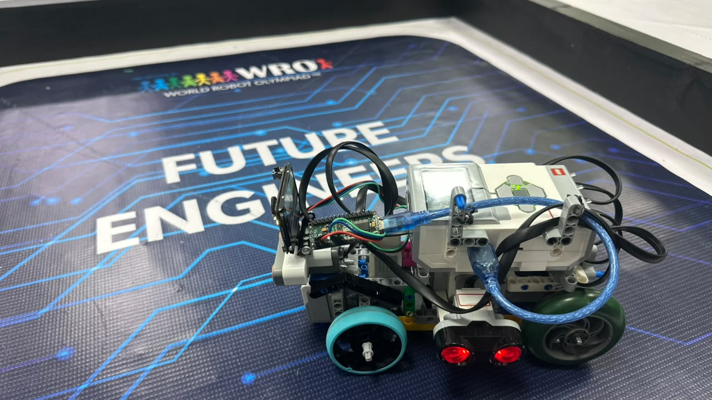
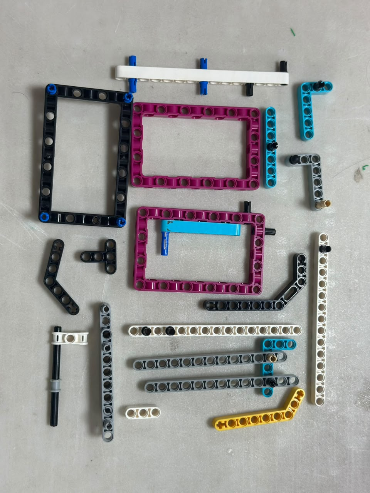
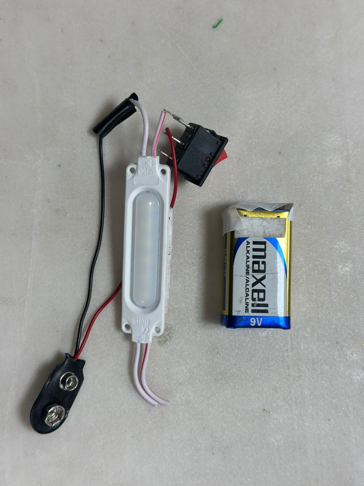
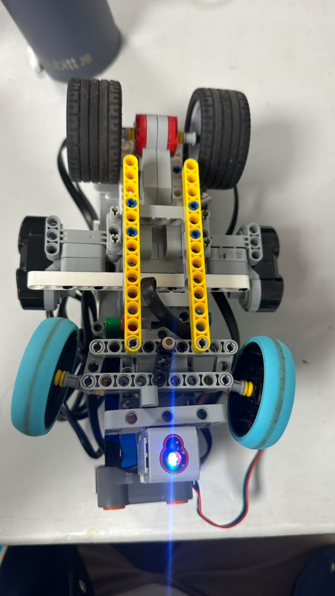
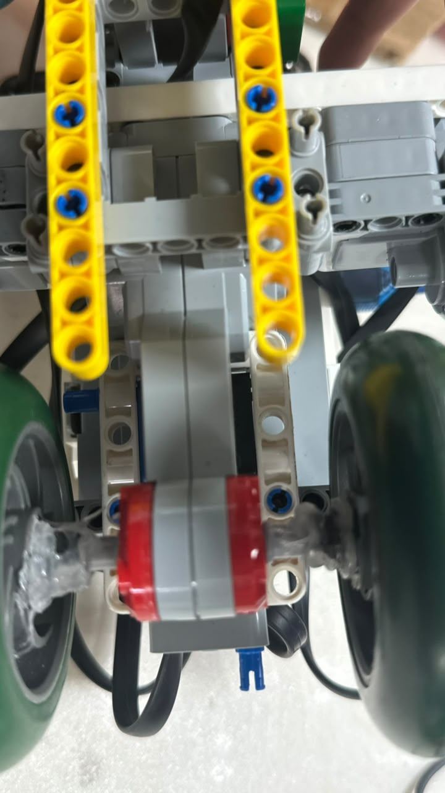
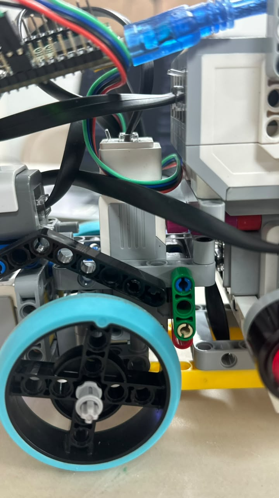
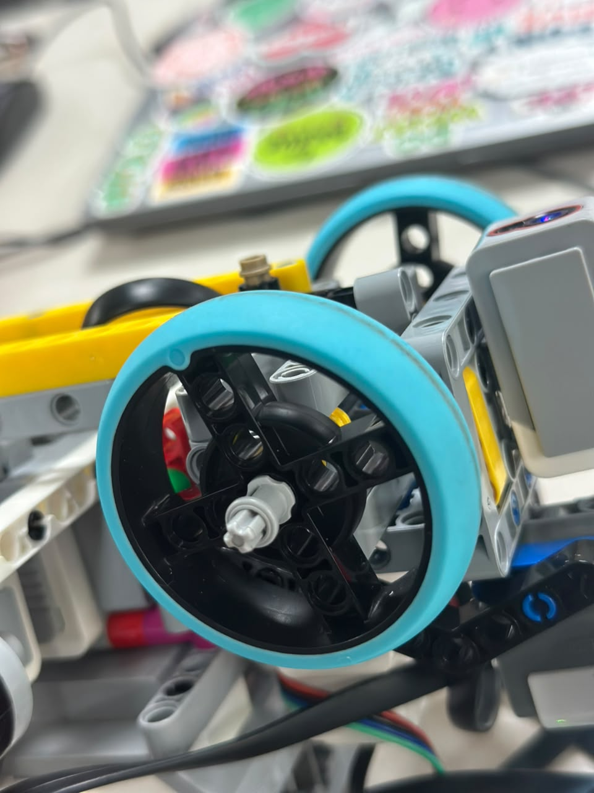
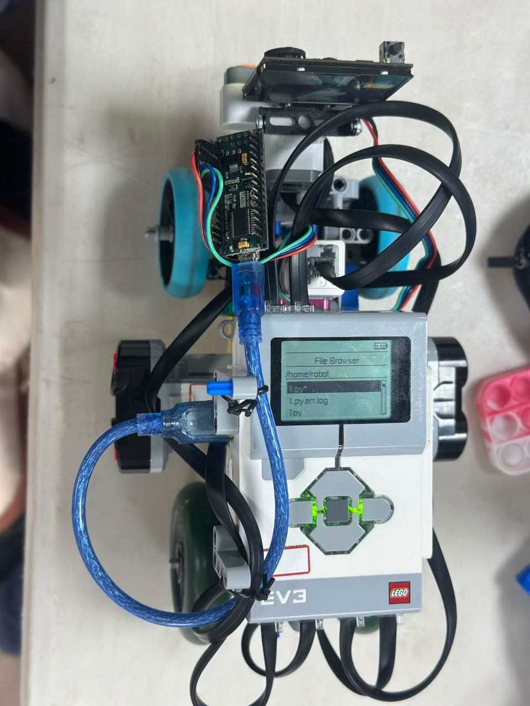
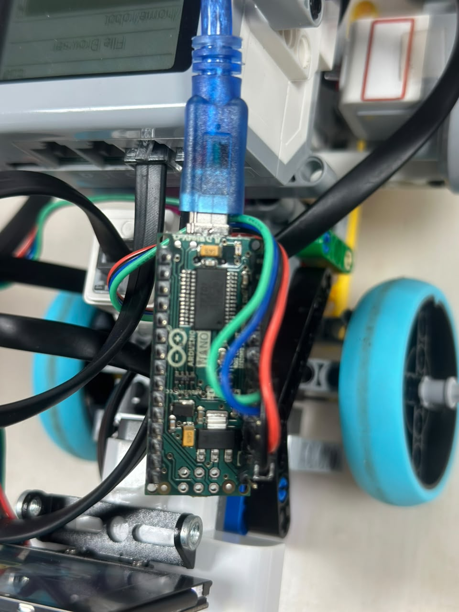
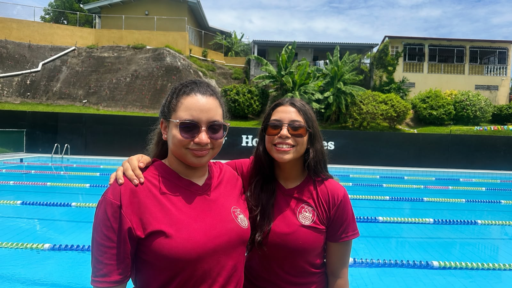

<h1 align="center">🧀 Welcome to the Go!Cheese Repository 🧀</h1>

<div align="center">

━━━━━━━━━━━━━━━━━━━━━━━━━━━━━━━━━━━━


━━━━━━━━━━━━━━━━━━━━━━━━━━━━━━━━━━━━

</div>

<h3 align="center"><em>"Cheese does run away from rats, right?"</em></h3>

<p align="center">
  
  
  
  
</p>

<p align="center">
  
  
  
  
  
</p>

---

Welcome to the official repository of **Go!Cheese**, a robotics team from San Miguelito, Panama, competing in the **WRO Future Engineers 2026** season.

This repository documents the complete engineering journey behind our autonomous vehicle, **Cheese**. It includes the development of the chassis, steering, drivetrain, electronics, sensors, vision system, software, testing process, failures, redesigns, and the decisions that eventually produced our current **Cheese v4**.

Our goal is not only to show the final robot.

We want the repository to explain:

> **What we built → why we built it that way → what failed → what we changed → what happened next.**

<div align="center">

| Project Information | Current Configuration |
| :--- | :--- |
| **Competition** | WRO Future Engineers 2026 |
| **Team** | Go!Cheese |
| **Region** | San Miguelito, Panama |
| **Current Robot** | Cheese v4 |
| **Controller** | LEGO Mindstorms EV3 |
| **Programming** | Python 3 (`ev3dev2`) + C++ Arduino bridge |
| **Vision** | HuskyLens |
| **Vision Interface** | Arduino Nano |
| **Propulsion** | EV3 Large Motor |
| **Steering** | EV3 Medium Motor + Ackermann geometry |
| **Distance Sensors** | 3 EV3 Ultrasonic Sensors |
| **Floor Detection** | EV3 Color Sensor |
| **Current Mass** | **666 g** |

</div>

---

<h3 align="center">Check us out! 👇</h3>

<p align="center">
  <a href="https://www.youtube.com/@GoCheese-pty" target="_blank">
    
  </a>
  <a href="https://github.com/Quesovamos2662" target="_blank">
    
  </a>
</p>

---

# WRO2026_FE_Go!Cheese

## 📌 Project Rundown

### Cheese Goal & Structure

Cheese is an autonomous LEGO Mindstorms EV3 vehicle designed for the **WRO Future Engineers 2026** competition.

The current robot is **Cheese v4**, the fourth major version of our platform.

Rather than using one fixed movement sequence, Cheese repeatedly reads its sensors and chooses a response based on the current situation.

Its main navigation systems include:

- PID wall-distance correction,
- progressive wall protection,
- color-based curve counting,
- front-distance safety,
- reverse recovery,
- obstacle recognition,
- camera-based steering influence,
- and final parking logic.

The software and mechanical architecture were designed together.

A good PID controller cannot compensate forever for a loose steering mechanism.

A correctly trained camera cannot help if the robot never places the obstacle inside its field of view.

A good color algorithm cannot work consistently if the sensor is mounted too far from the floor.

For this reason, our development philosophy became:

<p align="center">
  <strong>
    Mechanics + Sensors + Software + Testing = Reliable Behavior
  </strong>
</p>

---

### Open Challenge Logic

The Open Challenge is currently the most reliable part of Cheese v4.

The robot uses:

- left ultrasonic distance,
- right ultrasonic distance,
- front ultrasonic safety information,
- EV3 Color Sensor readings,
- PID steering,
- wall protection,
- curve validation,
- and parking logic.

A simplified Open control cycle is:

```text
START
  ↓
INITIALIZE
  ↓
READ ULTRASONIC SENSORS
  ↓
READ COLOR SENSOR
  ↓
CHECK FRONT SAFETY
  ↓
WALL PROTECTION?
  ↓
PID / STEERING CORRECTION
  ↓
VALID COLOR TRANSITION?
  ↓
UPDATE CURVE COUNT
  ↓
12 CURVES?
  ├── NO → CONTINUE
  └── YES → FINAL PARKING
```

A valid curve is based on a confirmed transition between the track colors:

```text
BLUE → ORANGE
```

or:

```text
ORANGE → BLUE
```

The current program expects:

```text
4 curves per lap × 3 laps = 12 curves
```

After the twelfth validated curve, Cheese enters its final parking procedure.

---

### Obstacle Challenge Logic

The Obstacle Challenge adds the **HuskyLens + Arduino Nano** vision subsystem.

The data path is:

```text
HuskyLens
    ↓
I2C
    ↓
Arduino Nano
    ↓
USB
    ↓
EV3
    ↓
Obstacle Navigation Logic
    ↓
Steering + Drive
```

The camera is currently trained for the competition obstacle colors:

| HuskyLens ID | Pillar | Required Passing Side |
| :---: | :---: | :--- |
| **ID 1** | 🔴 Red | Pass on the **right** |
| **ID 2** | 🟢 Green | Pass on the **left** |

The current obstacle challenge is functional but still being calibrated.

The main difficulty is no longer only recognizing the pillar.

It is completing the entire chain:

<p align="center">
  <strong>
    Detect → React → Avoid → Clear → Recover → Prepare for Next Obstacle
  </strong>
</p>

Post-obstacle recovery remains one of our main development priorities.

---

# General Project Index

This index connects the complete engineering documentation of Cheese.

Each section focuses on one part of the robot while remaining connected to the complete system.

---

## 🧀 General Project Overview

### [General Project Overview](sections/01-mobility-and-mechanical-design/project%20overview.md)

- Introduces Cheese and the WRO Future Engineers project.
- Explains the current Cheese v4 architecture.
- Summarizes the mechanical, electrical, software, sensing, testing, and development strategy.
- Introduces the progression from earlier versions to the current robot.

---

# 1. Mobility and Mechanical Design

## [1.1 Mechanical Design](sections/01-mobility-and-mechanical-design/1.1-mechanical-design.md)

- Explains the mechanical architecture behind Cheese.
- Documents propulsion and steering motor selection.
- Covers wheel decisions, drivetrain behavior, mechanical calculations, and testing.
- Connects mechanical changes to observed driving behavior.
- Documents changes introduced in Cheese v4.

## [1.2 Structural Components](sections/01-mobility-and-mechanical-design/1.2-structural-component.mds.md)

- Documents the LEGO Technic components used throughout the chassis.
- Explains liftarms, pins, axles, connectors, and critical supports.
- Separates critical structure from removable structure.
- Shows how v4 removed unnecessary components while keeping important mechanical supports.
- Includes structural evidence from the v3 → v4 redesign.

## [1.3 Steering and Drive](sections/01-mobility-and-mechanical-design/1.3-steering-and-drive.md)

- Explains the EV3 Large Motor rear-wheel-drive system.
- Explains the EV3 Medium Motor steering mechanism.
- Documents the Ackermann steering geometry.
- Shows how the steering linkage transfers motor rotation to the front wheels.
- Includes v1 → v2 → v3 → v4 steering development.
- Includes the dedicated v3 → v4 steering comparison.

## [1.4 Chassis Explanation](sections/01-mobility-and-mechanical-design/1.4-chassis-explanation.md)

- Explains how the chassis supports every major subsystem.
- Documents the lower EV3 position.
- Shows the motor, sensor, Nano, camera, and wiring placement.
- Explains the transition from the heavier v3 structure to the simplified v4 chassis.
- Documents the removal of unnecessary lighting and structural elements.

---

# 2. Power and Sensor Architecture

## [2.1 Power Supply and EV3](sections/02-power-and-sensor-architecture/2.1-power-supply-and-ev3.md)

- Documents the EV3 rechargeable battery.
- Explains the EV3 Brick as the central controller.
- Shows the lower physical EV3 placement in v4.
- Discusses battery consistency during testing.
- Explains why different battery conditions can affect physical motor response.
- Documents the use of two rechargeable EV3 batteries during repeated testing.

## [2.2 Wiring Diagram](sections/02-power-and-sensor-architecture/2.2-wiring-diagram.md)

- Documents the complete electrical architecture.
- Includes the system architecture diagram.
- Includes technical EV3 wiring.
- Explains sensor inputs and motor outputs.
- Documents the EV3 → Arduino Nano USB connection.
- Documents the Arduino Nano ↔ HuskyLens I2C connection.
- Includes real wiring photographs for reproducibility.

## [2.3 Sensor Selection and Placement](sections/02-power-and-sensor-architecture/2.3-sensor-selection-and-placement.md)

- Explains why Cheese uses three ultrasonic sensors.
- Documents left, right, and front ultrasonic placement.
- Explains the color sensor's floor-facing position.
- Documents the HuskyLens viewing position.
- Explains the compact front camera + ultrasonic arrangement.
- Connects physical sensor geometry to software reliability.

## [2.4 Sensor Calibration](sections/02-power-and-sensor-architecture/2.4-sensor-calibration.md)

- Documents color-sensor calibration.
- Explains the current EV3 color grouping.
- Covers ultrasonic filtering and distance thresholds.
- Documents PID calibration.
- Explains front-wall safety and reverse recovery.
- Documents HuskyLens obstacle IDs and camera reliability.
- Connects physical placement, sensor readings, and software interpretation.

---

# 3. Software and Obstacle Strategy

## [3.0 Cheese Logic Overview](sections/03-software-and-obstacle-strategy/3.0%20Cheese%20Logic%20Overview.md)

- Introduces the complete current software architecture.
- Explains the main sensor → decision → movement relationship.
- Separates Open Challenge logic from Obstacle Challenge logic.
- Introduces software priorities and safety behavior.

## [3.1 Algorithm Architecture](sections/03-software-and-obstacle-strategy/3.1-algorithm-architecture.md)

- Explains the internal software structure.
- Documents PID centering.
- Explains wall protection.
- Covers front-distance recovery.
- Documents color-based curve counting.
- Explains obstacle camera influence.
- Shows how competing behaviors are prioritized.

## [3.2 Flowchart](sections/03-software-and-obstacle-strategy/3.2-flowchart.md)

- Contains the current v4 software flowcharts.
- Shows the main software control cycle.
- Documents curve detection.
- Documents PID behavior.
- Shows front-wall reverse recovery.
- Shows obstacle camera behavior.
- Documents parking and sensor validation logic.

## [3.3 Open Challenge](sections/03-software-and-obstacle-strategy/3.3-open-challenge.md)

- Documents the current Open Challenge strategy.
- Explains wall following.
- Covers PID control and wall protection.
- Documents the front ultrasonic safety system.
- Explains curve counting.
- Covers the 12-curve / three-lap logic.
- Documents the current parking strategy.

## [3.4 Obstacle Challenge](sections/03-software-and-obstacle-strategy/3.4-obstacle-challenge.md)

- Explains red and green obstacle recognition.
- Documents HuskyLens communication through the Nano.
- Explains camera steering influence.
- Covers PID + camera interaction.
- Documents obstacle avoidance.
- Explains the current post-obstacle recovery problem.
- Records remaining testing priorities.

## [3.5 Corner Handling](sections/03-software-and-obstacle-strategy/3.5-corner-handling.md)

- Explains how Cheese enters and exits corners.
- Documents the BLUE ↔ ORANGE color sequence.
- Explains steering confirmation.
- Documents curve cooldown.
- Connects curve count directly to parking.
- Explains current corner failures and improvements.

## [3.6 Tuning Process](sections/03-software-and-obstacle-strategy/3.6-tuning-process.md)

- Documents the real tuning order used by the team.
- Covers mechanical tuning.
- Documents color calibration.
- Explains PID tuning.
- Covers curve tuning.
- Documents parking adjustments.
- Explains obstacle tuning.
- Records current Open and Obstacle status.

---

# 4. Engineering Decisions

## [4.1 Design Decision Log](sections/04-engineering-decisions/4.1-design-decision-log.md)

- Records major engineering decisions throughout development.
- Explains why components were added, moved, changed, or removed.
- Documents the transition from v3 to v4.
- Connects observed problems to engineering responses.
- Discusses trade-offs between mass, support, complexity, sensing, and reliability.

## [4.2 What Did Not Work](sections/04-engineering-decisions/4.2-what-didnt-work.md)

- Documents failures instead of hiding them.
- Explains mechanical failures.
- Covers sensor problems.
- Documents steering issues.
- Covers curve and parking failures.
- Explains unsuccessful lighting or structural strategies.
- Connects each failure to the next engineering decision.

---

# 5. Reproducibility

## [5.1 Bill of Materials](sections/05-reproducibility/5.1-bill-of-materials.md)

- Documents the components used in Cheese v4.
- Includes the EV3 Brick and rechargeable battery.
- Includes Large and Medium Motors.
- Includes the three ultrasonic sensors.
- Includes the EV3 Color Sensor.
- Includes the HuskyLens.
- Includes the Arduino Nano.
- Documents the LEGO Technic structural components.
- Separates critical and flexible components.

## [5.2 Build Instructions](sections/05-reproducibility/5.2-build-instructions.md)

- Provides a reproducible construction sequence.
- Documents chassis building.
- Explains motor installation.
- Covers Ackermann steering construction.
- Documents sensor mounting.
- Covers EV3 and Nano placement.
- References electrical wiring.
- Includes calibration and initial testing guidance.

---

# 6. Additional Resources

## [6.1 Additional Resources](sections/06-other-resources/6.1-additional-resources.md)

- Contains supporting engineering resources.
- Includes current v4 graphs.
- Includes historical v3 evidence where useful.
- Documents the transition between versions.
- Contains testing visualizations.
- Includes tuning and performance references.
- Supports deeper analysis beyond the main documentation.

---

# 7. Source Code

## [Source Code Folder](src/)

The `src/` folder contains the program files used during development.

The code history documents:

- Open Challenge development,
- Obstacle Challenge development,
- PID iterations,
- wall correction,
- curve counting,
- front recovery,
- camera integration,
- steering tests,
- parking logic,
- and experimental code versions.

Because software changed repeatedly during testing, older files are also useful engineering evidence.

They show how the current control system evolved rather than presenting the final program as if it appeared in one attempt.

---

# 8. Digital Models and Schemes

## [Robot Models](models/)

The models directory contains digital references related to Cheese's structure and development.

These resources complement physical photographs by helping document the robot's geometry and assembly.

## [Technical Schemes](schemes/)

The `schemes/` directory contains technical diagrams and reference documents.

Current resources include:

- complete system architecture,
- technical wiring,
- Nano ↔ HuskyLens wiring,
- final robot construction reference,
- steering comparison,
- and legacy wiring references.

<p align="center">
  <a href="schemes/Cheese_V4_Complete_System_Architecture_Wiring_Diagram.pdf">
    
  </a>
</p>

<p align="center">
  <a href="schemes/cheese_v4_technical_wiring_diagram.pdf">
    
  </a>
</p>

<p align="center">
  <a href="schemes/arduino_nano_huskylens_wiring_v4.pdf">
    
  </a>
</p>

<p align="center">
  <a href="schemes/steering_comparison_v3_to_v4.pdf">
    
  </a>
</p>

---

# 9. Visual Documentation

Our photo folders preserve the development of Cheese across the season.

## [Version 1 Photos](v-photos/v1/)

Documents the earliest physical ideas and provides historical evidence of the first steering and chassis concepts.

## [Version 2 Photos](v-photos/v2/)

Documents the first major physical competition version and important steering redesigns.

## [Version 3 Photos](v-photos/v3/)

Documents the heavier reinforced robot that preceded the current design.

Version 3 remains important because many v4 decisions were direct responses to problems identified in v3.

## [Version 4 Photos](v-photos/v4/)

Documents the **current Cheese v4** configuration.

The folder includes:

- front,
- back,
- left,
- right,
- top,
- bottom,
- chassis,
- motors,
- steering,
- ultrasonic sensors,
- color sensor,
- HuskyLens,
- Arduino Nano,
- battery,
- wiring,
- removed structural pieces,
- and removed lighting components.

---

# 10. Team Documentation

## [Team Photos](t-photos/)

The team documentation shows the people behind the vehicle and complements the technical engineering evidence.

---

<p align="center">
  <strong>
    This index connects every major part of the repository so the engineering process
    can be followed from concept → prototype → failure → redesign → testing → current v4.
  </strong>
</p>

---

<h2 align="center">🧀 Team Goals: Road to the National Finals 🧀</h2>

<p align="center">
  <em>
    Building Cheese is not only about competing. It is about learning how to think,
    test, fail, document, and improve like engineers.
  </em>
</p>

<div align="center">

| Goal | What We Want to Achieve |
| :--- | :--- |
| **🧊 Freeze Stable Code** | Once Open and Obstacle behavior reaches acceptable reliability, we want to avoid major last-minute changes and focus on repetition, calibration, and verification. |
| **🏁 Make Open Repeatable** | The current Open system can complete three laps and park. Our next objective is increasing repeatability across different starts and battery conditions. |
| **🚧 Complete Obstacle Reliability** | The HuskyLens can identify the pillars and affect movement, but avoidance and especially recovery still require calibration. |
| **📚 Make Documentation Count** | Every important decision should include the failure, cause, correction, result, and engineering lesson whenever evidence is available. |
| **🔧 Improve Reproducibility** | Another team should be able to understand Cheese's mechanics, sensors, wiring, software, and testing process from this repository. |
| **🏁 Earn Our Place at Nationals** | We want our performance and documentation to demonstrate how much Cheese improved throughout the season. |
| **🌱 Build a Reference for Future Us** | This is our first season in Future Engineers, so we want to leave behind a strong engineering foundation that can be improved later. |

</div>

<p align="center">
  <strong>Our main objective is to make Cheese more than a robot:</strong><br>
  a documented engineering project built through testing, iteration, teamwork, and constant improvement.
</p>

---

<h1 align="center">ᯓ★ Meet the Big Cheese! ᯓ★</h1>

<p align="center">
  
</p>

<p align="center">
  <em>Cheese v4 — current Go!Cheese WRO Future Engineers vehicle.</em>
</p>

Cheese v4 represents a major change in our design philosophy.

Version 3 focused heavily on reinforcement.

That solved several mechanical problems, but it also produced a robot with:

- more upper structure,
- more pins and liftarms,
- a larger camera support,
- longer cable routing,
- auxiliary lighting hardware,
- and a total mass of approximately **888.8 g**.

During the transition to v4, we asked a different question:

> **Which parts are actually necessary for the robot to work reliably?**

Instead of adding more structure, we began removing components that did not provide enough mechanical or sensing benefit.

The result was a **666 g** robot.

That represents a reduction of approximately:

```text
888.8 g − 666 g = 222.8 g
```

or about **223 g**.

---

## ❀ Current v4 Technical Overview ────୨ৎ────────୨ৎ────

| Core Subsystem | Current Cheese v4 Implementation |
| :--- | :--- |
| **Main Controller** | LEGO Mindstorms EV3 Brick |
| **Software** | Python 3 using `ev3dev2` |
| **External Interface** | Arduino Nano |
| **Vision Sensor** | HuskyLens |
| **Drive Motor** | EV3 Large Motor |
| **Steering Motor** | EV3 Medium Motor |
| **Drive Layout** | Rear-wheel drive |
| **Steering Geometry** | Front Ackermann steering |
| **Front Wheels** | LEGO SPIKE wheel assemblies |
| **Distance Sensors** | 3 EV3 Ultrasonic Sensors |
| **Floor Sensor** | EV3 Color Sensor |
| **Main Battery** | EV3 Rechargeable Battery |
| **Auxiliary Lighting** | Removed from current v4 configuration |
| **Current Mass** | **666 g** |

The current robot's dimensions are intentionally not listed here until a new complete v4 measurement set is verified.

---

## ❀ Cheese v4 Physical Layout ────୨ৎ────────୨ৎ────

<p align="center">
  
  &nbsp;
  
</p>

<p align="center">
  <em>Front and rear views of the current Cheese v4 configuration.</em>
</p>

<p align="center">
  
  &nbsp;
  
</p>

<p align="center">
  <em>Side views showing the lower and more compact v4 structure.</em>
</p>

<p align="center">
  
  &nbsp;
  
</p>

<p align="center">
  <em>Top and bottom views documenting the current mechanical arrangement.</em>
</p>

---

## ❀ Major v4 Mechanical Changes ────୨ৎ────────୨ৎ────

### Lower EV3 Brick

The EV3 Brick is positioned lower and flatter than in the previous configuration.

This helped remove unnecessary upper structure while keeping the controller accessible.

### Horizontal Large Motor

The drive motor is integrated horizontally into the chassis.

This helps use the available internal space more efficiently.

### SPIKE Front Wheels

The current front wheel assemblies use LEGO SPIKE-style wheels.

The change was made during the redesign of the front steering system and current testing has shown improved front-end response and grip.

### Reduced Upper Structure

The large previous camera/support tower was simplified.

Only structure with a useful mechanical role was retained.

### Removed Auxiliary Lighting

The auxiliary lighting system used during previous testing is not part of normal v4 operation.

Removing it reduced:

- wiring,
- mounting hardware,
- upper structure,
- and electrical complexity.

---

# 🏁 Achievements & Track Milestones

This section summarizes some of the main milestones that shaped the current robot.

Each milestone represents either a performance improvement, a design decision, or a development lesson.

<table>
  <tr>
    <td width="28%" align="center"><strong>Regional Experience</strong></td>
    <td>
      Competition experience showed us that performance alone was not enough.
      We also needed stronger software documentation, better evidence, and a clearer
      explanation of why each system existed.
    </td>
  </tr>

  <tr>
    <td width="28%" align="center"><strong>v3 Reinforcement</strong></td>
    <td>
      Cheese v3 became mechanically stronger, but its mass increased to approximately
      888.8 g. This taught us that reinforcement solves mechanical problems while
      potentially creating mass, complexity, and accessibility problems.
    </td>
  </tr>

  <tr>
    <td width="28%" align="center"><strong>666 g v4</strong></td>
    <td>
      Cheese v4 reduced mass by approximately 223 g while preserving the
      drivetrain, steering, sensor support, EV3, HuskyLens, Arduino Nano, and
      competition functionality.
    </td>
  </tr>

  <tr>
    <td width="28%" align="center"><strong>Three-Lap Open</strong></td>
    <td>
      The current Open Challenge system can complete the three-lap sequence
      using PID control, ultrasonic wall information, color-based curve counting,
      front safety, and final parking logic.
    </td>
  </tr>

  <tr>
    <td width="28%" align="center"><strong>Open Lap Speed</strong></td>
    <td>
      Current testing generally produces approximately 30–35 second laps,
      with a complete three-lap run around 80–90 seconds depending on conditions.
    </td>
  </tr>

  <tr>
    <td width="28%" align="center"><strong>Parking</strong></td>
    <td>
      Cheese can stop inside the parking area after completing the Open sequence.
      Final alignment can still vary and remains part of tuning.
    </td>
  </tr>

  <tr>
    <td width="28%" align="center"><strong>Obstacle Recognition</strong></td>
    <td>
      The HuskyLens is trained to identify the competition red and green pillars.
      The camera information already influences the obstacle navigation system.
    </td>
  </tr>

  <tr>
    <td width="28%" align="center"><strong>Current Obstacle Challenge</strong></td>
    <td>
      The main obstacle-development challenge is now obtaining reliable avoidance
      and recovery so Cheese is correctly positioned for the next pillar.
    </td>
  </tr>
</table>

---

# 🔄 Structural Evolution — v1 → v2 → v3 → v4

Cheese did not reach its current form in one build.

Each version was shaped by what the previous one taught us.

Our redesigns were responses to real problems:

- steering stiffness,
- chassis instability,
- sensing limitations,
- camera integration,
- structural stress,
- excessive mass,
- cable complexity,
- and navigation reliability.

<div align="center">

| Aspect | v1 | v2 | v3 | v4 |
| :--- | :--- | :--- | :--- | :--- |
| **Stage** | Early concept / digital development | First major physical competition build | Reinforced vision build | Current competition build |
| **EV3 Position** | Early vertical concept | Horizontal | Horizontal / higher structure | **Lower and flatter** |
| **Steering** | Initial stiff linkage | Redesigned linkage | Reinforced steering support | **Simplified supported Ackermann system** |
| **Distance Sensors** | Early mixed configuration | 3 ultrasonics | Reduced/changed configuration during development | **3 ultrasonic sensors** |
| **Color Sensor** | Not central | Development stage | Added for track events | **Current curve-count sensor, slightly lower** |
| **Camera** | None | None | HuskyLens introduced | **Lower HuskyLens position** |
| **Arduino Nano** | None | None / development | Vision bridge | **Current vision bridge** |
| **Lighting** | None | Development | Auxiliary lighting added | **Removed** |
| **Structure** | Compact concept | First stable structure | Heavy reinforcement | **Simplified structure** |
| **Mass** | Not representative | ~763.5 g | ~888.8 g | **666 g** |

</div>

---

## ❀ What v1 Taught Us

The first design helped us understand the basic physical arrangement of the robot.

However, some ideas that looked reasonable digitally did not behave the same way once LEGO friction, steering resistance, motor placement, and real track movement were considered.

The early steering system became one of the first areas requiring redesign.

---

## ❀ What v2 Taught Us

Version 2 became an important physical development stage.

It helped establish a more functional steering geometry and provided our first meaningful competition and track experience.

The robot was physically lighter than v3, but several systems still needed redesign for improved reliability.

---

## ❀ What v3 Taught Us

Version 3 prioritized structural reinforcement.

The robot gained:

- stronger steering support,
- a HuskyLens camera,
- Arduino integration,
- a larger upper structure,
- additional wiring,
- and auxiliary lighting.

These changes solved important problems.

However, they also pushed the robot to approximately **888.8 g**.

The lesson was not that v3 was a bad design.

It was that:

> **A solution to one problem can become the source of the next engineering problem.**

The stronger structure improved rigidity.

But the additional mass and complexity became the next design challenge.

---

## ❀ Why v4 Exists

Version 4 was designed to preserve the useful lessons from v3 while removing unnecessary complexity.

The main v4 question became:

> **What can we remove without reducing reliability?**

The redesign removed:

- large upper camera support elements,
- unnecessary liftarms,
- extra pins and axles,
- previous lighting hardware,
- lighting supports,
- excess upper structure,
- and longer cable routing.

At the same time, v4 retained:

- the EV3 controller,
- Ackermann steering,
- Large Motor propulsion,
- Medium Motor steering,
- three ultrasonics,
- color sensing,
- HuskyLens vision,
- Arduino Nano communication,
- battery access,
- and critical steering supports.

---

## ❀ Physical Evidence of Simplification ────୨ৎ────────୨ৎ────

<p align="center">
  
</p>

<p align="center">
  <em>Structural components removed during the transition from Cheese v3 to Cheese v4.</em>
</p>

<p align="center">
  
</p>

<p align="center">
  <em>Previous auxiliary lighting hardware removed from the normal v4 architecture.</em>
</p>

The v3 → v4 transition therefore followed:

```text
HEAVY BUT STABLE v3
        ↓
IDENTIFY NON-CRITICAL MASS
        ↓
REMOVE / REPOSITION COMPONENTS
        ↓
RETEST STRUCTURE
        ↓
KEEP CRITICAL SUPPORTS
        ↓
666 g v4
```

---

# 🛞 Steering Evolution

Steering has been one of the most important mechanical systems throughout Cheese's development.

The EV3 Medium Motor controls the front linkage.

The front wheels use Ackermann-style geometry so the inner and outer wheels can follow different paths through a turn.

The current v4 system retains the steering principles developed during earlier versions while simplifying the surrounding structure.

<p align="center">
  
</p>

<p align="center">
  <em>Top view of the current Cheese v4 steering system.</em>
</p>

<p align="center">
  <a href="schemes/steering_comparison_v3_to_v4.pdf">
    
  </a>
</p>

The main steering lesson became:

> **A linkage must be free enough to move, but supported enough to remain aligned.**

---

# 🧠 Cheese's Logic

Cheese uses a **priority-based navigation architecture**.

This means multiple systems can request steering or movement changes, but the software determines which response is most important at a given moment.

The main priorities include:

1. dangerous wall / front-distance protection,
2. obstacle reaction when relevant,
3. curve behavior,
4. normal PID wall control,
5. parking / finish behavior when the run is complete.

The exact priority can vary between Open and Obstacle code.

---

## ❀ Main Software Cycle ────୨ৎ────────୨ৎ────

```text
INITIALIZE
    ↓
READ SENSORS
    ↓
VALIDATE READINGS
    ↓
FRONT DANGER?
    ├── YES → SAFETY / REVERSE
    ↓ NO
WALL DANGER?
    ├── YES → WALL PROTECTION
    ↓ NO
OBSTACLE ACTIVE?
    ├── YES → CAMERA-BASED RESPONSE
    ↓ NO
NORMAL PID
    ↓
COLOR / CURVE LOGIC
    ↓
UPDATE COUNTERS
    ↓
PARKING READY?
    ├── YES → FINAL PARKING
    └── NO → NEXT LOOP
```

---

## ❀ Open Control Philosophy ────୨ৎ────────୨ৎ────

During Open navigation, Cheese continuously reads the ultrasonic sensors and uses the information to determine correction.

The PID controller is currently based around:

| Constant | Current Value |
| :--- | :---: |
| **KP** | 0.28 |
| **KI** | 0.001 |
| **KD** | 0.08 |
| **PID maximum steering angle** | 32° |
| **Center deadband** | 1.5 |

Wall protection becomes progressively stronger as the robot approaches the wall.

Current reference values include:

| Protection Parameter | Value |
| :--- | :---: |
| Gentle wall distance | 28 cm |
| Severe wall distance | 22 cm |
| Full avoidance distance | 15 cm |
| Gentle wall angle | 14° |
| Severe wall angle | 18° |

These values allow normal PID behavior to handle ordinary drift while stronger safety logic handles dangerous proximity.

---

## ❀ Front Safety ────୨ৎ────────୨ৎ────

The front ultrasonic sensor provides another navigation layer.

Current Open behavior includes:

- front assistance,
- too-close detection,
- confirmation,
- reverse recovery,
- and recovery distance.

When Cheese becomes too close to the front wall, reversing creates physical space for steering to become effective again.

```text
FRONT TOO CLOSE
      ↓
CONFIRM
      ↓
REVERSE
      ↓
CREATE SPACE
      ↓
RETURN TO NAVIGATION
```

---

## ❀ Curve Counting ────୨ৎ────────୨ৎ────

Cheese uses the floor color sensor to determine progress.

The sensor runs in `COL-COLOR` mode.

The current software interprets:

```text
BLUE = BLUE

RED
YELLOW  → ORANGE
BROWN
```

A valid transition:

```text
BLUE → ORANGE
```

or:

```text
ORANGE → BLUE
```

is used as part of curve validation.

Additional conditions include:

- steering confirmation,
- timing,
- and cooldown.

This is important because:

> **Seeing a color is not necessarily the same as physically completing a curve.**

---

# 🏁 Current Open Performance

The Open Challenge currently performs three laps with much greater reliability than earlier versions.

Current observations:

<div align="center">

| Open Capability | Current Status |
| :--- | :--- |
| Straight driving | ✅ Functional |
| PID correction | ✅ Functional |
| Wall protection | ✅ Functional |
| Front safety | ✅ Functional |
| Color detection | ✅ Functional |
| Curve counting | ✅ Functional |
| 3 complete laps | ✅ Mostly reliable |
| Parking area detection | ✅ Functional |
| Final alignment | 🟡 Still tuning |
| Battery sensitivity | 🟡 Still monitored |

</div>

Typical current timing is approximately:

```text
1 lap ≈ 30–35 seconds
3 laps ≈ 80–90 seconds
```

The exact time changes depending on battery condition, corrections, curve behavior, and parking.

---

# 🚧 Current Obstacle Performance

The Obstacle Challenge uses a different control emphasis.

The HuskyLens already recognizes red and green pillars.

The camera influences movement through the EV3 obstacle controller.

However, several real-world problems remain:

- a pillar may enter the camera's FOV too late,
- a poor curve exit can point the camera away from the next pillar,
- avoidance can sometimes be too weak,
- the robot can contact or carry an obstacle,
- and recovery after passing an obstacle can leave Cheese badly aligned.

The current largest obstacle priority is:

<p align="center">
  <strong>POST-OBSTACLE RECOVERY</strong>
</p>

because a successful first avoidance is not enough if the next pillar becomes impossible to detect.

---

# 🗺️ Current Software Flowcharts

The repository now includes a dedicated v4 flowchart set.

### [Open the complete Flowchart Section](sections/03-software-and-obstacle-strategy/3.2-flowchart.md)

Current diagrams include:

```text
00 — v4 Flowchart Set Map
01 — Main Loop Control Cycle
02 — Color Detection & Curve Counting
03 — Minimum Correction PID Controller
04 — Front Wall Safety / Reverse Recovery
05 — Obstacle Detection & Camera Bias
06 — Parking & Finish Logic
07 — Sensor Validation & Reliability
08 — Main Software Flowchart
```

<p align="center">
  
</p>

<p align="center">
  <em>Current Cheese v4 software flowchart set.</em>
</p>

<p align="center">
  
</p>

<p align="center">
  <em>Main v4 software architecture.</em>
</p>

---

# 🔌 Current Electronic Architecture

Cheese combines the LEGO EV3 ecosystem with an external vision interface.

```text
                 EV3 BATTERY
                      ↓
                  EV3 BRICK
             ┌────────┼────────┐
             ↓        ↓        ↓
          MOTORS   SENSORS    USB
                               ↓
                         ARDUINO NANO
                               ↓
                              I2C
                               ↓
                           HUSKYLENS
```

The EV3 remains the main controller.

The Arduino Nano does not replace the EV3.

Its role is to bridge the external camera subsystem.

---

## ❀ Technical Wiring Resources ────୨ৎ────────୨ৎ────

<p align="center">
  <a href="schemes/Cheese_V4_Complete_System_Architecture_Wiring_Diagram.pdf">
    
  </a>
</p>

<p align="center">
  <a href="schemes/cheese_v4_technical_wiring_diagram.pdf">
    
  </a>
</p>

<p align="center">
  <a href="schemes/arduino_nano_huskylens_wiring_v4.pdf">
    
  </a>
</p>

---

# 📡 Sensor Architecture

The current robot uses three sensing layers.

## Distance Layer

```text
LEFT ULTRASONIC
RIGHT ULTRASONIC
FRONT ULTRASONIC
```

These provide wall and forward-distance information.

## Floor Layer

```text
EV3 COLOR SENSOR
```

This detects the track markers used by curve counting.

## Vision Layer

```text
HUSKYLENS
```

This provides obstacle identification.

Each sensor has one main responsibility.

This makes the system easier to debug and prevents one sensor type from being responsible for every navigation problem.

---

# 🔍 Current Front Sensor Architecture

The HuskyLens and front ultrasonic sensor share the front region of the robot.

They perform different jobs:

| Sensor | Question It Answers |
| :--- | :--- |
| **HuskyLens** | What colored obstacle is ahead? |
| **Front Ultrasonic** | How close is the object or wall ahead? |

This combination gives Cheese both **identity** and **distance** information.

---

# 🎨 Color Sensor Development

One of the more interesting sensor lessons came from environmental lighting.

Earlier testing showed that ambient light could affect floor detection.

A temporary physical cover was tested around the color sensor.

However, it created its own mechanical problems because it could contact the field.

The final v4 solution was simpler:

> **Move the color sensor slightly lower.**

This improved the sensor-to-floor geometry enough that the temporary light-blocking structure was no longer needed during normal operation.

This became a useful engineering example:

```text
SENSOR PROBLEM
    ↓
TRY SOFTWARE / PHYSICAL FIX
    ↓
NEW PROBLEM CREATED
    ↓
RETHINK GEOMETRY
    ↓
SIMPLER SOLUTION
```

---

# ⚙️ Engineering Development Method

We try not to treat a failed run as simply a bad run.

Instead, we use the following process:

```text
FAILURE
   ↓
OBSERVATION
   ↓
POSSIBLE CAUSE
   ↓
CHANGE
   ↓
TEST
   ↓
RESULT
   ↓
LESSON
```

For example:

| Failure | Possible Cause | Change | Result / Lesson |
| :--- | :--- | :--- | :--- |
| Wide curves | Steering/timing too weak | Adjust curve response | Tighter path |
| Zig-zag | Corrections too aggressive | Tune PID / steering | Smoother movement |
| Missed floor marker | Sensor conditions | Lower sensor / grouping | Better detection |
| Front wall crash | No space for steering | Reverse recovery | Creates steering space |
| Obstacle contact | Late/weak reaction | Camera/avoidance tuning | Still under calibration |
| Poor next obstacle detection | Bad recovery position | Recovery tuning | Current major focus |

---

# 🧀 Cheese v4 Visual Tour

Instead of showing only one image, this section provides a physical map of the current robot.

---

## ❀ Front View ────୨ৎ────────୨ৎ────

<p align="center">
  
</p>

The front region contains the steering system and the main forward sensing area.

---

## ❀ Left View ────୨ৎ────────୨ৎ────

<p align="center">
  
</p>

The side profile shows how much lower v4 became compared with the larger v3 upper structure.

---

## ❀ Right View ────୨ৎ────────୨ৎ────

<p align="center">
  
</p>

The opposite side provides additional evidence of motor, chassis, sensor, and wiring integration.

---

## ❀ Back View ────୨ৎ────────୨ৎ────

<p align="center">
  
</p>

The rear region contains the main drive architecture.

---

## ❀ Top View ────୨ৎ────────୨ৎ────

<p align="center">
  
</p>

The top view helps explain the distribution of the EV3, motors, sensors, Nano, camera, and wiring.

---

## ❀ Bottom View ────୨ৎ────────୨ৎ────

<p align="center">
  
</p>

The bottom view documents the lower chassis, wheel system, steering geometry, and drivetrain support.

---

# ❀ Important v4 Close-Ups ────୨ৎ────────୨ৎ────

## Steering

<p align="center">
  
</p>

## Large Drive Motor

<p align="center">
  
</p>

## Medium Steering Motor

<p align="center">
  
</p>

## Front SPIKE Wheels

<p align="center">
  
</p>

## Wiring

<p align="center">
  
</p>

## Arduino Nano

<p align="center">
  
</p>

---

# 📊 Current Development Status

<div align="center">

| System | Status | Main Remaining Work |
| :--- | :---: | :--- |
| **Mechanical v4** | 🟢 Functional | Minor inspection / competition maintenance |
| **Steering** | 🟢 Functional | Continue maintaining alignment |
| **Drive** | 🟢 Functional | Battery-consistency checks |
| **Ultrasonics** | 🟢 Functional | Repeatability / filtering |
| **Color Sensor** | 🟢 Functional | Monitor occasional count issues |
| **Open PID** | 🟢 Functional | Final refinement |
| **Open Curves** | 🟢 Functional | Reduce occasional wide/late cases |
| **3-Lap Open** | 🟢 Mostly reliable | Repeatability |
| **Open Parking** | 🟡 Functional | Final angle / alignment |
| **HuskyLens Detection** | 🟢 Functional | Detection timing |
| **Obstacle Avoidance** | 🟡 In development | Reliability |
| **Post-Obstacle Recovery** | 🟠 Main challenge | Recenter / prepare for next pillar |
| **Obstacle Parking** | 🟠 In progress | Final integration |

</div>

---

# ᯓ★ Meet the Team ᯓ★

<p align="center">
  
  
  
  
</p>

<p align="center">
  <em>Two students, one robot, many late tests, many changes, and one very determined piece of cheese.</em>
</p>

<p align="center">
  
</p>

<p align="center">
  <strong>We are Go!Cheese</strong>, a robotics team of two from San Miguelito, Panama,
  competing in the <strong>WRO Future Engineers 2026</strong> season.
</p>

Our team is built around collaboration, testing, communication, and iteration.

Romina focuses primarily on programming, robot building, and physical changes.

Caylee focuses primarily on documentation, software explanation, engineering analysis, and organizing the project so another person can understand how Cheese works.

Neither role exists completely independently.

The robot changes influence the documentation.

The documentation forces us to understand the robot.

Testing influences both.

---

## ❀ Team at a Glance ────୨ৎ────────୨ৎ────

<div align="center">

| Member | Main Role | Superpower | Project Focus |
| :---: | :--- | :--- | :--- |
| **Caylee Rios** | Software Explanation & Documentation | Turning ideas, tests, and failures into clear engineering documentation | README structure, logic explanation, tuning analysis, visual organization |
| **Romina Mora** | Programming & Robot Builder | Turning ideas into physical robot changes and functional code | Robot building, code implementation, mechanical adjustments, testing |

</div>

<p align="center">
  <strong>
    Our teamwork connects the story, software, testing, and physical robot.
  </strong>
</p>

---

## ❀ Our Team Dynamic ────୨ৎ────────୨ৎ────

<div align="center">

| What Happens During Testing | How We Work Together |
| :--- | :--- |
| **Cheese crashes into a wall** | We check whether the cause is mechanical, sensor-based, software-based, or related to battery condition. |
| **The curve is too wide or too sharp** | We compare steering behavior, timing, sensor information, and code parameters. |
| **The color sensor misses a marker** | We check sensor position, lighting, color grouping, and curve validation. |
| **A pillar is missed** | We check HuskyLens FOV, robot position, camera angle, speed, and steering response. |
| **Obstacle avoidance works but recovery fails** | We analyze where Cheese finishes the maneuver and how that position affects the next pillar. |
| **Parking becomes inaccurate** | We review curve counting, final distance, timing, alignment, and battery consistency. |
| **The robot improves** | We record the change and the engineering reason behind it. |

</div>

Robotics is not only programming or building.

It requires observing what the real system does and comparing that behavior with what we expected.

---

# ✦ Member Profiles ─── ⋆⋅☆⋅⋆ ───

<p align="center">
  <em>
    Each member has a different focus, but both roles are connected by
    testing, problem-solving, communication, and the same robot.
  </em>
</p>

---

## ❀ Caylee Rios ────୨ৎ────────୨ৎ────

<p align="center">
  
  
</p>

<p align="center">
  
</p>

<div align="center">

| Category | Description |
| :--- | :--- |
| **Main Focus** | Documentation, software explanation, engineering reasoning, README structure, and testing analysis |
| **Project Strength** | Turning tests, failures, and robot behavior into understandable engineering explanations |
| **Favorite Part** | Organizing ideas and understanding how Cheese works |
| **Biggest Challenge** | Making sure failures become useful engineering evidence |
| **Main Contribution** | Documentation, project structure, logic explanation, engineering decisions, tuning analysis, and visual organization |

</div>

### About Caylee

Hii! My name is **Caylee**, and this is my first time competing in WRO.

I am really happy to be part of a competition that pushes us toward hard work, problem-solving, and personal growth.

Throughout these two regional competitions, I have grown a lot both as a person and in the way I approach my work as a software engineer. Every test, every good result, and every mistake has taught me something new about how to think, analyze problems, and improve the way we develop Cheese.

We have had many exciting moments, but also many failures, unexpected problems, and difficult tests. Those moments have become some of the most important parts of the experience because we never stop learning from them. We are always curious, always asking questions, and always looking for new things to discover, test, build, and create around robotics.

For me, working on Go!Cheese has been an exciting and very self-challenging experience. It has pushed me to become more patient, more analytical, more creative, and more confident when facing problems that do not have an immediate solution.

One of the things I enjoy the most about robotics is that there is always something else to learn. Every improvement opens the door to another idea, another test, or another challenge, and that constant process of learning and creating is what has made this experience so meaningful to me.

<p align="center">
  <a href="https://www.instagram.com/caymrr">
    
  </a>
</p>

---

## ❀ Romina Mora ────୨ৎ────────୨ৎ────

<p align="center">
  
  
</p>

<p align="center">
  
</p>

<div align="center">

| Category | Description |
| :--- | :--- |
| **Main Focus** | Programming, robot building, mechanical changes, software implementation, and testing |
| **Project Strength** | Turning ideas into physical robot changes and functional code |
| **Favorite Part** | Solving challenges through coding, building, and testing |
| **Biggest Challenge** | Adjusting the robot until physical behavior matches the idea in the code |
| **Main Contribution** | Programming, robot construction, mechanism adjustments, code implementation, and physical testing |

</div>

### About Romina

Helloo!!! I’m **Romina**, and I am a very passionate gamer.

I enjoy anything that represents a challenge, and this project has definitely been one of them.

Since 2025, I have been interested in robotics, and in 2026 I finally had the opportunity to work on a real WRO Future Engineers robot.

In Go!Cheese, my role focuses mainly on programming and building.

I help transform ideas into real robot changes, whether that means adjusting the structure, modifying software, testing a behavior, or rebuilding a mechanism.

For me, robotics is exciting because every problem becomes a new challenge to solve.

---

# ❀ How Our Roles Connect ────୨ৎ────────୨ৎ────

<p align="center">
  
  
  
</p>

<div align="center">

| Caylee | Together | Romina |
| :--- | :--- | :--- |
| Organizes documentation | Observe behavior | Builds robot changes |
| Explains software logic | Discuss failures | Programs behavior |
| Records engineering decisions | Compare tests | Adjusts mechanisms |
| Organizes evidence | Choose next experiment | Performs physical testing |
| Connects results to reasoning | Improve Cheese | Implements changes |

</div>

Our roles are different, but they are connected during every development cycle.

When Cheese fails, we do not want the result to disappear.

Instead:

```text
OBSERVATION
     ↓
DISCUSSION
     ↓
POSSIBLE CAUSE
     ↓
CHANGE
     ↓
TEST
     ↓
RESULT
     ↓
DOCUMENTATION
```

That cycle is the real development process behind Cheese.

---

# ❀ What Go!Cheese Means to Us ────୨ৎ────────୨ৎ────

Go!Cheese is more than the name of our team.

It represents our first serious experience in the WRO Future Engineers category, our learning process, and our determination to keep improving when the robot does not behave how we expected.

Throughout the season, Cheese changed many times.

We:

- redesigned the chassis,
- rebuilt steering systems,
- changed sensor strategies,
- experimented with lighting,
- added vision,
- simplified wiring,
- reduced mass,
- changed wheel configurations,
- tuned PID,
- changed curve behavior,
- developed parking,
- developed obstacle avoidance,
- and documented the reasoning behind those changes.

Every version taught us something.

<p align="center">
  <strong>
    For us, Go!Cheese means learning by doing, improving through testing,
    and proving that a small team can still build something meaningful
    with creativity, discipline, and teamwork.
  </strong>
</p>

---

# ❀ Team Motto ────୨ৎ────────୨ৎ────

<p align="center">
  ✦ ─── ⋆⋅☆⋅⋆ ─── (❁´◡`❁) ─── ⋆⋅☆⋅⋆ ─── ✦
</p>

<p align="center">
  <strong>
    “Build it, test it, break it, fix it, and make it better.”
  </strong>
</p>

<p align="center">
  <em>
    One robot, two minds, many tests, and a lot of cheese-powered determination.
  </em>
</p>

---

<h2 align="center">🧀 Why "Cheese"? 🧀</h2>

<p align="center">
  <em>"From a childhood rhyme to the competition track."</em>
</p>

<div align="center">

────────୨ৎ────────

</div>

Our name comes from a little recess rhyme we used to play back when we were kids.

It always stuck with us, so when it came time to choose our team name, we picked something that carried a piece of that memory with us.

That is how **Go!Cheese** was born.

It reminds us of where we started and of the season of our lives we are living now.

Our robot is named **Cheese** as a pun on our team name.

The idea is simple, and it became the heart of the project:

<p align="center">
  <strong>Cheese is the one who goes.</strong>
</p>

<div align="center">

────────୨ৎ────────

</div>

---

<h2 align="center">🧀 Go!Cheese — WRO Future Engineers 2026 🧀</h2>

<p align="center">
  <strong>
    Designed through failures.<br>
    Improved through testing.<br>
    Explained through engineering.
  </strong>
</p>

<p align="center">
  ✦ ─── ⋆⋅☆⋅⋆ ─── (❁´◡`❁) ─── ⋆⋅☆⋅⋆ ─── ✦
</p>
