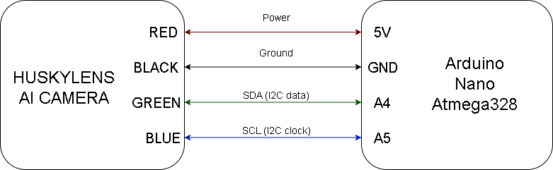
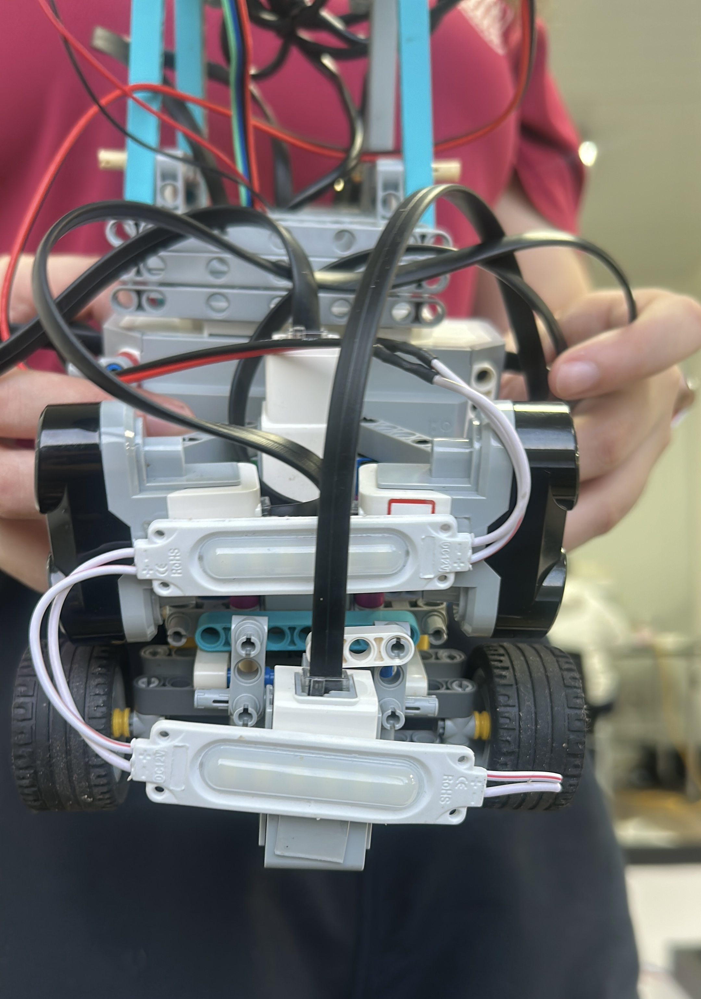
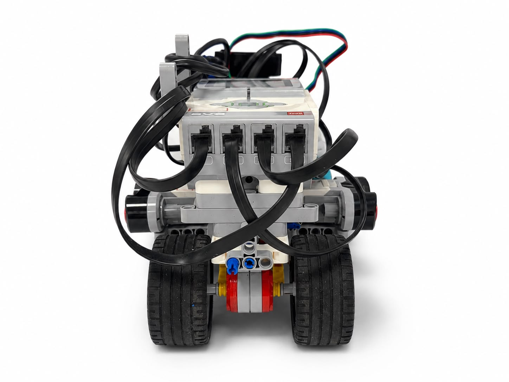

# ᯓ★ 2.1 Power Supply & EV3 ᯓ★

  
  
  

  <em>This section explains how Cheese is powered, how the EV3 Brick distributes energy, why voltage affects performance, and how the v4 power layout improved from the previous version.</em>

  ✦ ─── ⋆⋅☆⋅⋆ ─── (❁´◡`❁) ─── ⋆⋅☆⋅⋆ ─── ✦

Cheese depends on stable power to move, steer, read sensors, and use the HuskyLens vision system. The main power source is the **LEGO EV3 rechargeable battery**, which powers the EV3 Brick. From there, the EV3 Brick distributes power to the motors, LEGO sensors, Arduino Nano, and HuskyLens system.

This section also documents the difference between the **previous v3 power layout** and the **current v4 power layout**. In v3, Cheese used an additional lighting system powered by a separate 9V battery. In v4, the camera was moved lower and the mount became simpler, so the extra lamp structure is no longer part of the current final layout. We still include the v3 lighting evidence because it shows an important testing decision and explains why the v4 layout became cleaner.

---

## ❀ 2.1.1 Power System at a Glance ────୨ৎ────────୨ৎ────

  
  

For a beginner, the power system can be understood like this:

  <strong>The EV3 battery is the energy source.</strong> 
  <strong>The EV3 Brick is the control and distribution center.</strong> 
  <strong>The motors, sensors, Arduino Nano, and HuskyLens depend on stable voltage.</strong>

| Power Element | Beginner Explanation | Main Job |
| :--- | :--- | :--- |
| **EV3 rechargeable battery** | The main energy source of Cheese. | Powers the EV3 Brick. |
| **EV3 Brick** | The robot’s controller and power distributor. | Sends power and commands to motors, sensors, and USB-connected devices. |
| **Motor ports** | Output ports on the EV3 Brick. | Power the drive motor and steering motor. |
| **Sensor ports** | Input ports on the EV3 Brick. | Power and read the ultrasonic and color sensors. |
| **EV3 USB port** | USB power and communication port. | Powers the Arduino Nano. |
| **Arduino Nano** | Bridge between EV3 and HuskyLens. | Receives 5V from the EV3 USB port and connects to the HuskyLens. |
| **HuskyLens** | Vision sensor used for obstacle detection. | Receives power through the Arduino Nano and detects visual targets. |
| **v3 auxiliary lamps** | Previous lighting support system. | Helped camera and color detection during earlier tests. |
| **v4 lighting layout** | No extra lamp structure installed. | Cleaner layout after lowering the camera and simplifying the mount. |

Stable power matters because Cheese’s motors, sensors, camera, and control logic can only behave consistently when the EV3 battery and wiring system provide reliable voltage during testing.

---

## ❀ 2.1.2 The EV3 Rechargeable Battery ────୨ৎ────────୨ৎ────

  
  
  

The main battery used by Cheese is the **LEGO EV3 rechargeable lithium-ion battery pack**. This battery is made for the LEGO MINDSTORMS EV3 Intelligent Brick and allows the robot to run without disposable batteries.

The battery does not directly decide what the robot does. Instead, it provides energy to the EV3 Brick. The EV3 Brick then powers and controls the connected motors, sensors, and USB-connected Arduino Nano.

| Item | Detail |
| :--- | :--- |
| **Main battery** | LEGO EV3 rechargeable lithium-ion battery pack |
| **Capacity** | 2050 mAh |
| **Nominal voltage** | Around 7.4V |
| **Battery rotation** | 2 EV3 battery packs used in rotation |
| **Main powered systems** | EV3 Brick, EV3 Large Motor, EV3 Medium Motor, ultrasonic sensors, color sensor, Arduino Nano, and HuskyLens system |
| **v3 auxiliary lighting** | Powered by a separate 9V battery during previous tests |
| **v4 auxiliary lighting** | Extra lamp structure removed from the current layout |

We use two EV3 battery packs in rotation. While one battery is on the robot, the other can be charging. This helps us test with more consistent voltage instead of trying to tune the robot with a half-drained battery.

This is important because a run on a weak battery is not the same as a run on a fresh battery. The robot may still turn on, but the motors and camera system may behave differently.

  

  <em>EV3 battery evidence showing the rechargeable battery used as the main power source of Cheese.</em>

> **Photo note:** If `ev3_battery_closeup_v4.jpg` appears broken, upload a close-up photo of the EV3 battery area into `v-photos/v4/`.

---

## ❀ 2.1.3 Power Distribution Path ────୨ৎ────────୨ৎ────

Cheese uses a centralized power architecture. This means the EV3 Brick is the main power and control center of the robot.

The main power path works like this:

  <strong>EV3 Battery → EV3 Brick → Motors, LEGO Sensors, USB, Arduino Nano, and HuskyLens</strong>

The motors connect to EV3 output ports. The sensors connect to EV3 input ports. The Arduino Nano connects to the EV3 USB port and receives 5V from it. The HuskyLens receives power through short jumper wires connected to the Arduino Nano.

| Component | Port / Connection | Powered By | Approx. Voltage |
| :--- | :--- | :--- | :--- |
| **EV3 Large Motor** | `OUTPUT_B` | EV3 battery through EV3 motor output | ~7.4V nominal motor supply |
| **EV3 Medium Motor** | `OUTPUT_A` | EV3 battery through EV3 motor output | ~7.4V nominal motor supply |
| **Ultrasonic sensor left** | `INPUT_1` | EV3 sensor port | ~5V logic/sensor supply |
| **Color sensor** | `INPUT_2` | EV3 sensor port | ~5V logic/sensor supply |
| **Ultrasonic sensor right** | `INPUT_3` | EV3 sensor port | ~5V logic/sensor supply |
| **Arduino Nano** | EV3 USB port | EV3 USB power | 5V |
| **HuskyLens camera** | I2C / jumper wires through Arduino Nano | Arduino Nano 5V and GND pins | 5V |
| **v3 auxiliary lamps** | Separate wiring | External 9V battery | 9V battery supply |
| **v4 auxiliary lamps** | Not installed in current layout | Not applicable | Not applicable |

This table matters because every component depends on a power path. If one cable, port, or connection becomes unreliable, the robot may not behave as expected.

  

  <em>Previous wiring topology showing the EV3 Brick as the central power and control unit, with motors, sensors, Arduino Nano, and HuskyLens connected around it.</em>

  

  <em>Planned v4 power distribution diagram showing the updated current layout and the difference between the main EV3-powered systems and previous auxiliary lighting tests.</em>

> **Diagram note:** If `power_distribution_diagram_v4.png` appears broken, create a simple updated power diagram and upload it into `v-photos/v4/`.

---

## ❀ 2.1.4 EV3 Brick as the Power and Control Center ────୨ৎ────────୨ৎ────

The EV3 Brick is not only the robot’s controller. It also works as the main power distribution point.

The battery connects to the EV3 Brick, and the EV3 Brick sends power and control signals through its ports. This is why the EV3 is one of the most important components in the robot.

| EV3 Role | Why It Matters |
| :--- | :--- |
| **Main controller** | Runs the robot code and decides motor/sensor behavior. |
| **Motor power distributor** | Sends power to the drive and steering motors. |
| **Sensor power distributor** | Powers and reads the ultrasonic and color sensors. |
| **USB power source** | Powers the Arduino Nano. |
| **Testing reference point** | Battery voltage can be checked from the EV3 system. |
| **Physical access point** | Its placement affects how easy it is to check ports, cables, and battery condition. |

In v4, the EV3 Brick was placed flatter and in a cleaner position. This made the robot easier to inspect and interact with. A cleaner EV3 placement also makes it easier to check cables, ports, and battery access.

  

  <em>Top view of Cheese v4 showing the EV3 Brick placement, cleaner layout, and accessible wiring paths.</em>

---

## ❀ 2.1.5 Arduino Nano and HuskyLens Power Path ────୨ৎ────────୨ৎ────

The Arduino Nano and HuskyLens are part of the vision system. The EV3 Brick does not connect to the HuskyLens like a normal LEGO sensor, so the Arduino Nano works as an intermediate board.

The Arduino Nano receives power from the EV3 USB port. The correct cable for a classic Arduino Nano V3 is:

  <strong>USB Type-A to USB Mini-B</strong>

The USB Type-A side connects to the EV3 USB port, and the USB Mini-B side connects to the Arduino Nano.

The HuskyLens receives power from the Arduino Nano through short jumper wires. These jumper wires connect the Arduino Nano’s power and ground pins to the HuskyLens power input.

The power path is:

  <strong>EV3 Battery → EV3 Brick → USB Port → Arduino Nano → Jumper Wires → HuskyLens</strong>

| Vision Power Part | Function |
| :--- | :--- |
| **EV3 USB port** | Provides 5V power to the Arduino Nano. |
| **USB Type-A to USB Mini-B cable** | Connects the EV3 USB port to the Arduino Nano. |
| **Arduino Nano** | Receives USB power and communicates with the HuskyLens. |
| **Jumper wires** | Carry power, ground, and signal connections between Arduino Nano and HuskyLens. |
| **HuskyLens** | Uses power from the Arduino Nano and detects obstacles. |
| **I2C connection** | Allows the Arduino Nano and HuskyLens to communicate. |

This makes the vision system sensitive to wiring quality. If the EV3 battery becomes weak, if the USB cable is loose, or if the jumper wires are unstable, the HuskyLens system can become less reliable.

  

  <em>HuskyLens to Arduino Nano wiring diagram showing the 5V, GND, SDA, and SCL connection used for power and I2C communication.</em>

  

  <em>Evidence showing the EV3 USB connection that powers the Arduino Nano.</em>

  

  <em>Evidence showing the HuskyLens power path through the Arduino Nano and short jumper wires.</em>

> **Photo note:** If these images appear broken, upload `ev3_usb_arduino_connection_v4.jpg` and `huskylens_power_connection_v4.jpg` into `v-photos/v4/`.

---

## ❀ 2.1.6 Previous Lighting Power vs. Current v4 Layout ────୨ৎ────────୨ৎ────

In previous testing, Cheese used a **dual-light support system** powered by a separate **9V battery**. The purpose was to improve visual detection: one lamp helped the HuskyLens see obstacles more clearly, and another lamp helped the color sensor read floor colors more consistently.

This was useful evidence because lighting problems affected both camera and color detection. However, it also added extra wiring, extra structure, and another power source to manage.

In the current v4 layout, the camera was moved lower and the camera mount was simplified. Because of that, the extra installed lamp structure is no longer part of the current robot layout.

| Version / Setup | Lighting Power | Why It Was Used | Current Status |
| :--- | :--- | :--- | :--- |
| **v3 / previous tests** | Separate 9V battery | Improved obstacle and floor visibility. | Legacy testing evidence. |
| **v4 / current layout** | No extra lamp structure installed | Camera was lowered and mount was simplified. | Current final layout. |

This contrast is important because it shows an engineering trade-off. The lights helped visibility, but they also added complexity. The v4 redesign reduced that complexity by improving the camera position and simplifying the upper structure.

  

  <em>Previous v3 lighting evidence showing the dual-light support system used during testing.</em>

  

  <em>Current v4 camera placement evidence showing the lower and simplified camera structure that reduced the need for extra installed lamps.</em>

---

## ❀ 2.1.7 Why Voltage Matters More Than Battery Percentage ────୨ৎ────────୨ৎ────

Battery percentage can be useful, but it does not tell the full truth about robot performance. Voltage is more important because it shows the electrical potential available to the system.

For Cheese, voltage matters because motors depend on electrical power to move. When voltage decreases, motor behavior can change. This affects both the drive motor and the steering motor.

  
  

In simple terms:

| Battery Condition | Possible Robot Behavior |
| :--- | :--- |
| **Fresh battery** | Motors respond faster and more consistently. |
| **Partially drained battery** | Motors may feel slower or less sharp. |
| **Weak battery** | Steering may react late, and the camera/Arduino system may become less reliable. |
| **Inconsistent battery level during testing** | Tuning becomes harder because the robot is not behaving the same way each run. |

This is why battery voltage matters more than just looking at battery percentage. A battery can still show charge, but the robot may already be losing performance under load.

---

## ❀ 2.1.8 Voltage Effect on Motors ────୨ৎ────────୨ৎ────

The motors are the most noticeable components affected by battery condition. If the battery voltage drops, the robot can still run, but motor response can become weaker or slower.

For a DC motor, speed is related to supply voltage:

  <strong>No-load speed ∝ supply voltage</strong>

This means that if the available voltage drops, the motor’s free-running speed also tends to drop. The robot may still move, but it may not move with the same response as it did with a fresh battery.

| Motor | What Low Voltage Can Affect | Why It Matters |
| :--- | :--- | :--- |
| **EV3 Large Motor** | Forward speed and acceleration. | Cheese may reach curves with different timing than expected. |
| **EV3 Medium Motor** | Steering speed and steering timing. | Wheels may not reach the commanded angle before the robot enters a curve. |

This connects directly to the steering system. If Cheese enters a curve and the steering motor is slower than expected, the wheels may not reach the correct angle in time.

---

## ❀ 2.1.9 What Fails First: Steering Timing and Vision Reliability ────୨ৎ────────୨ৎ────

As the battery drains, Cheese may begin to behave differently. The most visible problem is usually not that the robot suddenly turns off. Instead, the robot may become less consistent.

Two systems are especially important:

| System | Why It Is Sensitive |
| :--- | :--- |
| **Steering system** | It depends on the Medium Motor reaching the commanded angle quickly enough during curves. |
| **Vision system** | The HuskyLens depends on the EV3 USB → Arduino Nano → HuskyLens power path. |

### Steering timing

If the Medium Motor becomes slower, Cheese may enter a curve before the wheels reach the required angle. This can make the robot turn too late and crash into a wall.

This does not always look like a battery problem at first. It can look like bad code, bad PID tuning, or incorrect steering angle. However, if the same code works better with a fresh battery, then power consistency is part of the problem.

### Vision reliability

The HuskyLens is powered indirectly through the Arduino Nano. This means the camera system depends on the EV3 USB power path and the Nano’s jumper wire connections. If power becomes unstable, the vision system can become less reliable.

This is why wiring and power routing matter. The camera is not only a software component; it also depends on stable electrical power.

---

## ❀ 2.1.10 Battery Rotation and Testing Consistency ────୨ৎ────────୨ৎ────

We use two EV3 battery packs in rotation because testing with inconsistent battery levels can give misleading results.

A robot may fail a curve for two different reasons:

| Possible Cause | What It Looks Like |
| :--- | :--- |
| **Mechanical or tuning issue** | The robot fails even with a fresh battery. |
| **Battery voltage issue** | The robot works better with a fresh battery but gets worse as voltage drops. |

This happened during testing. Sometimes Cheese had failures that looked like mechanical or software problems, but after charging the battery, the robot behaved much closer to what we wanted. That taught us that power consistency must be checked before changing code or rebuilding mechanisms.

Battery rotation helps separate these problems. When tests are done with a fresh or consistent battery, it becomes easier to know whether a failure comes from mechanical design, software tuning, sensor placement, or power level.

  <strong>Testing rule:</strong> 
  Do not compare tuning results from a fresh battery and a weak battery as if they were the same condition.

---

## ❀ 2.1.11 v4 Wiring and Power Layout Evidence ────୨ৎ────────୨ৎ────

In v4, the robot became cleaner and easier to inspect. This matters for power because wires are part of the power system. If wires are too long, tangled, or hard to trace, debugging becomes harder.

  

  <em>Top view of Cheese v4 showing the EV3 Brick placement, main cable paths, and cleaner wiring organization.</em>

  
  

  <em>Back and front views of Cheese v4 showing how the chassis layout helps organize wiring around the drive, steering, sensor, and camera areas.</em>

  

  <em>Camera placement evidence showing the HuskyLens area and the simplified v4 structure around the vision system.</em>

These images help show that the v4 power and wiring layout is easier to inspect than the previous structure. Shorter and cleaner cable paths reduce the chance of cables blocking sensors, touching motors, or hiding wiring problems.

---

## ❀ 2.1.12 Power Evidence Map ────୨ৎ────────୨ৎ────

  
  
  

| Evidence | Interactive File Link | What It Proves |
| :--- | :--- | :--- |
| **v4 top view** | [top_v4.jpg](../../v-photos/v4/top_v4.jpg) | Shows EV3 placement, cable organization, and main component layout. |
| **v4 back view** | [back_v4.jpg](../../v-photos/v4/back_v4.jpg) | Shows rear structure and wiring access. |
| **v4 front view** | [front_v4.jpg](../../v-photos/v4/front_v4.jpg) | Shows front sensors, camera area, and cable paths. |
| **v4 camera placement** | [sensor_placement_cam_v4.jpg](../../v-photos/v4/sensor_placement_cam_v4.jpg) | Shows the simplified camera structure and vision system area. |
| **v3 dual-light system** | [dual_light_system_v3.jpeg](../../v-photos/v3/dual_light_system_v3.jpeg) | Shows the previous lighting support used during testing. |
| **EV3 battery close-up** | [ev3_battery_closeup_v4.jpg](../../v-photos/v4/ev3_battery_closeup_v4.jpg) | Shows the main rechargeable battery used by the robot. |
| **EV3 USB to Arduino connection** | [ev3_usb_arduino_connection_v4.jpg](../../v-photos/v4/ev3_usb_arduino_connection_v4.jpg) | Shows how the Arduino Nano receives 5V from the EV3 USB port. |
| **HuskyLens power connection** | [huskylens_power_connection_v4.jpg](../../v-photos/v4/huskylens_power_connection_v4.jpg) | Shows how the HuskyLens receives power through the Arduino Nano and jumper wires. |
| **v4 power distribution diagram** | [power_distribution_diagram_v4.png](../../v-photos/v4/power_distribution_diagram_v4.png) | Shows how power flows from the EV3 battery to the full robot system. |

This evidence map connects the power explanation to physical documentation. It shows both the previous lighting support and the current v4 cleaner wiring layout.

---

## ❀ Visual Evidence Checklist ────୨ৎ────────୨ৎ────

Some visuals are already uploaded, while others still need to be added. This checklist helps keep the power evidence organized and clickable.

| Evidence | Status | Interactive File Link | What It Shows |
| :--- | :---: | :--- | :--- |
| **Top v4 view** | ✅ Uploaded | [top_v4.jpg](../../v-photos/v4/top_v4.jpg) | EV3 placement, cables, and general wiring layout. |
| **Back v4 view** | ✅ Uploaded | [back_v4.jpg](../../v-photos/v4/back_v4.jpg) | Back structure and access to wiring areas. |
| **Front v4 view** | ✅ Uploaded | [front_v4.jpg](../../v-photos/v4/front_v4.jpg) | Front sensors, camera area, and wiring path. |
| **Camera placement v4** | ✅ Uploaded | [sensor_placement_cam_v4.jpg](../../v-photos/v4/sensor_placement_cam_v4.jpg) | Simplified camera structure and vision area. |
| **v3 dual-light system** | ✅ Uploaded | [dual_light_system_v3.jpeg](../../v-photos/v3/dual_light_system_v3.jpeg) | Previous auxiliary lighting support used during testing. |
| **EV3 battery close-up** | ⏳ Pending | [ev3_battery_closeup_v4.jpg](../../v-photos/v4/ev3_battery_closeup_v4.jpg) | Rechargeable EV3 battery and battery access. |
| **EV3 USB to Arduino connection** | ⏳ Pending | [ev3_usb_arduino_connection_v4.jpg](../../v-photos/v4/ev3_usb_arduino_connection_v4.jpg) | USB power path from EV3 to Arduino Nano. |
| **HuskyLens power connection** | ⏳ Pending | [huskylens_power_connection_v4.jpg](../../v-photos/v4/huskylens_power_connection_v4.jpg) | Power and jumper wire connection from Arduino Nano to HuskyLens. |
| **Power distribution diagram** | ⏳ Pending | [power_distribution_diagram_v4.png](../../v-photos/v4/power_distribution_diagram_v4.png) | Overall power flow for the EV3, motors, sensors, Arduino Nano, and HuskyLens. |

This checklist separates evidence that is already uploaded from evidence that still needs to be added. The uploaded photos already support the layout explanation, while the pending photos would make the power system more reproducible.

---

## ✦ Final Power Supply Summary ─── ⋆⋅☆⋅⋆ ───

Cheese’s main power system is centered around the EV3 rechargeable battery. The EV3 Brick powers the drive motor, steering motor, LEGO sensors, and the Arduino Nano through USB. The Arduino Nano then powers and communicates with the HuskyLens camera through short jumper wires.

The previous v3 layout included auxiliary lamps powered by a separate 9V battery to improve camera and floor visibility during testing. In v4, the camera was lowered and the structure was simplified, so the extra lamp structure was removed from the current layout. This contrast shows how the power system became cleaner and easier to inspect.

The most important lesson from this section is that power affects behavior. A weak battery can make motors slower, steering less responsive, and the camera system less reliable. Because of that, battery rotation and wiring organization are part of the robot’s testing strategy, not just maintenance.

  <strong>Final power lesson:</strong> 
  Stable power matters because Cheese’s motors, sensors, camera, and control logic can only behave consistently when the EV3 battery and wiring system provide reliable voltage during testing.

  ✦ ─── ⋆⋅☆⋅⋆ ─── (❁´◡`❁) ─── ⋆⋅☆⋅⋆ ─── ✦

  

