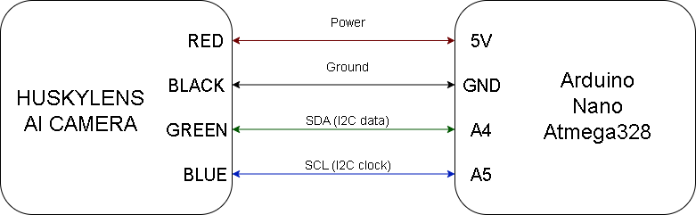

### Wiring Diagram 

### 2.2.1 - Wiring Diagram Topology

The wiring diagram shows the connection used in Cheese’s power and sensing architecture. The EV3 brick with its rechargeable battery acts as the central control and power unit, directly managing the drive motor, steering motor, ultrasonic sensors, and color sensor through its output and input ports. The HuskyLens AI camera is connected through an Arduino Nano, which works as an intermediate communication bridge between the vision system and the EV3. This layout keeps the main navigation sensors connected directly to the EV3 while separating the camera-processing system, making the wiring easier to understand, debug, and maintain during testing.

━━━━━━━━━━━━━━━━━━━━━━━━━━━━━━━━━━━━━━━━

  

━━━━━━━━━━━━━━━━━━━━━━━━━━━━━━━━━━━━━━━━

#### 2.2.2 - Arduino-HuskyLens Wiring Diagram

The diagram shows the I2C wiring connection between the HuskyLens AI Camera and the Arduino Nano. The HuskyLens receives power through the 5V and GND pins, while the green and blue signal wires are connected to the Arduino Nano’s A4 and A5 pins, which are used for I2C communication. This connection allows the Arduino Nano to receive vision data from the HuskyLens and later act as a bridge between the camera system and the EV3-based control architecture.

━━━━━━━━━━━━━━━━━━━━━━━━━━━━━━━━━━━━━━━━

  

━━━━━━━━━━━━━━━━━━━━━━━━━━━━━━━━━━━━━━━━

