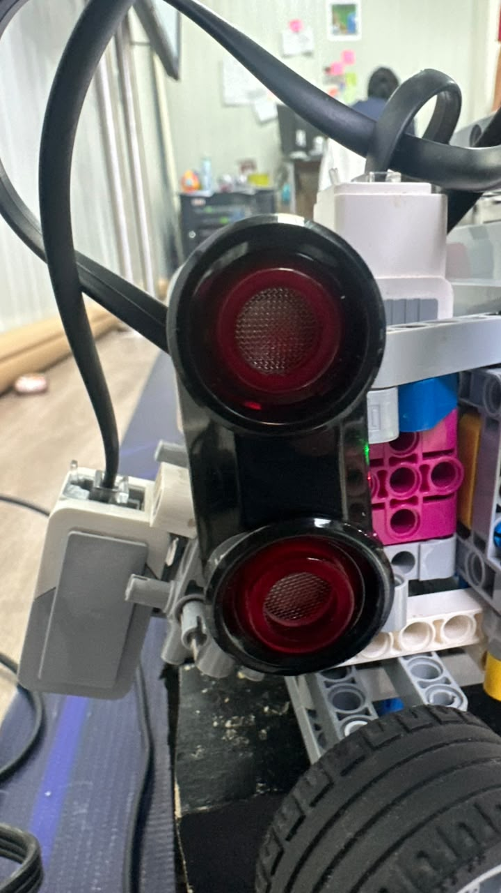
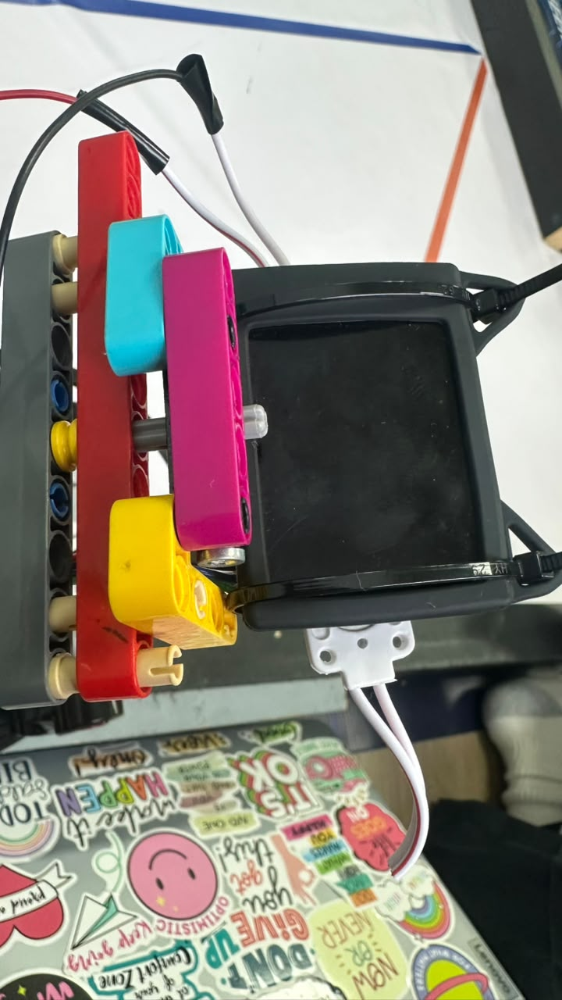

# ᯓ★ 2.3 Sensor Selection & Placement ᯓ★

Cheese navigates with three sensors and a camera, and every one of them earned its place by replacing something that did not work. This section covers how each sensor works, why we chose it, where it sits, and what still goes wrong with it.

| Sensor | Port | Position | Job |
| :--- | :---: | :--- | :--- |
| **Ultrasonic (left)** | `INPUT_1` | Left flank | Distance to the left wall |
| **Color sensor** | `INPUT_2` | Center, near the brick, facing down | Reads track lines to time the turns |
| **Ultrasonic (right)** | `INPUT_3` | Right flank | Distance to the right wall |
| **HuskyLens** | via Arduino Nano | Elevated mount, angled down | Detects red and green pillars |

---

## ❀ 2.3.1 The Ultrasonic Sensors ────୨ৎ────────୨ৎ────

**How they work.** An ultrasonic sensor emits a pulse of sound above human hearing and measures how long it takes for the echo to return. Since the speed of sound is known, that flight time converts directly into distance. The sensor is not seeing the wall; it is listening for its own voice coming back.

| Specification | Value |
| :--- | :--- |
| **Measurement range** | 3 cm to 250 cm |
| **Accuracy** | ± 1 cm |
| **Beam angle** | ~45 degrees |

**What they do on Cheese.** Both sensors sit on the flanks and read the distance to the walls on either side, the outer track wall and the inner one. The robot uses both readings together, trying to settle itself at a target distance from the outer wall and hold that line down the straight. This is the input the PD controller works from.

**Why ultrasonic.** Two reasons, and one of them is not purely technical.

The first is availability. We work with a limited set of sensors, and ultrasonic is what we had access to. That is a real constraint and it shaped the design.

The second is that we understood them. We had worked with ultrasonic sensors in class, so we knew how they behaved and how to reason about their output. A more capable sensor we did not understand would have been worse than a limited one we did. Choosing the tool you can actually debug is a legitimate engineering decision, especially for two people against a deadline.

**Where they fail, and why.** The ultrasonic sensors give us wild, uncontrolled readings more often than we would like. Two things trigger it:

- **A draining battery.** Readings degrade as voltage falls, consistent with everything in Section 2.1.
- **New code.** Most episodes appear right after we deploy a change, which points to how we are reading the sensors rather than to the sensors themselves.

**A risk we have identified but not yet solved.** Our two ultrasonic sensors currently fire **at the same time**. This is a known hazard in ultrasonic sensing, called **cross-talk**: with a beam angle of roughly 45 degrees, the sound cone from one sensor is wide enough that its pulse can reach the other sensor, which may then mistake a neighbour's echo for its own. The result is a distance reading that is real sound but the wrong sound, which is exactly the kind of nonsense value we keep seeing.

We have not confirmed this is the cause of our erratic readings, but the mechanism fits the symptom, and it is the first thing we intend to test. The standard fix is to stagger the readings in time so that only one sensor is listening at any moment.

---

## ❀ 2.3.2 The Color Sensor ────୨ৎ────────୨ৎ────

**How it works.** The EV3 color sensor is an active sensor: it emits its own light onto the surface below it and measures the intensity and wavelength of what bounces back. Because it supplies its own illumination, it does not depend on ambient lighting, which makes it far more consistent than a passive sensor would be under changing conditions.

The consequence of that design is that **the distance from the floor matters.** Light spreads and weakens with distance, so a sensor mounted too high receives a dimmer, more diffuse return and reads colors less confidently.

**Where it sits.** The color sensor is mounted at the center of the robot, near the brick, held firmly to the structure and facing straight down. It sits close enough to the floor to get a strong reading, with enough clearance not to drag.

The central mounting was deliberate. The sensor reads a line the instant it passes over it, so its position along the robot determines *when* in the robot's travel that signal arrives. Placing it at the center ties our turn timing to the middle of the vehicle rather than to its leading edge.

It is held rigidly for a reason that follows directly from how it works: since the reading depends on distance to the floor, a sensor that bounces or drifts changes its own measurement. A wobbling color sensor is a lying color sensor.

**What it reads.** The logic is symmetric rather than fixed. Either color can begin a turn, and the opposite color ends it:

- **Blue detected** → begin a left turn. The turn ends when orange appears.
- **Orange detected** → begin a right turn. The turn ends when blue appears.

The color that starts the corner also determines which way the robot turns, and the code then waits specifically for the opposite color before declaring the corner complete. This means a single stripe cannot accidentally both start and end a turn.

This is the most reliable signal on the robot. It does not estimate, infer, or measure something and guess. The line is there or it is not.

**How it performed.** It has not given us a single problem. Not one. In a robot where the ultrasonic sensors go haywire and the camera dies on low battery, the color sensor has simply worked, every run.

---

## ❀ 2.3.3 The Sensor We Replaced Three Times ────୨ৎ────────୨ৎ────

The third sensor slot has the most instructive history on this robot, because it took three attempts to fill it correctly.

| Version | Sensor | Why it failed |
| :--- | :--- | :--- |
| **v1** | Infrared | Did not work at the distances we needed; too complex to work with |
| **v2** | Ultrasonic, forward-facing | Lost its echo during corners and returned meaningless distances |
| **v3** | Color sensor, downward-facing | Works. Reads a line instead of guessing a distance. |

**v1: infrared.** Our first build used an infrared sensor. It failed on two counts: it did not work at the distances we actually needed, and it was complicated enough that it was slowing us down. We dropped it.

**v2: a forward-facing ultrasonic.** We replaced it with an ultrasonic sensor pointed forward, using the approaching wall to time our turns.

This is the version that broke us, and the reason is physical. **An ultrasonic sensor depends on the surface it is aimed at being roughly perpendicular to it.** A perpendicular wall reflects the sound pulse straight back to the sensor. A wall at an angle does not: the sound reflects away at the mirror angle and never returns. This is called specular reflection, and it is the fundamental weakness of ultrasonic ranging.

On the straights, our forward sensor faced a wall square-on and worked fine. But the moment the robot began rotating into a corner, the wall ahead was no longer perpendicular to the sensor. The pulses started bouncing away instead of coming back, the echoes stopped returning reliably, and the distance readings became erratic and meaningless, exactly when the robot most needed to know where it was. It crashed.

**v3: a downward color sensor.** We stopped trying to solve the corner with distance and solved it with color instead. Instead of asking "how far is the wall," the robot now asks "am I on the line yet."

The difference is fundamental. Distance to a wall during a corner is genuinely ambiguous, because the geometry between the sensor and the wall is changing as the robot rotates. A painted line on the floor is not ambiguous. The sensor is always perpendicular to the floor, no matter how the robot is oriented, so the reading never degrades.

> **The lesson:** we spent two versions trying to make a distance sensor answer a question its physics made it bad at answering. The fix was not a better sensor. It was a better question.

---

## ❀ 2.3.4 The HuskyLens Camera ────୨ৎ────────୨ৎ────

**What it does.** The HuskyLens detects the red and green pillars of the Obstacle Challenge. Without it, an entire round of the competition is impossible for us.

**Where it sits.** The camera is suspended on a custom mount, elevated above the body of the robot and **angled downward toward the floor.** The downward tilt is what lets it see the pillars at all: they sit on the mat, and a camera pointed straight ahead would look over them rather than at them. Height plus a downward angle gives it a clear view of the ground ahead, which is exactly where an obstacle appears before the robot reaches it.

**How it performed.** Reliable in every condition except one: it fails when the battery is low. As documented in Section 2.1, the HuskyLens sits at the end of the power chain, drawing from the Arduino Nano, which draws from the EV3's USB rail. It is the first component to fall below its operating voltage, which means **we lose vision before we lose motion.**

That is not a camera problem. It is a power architecture problem, and we treat it as one.

---

## ❀ 2.3.5 What This Configuration Cannot Do ────୨ৎ────────୨ৎ────

Cheese has **no forward-facing distance sensor.** We removed it deliberately, because the physics above made it unreliable exactly when we needed it. But it does mean the robot has no direct way to measure how far it is from something directly ahead.

It infers what is coming from the walls beside it and the lines beneath it. For our track this works, because the geometry is known and the lines mark the corners. But it is a real limitation, and worth naming rather than hiding.

---

## ❀ 2.3.6 Sensor Placement Photos ────୨ৎ────────୨ৎ────

The following photos show the final sensor placement used in Cheese v3. These images are important because sensor position directly affects how the robot reads the track, detects walls, identifies colors, and recognizes obstacles.

  
  
  

  <em>Left: the left ultrasonic sensor on the flank. Center: the color sensor mounted at the front and facing the floor. Right: the HuskyLens camera on its elevated mount for obstacle recognition.</em>

| Sensor View | Photo | What It Shows |
| :--- | :--- | :--- |
| **Left Ultrasonic Sensor** | [View Image](../../v-photos/v3/sensor_placement_left_v3.jpg) | Shows the left ultrasonic sensor mounted on the side of the robot to help measure wall distance. |
| **Front Color Sensor** | [View Image](../../v-photos/v3/sensor_placement_front_v3.jpg) | Shows the color sensor placement used to read floor colors for curve and progress detection. |
| **Right Ultrasonic Sensor** | [View Image](../../v-photos/v3/sensor_placement_right_v3.jpg) | Shows the right ultrasonic sensor mounted on the opposite side for wall-distance comparison. |
| **HuskyLens Camera** | [View Image](../../v-photos/v3/sensor_placement_cam_v3.jpg) | Shows the elevated HuskyLens placement used for obstacle recognition and camera-based detection. |
| **Dual-Light System** | [View Image](../../v-photos/v3/dual_light_system_v3.jpeg) | Shows the lighting support added to improve sensor consistency under irregular lighting conditions. |

These photos support the sensor architecture because they show that each sensor was not only selected for its function, but also placed in a position that matched its role. The ultrasonic sensors are positioned to support wall awareness, the color sensor is placed close to the floor for color detection, and the HuskyLens is elevated to improve its field of view for obstacle recognition.

  ✦ ─── ⋆⋅☆⋅⋆ ─── (❁´◡`❁) ─── ⋆⋅☆⋅⋆ ─── ✦

  

