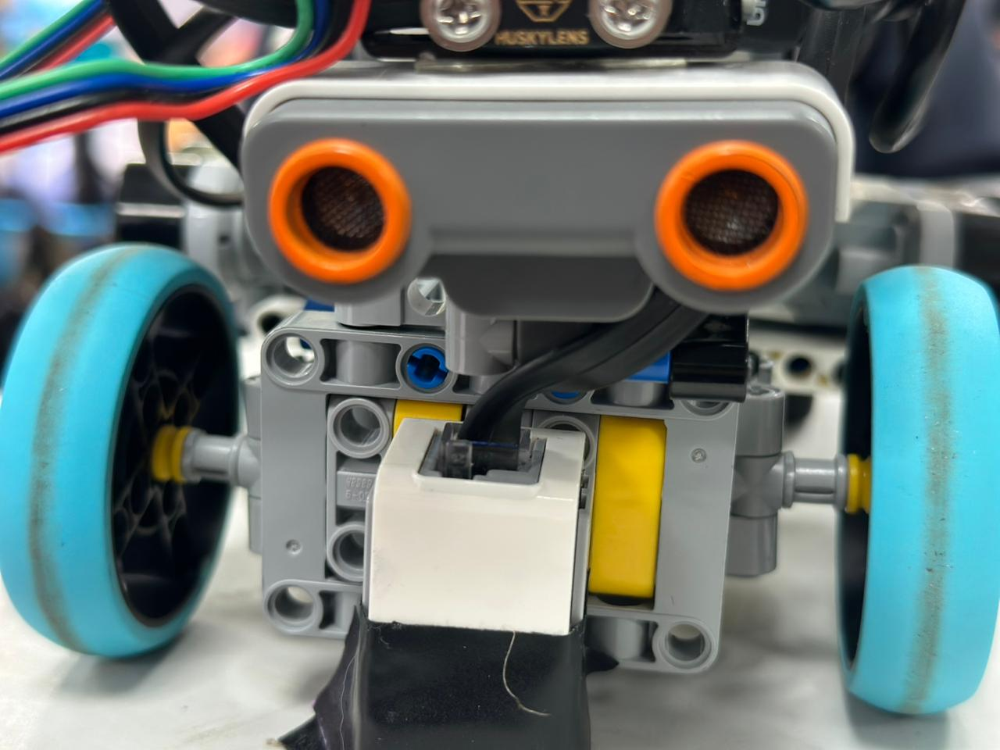
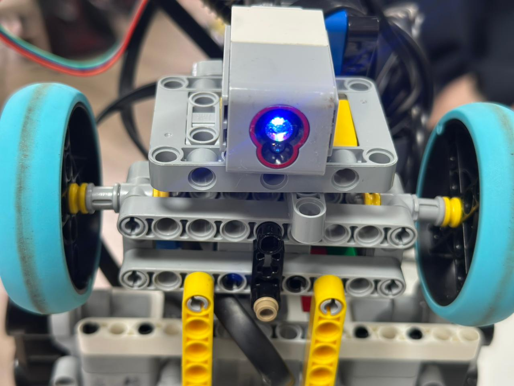
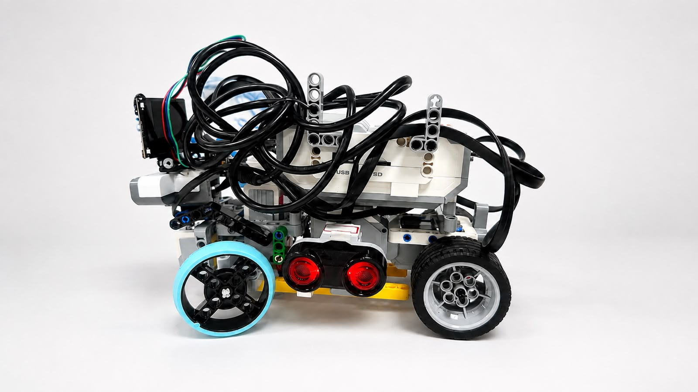

# ᯓ★ 2.3 Sensor Selection and Placement ᯓ★

  
  
  

  <em>This section explains why each sensor was chosen, what each sensor detects, where it is placed, and how the v4 layout improved sensor stability, visibility, and inspection.</em>

  ✦ ─── ⋆⋅☆⋅⋆ ─── (❁´◡`❁) ─── ⋆⋅☆⋅⋆ ─── ✦

Each sensor on Cheese was placed according to what it needs to detect. The ultrasonic sensors look toward the walls, the color sensor looks down at the floor, and the HuskyLens camera looks forward toward obstacles.

The sensor system is important because Cheese does not know where it is unless the sensors give useful information. If a sensor is too high, too low, blocked by cables, pointed at the wrong angle, or affected by lighting, the robot can make the wrong decision even if the code is correct.

This section also documents the progress from previous versions to v4. The goal was not to erase old solutions, but to show how testing helped us improve the sensor layout.

---

## ❀ 2.3.1 Sensor Job Map ────୨ৎ────────୨ৎ────

  
  

For a beginner, the easiest way to understand Cheese’s sensors is to separate them by job.

| Sensor | What It Detects | Where It Looks | Why Cheese Needs It |
| :--- | :--- | :--- | :--- |
| **Left ultrasonic sensor** | Distance to the left wall | Side of the robot | Helps Cheese understand its position relative to the wall. |
| **Right ultrasonic sensor** | Distance to the right wall | Side of the robot | Helps Cheese compare wall distance and avoid drifting. |
| **Color sensor** | Floor colors / markers | Down toward the mat | Helps Cheese detect colored lines and count progress around the track. |
| **HuskyLens camera** | Obstacles / visual targets | Forward | Helps Cheese recognize obstacles during the Obstacle Challenge. |

  <strong>Final sensor logic:</strong> 
  Ultrasonic sensors detect walls, the color sensor detects floor markers, and the HuskyLens detects obstacles.

---

## ❀ 2.3.2 Sensor Visual Evidence Gallery ────୨ৎ────────୨ৎ────

The photos are grouped here so the evidence stays organized instead of being scattered through the section. Each image supports a specific sensor placement decision.

| Evidence | Visual | Interactive File Link | What It Proves |
| :--- | :---: | :--- | :--- |
| **Overall v4 layout** |  | [top_v4.jpg](../../v-photos/v4/top_v4.jpg) | Shows the compact sensor layout, EV3 position, and cable organization. |
| **Left ultrasonic sensor** |  | [sensor_placement_left_v4.jpg](../../v-photos/v4/sensor_placement_left_v4.jpg) | Shows the left wall-distance sensor placement. |
| **Right ultrasonic sensor** |  | [sensor_placement_right_v4.jpg](../../v-photos/v4/sensor_placement_right_v4.jpg) | Shows the right wall-distance sensor placement. |
| **Front sensor area** |  | [sensor_placement_front_v4.jpg](../../v-photos/v4/sensor_placement_front_v4.jpg) | Shows the front sensor area and compact v4 layout. |
| **Color sensor / bottom area** |  | [sensor_placement_cam_bottom.jpg](../../v-photos/v4/sensor_placement_cam_bottom.jpg) | Shows the floor-facing sensor area used for marker detection. |
| **HuskyLens camera** |  | [sensor_placement_cam_v4.jpg](../../v-photos/v4/sensor_placement_cam_v4.jpg) | Shows the simplified forward-facing camera mount. |
| **Front robot view** |  | [front_v4.jpg](../../v-photos/v4/front_v4.jpg) | Shows how the front structure supports sensors and camera placement. |
| **Bottom robot view** |  | [bottom_v4.jpg](../../v-photos/v4/bottom_v4.jpg) | Shows lower structure, sensor support, and routing space. |
| **Left side view** |  | [left_v4.jpeg](../../v-photos/v4/left_v4.jpeg) | Shows the left side structure and sensor support. |
| **Right side view** |  | [right_v4.jpg](../../v-photos/v4/right_v4.jpg) | Shows the right side structure and sensor support. |

This gallery keeps the sensor evidence in one place. The rest of the section explains the reasoning behind each placement decision.

---

## ❀ 2.3.3 Field Geometry and Sensor Placement ────୨ৎ────────୨ৎ────

Sensor placement depends on field geometry. The sensors must face the part of the field that contains the information they need.

| Field Feature | Sensor That Reads It | Placement Reason |
| :--- | :--- | :--- |
| **Side walls** | Ultrasonic sensors | They are placed on the sides and lowered so the signal can bounce from the walls. |
| **Floor color markers** | Color sensor | It faces downward because the markers are on the floor. |
| **Obstacles** | HuskyLens camera | It faces forward because obstacles appear ahead of the robot. |

This is why sensor placement is not random. The track itself decides where the sensors should look.

  <strong>Sensor placement rule:</strong> 
  A sensor should point toward the physical feature it is responsible for detecting.

---

## ❀ 2.3.4 Ultrasonic Sensors: Wall Distance ────୨ৎ────────୨ৎ────

  
  
  

An ultrasonic sensor is a distance sensor. It sends out a sound wave that humans cannot hear. That sound wave travels through the air, bounces off a wall or object, and returns to the sensor. The sensor uses the return time to estimate distance.

For Cheese, ultrasonic sensors are useful because the WRO Future Engineers track has side walls. The robot needs to know how far it is from those walls so it can correct its position and avoid crashing.

| Ultrasonic Sensor Part | Beginner Explanation |
| :--- | :--- |
| **Emitter** | Sends the ultrasonic sound pulse. |
| **Receiver** | Detects the returning echo. |
| **Time measurement** | Measures how long the sound took to return. |
| **Distance value** | Converts that time into a distance reading. |

Cheese uses ultrasonic sensors because wall distance is one of the most important pieces of information for navigation. The sensors do not tell the robot the full map, but they tell it how close it is to the walls.

---

## ❀ 2.3.5 Why Ultrasonic Sensors Were Lowered in v4 ────୨ৎ────────୨ৎ────

In v4, the ultrasonic sensors were lowered. This change was important because the side walls of the WRO field are not extremely tall. If an ultrasonic sensor is placed too high, the ultrasonic beam can pass above the wall instead of bouncing back correctly.

| Problem With Higher Placement | Why It Can Hurt Navigation |
| :--- | :--- |
| **Beam passes above the wall** | The robot may think the side is open and drive incorrectly. |
| **Smaller surface for echo** | Readings can become weaker or less consistent. |
| **Sensor angle becomes harder to control** | Small movements can change the reading. |
| **Wall detection becomes unreliable** | The robot may correct too late or crash. |

Lowering the ultrasonic sensors helps the sound beam hit the wall more directly. This gives the robot a better chance of receiving a useful echo from the wall surface.

  <strong>Lower ultrasonic placement → better wall contact → more useful distance readings</strong>

This does not mean the readings become perfect, but it improves the physical conditions for wall detection.

---

## ❀ 2.3.6 Color Sensor: Floor Marker Detection ────୨ৎ────────୨ৎ────

  
  
  

A color sensor is a sensor that detects color or reflected light from a surface. It works by shining light toward a surface and measuring what light reflects back.

For Cheese, the color sensor faces the floor because the useful information is on the mat. The robot uses floor colors and line markers to understand progress during the run. This makes the color sensor one of the most important sensors for counting and navigation progress.

| Color Sensor Job | Why It Matters |
| :--- | :--- |
| **Looks down at the floor** | The colored markers are on the mat, not in front of the robot. |
| **Detects floor colors** | Helps Cheese identify lines or markers. |
| **Supports curve / lap progress** | Helps the program count where the robot is in the run. |
| **Acts like a progress signal** | Tells the robot when it has passed important track markers. |

The color sensor is like the part of the robot that says, “I just passed this marker.” Without it, the robot would have less information about where it is in the run.

---

## ❀ 2.3.7 Why the Color Sensor Stayed in the Same Position ────୨ৎ────────୨ৎ────

The color sensor stayed in the same general position in v4 because it was still doing its job correctly. Not every redesign requires moving every component.

In engineering, keeping a working placement can be just as important as changing a weak one. The color sensor already had the correct job, direction, and purpose: it faced the floor and detected the markers Cheese needed.

| Reason It Stayed | Why That Was the Better Choice |
| :--- | :--- |
| **It already faced the floor correctly** | The information it needed was on the mat. |
| **It still supported line / marker counting** | The robot could continue tracking progress. |
| **Moving it could create new calibration problems** | A new height or angle could change readings. |
| **The v4 redesign focused on weaker areas** | Ultrasonic height, camera structure, and cable clutter needed more attention. |

This was an intentional decision. The color sensor was not left unchanged because we forgot about it. It stayed because its placement still matched its function.

---

## ❀ 2.3.8 HuskyLens Camera: Obstacle Detection ────୨ৎ────────୨ৎ────

  
  
  

The HuskyLens is a camera-based vision sensor. It can recognize visual information, such as learned objects, colors, or targets depending on how it is trained and configured.

For Cheese, the HuskyLens faces forward because obstacles appear in front of the robot during the Obstacle Challenge. A forward-facing camera lets the robot detect obstacles before it reaches them.

| Camera Placement Choice | Why It Matters |
| :--- | :--- |
| **Faces forward** | Obstacles are ahead of the robot. |
| **Placed closer to the front** | Gives a clearer and more direct view of the obstacle area. |
| **Lower than before** | Reduces unnecessary upper structure and helps visibility. |
| **Simpler mount** | Makes the robot lighter, cleaner, and easier to inspect. |

The camera does not replace the ultrasonic sensors or color sensor. It gives a different type of information: visual obstacle information.

---

## ❀ 2.3.9 Why the Camera Stayed Forward but With a Simpler Mount ────୨ৎ────────୨ৎ────

In v3, the camera structure had a lot of extra support. The camera function was necessary, but the mount added weight, height, and calibration difficulty.

During testing, we realized that much of the extra structure was supporting the same goal: holding the camera. It did not directly improve every part of the robot’s performance, and it made the robot heavier and more complicated to tune.

In v4, the camera stayed forward because its job did not change. It still needed to see obstacles ahead. What changed was the structure around it.

| Previous Camera Structure | v4 Camera Structure |
| :--- | :--- |
| Taller and more supported by extra pieces. | Lower and simpler. |
| Added more upper mass. | Reduced unnecessary height. |
| Made the robot more cluttered. | Cleaner and easier to inspect. |
| Needed more calibration attention. | More direct and compact placement. |
| Helped the camera function but added complexity. | Keeps the camera function while reducing structure. |

This is a good example of progress through testing. We did not remove the camera; we improved how it was mounted.

---

## ❀ 2.3.10 How the Sensors Work Together ────୨ৎ────────୨ৎ────

No single sensor gives Cheese all the information it needs. Each sensor gives a different type of information, and the robot combines those readings through the program.

  

| Sensor | Information Type | Robot Use |
| :--- | :--- | :--- |
| **Ultrasonic sensors** | Wall distance | Helps wall following and collision avoidance. |
| **Color sensor** | Floor marker / color information | Helps count progress and detect track markers. |
| **HuskyLens camera** | Obstacle information | Helps detect obstacles during the Obstacle Challenge. |

In simple terms:

  <strong>Ultrasonic sensors answer:</strong> “How close am I to the wall?” 
  <strong>Color sensor answers:</strong> “What floor marker did I pass?” 
  <strong>HuskyLens answers:</strong> “What obstacle is in front of me?”

This separation makes the sensor system easier to understand and debug. If the robot has wall problems, we inspect the ultrasonic sensors. If it misses floor markers, we inspect the color sensor. If it misses obstacles, we inspect the camera system.

---

## ❀ 2.3.11 v3 to v4 Sensor Layout Changes ────୨ৎ────────୨ৎ────

The v4 sensor layout became more compact and easier to inspect. This was not done by removing sensor functions. It was done by improving how the sensors were supported and arranged.

| Sensor Area | Previous Issue | v4 Change | Result |
| :--- | :--- | :--- | :--- |
| **Ultrasonic sensors** | Some placements were higher or less ideal for the wall height. | Sensors were lowered. | Better physical alignment with side walls. |
| **Color sensor** | Placement was already useful. | Stayed in the same working position. | Avoided unnecessary recalibration. |
| **HuskyLens camera** | Mount was taller and had extra structure. | Camera stayed forward but mount became simpler and lower. | Cleaner structure and better inspection. |
| **Sensor wiring** | More clutter around the robot. | Cable routing became shorter and cleaner. | Easier debugging and less obstruction. |

This section shows adaptability. The team did not change everything blindly. We changed the parts that testing showed were weak, and we kept the parts that were already working.

---

## ❀ 2.3.12 Sensor Evidence Map ────୨ৎ────────୨ৎ────

  
  
  

| Evidence | Interactive File Link | What It Proves |
| :--- | :--- | :--- |
| **Top v4 sensor overview** | [top_v4.jpg](../../v-photos/v4/top_v4.jpg) | Shows the compact sensor layout and general cable organization. |
| **Left ultrasonic sensor** | [sensor_placement_left_v4.jpg](../../v-photos/v4/sensor_placement_left_v4.jpg) | Shows the left wall-distance sensor position. |
| **Right ultrasonic sensor** | [sensor_placement_right_v4.jpg](../../v-photos/v4/sensor_placement_right_v4.jpg) | Shows the right wall-distance sensor position. |
| **Front sensor overview** | [sensor_placement_front_v4.jpg](../../v-photos/v4/sensor_placement_front_v4.jpg) | Shows the front sensor area and compact v4 layout. |
| **Color sensor bottom view** | [sensor_placement_cam_bottom.jpg](../../v-photos/v4/sensor_placement_cam_bottom.jpg) | Shows the floor-facing sensor area used for floor marker detection. |
| **HuskyLens camera placement** | [sensor_placement_cam_v4.jpg](../../v-photos/v4/sensor_placement_cam_v4.jpg) | Shows the simplified forward-facing camera mount. |
| **Bottom structure view** | [bottom_v4.jpg](../../v-photos/v4/bottom_v4.jpg) | Shows lower support structure and sensor routing space. |
| **Front robot view** | [front_v4.jpg](../../v-photos/v4/front_v4.jpg) | Shows how the front structure supports the sensor and camera area. |
| **Sensor overview labeled photo** | [sensor_placement_overview_v4.jpg](../../v-photos/v4/sensor_placement_overview_v4.jpg) | Should show all main sensors labeled in one image. |
| **v3 vs v4 sensor comparison** | [v3_vs_v4_sensor_layout_comparison.jpg](../../v-photos/v4/v3_vs_v4_sensor_layout_comparison.jpg) | Should show how sensor placement changed from the older layout to v4. |

This evidence map connects the sensor explanation to physical proof. Each image supports a specific placement decision: walls, floor markers, or obstacles.

---

## ❀ 2.3.13 Sensor Testing and Lessons ────୨ৎ────────୨ৎ────

Testing showed that sensor performance depends on both the sensor itself and the physical placement around it.

| Sensor | Testing Lesson | Design Response |
| :--- | :--- | :--- |
| **Ultrasonic sensors** | Wall distance readings depend on height and angle. | Sensors were lowered in v4 to better face the side walls. |
| **Color sensor** | It was already useful for floor marker detection. | It stayed in the same working position to avoid unnecessary recalibration. |
| **HuskyLens camera** | Obstacle detection depends on forward visibility and stable mounting. | Camera stayed forward but mount became lower and simpler. |
| **Sensor wiring** | Cables can block or complicate sensor inspection. | Cable routing became shorter and cleaner in v4. |

The main lesson is that sensor selection and sensor placement must be designed together. A good sensor in a bad position can still give poor results.

---

## ✦ Final Sensor Selection and Placement Summary ─── ⋆⋅☆⋅⋆ ───

Each sensor was placed according to its job: walls, floor markers, or obstacles.

The ultrasonic sensors were chosen because Cheese needs wall-distance information. They were lowered in v4 to better align with the side walls of the field. The color sensor faces the floor because it detects floor markers used for progress and line counting. Its position stayed the same because it was already working. The HuskyLens faces forward because obstacles appear in front of the robot, but its mount became simpler and lower in v4 to reduce unnecessary structure and improve inspection.

  <strong>Final sensor lesson:</strong> 
  A sensor is only useful when it is placed where the information exists.

  ✦ ─── ⋆⋅☆⋅⋆ ─── (❁´◡`❁) ─── ⋆⋅☆⋅⋆ ─── ✦

  

