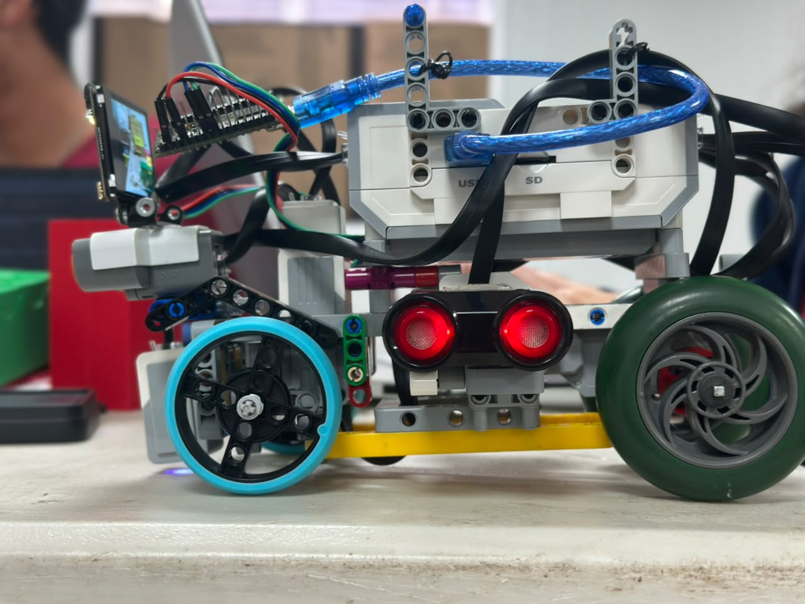
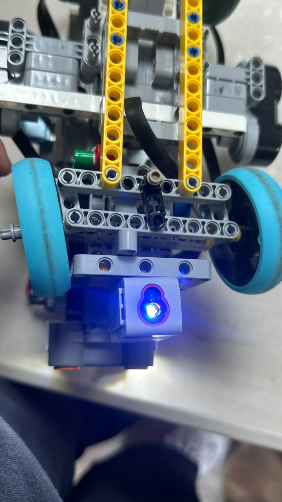
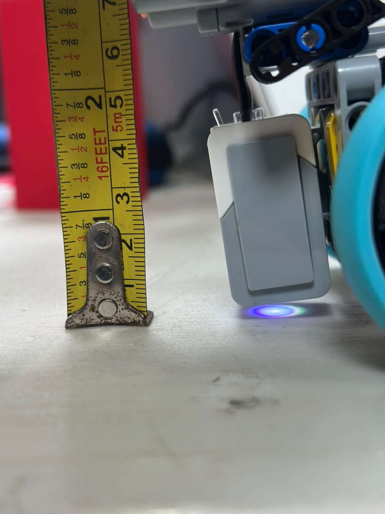
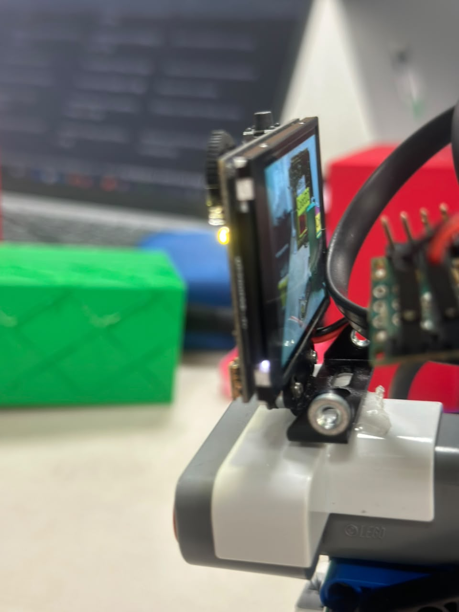
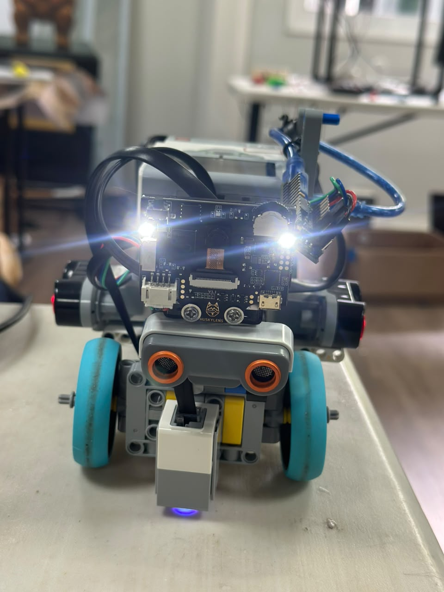

<h1 align="center">ᯓ★ 2.3 Sensor Selection & Placement ᯓ★</h1>

<p align="center">
  
  
  
  
</p>

<p align="center">
  <em>
    Cheese v4 combines distance, floor-color, and computer-vision sensing.
    Each sensor is positioned according to the physical information it must detect.
  </em>
</p>

<p align="center">
  ✦ ─── ⋆⋅☆⋅⋆ ─── (❁´◡`❁) ─── ⋆⋅☆⋅⋆ ─── ✦
</p>

Sensor selection alone is not enough for an autonomous vehicle.

A sensor can be technically correct but still provide poor information if it is mounted too high, too far from its target, blocked by another component, or pointed toward the wrong area.

For Cheese v4, sensor placement follows one main principle:

> **Place each sensor where the physical information it needs is actually available.**

This resulted in three sensing layers:

```text
SIDE / FRONT DISTANCE
        ↓
3 Ultrasonic Sensors

FLOOR INFORMATION
        ↓
EV3 Color Sensor

VISUAL OBSTACLES
        ↓
HuskyLens Camera
```

---

## ❀ 2.3.1 Sensor Configuration ────୨ৎ────────୨ৎ────

The current Cheese v4 sensor architecture contains:

| Device | Quantity | Information | Main Purpose |
| :--- | :---: | :--- | :--- |
| **Left Ultrasonic Sensor** | 1 | Left-side distance | Wall awareness and navigation |
| **Right Ultrasonic Sensor** | 1 | Right-side distance | Wall awareness and navigation |
| **Front Ultrasonic Sensor** | 1 | Forward distance | Front-wall safety and recovery |
| **EV3 Color Sensor** | 1 | Floor color | Curve/progress counting |
| **HuskyLens** | 1 | Visual obstacle information | Red/green obstacle recognition |

Therefore, Cheese does not depend on one sensor to understand the complete field.

Each device has a specialized job.

<p align="center">
  <strong>
    Walls → Ultrasonic Sensors<br>
    Floor Markers → Color Sensor<br>
    Obstacles → HuskyLens
  </strong>
</p>

---

## ❀ 2.3.2 Why Multiple Sensor Types Are Necessary ────୨ৎ────────୨ৎ────

Different parts of the WRO field contain different kinds of information.

A wall is best understood as a **distance**.

A floor marker is best understood as a **color**.

An obstacle requires **visual identification and position information**.

For this reason, Cheese uses complementary sensors instead of expecting one device to solve every navigation problem.

| Field Information | Sensor Type | Reason |
| :--- | :--- | :--- |
| Side-wall distance | Ultrasonic | Measures distance without physical contact |
| Front-wall distance | Ultrasonic | Detects unsafe forward proximity |
| Colored floor markers | Color sensor | Reads the mat directly below Cheese |
| Colored obstacles | HuskyLens | Provides visual recognition ahead of Cheese |

This creates a more modular architecture.

When a failure occurs, the team can investigate the subsystem responsible for that information.

---

# ❀ 2.3.3 Ultrasonic Sensor Layout ────୨ৎ────────୨ৎ────

Cheese v4 uses **three ultrasonic sensors**.

Their positions are not interchangeable because each one observes a different part of the environment.

```text
                    FRONT
                      ↑

              [ FRONT ULTRASONIC ]

                      │

 LEFT ULTRASONIC ← [ CHEESE ] → RIGHT ULTRASONIC

                      ↓
                 REAR / DRIVE
```

The two lateral sensors provide information about the walls beside the robot.

The front ultrasonic sensor provides an additional safety layer for situations where Cheese approaches a wall or object too closely.

---

## ❀ 2.3.4 Left & Right Ultrasonic Sensors ────୨ৎ────────୨ৎ────

The lateral ultrasonic sensors are mounted low on both sides of Cheese.

<p align="center">
  
</p>

<p align="center">
  <em>
    Side-sensor layout of Cheese v4 showing the low lateral distance-sensing arrangement.
  </em>
</p>

Their main purpose is to provide wall-distance information.

The software can use these measurements to determine whether Cheese is:

- approaching a wall,
- moving away from a wall,
- drifting from its intended path,
- or entering a region where stronger correction is necessary.

### Why were they mounted low?

The height of the field walls creates a physical limitation.

If an ultrasonic sensor is mounted too high, part of its sensing beam may pass above the wall instead of returning a useful echo.

Therefore:

<p align="center">
  <strong>
    Lower sensor position → better alignment with wall → more useful distance measurement
  </strong>
</p>

This was one of the physical improvements incorporated into the v4 layout.

---

# ❀ 2.3.5 Front Ultrasonic Sensor ────୨ৎ────────୨ৎ────

The third ultrasonic sensor faces forward.

Its role is different from the lateral sensors.

Instead of primarily measuring lateral position, it provides **forward safety information**.

<p align="center">
  
</p>

<p align="center">
  <em>
    Front sensing stack showing the HuskyLens positioned above the forward ultrasonic sensor.
  </em>
</p>

The front ultrasonic sensor is useful when Cheese approaches the front wall too closely.

This allows the navigation system to recognize dangerous proximity and activate recovery behavior before the robot remains pressed against the wall.

| Front Sensor Role | Purpose |
| :--- | :--- |
| **Forward distance measurement** | Detects objects/walls ahead |
| **Safety monitoring** | Identifies unsafe proximity |
| **Reverse recovery support** | Helps determine when backing away is necessary |
| **Collision prevention** | Adds protection beyond side-wall navigation |

The front ultrasonic sensor is therefore a **safety and recovery sensor**, not the main curve-counting sensor.

---

# ❀ 2.3.6 Color Sensor Placement ────୨ৎ────────୨ৎ────

The EV3 Color Sensor faces downward toward the track.

<p align="center">
  
  &nbsp;
  
</p>

<p align="center">
  <em>
    Current v4 color-sensor placement and its physical distance from the track surface.
  </em>
</p>

This orientation is necessary because the information used by the sensor exists **on the floor**.

During the Open Challenge, Cheese uses floor-color information to detect the colored track markers used by the curve-counting logic.

The sensor therefore acts as a progress reference:

```text
Track marker
     ↓
Color Sensor
     ↓
Color Detection
     ↓
Curve Validation
     ↓
Curve Counter
     ↓
Run Progress / Parking Logic
```

---

## ❀ 2.3.7 Color Sensor v4 Position Change ────୨ৎ────────୨ৎ────

The v4 color sensor remained in approximately the **same structural region** as the previous design.

However, it was positioned **slightly lower**.

That small physical change became important.

Earlier testing showed that floor-color detection could become unreliable depending on lighting conditions and sensor-to-floor geometry.

An improvised light-blocking cover was tested, but it created its own mechanical problems and was not retained as part of the final normal v4 configuration.

Instead, lowering the sensor slightly improved the physical reading conditions enough that the additional cover was no longer necessary during normal operation.

| Earlier Problem | Tested Response | v4 Decision |
| :--- | :--- | :--- |
| Ambient light affected readings | Temporary physical cover | Cover removed |
| Some colors were harder to distinguish | Position experiments | Sensor lowered slightly |
| Extra cover could interfere physically | Additional structure around sensor | Simplified |
| Detection needed more consistency | Better sensor-to-floor geometry | Current lower position retained |

This produced an important lesson:

> **Sometimes improving the position of a sensor is better than adding another component around it.**

---

# ❀ 2.3.8 HuskyLens Camera Placement ────୨ৎ────────୨ৎ────

The HuskyLens is the main visual sensor used during the Obstacle Challenge.

It is mounted at the front of Cheese and faces forward toward the obstacle region.

<p align="center">
  
  &nbsp;
  
</p>

<p align="center">
  <em>
    Front and side evidence of the current HuskyLens mounting position and viewing angle.
  </em>
</p>

Camera placement is especially important because visual detection depends on the obstacle entering the camera's **field of view**.

A camera may be functioning correctly while still failing to detect an obstacle if:

- the obstacle is outside the field of view,
- Cheese exits a curve at a poor angle,
- detection occurs too late,
- another component blocks part of the view,
- or the robot is not positioned appropriately on the straight.

Therefore, camera placement and robot path are directly related.

---

## ❀ 2.3.9 HuskyLens + Front Ultrasonic Stack ────୨ৎ────────୨ৎ────

The front of Cheese must support two different kinds of sensing:

**visual obstacle information** and **physical distance information**.

The current layout places the HuskyLens above the front ultrasonic sensor.

<p align="center">
  
</p>

<p align="center">
  <em>
    Compact v4 front sensor stack integrating visual and ultrasonic sensing.
  </em>
</p>

The two sensors answer different questions:

| Sensor | Question |
| :--- | :--- |
| **HuskyLens** | What obstacle is ahead? |
| **Front ultrasonic** | How close is the object or wall ahead? |

They are complementary rather than redundant.

The HuskyLens helps the robot understand **what it sees**.

The ultrasonic sensor helps it understand **how close something is**.

---

# ❀ 2.3.10 Camera Mount Evolution ────୨ৎ────────୨ৎ────

The HuskyLens existed in previous Cheese versions, but the structure surrounding it changed significantly.

The previous design used more upper support structure.

During the v4 redesign, unnecessary structural elements were removed and the camera was integrated into a lower and more compact front assembly.

<p align="center">
  
</p>

The camera itself remained necessary.

The question was not:

> “Should we remove the camera?”

Instead, the engineering question became:

> **“How much structure does the camera actually need?”**

| v3 Concern | v4 Response |
| :--- | :--- |
| Large upper structure | Reduced |
| Higher camera assembly | Lower arrangement |
| More supporting pieces | Simplified support |
| More cable clutter | Cleaner routing |
| More mass above chassis | Reduced upper mass |

The result was a sensor system that retained its functionality while contributing to the lighter **666 g v4 robot**.

---

# ❀ 2.3.11 Arduino Nano Position ────୨ৎ────────୨ৎ────

The Arduino Nano is not itself an environmental sensor.

It acts as the communication bridge between the HuskyLens vision system and the EV3 architecture.

Its electrical connections are documented in **Section 2.2 Wiring Diagram**.

Its physical placement is still relevant here because it affects the sensor architecture.

<p align="center">
  
</p>

<p align="center">
  <em>
    Physical position of the Arduino Nano used as the communication interface for the vision subsystem.
  </em>
</p>

Unlike the EV3 Brick or motors, the Nano does not require a large rigid structural mount.

Its placement prioritizes:

- safe cable routing,
- accessibility,
- short connections,
- avoiding moving steering components,
- and keeping the front sensor area manageable.

For the detailed electrical relationship:

> **See Section 2.2 — Wiring Diagram.**

---

# ❀ 2.3.12 Sensor Geometry ────୨ৎ────────୨ৎ────

The final sensor arrangement can be understood by looking at the direction in which each device searches for information.

```text
                         OBSTACLES
                             ↑
                         HuskyLens
                             ↑
                      Front Ultrasonic

                             │
                             │
WALL  ←  Left Ultrasonic   CHEESE   Right Ultrasonic  →  WALL
                             │
                             │
                       Color Sensor
                             ↓
                      FLOOR MARKERS
```

This geometry follows the physical structure of the field.

### Horizontal information

The ultrasonic sensors measure walls and forward proximity.

### Vertical/downward information

The color sensor reads the track surface.

### Forward visual information

The HuskyLens observes obstacles ahead.

The sensor layout therefore surrounds Cheese with information without requiring every sensor to perform the same task.

---

# ❀ 2.3.13 How the Sensors Work Together ────୨ৎ────────୨ৎ────

The sensors become useful when their information reaches the navigation logic.

A simplified control relationship is:

```text
LEFT ULTRASONIC ──────┐
RIGHT ULTRASONIC ─────┤
FRONT ULTRASONIC ─────┤
                      ├──→ NAVIGATION LOGIC ───→ STEERING / DRIVE
COLOR SENSOR ─────────┤
                      │
HUSKYLENS → NANO ─────┘
```

However, not every challenge uses every sensing layer in the same way.

### Open Challenge

The Open Challenge primarily depends on:

- ultrasonic wall information,
- color-marker detection,
- PID corrections,
- front safety,
- curve counting,
- and parking logic.

### Obstacle Challenge

The Obstacle Challenge adds:

- HuskyLens obstacle recognition,
- camera-based steering influence,
- obstacle avoidance,
- and obstacle recovery.

This modular approach allows Cheese to use the sensing information appropriate for each challenge.

---

# ❀ 2.3.14 Sensor Selection: Engineering Reasoning ────୨ৎ────────୨ৎ────

Each sensor was selected because it solves a different physical problem.

| Requirement | Selected Device | Why |
| :--- | :--- | :--- |
| Measure side walls | Ultrasonic sensors | Direct non-contact distance measurement |
| Detect unsafe front proximity | Front ultrasonic | Measures forward distance |
| Detect track markers | EV3 Color Sensor | Designed to read surface color/reflection |
| Recognize colored obstacles | HuskyLens | Provides visual recognition |
| Transfer vision information | Arduino Nano | Interfaces the vision subsystem with EV3 |

The architecture therefore avoids unnecessary duplication.

The goal is not to use as many sensors as possible.

The goal is:

> **Use the minimum useful set of sensors that provides the information required by the navigation strategy.**

---

# ❀ 2.3.15 v3 → v4 Sensor Architecture Evolution ────୨ৎ────────୨ৎ────

The v4 redesign did not simply move every sensor.

Each component was evaluated according to the problems observed during testing.

| Area | Earlier Issue | v4 Change | Intended Benefit |
| :--- | :--- | :--- | :--- |
| **Side ultrasonic sensors** | Physical alignment could be improved | Lower positioning | Better wall interaction |
| **Front ultrasonic** | Forward safety required dedicated information | Integrated into front stack | Better front-distance awareness |
| **Color sensor** | Lighting and geometry affected detection | Slightly lower position | More reliable floor detection |
| **Light-blocking cover** | Could interfere mechanically | Removed | Simpler sensor area |
| **HuskyLens** | Large upper mounting structure | Lower, simpler front mount | Less structure and easier inspection |
| **Nano** | Needed to coexist with camera wiring | Accessible compact position | Cleaner communication routing |
| **Overall sensor system** | More structural and cable complexity | More compact arrangement | Easier inspection and debugging |

The design process was therefore selective:

<p align="center">
  <strong>
    Keep what works → modify what is weak → remove what is unnecessary
  </strong>
</p>

---

# ❀ 2.3.16 Current Sensor Evidence Map ────୨ৎ────────୨ৎ────

Every file in this table already belongs to the current v4 documentation.

| Evidence | Repository File | What It Shows |
| :--- | :--- | :--- |
| **Overall top view** | [`top_v4.jpg`](../../v-photos/v4/top_v4.jpg) | General v4 layout |
| **Side sensor layout** | [`side_sensor_layout_v4.jpg`](../../v-photos/v4/side_sensor_layout_v4.jpg) | Lateral ultrasonic arrangement |
| **Front sensor stack** | [`huskylens_front_sensor_stack_v4.jpg`](../../v-photos/v4/huskylens_front_sensor_stack_v4.jpg) | Camera/front ultrasonic integration |
| **Camera + ultrasonic stack** | [`huskylens_front_ultrasonic_stack_v4.jpg`](../../v-photos/v4/huskylens_front_ultrasonic_stack_v4.jpg) | Relative position of the two front sensors |
| **HuskyLens mount** | [`huskylens_mount_front_closeup_v4.jpg`](../../v-photos/v4/huskylens_mount_front_closeup_v4.jpg) | Physical camera mounting |
| **HuskyLens angle** | [`huskylens_angle_side_v4.jpg`](../../v-photos/v4/huskylens_angle_side_v4.jpg) | Camera viewing orientation |
| **Color sensor layout** | [`color_sensor_front_layout_v4.jpg`](../../v-photos/v4/color_sensor_front_layout_v4.jpg) | Current floor-sensor location |
| **Color sensor gap** | [`color_sensor_floor_gap_v4.jpg`](../../v-photos/v4/color_sensor_floor_gap_v4.jpg) | Physical sensor-to-floor relationship |
| **Arduino Nano position** | [`arduino_nano_position_v4.jpg`](../../v-photos/v4/arduino_nano_position_v4.jpg) | Vision-interface placement |
| **Front view** | [`front_v4.jpg`](../../v-photos/v4/front_v4.jpg) | Overall front architecture |
| **Bottom view** | [`bottom_v4.jpg`](../../v-photos/v4/bottom_v4.jpg) | Lower sensor and chassis arrangement |
| **Removed structure** | [`removed_structural_parts_from_v3_to_v4.jpg`](../../v-photos/v4/removed_structural_parts_from_v3_to_v4.jpg) | Evidence of v4 simplification |

---

# ✦ Engineering Decisions & Lessons ─── ⋆⋅☆⋅⋆ ───

### 1. Sensor position can matter as much as sensor selection

A good sensor in a poor position can still provide poor information.

### 2. Each sensor needs one clear responsibility

Separating wall, floor, front-distance, and obstacle information makes the system easier to understand and debug.

### 3. Physical geometry affects software reliability

A missed detection is not automatically a programming failure.

Sensor height, angle, field of view, distance, lighting, and robot orientation can all affect the information reaching the software.

### 4. Small mechanical changes can solve sensing problems

The color sensor did not require a completely new architecture.

A relatively small change in height improved its operating conditions.

### 5. More structure does not automatically mean more stability

The HuskyLens still performs the same basic sensing role with a simpler v4 mounting arrangement.

### 6. Sensors must be designed as a system

The camera, ultrasonics, color sensor, wiring, chassis, steering system, and navigation software all influence one another.

---

# ✦ 2.3 Final Sensor Selection & Placement Summary ─── ⋆⋅☆⋅⋆ ───

Cheese v4 combines **three ultrasonic sensors, one EV3 Color Sensor, and one HuskyLens camera** to observe different parts of the WRO field.

The lateral ultrasonic sensors monitor wall distance, while the front ultrasonic provides forward safety information. The color sensor faces the floor and was positioned slightly lower in v4 to improve floor-marker detection. The HuskyLens faces forward and is integrated into a lower, simpler front structure for obstacle recognition.

The Arduino Nano supports the vision subsystem as its communication interface, while its detailed wiring is documented separately in Section 2.2.

The final sensor architecture follows one central engineering principle:

<p align="center">
  <strong>
    Put each sensor where the information it needs actually exists.
  </strong>
</p>

The exact numerical thresholds and the process used to tune these sensors are documented next in:

<p align="center">
  <strong>Section 2.4 — Sensor Calibration</strong>
</p>

<p align="center">
  ✦ ─── ⋆⋅☆⋅⋆ ─── (❁´◡`❁) ─── ⋆⋅☆⋅⋆ ─── ✦
</p>

<p align="center">
  <a href="https://github.com/Quesovamos2662/WRO2026_FE_Go-Cheese#general-project-index">
    
  </a>
</p>
