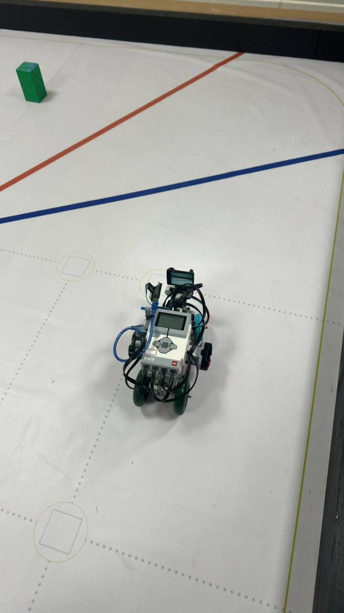

<h1 align="center">ᯓ★ 2.4 Sensor Calibration & Reliability ᯓ★</h1>

<p align="center">
  
  
  
</p>

<p align="center">
  <em>
    Sensor calibration in Cheese is an iterative process connecting physical placement,
    real-track testing, software thresholds, and repeated driving behavior.
  </em>
</p>

<p align="center">
  ✦ ─── ⋆⋅☆⋅⋆ ─── (❁´◡`❁) ─── ⋆⋅☆⋅⋆ ─── ✦
</p>

---

A sensor being connected correctly does not automatically make its information reliable.

Its readings can change because of:

- height,
- angle,
- distance,
- lighting,
- robot speed,
- field geometry,
- mechanical alignment,
- battery condition,
- and the way the software interprets the measurement.

For this reason, Cheese v4 was calibrated primarily through **real-track testing and repeated iteration**.

<p align="center">
  <strong>
    Test → Observe → Adjust → Repeat → Compare
  </strong>
</p>

---

# ❀ 2.4.1 Calibration Strategy ────୨ৎ────────୨ৎ────

Cheese uses several sensor types, so there is no single calibration procedure that works for the entire robot.

Each sensor provides a different type of information and therefore requires a different calibration focus.

<div align="center">

| Sensor | Calibration Focus | Why |
| :--- | :--- | :--- |
| **Left Ultrasonic** | Wall distance and PID response | Controls lateral wall awareness |
| **Right Ultrasonic** | Wall distance and PID response | Controls lateral wall awareness |
| **Front Ultrasonic** | Safety and recovery distance | Detects dangerous forward proximity |
| **EV3 Color Sensor** | Real floor-marker recognition | Supports curve counting and run progress |
| **HuskyLens** | Pillar recognition and visibility | Supports obstacle avoidance |

</div>

The calibration process therefore connects:

```text
PHYSICAL PLACEMENT
        ↓
SENSOR READING
        ↓
SOFTWARE INTERPRETATION
        ↓
ROBOT RESPONSE
        ↓
REAL-TRACK RESULT
```

A problem at any stage can affect the final behavior.

This is why we do not immediately change software values every time Cheese fails.

Sometimes the actual problem is the physical position of the sensor, the robot's angle, battery condition, or another subsystem.

---

# ❀ 2.4.2 Current Calibration Status ────୨ৎ────────୨ৎ────

The current v4 system is not equally mature in every subsystem.

<div align="center">

| System | Current Status |
| :--- | :--- |
| **Color sensor** | 🟢 Functional and used during Open Challenge |
| **Left ultrasonic** | 🟢 Functional and integrated into navigation |
| **Right ultrasonic** | 🟢 Functional and integrated into navigation |
| **Front ultrasonic** | 🟢 Functional and used for safety/recovery |
| **HuskyLens** | 🟢 Trained and integrated into obstacle behavior |
| **Open sensor system** | 🟢 Mostly stable |
| **Obstacle sensing** | 🟡 Functional but still being calibrated |
| **Obstacle recovery** | 🟠 One of the main development areas |

</div>

This distinction is important.

The HuskyLens is **not merely planned** anymore.

It already detects the competition obstacle colors and influences Cheese's movement.

However:

> **Successful recognition does not automatically guarantee successful avoidance.**

The complete obstacle response also depends on approach position, visibility, speed, steering strength, wall protection, and recovery.

---

# ❀ 2.4.3 Color Sensor Calibration ────୨ৎ────────୨ৎ────

The EV3 Color Sensor faces downward toward the competition field.

<p align="center">
  
  &nbsp;
  
</p>

<p align="center">
  <em>
    Current floor-facing color-sensor position and sensor-to-track geometry.
  </em>
</p>

The color sensor is calibrated using the **real competition surface**, rather than relying only on theoretical values.

This matters because color readings can depend on several physical conditions.

<div align="center">

| Variable | Possible Effect |
| :--- | :--- |
| **Ambient lighting** | Changes reflected light |
| **Surface finish** | Changes reflection |
| **Sensor height** | Changes the amount of reflected light received |
| **Robot speed** | Changes how long the sensor remains over a marker |
| **Sensor angle** | Changes reflected-light geometry |

</div>

The current sensor position was chosen after repeated physical testing rather than by relying only on nominal specifications.

---

## ❀ 2.4.4 `COL-COLOR` Mode ────୨ৎ────────୨ৎ────

The current Open code uses the EV3 Color Sensor in:

```python
COL-COLOR
```

Instead of processing raw RGB values, the program uses the EV3 sensor's built-in color classification.

This keeps the current Open logic simpler and has proved sufficient for our track conditions.

The important software interpretation is:

```text
BLUE
  ↓
BLUE marker


RED
YELLOW ─────→ ORANGE marker
BROWN
```

Therefore:

```text
BLUE = BLUE

RED + YELLOW + BROWN = ORANGE
```

The robot does not need the EV3 sensor to perfectly classify the physical orange marker as the exact word **orange**.

It only needs to reliably determine:

> **“This reading belongs to the Orange track-marker group.”**

---

# ❀ 2.4.5 Why Orange Uses a Color Group ────୨ৎ────────୨ৎ────

During real-track testing, the orange region was not always classified by the EV3 sensor as one identical built-in color.

Depending on the conditions, the same physical marker could appear as a warm-color classification.

<div align="center">

| Physical Marker | EV3 Reading | Software Meaning |
| :--- | :--- | :--- |
| Orange | Red | ORANGE |
| Orange | Yellow | ORANGE |
| Orange | Brown | ORANGE |
| Blue | Blue | BLUE |

</div>

Instead of forcing the physical sensor to behave like a perfect digital color detector, we adapted the software to the readings actually observed during testing.

This became an important calibration principle:

> **Calibration should make the software understand the real sensor, not pretend the real sensor behaves perfectly.**

---

# ❀ 2.4.6 Color Sensor Physical Improvement ────୨ৎ────────୨ৎ────

Early testing revealed an important environmental problem:

> **Ambient light could affect floor-color detection.**

At one stage, a physical cover was tested around the color sensor to reduce external light.

However, the cover introduced a new problem.

Because it was positioned very low, it could interfere physically with the field.

The cover was therefore not retained as part of normal Cheese v4 operation.

Instead, the color sensor remained in the same general front-bottom region but was positioned **slightly lower**.

<p align="center">
  
</p>

<p align="center">
  <em>
    Current sensor-to-floor gap after lowering the color sensor for improved track detection.
  </em>
</p>

The development chain became:

```text
AMBIENT LIGHT AFFECTED READINGS
            ↓
PHYSICAL COVER TESTED
            ↓
COVER CREATED MECHANICAL INTERFERENCE
            ↓
SENSOR POSITION RECONSIDERED
            ↓
SENSOR LOWERED SLIGHTLY
            ↓
MORE RELIABLE FLOOR DETECTION
            ↓
COVER REMOVED
```

This became a useful example of solving a sensing problem through **mechanical calibration instead of adding more software or hardware complexity**.

---

# ❀ 2.4.7 Curve Validation ────୨ৎ────────୨ৎ────

Detecting a color does not automatically mean Cheese completed a curve.

This distinction became very important during development.

The current curve-counting system recognizes transitions between:

```text
BLUE → ORANGE
```

or:

```text
ORANGE → BLUE
```

However, the color sequence is not used alone.

Additional validation is necessary because the sensor may encounter a color even when the physical turn has not been completed correctly.

The current system therefore combines:

- color sequence,
- steering confirmation,
- timing,
- and cooldown logic.

The objective is to prevent one physical corner from being counted more than once.

---

## ❀ 2.4.8 Current Curve-Counting Calibration Values ────୨ৎ────────୨ৎ────

Current Open calibration includes:

<div align="center">

| Parameter | Current Value |
| :--- | :---: |
| **Total curve count** | **12** |
| **Color-change window** | **3.0 s** |
| **Curve cooldown** | **1.5 s** |
| **Minimum steering angle confirmation** | **0.1°** |
| **Minimum steering time** | **0.03 s** |
| **Post-color steering window** | **0.9 s** |

</div>

For the complete Open run:

```text
4 corners / lap
×
3 laps
=
12 validated curves
```

The curve counter is directly connected to the finish and parking logic.

Therefore:

```text
CORRECT COLOR DETECTION
        ↓
CORRECT CURVE VALIDATION
        ↓
CORRECT CURVE COUNT
        ↓
CORRECT RUN PROGRESS
        ↓
CORRECT PARKING ACTIVATION
```

A missed or extra curve count can make parking begin too early or too late.

---

# ❀ 2.4.9 Ultrasonic Calibration ────୨ৎ────────୨ৎ────

Cheese v4 uses **three ultrasonic sensors**.

The two lateral sensors support wall awareness and PID-based navigation.

The front sensor provides forward-distance safety information.

<p align="center">
  
</p>

<p align="center">
  <em>
    Current side ultrasonic layout used for lateral distance measurement.
  </em>
</p>

Ultrasonic calibration was performed mainly through repeated driving tests.

During testing we observed:

- wall distance,
- robot drift,
- correction timing,
- steering strength,
- wall contact,
- oscillation,
- and recovery behavior.

---

# ❀ 2.4.10 Why Ultrasonic Placement Matters ────୨ৎ────────୨ৎ────

Ultrasonic sensors measure distance using reflected sound.

Their physical orientation therefore matters.

If a sensor is badly aligned, its reading may not represent the wall position expected by the navigation software.

The current v4 layout places the lateral ultrasonic sensors relatively low.

<p align="center">
  
</p>

<p align="center">
  <em>
    The low lateral layout helps keep the ultrasonic sensing direction aligned with the field walls.
  </em>
</p>

The goal is to improve the physical relationship:

```text
ULTRASONIC SENSOR
        ↓
ULTRASONIC BEAM
        ↓
FIELD WALL
```

A consistent physical orientation makes software calibration more meaningful.

---

# ❀ 2.4.11 Ultrasonic Filtering ────୨ৎ────────୨ৎ────

Raw ultrasonic measurements can fluctuate slightly.

If the steering system reacted aggressively to every individual reading, Cheese could become unstable.

The current Open controller therefore filters sensor information before it is used for navigation.

<div align="center">

| Parameter | Current Value |
| :--- | :---: |
| **Sensor filter alpha** | **0.65** |
| **Derivative filter** | **0.45** |
| **Control-loop delay** | **0.01 s** |

</div>

Filtering creates the following chain:

```text
RAW DISTANCE
     ↓
FILTERING
     ↓
MORE STABLE DISTANCE ESTIMATE
     ↓
PID ERROR
     ↓
STEERING CORRECTION
```

The objective is to suppress short measurement spikes without making the system react too slowly.

---

# ❀ 2.4.12 PID Calibration ────୨ৎ────────୨ৎ────

Sensor calibration and PID calibration are closely connected.

The ultrasonic sensors provide wall-distance information.

The PID controller determines how strongly Cheese should respond to that information.

Current Open PID values are:

<div align="center">

| Constant | Current Value |
| :--- | :---: |
| **KP** | **0.28** |
| **KI** | **0.001** |
| **KD** | **0.08** |
| **Integral limit** | **20** |
| **Center deadband** | **1.5** |
| **Maximum PID steering angle** | **32°** |

</div>

The PID controller became one of the most important parts of Open Challenge tuning.

### Too weak

```text
DISTANCE ERROR
      ↓
SMALL CORRECTION
      ↓
ROBOT CONTINUES DRIFTING
```

### Too aggressive

```text
DISTANCE ERROR
      ↓
LARGE CORRECTION
      ↓
ROBOT CROSSES TARGET
      ↓
OPPOSITE CORRECTION
      ↓
ZIG-ZAG
```

### Desired response

```text
DISTANCE ERROR
      ↓
CONTROLLED CORRECTION
      ↓
SMOOTH RETURN
      ↓
STABLE PATH
```

The goal was therefore not to obtain the strongest possible correction.

It was to obtain the **smallest useful correction that still returns Cheese to a safe trajectory**.

---

# ❀ 2.4.13 Wall-Distance Thresholds ────୨ৎ────────୨ৎ────

Not every wall distance should produce the same response.

Cheese therefore uses different protection regions.

<div align="center">

| Parameter | Current Value |
| :--- | :---: |
| **Gentle wall distance** | **28.0 cm** |
| **Severe wall distance** | **22.0 cm** |
| **Full wall-avoidance distance** | **15.0 cm** |
| **Gentle wall angle** | **14°** |
| **Severe wall angle** | **18°** |

</div>

This creates progressive correction:

```text
NORMAL DISTANCE
      ↓
PID NAVIGATION


CLOSER TO WALL
      ↓
GENTLE PROTECTION


TOO CLOSE
      ↓
SEVERE PROTECTION


VERY CLOSE
      ↓
MAXIMUM WALL-AVOIDANCE AUTHORITY
```

This is safer than waiting until Cheese is already touching the wall before applying a stronger correction.

---

# ❀ 2.4.14 Front Ultrasonic Safety Calibration ────୨ৎ────────୨ৎ────

The front ultrasonic sensor adds another protection layer.

<p align="center">
  
</p>

<p align="center">
  <em>
    Current front ultrasonic sensor placement used for forward-distance safety and recovery.
  </em>
</p>

Current front-distance parameters include:

<div align="center">

| Parameter | Current Value |
| :--- | :---: |
| **Front PID assistance begins** | **70 cm** |
| **Maximum front assist** | **10°** |
| **Too-close threshold** | **10 cm** |
| **Recovery target distance** | **30 cm** |
| **Detection confirmations** | **3** |
| **Recovery timeout** | **1.8 s** |
| **Maximum reverse steering** | **10°** |

</div>

The front ultrasonic is therefore not simply an emergency switch.

Its information can contribute before the robot reaches the most dangerous distance.

---

# ❀ 2.4.15 Front Recovery Logic ────୨ৎ────────୨ৎ────

When the front distance becomes dangerously small, Cheese can reverse to create space.

The logic can be simplified as:

```text
FRONT DISTANCE CHECKED
        ↓
       SAFE?
   ┌─────┴─────┐
  YES          NO
   │            │
CONTINUE    CONFIRM READING
                ↓
          REVERSE RECOVERY
                ↓
          INCREASE DISTANCE
                ↓
          RETURN TO NAVIGATION
```

This behavior was introduced because steering cannot always save the robot once the front of the chassis is already extremely close to the wall.

Backing away creates physical room for the steering mechanism to become useful again.

---

# ❀ 2.4.16 HuskyLens Calibration ────୨ৎ────────୨ৎ────

The HuskyLens is already trained and integrated into the current Obstacle Challenge system.

For this section, the camera evidence uses the current **camera-placement photograph** instead of the older close-up image that was not rendering correctly in GitHub.

<p align="center">
  
</p>

<p align="center">
  <em>
    Current HuskyLens placement used for red and green obstacle recognition on Cheese v4.
  </em>
</p>

The camera is trained to recognize the two competition pillar colors.

<div align="center">

| HuskyLens ID | Obstacle | Required Passing Side |
| :---: | :--- | :--- |
| **ID 1** | 🔴 Red | Pass on the **right** |
| **ID 2** | 🟢 Green | Pass on the **left** |

</div>

The camera information reaches the EV3 through the Arduino Nano communication bridge documented in **Section 2.2 Wiring Diagram**.

Conceptually:

```text
HUSKYLENS
     ↓
I2C
     ↓
ARDUINO NANO
     ↓
USB SERIAL
     ↓
EV3
     ↓
OBSTACLE NAVIGATION
```

---

# ❀ 2.4.17 Vision Calibration Is More Than Color Recognition ────୨ৎ────────୨ৎ────

Recognizing the correct obstacle color is only the first part of camera calibration.

The camera must also detect the pillar:

- early enough,
- at a useful angle,
- while the pillar remains inside the field of view,
- and with enough time for Cheese to physically react.

This became especially important after curves.

A pillar can be correctly trained in the HuskyLens while still being missed if Cheese exits a corner with the camera pointing away from the useful region.

Therefore:

```text
GOOD COLOR TRAINING
        ≠
GUARANTEED AVOIDANCE
```

Successful obstacle behavior requires:

```text
RECOGNITION
     +
FIELD OF VIEW
     +
ROBOT POSITION
     +
DETECTION TIMING
     +
STEERING RESPONSE
     +
POST-AVOIDANCE RECOVERY
```

This is why the obstacle system must be calibrated as a complete navigation system rather than only as a camera.

---

# ❀ 2.4.18 HuskyLens Physical Calibration ────୨ৎ────────୨ৎ────

The physical angle of the camera strongly affects what Cheese can detect.

<p align="center">
  
</p>

<p align="center">
  <em>
    Side view of the current HuskyLens angle used during Obstacle Challenge testing.
  </em>
</p>

Camera calibration therefore includes both **software recognition** and **physical placement**.

<div align="center">

| Variable | Why It Matters |
| :--- | :--- |
| **Camera height** | Changes the visible obstacle region |
| **Camera angle** | Changes where the field of view points |
| **Robot position** | Determines whether the pillar enters the image |
| **Distance** | Changes apparent obstacle size |
| **Speed** | Changes available reaction time |
| **Curve exit angle** | Can determine whether the next pillar is visible |

</div>

The current camera placement works, but obstacle reliability is still being tuned.

---

# ❀ 2.4.19 Arduino Nano Vision Interface ────୨ৎ────────୨ৎ────

The Arduino Nano acts as the communication bridge between the HuskyLens and EV3.

<p align="center">
  
</p>

<p align="center">
  <em>
    Current Arduino Nano position used for HuskyLens-to-EV3 communication.
  </em>
</p>

The Nano receives the HuskyLens result and provides simplified obstacle information to the EV3.

The obstacle packet includes information such as:

```text
R,xCenter,width
```

for red,

```text
G,xCenter,width
```

for green,

or:

```text
N,0,0
```

when no useful obstacle is detected.

This allows the EV3 to focus on the movement decision rather than directly managing the camera protocol.

---

# ❀ 2.4.20 Current Obstacle-Sensing Behavior ────୨ৎ────────୨ৎ────

The HuskyLens currently influences Cheese's movement.

The obstacle system is therefore already beyond simple recognition testing.

Current behavior can be summarized as:

```text
HUSKYLENS SEES PILLAR
        ↓
COLOR / ID RECOGNIZED
        ↓
POSITION DATA SENT THROUGH NANO
        ↓
EV3 RECEIVES CAMERA INFORMATION
        ↓
CAMERA STEERING INFLUENCE GENERATED
        ↓
COMBINED WITH NAVIGATION / SAFETY LOGIC
        ↓
CHEESE ATTEMPTS AVOIDANCE
```

Current testing has revealed several remaining failure modes.

<div align="center">

| Failure | Current Observation |
| :--- | :--- |
| **Pillar not visible soon enough** | Avoidance can begin late |
| **Poor approach angle** | Camera may not maintain useful detection |
| **Avoidance too weak** | Cheese may contact or carry the obstacle |
| **Poor recovery** | Robot may not return to a useful path afterward |
| **Poor post-curve position** | Next pillar may enter the FOV too late |

</div>

The largest remaining challenge is not simply distinguishing red from green.

It is:

> **Recovering reliably after avoidance so Cheese is ready for the next obstacle.**

---

# ❀ 2.4.21 Speed as a Calibration Variable ────୨ৎ────────୨ৎ────

Sensor reliability is connected to robot speed.

A faster robot travels farther between sensor updates and gives the steering system less time to react.

This became especially important during obstacle testing.

Reducing speed can provide:

- more camera observation time,
- more reaction time,
- smoother avoidance,
- more useful ultrasonic corrections,
- and better recovery opportunities.

However, excessive speed reduction also increases total run time.

The trade-off is:

```text
HIGH SPEED
    ↓
FAST RUN
but
LESS REACTION TIME


LOWER SPEED
    ↓
MORE REACTION TIME
but
SLOWER RUN
```

The target is therefore:

> **The fastest speed that remains repeatable.**

---

# ❀ 2.4.22 Battery Condition as a Testing Variable ────୨ৎ────────୨ৎ────

Battery condition can also affect calibration results.

A sensor threshold may remain mathematically identical while the robot's physical response changes because the drive and steering motors do not behave exactly the same under different battery conditions.

For this reason, a failed run should not immediately be blamed on sensor calibration.

The team should consider:

```text
SENSOR?
PID?
STEERING?
MECHANICAL STRUCTURE?
BATTERY?
CAMERA VISIBILITY?
SOFTWARE TIMING?
```

This systems approach helps prevent changing a correct sensor value to compensate for a completely different problem.

---

# ❀ 2.4.23 Real-Track Calibration ────୨ৎ────────୨ৎ────

The most important calibration environment is the real field.

<p align="center">
  
</p>

<p align="center">
  <em>
    Cheese v4 on the track where sensor placement, thresholds, PID behavior, and navigation are tested together.
  </em>
</p>

Bench testing can confirm that:

- a sensor turns on,
- a value changes,
- the camera recognizes a color,
- or communication works.

But the real track reveals whether those values are actually useful while the robot is moving.

Real-track calibration includes:

```text
LIGHTING
   +
WALL GEOMETRY
   +
ROBOT SPEED
   +
CURVES
   +
OBSTACLES
   +
MECHANICAL MOTION
   ↓
REAL SENSOR BEHAVIOR
```

---

# ❀ 2.4.24 Current Sensor Reliability Chain ────୨ৎ────────୨ৎ────

The current Cheese v4 sensing architecture can be summarized as:

```text
                     REAL ENVIRONMENT
                           │
          ┌────────────────┼────────────────┐
          │                │                │
        WALLS            FLOOR          OBSTACLES
          │                │                │
          ▼                ▼                ▼
    ULTRASONICS      COLOR SENSOR       HUSKYLENS
          │                │                │
          ▼                ▼                ▼
      FILTERING       COLOR GROUPING    NANO INTERFACE
          │                │                │
          └────────────────┼────────────────┘
                           ▼
                    SOFTWARE LOGIC
                           ▼
                STEERING + DRIVE RESPONSE
                           ▼
                      TRACK RESULT
                           ▼
                        RETUNING
```

This illustrates why calibration cannot be completely separated from software or mechanical design.

---

# ❀ 2.4.25 Failure → Adjustment → Result ────୨ৎ────────୨ৎ────

The most important calibration decisions can be summarized through the engineering process.

<div align="center">

| Failure / Observation | Adjustment | Result |
| :--- | :--- | :--- |
| Ambient light affected floor readings | Tested cover, then lowered color sensor | More reliable detection without permanent cover |
| Orange produced multiple EV3 classifications | Grouped red + yellow + brown | More tolerant orange detection |
| False curve counts were possible | Added sequence, steering confirmation, timing and cooldown | More reliable curve counting |
| Wall correction could become unstable | Tuned PID and filtered ultrasonic readings | Smoother Open navigation |
| Ultrasonic wall alignment needed improvement | Used lower lateral sensor placement | Better physical wall alignment |
| Dangerous front proximity | Added front-distance recovery logic | More protection from front-wall crashes |
| Camera detection depended strongly on angle | Adjusted camera position and robot path | Better opportunity for pillar detection |
| Avoidance could fail despite recognition | Continued steering and speed tuning | Improved behavior, still in development |
| Robot could finish avoidance badly positioned | Recovery became a major tuning focus | Current obstacle-development priority |

</div>

This is more representative of the real engineering process than treating calibration as one isolated setup step.

---

# ❀ 2.4.26 Current Calibration Evidence ────୨ৎ────────୨ৎ────

The following repository files document the physical conditions used during v4 sensor calibration.

<div align="center">

| Evidence | Repository File | Purpose |
| :--- | :--- | :--- |
| **Color sensor position** | [`color_sensor_front_layout_v4.jpg`](../../v-photos/v4/color_sensor_front_layout_v4.jpg) | Shows floor-facing location |
| **Color sensor gap** | [`color_sensor_floor_gap_v4.jpg`](../../v-photos/v4/color_sensor_floor_gap_v4.jpg) | Shows sensor-to-floor geometry |
| **Side ultrasonic layout** | [`side_sensor_layout_v4.jpg`](../../v-photos/v4/side_sensor_layout_v4.jpg) | Shows lateral sensors |
| **Front ultrasonic** | [`sensor_placement_front_v4.jpg`](../../v-photos/v4/sensor_placement_front_v4.jpg) | Shows forward ultrasonic placement |
| **Camera placement** | [`sensor_placement_cam_v4.jpg`](../../v-photos/v4/sensor_placement_cam_v4.jpg) | Shows current HuskyLens position |
| **Camera angle** | [`huskylens_angle_side_v4.jpg`](../../v-photos/v4/huskylens_angle_side_v4.jpg) | Shows HuskyLens viewing angle |
| **Arduino Nano position** | [`arduino_nano_position_v4.jpg`](../../v-photos/v4/arduino_nano_position_v4.jpg) | Shows vision-interface placement |
| **Robot on track** | [`v4_on_track_v4.jpg`](../../v-photos/v4/v4_on_track_v4.jpg) | Shows real operating environment |

</div>

No placeholder or unverified image names are used in this evidence table.

---

# ✦ Engineering Lessons ─── ⋆⋅☆⋅⋆ ───

## 1. Calibration is not one number

Reliable sensing depends on physical placement, software interpretation, and robot behavior together.

---

## 2. Real-track testing matters

The competition mat, walls, lighting, movement speed, and obstacles create conditions that cannot be perfectly reproduced through theory alone.

---

## 3. Mechanical adjustments can improve software reliability

Lowering the color sensor and improving sensor placement changed the quality of the information reaching the code.

---

## 4. Filtering helps, but it cannot repair bad geometry

Software can reduce noise, but the sensor still needs to point toward useful information.

---

## 5. Detection and successful reaction are different problems

This is especially important for HuskyLens.

Recognizing a pillar correctly does not guarantee that Cheese will avoid it correctly.

---

## 6. Recovery is part of obstacle calibration

An obstacle maneuver is not complete when Cheese only passes the pillar.

The robot must also return to a position where it can detect and react to the next obstacle.

---

## 7. Reliability requires repetition

One successful run demonstrates that a system **can** work.

Repeated successful runs provide evidence that the system is becoming **reliable**.

---

# ✦ 2.4 Final Calibration Summary ─── ⋆⋅☆⋅⋆ ───

Cheese v4 uses calibration as a continuous engineering process rather than a one-time setup procedure.

The **EV3 Color Sensor** is currently functional for floor-marker detection and curve counting.

Its reliability improved through:

- real-track testing,
- warm-color grouping,
- curve-validation logic,
- and a slightly lower physical position.

The **three ultrasonic sensors** provide lateral and forward-distance information.

Their behavior is supported by:

- filtering,
- PID tuning,
- progressive wall-distance thresholds,
- and front-distance recovery logic.

The **HuskyLens** is already trained and integrated into the Obstacle Challenge system.

It recognizes the competition pillar colors and influences steering through the Arduino Nano → EV3 vision architecture.

The remaining obstacle problem is primarily improving:

- detection timing,
- avoidance strength,
- robot positioning,
- and especially **post-obstacle recovery**.

The most important calibration lesson from Cheese is:

<p align="center">
  <strong>
    Reliable sensing is created by matching the physical sensor,
    the software interpretation, and the real environment.
  </strong>
</p>

<p align="center">
  ✦ ─── ⋆⋅☆⋅⋆ ─── (❁´◡`❁) ─── ⋆⋅☆⋅⋆ ─── ✦
</p>

<p align="center">
  <a href="https://github.com/Quesovamos2662/WRO2026_FE_Go-Cheese#general-project-index">
    
  </a>
</p>
