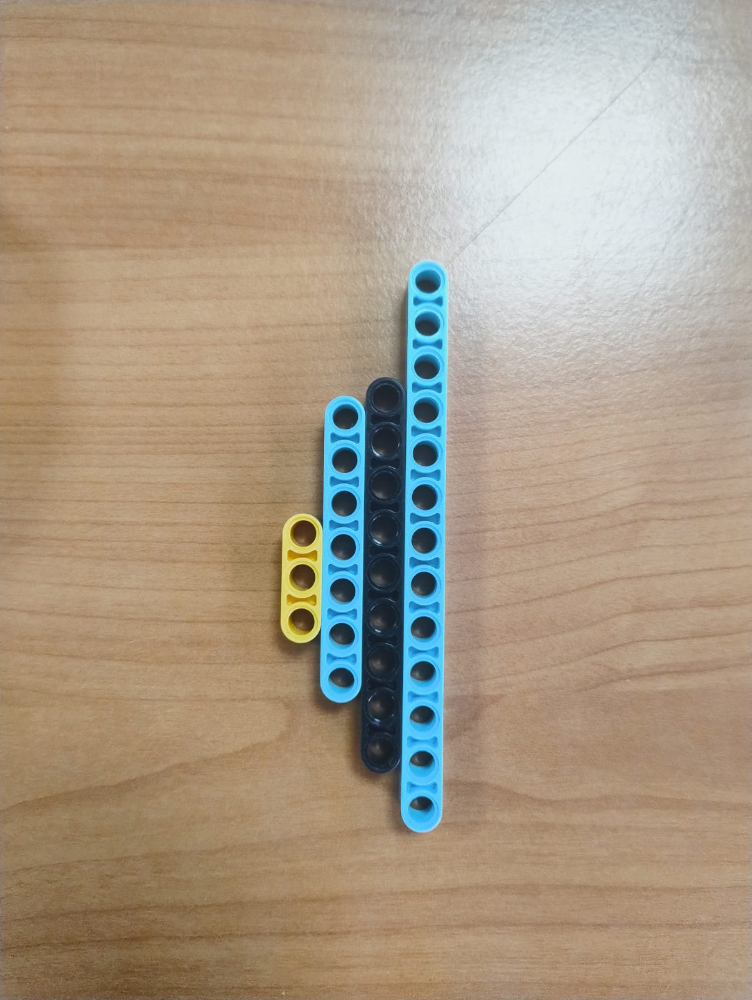

# ᯓ★ 1.2 Structural Components ᯓ★

Everything on Cheese that moves is bolted onto something that does not. This section is about that something: the Technic liftarms that make up the frame, and the pins and axles that hold it all together. These parts do not drive, steer or sense anything, but they decide whether the robot keeps its shape while doing all three, and getting that right turned out to be harder than we expected.

| Component | What it does | Main weakness |
| :--- | :--- | :--- |
| **Liftarms** | Form the frame and hold every component in position | Add weight; we place them by intuition rather than calculation |
| **Pins** | Connect liftarms and decide whether a joint locks or pivots | Wear down with friction, loosen and break over time |
| **Axles** | Transmit torque from the large motor to the rear wheels | Depend on tight bushings, or the geometry drifts out of alignment |

## ❀ Component Photos ────୨ৎ────────୨ৎ────────୨ৎ────

  
 
  <em>Left: Technic liftarms used as the main structural members of the chassis. Right: pins and axles used to connect the frame and transfer rotation through the drivetrain.</em>

   
  <em>Example of a broken Technic pin after repeated testing, showing why reinforced connections became necessary.</em>

These component photos show the parts that shaped the mechanical structure of Cheese. The liftarms provided the main chassis frame, while the pins and axles allowed the structure to be assembled, adjusted, and repaired quickly during testing. The broken pin is included as evidence of a real failure point we experienced, showing why redundant pinning and stronger joint support became important in later rebuilds.

## ❀ Technic Liftarms ────୨ৎ────────୨ৎ────────୨ৎ────

**Why we build with them.** Liftarms are the frame of our entire robot. They are made of ABS plastic, which is light but stiff, and their real strength shows up when you pin them together: a pinned liftarm structure resists bending far better than any single beam could on its own.

That rigidity is not just nice to have, it is something our code depends on. Our navigation runs on a PD controller that reads the distance from the walls and steers to correct. If the frame flexes, the sensors move with it, and the controller cannot tell the difference between the robot actually drifting toward a wall and the frame simply bending. Every bit of wobble becomes noise in the readings. A stiff frame means the sensors report what is really happening, and the entire control system is built on top of that.

Liftarms also come with a precise grid: their holes are spaced exactly 8 mm apart (1 stud). That precision is what let us build a custom mount for the HuskyLens and place the camera exactly where it needed to sit, rather than approximately where it fit.

**Where they cost us.** Each liftarm weighs between 0.5 g and 4.5 g, and we use a lot of them. That adds up directly into our 888.1 g, and mass is one of the things holding our speed down.

> **Weight as force:** at 888.1 g, the robot presses down with roughly 8.71 N of force (0.8881 kg × 9.81 m/s²) through its drivetrain.

There is also a limitation we have to be honest about. Liftarms make cross-bracing possible, which means stacking them perpendicular to each other to build triangular structures that resist twisting. **We have not implemented cross-bracing on Cheese.** We placed our liftarms based on intuition, adding material where the structure felt weak rather than calculating where it actually needed support. Learning to design efficient triangular structures, ones that hold weight while using fewer parts, is a skill we have not developed yet, and it is one of the clearest improvements available to us for a future version.

The 8 mm grid also constrains us. Ackermann steering depends on exact linkage lengths and pivot positions, and when every hole has to land on that grid, we cannot always place a pivot where the geometry would ideally want it. We work within the grid rather than around it.

**Where that leaves us.** Liftarms are both the reason our chassis holds together and the main thing limiting it. They gave us a frame we could rebuild in minutes when a design failed, which mattered enormously across three versions. But because we placed them by feel rather than by calculation, we are almost certainly carrying weight we do not need, and using liftarms more deliberately is one of the most direct paths we have to a faster robot.

## ❀ Technic Pins and Axles ────୨ৎ────────୨ৎ────────୨ৎ────

**Why we build with them.** Pins are what turn a pile of liftarms into a robot. They hold liftarms, motors and sensors together into one structure, and their friction fit lets us decide whether a joint locks in place or pivots freely, which is exactly what a steering linkage needs, where some joints must rotate and others must not move at all. They also come apart in seconds, which meant that during testing we could adjust the structure between runs instead of rebuilding it.

Axles do something different: they transmit rotation. Specifically, they carry the torque from the large motor to the rear wheels, using a 3L axle with stop. Unlike pins, axles are not fighting to hold pieces together, so they do not degrade from friction the way pins do.

**Where they cost us.** Pins are the weakest link in our build, and we mean that literally. They break when they carry weight without support, and they can crack just from handling. Worse, they wear out slowly: the same friction that makes a pin grip is the friction that grinds it down, so a pin that starts tight loosens after dozens of runs. Once the grip is gone, the ordinary vibration of driving is enough to work pieces apart on its own.

Axles have their own failure mode. They need bushings to hold parts like wheels in place, and if a bushing is not tight, the part shifts and the geometry drifts out of alignment. In a steering system built on precise angles, that is exactly what we cannot afford.

**How this shaped the rebuild.** This fragility is the direct reason our physical robot needed far more pins and connectors than our BrickLink model called for. Because a single pin only holds a small load before it starts to slip, reinforcing a weak joint meant surrounding it with several pins instead of trusting one. The digital model assumed every connection would hold whatever we asked of it. The real build did not, and every joint that failed in testing came back with redundant pinning.

**Would we change them?** No. The thing that makes pins frustrating, that they pull apart under force, is the same thing that made them invaluable while we were still figuring the robot out. We rebuilt sections of Cheese in minutes because of pins. Our only real complaint is the plastic itself: pins would be far better made from a harder material that does not bend and does not wear down with use.

  ✦ ─── ⋆⋅☆⋅⋆ ─── (❁´◡`❁) ─── ⋆⋅☆⋅⋆ ─── ✦

  

