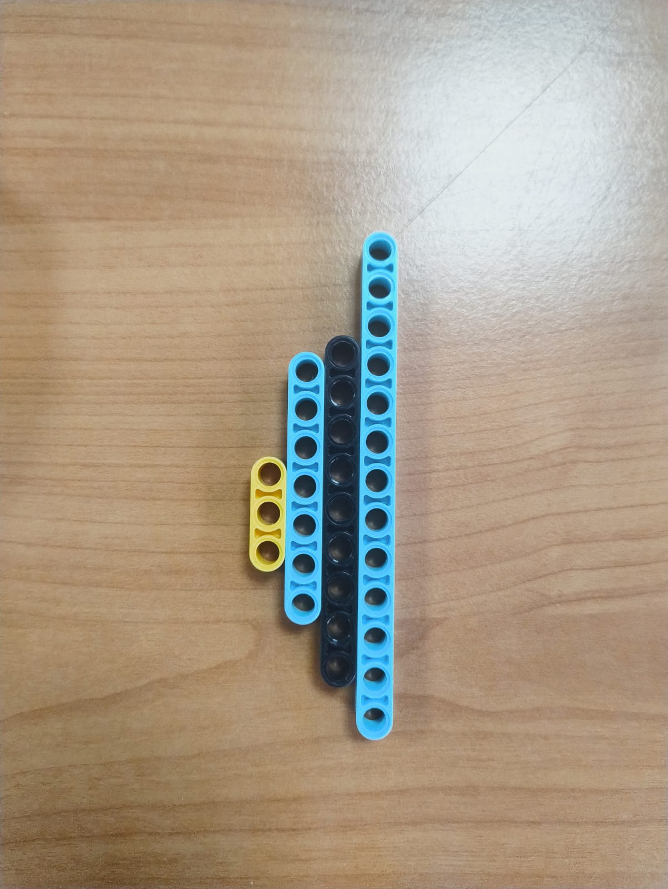
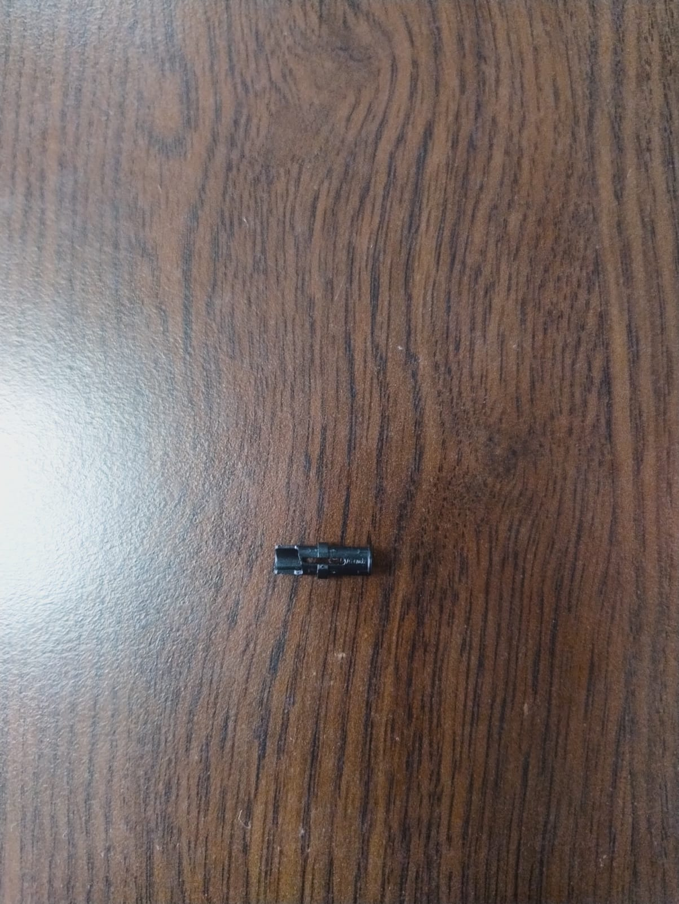
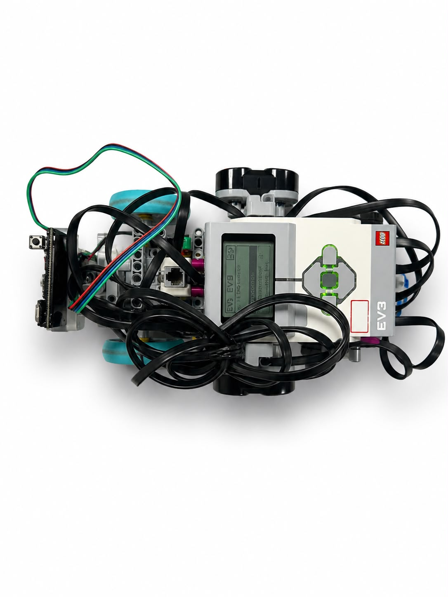

# ᯓ★ 1.2 Structural Components ᯓ★

Structural components are the pieces that keep Cheese physically stable. They do not drive the robot like a motor, they do not detect walls like an ultrasonic sensor, and they do not run code like the EV3 Brick. However, they decide whether all of those systems stay in the correct position while the robot moves, turns, vibrates, and reacts to the track.

For a beginner, the easiest way to understand this section is this: the structure is the robot’s skeleton. If the skeleton is weak, the robot bends or falls apart. If the skeleton is too heavy, the robot becomes harder to move and harder to control. Cheese v4 was designed around finding the balance between **enough structure to stay reliable** and **less unnecessary structure to become lighter and cleaner**.

In Cheese v3, the structure worked, but it carried extra height, extra pieces, longer cables, and a larger camera support. In Cheese v4, we reduced the robot mass from **888 g to 666 g** by removing pieces that did not directly support movement, stability, sensor placement, wiring, or protection.

| Structural Component | What It Does | Main Weakness | v4 Design Response |
| :--- | :--- | :--- | :--- |
| **Liftarms / beams** | Form the main chassis and hold every component in position. | Add weight when used excessively. | Kept only where they supported the chassis, motors, sensors, or reinforcement. |
| **Pins** | Connect liftarms and decide whether a joint locks or pivots. | Wear down, loosen, or break after repeated testing. | Used more intentionally in important support points instead of adding them everywhere. |
| **Axles** | Transmit rotation and help keep wheels aligned. | Depend on tight bushings and correct alignment. | Kept in drivetrain and wheel areas where alignment is critical. |
| **Connectors** | Join beams and axles at different angles. | Can add complexity if overused. | Kept where they improved support, sensor mounting, or compactness. |
| **Frames / angled pieces** | Create stronger support areas and corners. | Add mass if used without a clear purpose. | Reduced in non-critical upper areas while preserving the main frame. |

This section explains what structural parts we used, why they mattered, what problems they created, and how the v4 redesign made the structure lighter and more intentional.

## ❀ 1.2.1 Component Photos and Evidence ────୨ৎ────────୨ৎ────

  
   
  <em>Left: Technic liftarms used as the main structural members of the chassis. Right: pins and axles used to connect the frame and transfer rotation through the drivetrain.</em>

   
  <em>Example of a broken Technic pin after repeated testing, showing why reinforced connections and better structural planning became necessary.</em>

  

  <em>Cheese v3 compared with Cheese v4. The v4 version became lighter, lower, and more compact after removing unnecessary upper structure, shortening cable routing, and reducing 222 g from the previous version.</em>

  
  

  <em>Top and bottom views of Cheese v4 showing the simplified structure and the remaining support points for the chassis, motors, sensors, and wiring.</em>

These photos are included as structural evidence. The liftarms, pins, and axles show the basic LEGO Technic parts used to build Cheese. The broken pin shows a real failure point from testing. The v3-to-v4 comparison and v4 structure photos show how the robot became lighter, cleaner, and more intentional after removing unnecessary pieces.

## ❀ 1.2.2 v3 to v4 Structural Simplification ────୨ৎ────────୨ৎ────

The most important structural change from v3 to v4 was simplification. Cheese v3 had extra upper structure, a larger camera support, longer cable paths, and structural pieces that made the robot taller and heavier than necessary. Cheese v4 kept the important support points but removed pieces that did not clearly improve performance.

| v3 Problem | v4 Change | Engineering Reason |
| :--- | :--- | :--- |
| **Extra camera support structure** | Removed and simplified the camera mount. | Reduced height, mass, and unnecessary upper structure. |
| **Too much structural clutter** | Removed non-essential beams and supports. | Made the robot easier to inspect and modify. |
| **Long cable loops** | Shortened and cleaned cable routing. | Reduced clutter and made debugging easier. |
| **Heavier frame** | Reduced mass from **888 g to 666 g**. | Lower mass reduces load on motors, pins, beams, and connectors. |
| **Higher layout** | Lowered the structure and sensor layout. | Helped make the robot more compact and less top-heavy. |
| **Useful sensor support** | Kept the main sensor mounting points. | Preserved the functions needed for navigation and detection. |

The removed parts were not taken out randomly. Each part was judged by one question:

  <strong>Does this piece directly help support, alignment, reinforcement, sensor position, wiring, or movement reliability?</strong>

If the answer was yes, the piece stayed. If the piece only added height, mass, or clutter, it was removed or simplified.

---

## ❀ 1.2.3 Structural Components Kept in v4 ────୨ৎ────────୨ৎ────

Cheese v4 still needed a strong structure. We did not remove the main chassis, steering support, drive support, wheel alignment parts, or sensor mounting points. The goal was not to make the robot fragile; the goal was to remove excess structure while keeping the support needed for reliable movement.

| LEGO Technic Piece | Approximate Use | Why It Was Kept |
| :--- | :---: | :--- |
| **Technic Beam 15L** | 2 | Used for long chassis support and main frame length. |
| **Technic Beam 11L** | Several | Used to connect larger chassis sections. |
| **Technic Beam 7L** | Several | Used for medium support areas and local reinforcement. |
| **Technic Beam 5L** | Several | Used for compact supports and small frame sections. |
| **Technic Beam 3L** | Several | Used for short connections and tight areas. |
| **Technic Thin Beam 5L** | Several | Used where a thinner support was enough. |
| **Technic L-Shape Beam 3×5** | Several | Used to create stronger corners and support angles. |
| **Technic Angled Beam / Bent Liftarm** | Several | Used where straight beams could not create the needed geometry. |
| **Technic Frame** | 1–2 | Used to support larger rigid sections. |
| **Technic Brick with Holes** | Several | Used to connect stud-based structure with Technic connections. |
| **Technic Axles** | Several | Used for wheel alignment and rotating connections. |
| **Technic Pin with Friction** | Many | Used to hold beams tightly together. |
| **Technic Pin 3L with Friction** | Several | Used for stronger multi-layer connections. |
| **Technic Axle Pin** | Several | Used where a connection needed both pin and axle geometry. |
| **Technic Axle Pin 3L with Friction** | Several | Used for stronger mixed connections. |
| **Technic Bush / Half Bush** | Several | Used to stop axles and wheels from sliding. |
| **Technic Axle Connector** | Several | Used to extend or redirect axle connections. |
| **Technic Axle and Pin Connector** | Several | Used to connect rotating and fixed structures. |
| **Technic Perpendicular Connector** | Several | Used to make 90-degree structural joints. |
| **Technic Pin Connector Round** | Several | Used in compact linkage or support areas. |

These pieces were kept because they had a clear purpose. Some supported the chassis, some held motors, some helped keep sensors in place, and others allowed axles and wheels to stay aligned. In v4, each remaining structural piece needed to justify its position.

## ❀ 1.2.4 Technic Liftarms ────୨ৎ────────୨ৎ────

  
  
  

  <em>Liftarms are the main structural bones of Cheese. They decide where motors, sensors, wheels, cables, and the EV3 Brick stay during movement.</em>

---

### ❀ What Liftarms Are ────୨ৎ────────୨ৎ────

Liftarms are LEGO Technic beams with holes that allow pins, axles, and connectors to pass through them. On Cheese, they form the main frame of the robot. They do not move the robot by themselves, but they hold the parts that do.

For a beginner, liftarms are like the **bones of the robot**. They decide the robot’s shape, length, width, height, and support points. If the liftarms are placed badly, the robot can become weak, heavy, difficult to repair, or unstable during movement.

  

  <em>Technic liftarms used as structural beams for the robot frame.</em>

---

### ❀ Why We Build With Liftarms ────୨ৎ────────୨ৎ────

Liftarms are useful because they are stiff, modular, easy to connect, and easy to rebuild. Their holes follow the LEGO Technic grid, which makes it possible to place motors, wheels, and sensors in repeatable positions.

| Liftarm Advantage | How It Helps Cheese |
| :--- | :--- |
| **Rigid frame support** | Helps the robot keep its shape while driving, turning, and vibrating. |
| **Standard hole spacing** | Makes sensor and motor placement easier to repeat and adjust. |
| **Fast rebuilding** | Allows the team to test changes quickly between runs. |
| **Many sizes available** | Helps create long chassis supports, small reinforcements, and compact mounts. |
| **Strong mounting points** | Holds motors, sensors, EV3 Brick, lights, and cables in fixed positions. |

Liftarms gave Cheese a structure that could be changed many times during testing. This mattered because the robot went through several versions before reaching the v4 layout.

---

### ❀ Why Liftarm Rigidity Matters for Software ────୨ৎ────────୨ৎ────

The structure does not only affect the mechanical side of Cheese. It also affects the software.

Cheese uses sensor readings to decide how to steer. If the frame bends or shakes too much, the sensors can move slightly. When that happens, the robot may think it is drifting toward a wall even if the real problem is that the sensor mount moved.

  <strong>Stable structure → stable sensor position → reliable readings → better steering decisions</strong>

This is why liftarms matter for the robot’s control system. The code can only react correctly if the sensors are physically stable.

| Structural Issue | Software Effect |
| :--- | :--- |
| **Frame flex** | Ultrasonic sensors may give inconsistent wall readings. |
| **Loose sensor mount** | Color or camera readings may change because the sensor angle changes. |
| **Weak motor support** | Steering or drive movement can become less predictable. |
| **Too much vibration** | The robot may overcorrect because readings become noisy. |

A strong structure helps the code make better decisions because the sensors stay where they are supposed to be.

---

### ❀ Liftarm Trade-Off: Strength vs. Weight ────୨ৎ────────୨ৎ────

  
  
  

  <strong>Liftarms made Cheese strong, but too many liftarms made Cheese heavier than necessary.</strong>

Liftarms add weight when they are used excessively. One liftarm does not weigh much by itself, but many liftarms together can make the robot heavier, taller, and harder to inspect.

In **v3**, some liftarms were necessary, but others only added extra height, bulk, or support around areas that did not directly improve performance. In **v4**, we removed or reduced liftarms that only added unnecessary upper structure, especially around the camera mount. However, we kept the liftarms that supported the main chassis, drive system, steering system, and sensor mounts.

---

| ❀ Design Question | ✦ Engineering Answer |
| :--- | :--- |
| **Do we need this beam for support?** | If yes, it stays. |
| **Does it hold a motor, sensor, wheel, or chassis section?** | If yes, it is part of the main structure. |
| **Does it only add height or clutter?** | If yes, it can be removed or simplified. |
| **Would removing it make the robot weak?** | If yes, we keep reinforcement in that area. |
| **Would removing it make the robot lighter without losing function?** | If yes, it supports the v4 redesign goal. |

---

  

  <strong>A stronger robot is not always the robot with the most beams.</strong> 
  A stronger robot is the one where each beam has a clear purpose.

---

### ❀ v4 Liftarm Decision Map ────୨ৎ────────୨ৎ────

| ✅ Kept in v4 | 🧀 Why It Stayed | ❌ Removed or Reduced | 🧠 Why It Changed |
| :--- | :--- | :--- | :--- |
| **Main chassis beams** | Hold the robot’s main body together. | **Extra upper camera support beams** | Added height and mass without being essential. |
| **Motor support beams** | Keep the drive and steering motors fixed. | **Non-critical upper structure** | Made the robot taller and harder to inspect. |
| **Sensor mount beams** | Keep sensors facing the correct direction. | **Excess reinforcement around low-risk areas** | Added weight without improving performance. |
| **Steering support beams** | Keep steering geometry stable. | **Bulky liftarms near the camera mount** | Made the structure heavier and more cluttered. |
| **Wheel alignment supports** | Help keep wheel geometry consistent. | **Pieces that made inspection harder** | Slowed down debugging and modifications. |

---

### ❀ Why This Improved v4 ────୨ৎ────────୨ৎ────

  
  
  

| v4 Improvement | What Changed | Why It Matters |
| :--- | :--- | :--- |
| **Lower mass** | Fewer unnecessary beams and supports. | Less load for motors, pins, axles, and connectors. |
| **Cleaner structure** | Less visual and physical clutter. | Easier to inspect, repair, and explain. |
| **Lower layout** | Extra upper structure was removed. | Helps reduce top-heavy behavior. |
| **Better access** | Fewer pieces blocking important areas. | Faster debugging during testing. |
| **More intentional design** | Every remaining liftarm has a purpose. | Supports the engineering decision process. |

---

### ❀ Liftarms and Mechanical Stress ────୨ৎ────────୨ৎ────

The liftarm structure also affects how much stress the robot experiences. A heavier robot places more load on its frame. During turns, starts, stops, and wall corrections, that load is repeated many times.

Using the weight equation:

  <strong>W = m × g</strong>

For v3:

  <strong>W = 0.888 kg × 9.81 m/s² ≈ 8.71 N</strong>

For v4:

  <strong>W = 0.666 kg × 9.81 m/s² ≈ 6.53 N</strong>

This means the v4 structure supports less downward force than the v3 structure. That matters because beams, pins, axles, and connectors experience less mechanical load during repeated testing.

| Version | Mass | Approximate Weight Force | Structural Meaning |
| :--- | :---: | :---: | :--- |
| **v3** | 888 g | ≈ 8.71 N | More load on beams and connections. |
| **v4** | 666 g | ≈ 6.53 N | Less load and less repeated stress. |

The mass reduction does not remove the need for a strong frame, but it helps reduce the amount of force that the frame must handle.

---

### ❀ Final Liftarm Decision ────୨ৎ────────୨ৎ────

  <strong>Cheese v4 became lighter and more compact while still keeping the support needed for reliable movement.</strong>

The final decision was to keep liftarms where they supported the main chassis, motors, wheels, sensors, and steering system. We removed or reduced liftarms that only added height, clutter, or unnecessary mass.

This made the v4 structure more intentional. Instead of building by adding more beams everywhere, we built by asking what each beam actually needed to do.

  ✦ ─── ⋆⋅☆⋅⋆ ─── (❁´◡`❁) ─── ⋆⋅☆⋅⋆ ─── ✦

## ❀ 1.2.5 Technic Pins and Connectors ────୨ৎ────────୨ৎ────

  
  
  

  <em>Pins and connectors are the small parts that turn separate liftarms into one complete robot structure.</em>

---

### ❀ What Pins and Connectors Do ────୨ৎ────────୨ৎ────

Pins and connectors are what hold Cheese together. They connect liftarms, motors, sensors, cable supports, and chassis sections into one structure.

For a beginner, pins are like the small locks of the robot. Without them, the liftarms would not stay connected. Some pins create tight fixed joints, while other connectors allow special angles, corners, pivots, or compact supports.

| Part | Beginner Explanation | Why It Matters on Cheese |
| :--- | :--- | :--- |
| **Friction pins** | Tight pins that hold beams firmly together. | Keep the chassis and mounts from separating during testing. |
| **3L pins** | Longer pins that connect multiple layers. | Help reinforce thicker or stacked structures. |
| **Axle pins** | Hybrid pieces that connect pin holes and axle holes. | Useful when a support must connect fixed and rotating geometry. |
| **Perpendicular connectors** | Connect beams at 90 degrees. | Help build corners, braces, and compact mounts. |
| **Round pin connectors** | Small connector bodies used in tight spaces. | Help create compact supports or linkage areas. |

Pins and connectors may look small, but they decide whether the robot stays aligned during movement. If one connection loosens, a motor, sensor, or wheel support can shift slightly, and that small movement can affect the robot’s behavior.

---

### ❀ Why We Build With Pins and Connectors ────୨ৎ────────୨ৎ────

Pins and connectors are useful because they make the robot modular. During testing, Cheese needed many rebuilds and small adjustments. Pins allowed us to change the structure quickly without permanently damaging the robot.

| Benefit | How It Helped Cheese |
| :--- | :--- |
| **Fast rebuilding** | We could modify parts of the robot between tests. |
| **Adjustable structure** | Sensor mounts and supports could be moved when testing showed problems. |
| **Strong connections** | Friction pins helped keep liftarms locked together. |
| **Compact building** | Connectors helped fit supports in tight spaces. |
| **Repairability** | Damaged or loose sections could be replaced quickly. |

This mattered because Cheese changed across versions. The structure was not perfect at the beginning, so we needed parts that allowed fast testing, failure observation, and rebuilding.

---

### ❀ Main Weakness of Pins ────୨ৎ────────୨ৎ────

  
  

Pins are useful, but they are also one of the weakest parts of a LEGO Technic robot. They can loosen, wear down, crack, or break after repeated testing.

  

  <em>Broken pin evidence from repeated testing. This helped us understand that structural connections needed better support in critical areas.</em>

When a pin loosens, the structure can shift. When the structure shifts, the sensor angle, motor position, or wheel alignment can change. For Cheese, that matters because the robot depends on stable steering and sensor readings.

| Pin Problem | Effect on the Robot |
| :--- | :--- |
| **Loose pin** | A beam or mount can move slightly. |
| **Worn pin** | The connection becomes less reliable over time. |
| **Broken pin** | A structural support can fail completely. |
| **Too many pins** | The structure becomes heavier and harder to inspect. |
| **Poorly placed pins** | The robot can look reinforced but still have weak points. |

This is why v4 focused on using pins more intentionally. We did not want to add pins everywhere. We wanted to keep reinforcement where it protected important systems.

---

### ❀ v4 Pin and Connector Decision Map ────୨ৎ────────୨ৎ────

| ✅ Kept in v4 | 🧀 Why It Stayed | ❌ Reduced or Avoided | 🧠 Why It Changed |
| :--- | :--- | :--- | :--- |
| **Pins in main chassis joints** | These joints hold the robot body together. | **Pins in unnecessary upper structure** | That structure added weight without enough benefit. |
| **Pins around motor mounts** | Motors must stay fixed during movement. | **Excess pinning in non-critical areas** | Added clutter and made inspection harder. |
| **Sensor mount connectors** | Sensors need stable angles. | **Bulky connector stacks near the camera mount** | The camera mount was simplified in v4. |
| **Steering support connectors** | Steering geometry must stay aligned. | **Connectors that only added height** | Height made the robot more top-heavy. |
| **Cable support pins** | Help keep cables away from moving parts. | **Long cable loops and extra supports** | Shorter cables reduced the need for extra support. |

The final decision was not to remove pins everywhere. The decision was to use them where they mattered most: chassis stability, motor support, steering alignment, sensor mounts, and cable organization.

---

### ❀ Why This Improved v4 ────୨ৎ────────୨ৎ────

  
  
  

| v4 Improvement | What Changed | Why It Matters |
| :--- | :--- | :--- |
| **Less unnecessary reinforcement** | Pins and connectors were reduced in non-critical upper areas. | Lowered weight and visual clutter. |
| **Critical supports remained** | Motor, steering, chassis, and sensor joints stayed reinforced. | Preserved reliability. |
| **Cleaner camera area** | Extra camera mount support was removed. | Reduced height and simplified the structure. |
| **Better access** | Fewer connector stacks blocked important parts. | Made testing and debugging faster. |
| **More purposeful structure** | Connections were kept where they had a clear job. | Supports stronger engineering reasoning. |

This improved Cheese because the structure became easier to understand. A cleaner robot is easier to inspect, modify, repair, and explain to someone who is seeing it for the first time.

---

## ❀ 1.2.6 Axles and Bushings ────୨ৎ────────୨ৎ────

  
  
  

  <em>Axles and bushings are small, but they help keep rotating parts aligned and controlled.</em>

---

### ❀ What Axles and Bushings Do ────୨ৎ────────୨ৎ────

Axles transmit rotation and help keep rotating parts in place. On Cheese, axles are important because the drivetrain depends on rotation reaching the wheels correctly.

Bushings and half bushings stop parts from sliding along an axle. If a wheel, gear, or connector slides out of position, the robot’s geometry can change.

For a beginner, axles are like the rotating rods of the robot, and bushings are like small stoppers that keep those rods from letting parts move out of place.

| Component | Function | Possible Problem |
| :--- | :--- | :--- |
| **Axle** | Transfers rotation and holds wheel alignment. | Can shift if not locked correctly. |
| **Bush** | Stops parts from sliding along the axle. | Loose bushings can let geometry drift. |
| **Half bush** | Provides compact spacing control. | Can be misplaced or loosened during rebuilds. |
| **Axle connector** | Extends or redirects axle connections. | Misalignment can affect rotation. |
| **Axle pin** | Connects axle geometry with pin holes. | Can create weak or shifting joints if unsupported. |

Axles and bushings may look small, but they help maintain the geometry of the drivetrain and wheels. In a robot with steering and wall-following, alignment matters a lot because small mechanical shifts can affect the path.

---

### ❀ Why Alignment Matters ────୨ৎ────────୨ৎ────

The drive and steering systems depend on predictable geometry. If an axle moves, a bushing loosens, or a wheel shifts, the robot may not move exactly as expected.

  <strong>Aligned axles → stable wheels → predictable movement → easier steering control</strong>

| Alignment Issue | Robot Behavior Problem |
| :--- | :--- |
| **Wheel shifts sideways** | Robot may drift or become less stable. |
| **Axle slides out of place** | Rotation can become inconsistent. |
| **Loose bushing** | Wheel spacing can change during testing. |
| **Connector misalignment** | Steering or drivetrain geometry can become less precise. |

Because of this, v4 kept the axle and bushing structure needed for wheel and drive alignment, even while removing unnecessary upper structure.

---

### ❀ Axle and Bushing Decision in v4 ────୨ৎ────────୨ৎ────

| Kept in v4 | Why It Stayed |
| :--- | :--- |
| **Drive axle support** | The rear wheels need stable rotation. |
| **Wheel bushings** | Wheels must not slide out of position. |
| **Axle connectors in necessary areas** | Some compact connections need axle geometry. |
| **Steering-related axle parts** | Steering geometry must remain aligned. |
| **Spacing parts** | Correct spacing prevents rubbing or drifting. |

We reduced unnecessary structure around the upper build, but we did not remove the axle and bushing elements that helped the robot keep its movement geometry.

---

## ❀ 1.2.7 Structural Testing and Lessons ────୨ৎ────────୨ৎ────

  
  

Testing taught us that structural components affect more than strength. They affect mass, steering response, sensor stability, cable access, and maintenance speed.

| Observation | What It Showed | v4 Response |
| :--- | :--- | :--- |
| **The robot was too bulky in v3** | Extra structure added weight and made the robot harder to inspect. | Removed unnecessary upper pieces. |
| **The camera support used too much structure** | The camera function was necessary, but the mount was heavier than needed. | Simplified the camera support. |
| **Long cables added clutter** | Debugging and inspection became harder. | Shortened cable routing. |
| **Pins can break or loosen** | Real testing caused structural failure points. | Kept reinforcement only where it was necessary. |
| **Removing too much structure could weaken the robot** | Weight reduction must be balanced with stability. | Main support points were kept. |
| **Sensor mounts must stay stable** | If sensors move, readings can become less reliable. | Sensor supports were kept but the layout was lowered. |
| **Axles must stay aligned** | Wheel or drivetrain geometry can drift if not supported. | Axles and bushings remained in critical movement areas. |

The most important lesson was that structural design is not only about adding support. It is about choosing the correct amount of support. Too little structure makes the robot weak, but too much structure makes the robot heavy, cluttered, and harder to control.

---

## ✦ Final Structural Components Summary ─── ⋆⋅☆⋅⋆ ───

Cheese v4 became a better structural design because it was not built by adding more pieces everywhere. It was improved by studying what each structural piece actually did.

The final structure keeps the parts that support movement, alignment, sensors, motors, wiring, and stability. At the same time, it removes unnecessary upper support, excess camera structure, and cable clutter.

  <strong>The v4 structure became more intentional because every remaining structural piece had a clear purpose:</strong> 
  support, alignment, reinforcement, sensor positioning, cable organization, or movement reliability.

  ✦ ─── ⋆⋅☆⋅⋆ ─── (❁´◡`❁) ─── ⋆⋅☆⋅⋆ ─── ✦

