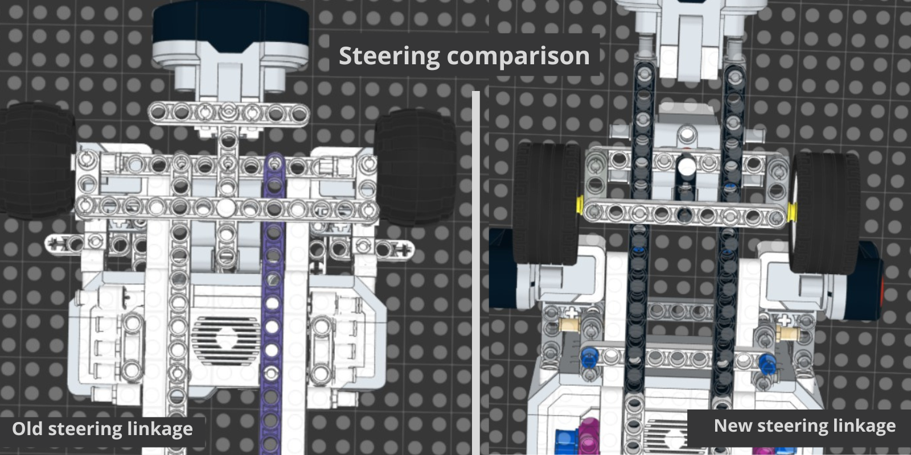
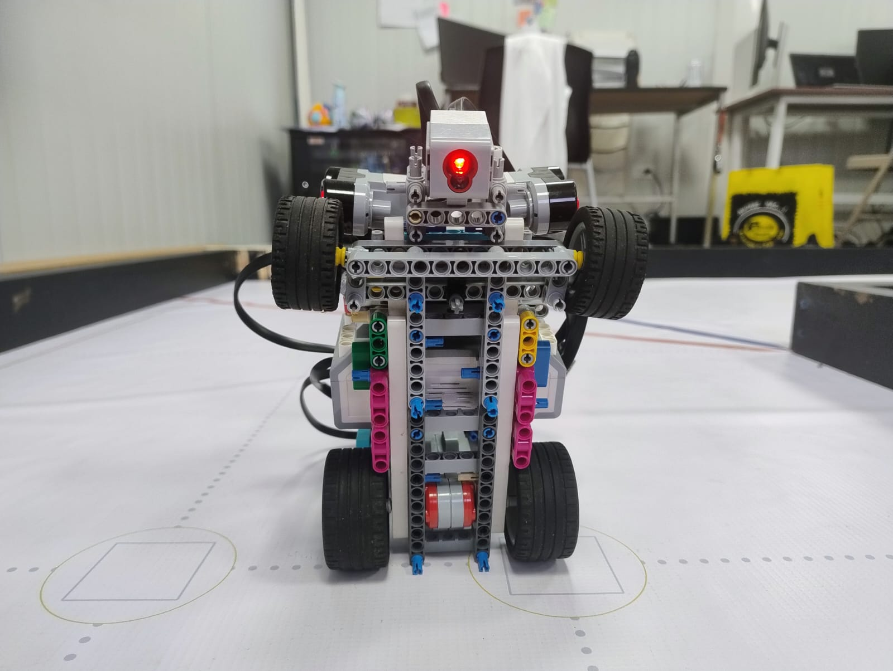

# ᯓ★ 1.3 Steering & Drive Mechanism ᯓ★

Cheese turns four corners every lap, twelve across a full run. Every one of them has to come out the same way, or our lap times fall apart and the navigation code cannot predict where the robot will end up. This section covers how our steering works, the math behind it, what broke when we first built it, and the problem we are still chasing.

---

## ❀ 1.3.1 How Ackermann Steering Works ────୨ৎ────────୨ৎ────

Cheese uses **Ackermann steering geometry** on the front axle, driven by the EV3 Medium Motor. The principle is that when the robot turns, the two front wheels do **not** turn by the same amount. The inner wheel turns more sharply than the outer one.

This is not a stylistic choice, it is forced by geometry. Both front wheels are tracing arcs around the same center point, but they sit at different distances from it. The inner wheel is closer to that center, so it travels a tighter circle. The outer wheel is further out, so it travels a wider one.

   
  <em>Both wheels turn around a shared center point, but the inner wheel follows a tighter arc and therefore needs a sharper angle.</em>

**The math.** If the robot turns with a radius R measured to the center of the axle, and the front wheels are separated by a track width T, then each wheel is turning around a different radius:

`Inner wheel radius = R − (T / 2)`

`Outer wheel radius = R + (T / 2)`

Both wheels share the same wheelbase L, so their steering angles have to differ:

`tan(theta_inner) = L / (R − T/2)`

`tan(theta_outer) = L / (R + T/2)`

Because the inner wheel's radius is the smaller number, its tangent is larger, which means **theta_inner is always greater than theta_outer**. That is the entire principle in one line: the inner wheel must turn more.

**What happens without it.** Force both wheels to the same angle and one of them is pointed wrong for the arc it is actually travelling. It stops rolling and starts dragging sideways across the mat. That is tire scrub, and it costs us three times over: it wastes energy, it makes the turn unpredictable, and it puts lateral stress on the linkage, which is exactly the kind of load that works LEGO pins loose over time.

---

## ❀ 1.3.2 Why We Chose It ────୨ৎ────────୨ৎ────

Twelve corners per run is the number that decided this for us. A simpler steering setup would have been faster to build, but it would have introduced scrub on every single one of those corners, and that error does not stay put, it compounds. Ackermann geometry is what lets both wheels roll cleanly through a turn, and clean turns are what make our lap times repeatable enough for the code to work with.

**What we considered instead.** While working through our steering problems, we discussed changing the chassis itself rather than the steering: shortening it or lengthening it to see whether a different wheelbase would make the turns behave. We never built either version. Once we started fixing the fit and the reinforcement of the existing assembly, the turns improved enough that a change that drastic stopped looking necessary. We chose to solve the problem where it actually was, in the joints and the structure, rather than rebuilding the whole car around it.

---

## ❀ 1.3.3 Building the Linkage: Failures and Fixes ────୨ৎ────────୨ৎ────

| Version | Joint used | Problem | Outcome |
| :--- | :--- | :--- | :--- |
| **v1** | Technic liftarm 1x3 + pins | Too stiff, motor could not move it | Scrapped |
| **v2** | Connector with pin + 3L axle | Steering worked | Kept |
| **v3** | Same as v2, reinforced | Snapping turns stressing the assembly | Structure strengthened |

**v1: the linkage was too stiff to move.** Our original linkage used a **Technic liftarm 1x3**, some Technic pins, and a **3L axle with stop**. It looked correct in the model. Then we mounted the medium motor, told it to steer, and watched it struggle to move the geometry at all.

The problem was that the combination of pins and that liftarm made the joint too stiff. Instead of pivoting, the linkage fought back. We were asking a 12 N·cm motor to overcome the resistance inside its own mechanism before it could even start turning the wheels. The steering was rigid in exactly the place it needed to be free.

**v2: replacing the joint.** We replaced the Technic liftarm 1x3 with a **connector with pin**, keeping the same 3L axle with stop. That single swap changed the whole character of the joint: the connector pivots freely where the liftarm resisted, and the medium motor could finally move the linkage the way the design had always intended. In v2, the steering worked.

**v3: reinforcing what we already knew was failing.** The aggressive, snapping turns were not new in v3. We had been seeing them since v2, and we knew they were putting more stress on the Ackermann assembly than it could handle. What we did not have in v2 was time. Between the regional and the redesign, the chassis problems piled up faster than we could fix them, and the steering reinforcement kept getting pushed down the list.

v3 is where we finally caught up. We reinforced the front Ackermann assembly so it could hold its shape under the loads the turns were already generating, and we reinforced the mounting of the medium motor for the same reason: the abrupt movements were throwing the motor around, and a steering motor that shifts while it steers is pushing against a moving foundation. Every bit of that movement is precision lost from the wheel angle it is trying to hold.

Neither of these was a redesign. The geometry, the connector-with-pin joint and the 3L axle with stop all carried over from v2 unchanged, because that part of the design was working. What v3 fixed was not the mechanism itself, but the structure holding it in place.

   
  <em>The original v1 linkage compared to the redesigned v2 mechanism. The v2 geometry carried over into v3, where we reinforced the front assembly and the motor mount.</em>

   
  <em>The current v3 steering assembly, seen from below: the Ackermann linkage between the front wheels, with the reinforced front structure and motor support.</em>

---

## ❀ 1.3.4 The Steering Problem We Keep Chasing ────୨ৎ────────୨ৎ────

Steering has been our hardest subsystem to get right, and it has failed on us in two opposite directions.

**Turning too little.** On fast corners, the medium motor sometimes does not reach the commanded angle before the robot is already in the turn. The wheels are still swinging when the car needs them pointed, and Cheese drives into the wall. This is our most frequent cause of crashing.

**Turning too much.** At other points in our testing, the opposite happened: the turns came out sharp and violent, overcorrecting past where they needed to be. These snapping movements are what stressed the linkage and eventually forced us to reinforce both the front assembly and the motor mount.

**Why both happen.** These look like contradictory failures, but they are two symptoms of the same underlying issue: the relationship between how fast the robot is driving and how fast the steering can respond is not yet properly matched. When the robot outruns the steering, we get the first failure. When the steering is asked to correct too aggressively for the speed it is travelling, we get the second. Both come from the same gap, and neither is caused by the motor being the wrong choice.

**Where the fix lives.** The mechanical side of this is largely done. We freed the linkage so the motor can move it, and we reinforced the structure so it survives the loads. What remains is a tuning problem: matching the steering response to the driving speed, corner by corner. That belongs to the software, and we address it through the speed layers and steering angle levels.

  ✦ ─── ⋆⋅☆⋅⋆ ─── (❁´◡`❁) ─── ⋆⋅☆⋅⋆ ─── ✦

  

