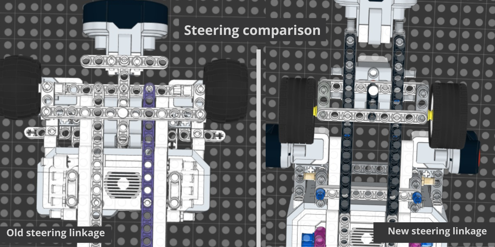
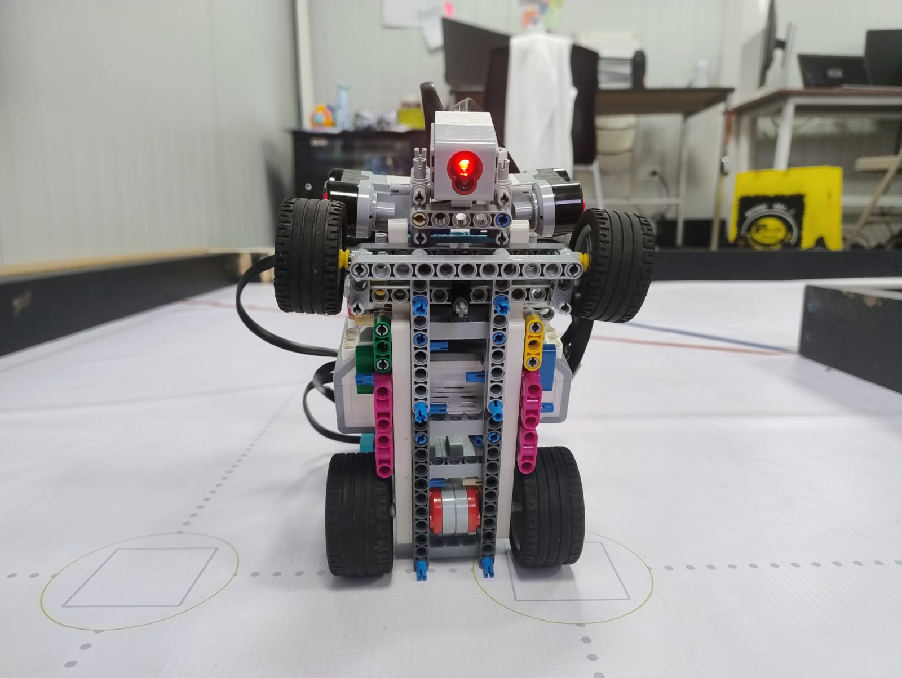

# ᯓ★ 1.3 Steering & Drive Mechanism ᯓ★

  
  
  

  <em>This section explains how Cheese moves forward, how it turns, why the steering system must stay stable, and how the v4 redesign improved the mechanical foundation for steering and drive performance.</em>

  ✦ ─── ⋆⋅☆⋅⋆ ─── (❁´◡`❁) ─── ⋆⋅☆⋅⋆ ─── ✦

Cheese turns four corners every lap, twelve across a full Open Challenge run. Every corner must be handled consistently because one unstable turn can affect the next straight section, the next curve, and the robot’s final position.

For a beginner, the easiest way to understand this section is this:

| System | Simple Explanation | Main Job |
| :--- | :--- | :--- |
| **Drive system** | The part that makes the robot move forward. | Pushes Cheese through the rear wheels. |
| **Steering system** | The part that changes the angle of the front wheels. | Controls the direction of the robot. |
| **Steering linkage** | The mechanical connection between the steering motor and the wheels. | Transfers motor movement into wheel angle. |
| **Chassis support** | The structure holding the motors and linkage in place. | Keeps the mechanism stable during movement. |

The drive and steering systems must work together. The drive motor moves the robot forward, while the steering mechanism controls where the robot goes. If the robot drives faster than the steering can react, it can crash. If the steering moves too aggressively, it can overcorrect and stress the linkage.

---

## ❀ 1.3.1 Drive System: How Cheese Moves Forward ────୨ৎ────────୨ৎ────

  
  
  

A drive motor is the part of a robot that turns electrical power into physical movement. In Cheese, the **EV3 Large Motor** is used as the drive motor. Its job is to rotate the rear axle so the rear wheels push the robot forward.

The drive motor does not steer the robot. It only provides propulsion.

| Drive Part | What It Does | Why It Matters |
| :--- | :--- | :--- |
| **EV3 Large Motor** | Provides the torque needed to move the robot. | Moves the full robot mass. |
| **Rear axle** | Transfers rotation from the motor to the rear wheels. | Keeps both rear wheels connected to the drive system. |
| **Rear wheels** | Push against the mat to move Cheese forward. | Convert motor rotation into forward motion. |
| **Chassis support** | Holds the drive motor in position. | Prevents the motor from shifting during testing. |

In v4, the Large Motor was placed lower and more horizontally, becoming part of the chassis structure instead of standing more separately. This helped save space, reduce the need for extra support pieces, and make the robot more compact.

  

  <em>Drive motor close-up evidence. This image should show the EV3 Large Motor placement and how it supports rear-wheel drive in the v4 structure.</em>

> **Note:** If this image appears broken, upload a close-up photo named `drive_motor_closeup_v4.jpg` into `v-photos/v4/`.

---

## ❀ 1.3.2 Steering System: How Cheese Changes Direction ────୨ৎ────────୨ৎ────

  
  
  

The steering motor is different from the drive motor. The steering motor does **not** move Cheese forward. Instead, it changes the angle of the front wheels so the robot can turn.

In Cheese, the **EV3 Medium Motor** controls the front steering linkage. When the motor rotates, the linkage moves, and that movement changes the direction of the front wheels.

| Steering Part | What It Does | Why It Matters |
| :--- | :--- | :--- |
| **EV3 Medium Motor** | Moves the steering linkage. | Changes the angle of the front wheels. |
| **Steering linkage** | Connects the motor movement to the front wheels. | Transfers rotation into steering motion. |
| **Front wheels** | Point the robot toward the direction it should travel. | Control the robot’s path. |
| **Motor mount** | Keeps the steering motor fixed. | Prevents angle errors caused by motor movement. |
| **Front structure** | Holds the linkage and wheels aligned. | Keeps steering geometry stable. |

For a beginner, the drive motor is like the robot’s legs, while the steering motor is like the robot’s hands on a steering wheel. One makes the robot move; the other decides where it goes.

  

  <em>Steering motor close-up evidence. This photo should show how the EV3 Medium Motor is mounted and connected to the steering linkage.</em>

> **Note:** If this image appears broken, upload a close-up photo named `steering_motor_closeup_v4.jpg` into `v-photos/v4/`.

---

## ❀ 1.3.3 How Ackermann Steering Works ────୨ৎ────────୨ৎ────

Cheese uses **Ackermann steering geometry** on the front axle. This means the two front wheels do not turn at the exact same angle during a curve.

When a vehicle turns, both front wheels rotate around the same turning center. However, the inner wheel is closer to that center, so it must follow a tighter circle. The outer wheel is farther away, so it follows a wider circle.

Because of this:

  <strong>The inner wheel must turn more sharply than the outer wheel.</strong>

  

  <em>Ackermann steering diagram. The inner wheel follows a smaller radius, while the outer wheel follows a larger radius.</em>

> **Note:** If this image appears broken, upload a diagram named `ackermann_diagram.png` into the `img/` folder.

### Ackermann Geometry

If the robot turns with a radius **R** measured to the center of the axle, and the front wheels are separated by a track width **T**, then each wheel turns around a different radius:

  <strong>Inner wheel radius = R − (T / 2)</strong> 
  <strong>Outer wheel radius = R + (T / 2)</strong>

Both wheels share the same wheelbase **L**, so their steering angles are:

  <strong>tan(θ inner) = L / (R − T/2)</strong> 
  <strong>tan(θ outer) = L / (R + T/2)</strong>

Because the inner wheel radius is smaller, the inner wheel angle is larger.

  <strong>θ inner &gt; θ outer</strong>

This is why Ackermann steering matters. It helps the wheels roll through a turn instead of dragging sideways across the mat.

---

## ❀ 1.3.4 Why Steering Stability Matters During Curves ────୨ৎ────────୨ৎ────

Steering stability is important because Cheese must turn corners while still reading sensors, correcting its path, and avoiding walls. If the steering mechanism is unstable, the robot can lose control even if the software is making the correct decision.

| Steering Instability | What Can Happen |
| :--- | :--- |
| **Motor mount shifts** | The commanded angle may not match the real wheel angle. |
| **Linkage flexes** | The wheels can lag or move unevenly. |
| **Frame bends** | Sensors can shift and give less reliable readings. |
| **Robot is too top-heavy** | Turns can feel less controlled. |
| **Robot is too heavy** | Steering corrections need more time and force to control the robot’s path. |
| **Cables block the mechanism** | Steering movement can become restricted or harder to inspect. |

During curves, the steering system must react before the robot reaches the wall. If the wheels are still moving toward the required angle when Cheese enters the curve, the robot may turn too late. If the steering correction is too strong for the robot’s speed, the robot may oversteer.

This is why steering is not only a software issue. It is a mechanical system that depends on motor placement, linkage freedom, structure, weight, and speed.

---

## ❀ 1.3.5 Building the Linkage: Failures and Fixes ────୨ৎ────────୨ৎ────

The steering linkage was one of the hardest mechanisms to make reliable. It had to be loose enough to move, but strong enough to keep its shape.

| Version | Joint / Structure Used | Problem | Outcome |
| :--- | :--- | :--- | :--- |
| **v1** | Technic liftarm 1×3 + pins | Too stiff; the motor struggled to move the linkage. | Scrapped. |
| **v2** | Connector with pin + 3L axle with stop | Steering moved more freely. | Kept as the working geometry. |
| **v3** | Same geometry as v2, reinforced | Snapping turns stressed the front structure. | Front assembly and motor mount were strengthened. |
| **v4** | Simplified surrounding structure with lighter chassis | Robot became lighter, lower, and cleaner. | Steering area became easier to inspect and less affected by unnecessary upper mass. |

### v1: The linkage was too stiff

Our original linkage used a **Technic liftarm 1×3**, Technic pins, and a **3L axle with stop**. It looked correct in the model, but when the medium motor tried to steer, the joint resisted too much.

The problem was that the linkage was rigid in the place where it needed to pivot freely. We were asking the steering motor to fight the resistance of the mechanism before it could even turn the wheels.

### v2: Replacing the joint

We replaced the Technic liftarm 1×3 with a **connector with pin**, while keeping the same 3L axle with stop. This helped the joint pivot more freely, allowing the medium motor to move the linkage properly.

This became the steering geometry that carried into later versions.

### v3: Reinforcing the front assembly

In v3, the geometry still worked, but aggressive steering movements stressed the front assembly. The steering motor and linkage needed a more stable foundation because a steering motor that shifts while steering creates angle errors.

The v3 improvement was not a full redesign of the geometry. It was a reinforcement of the structure holding the mechanism in place.

### v4: Reducing unnecessary structure around the mechanism

In v4, the steering geometry still needed support, but the rest of the robot became lighter and less cluttered. The robot mass was reduced from **888 g to 666 g**, cable routing became shorter, and unnecessary upper structure was removed.

This helped the steering system because the robot became easier to inspect and less top-heavy. A lighter robot gives the steering system a better mechanical foundation because there is less mass to redirect during corrections.

---

## ❀ 1.3.6 Steering Evolution Evidence ────୨ৎ────────୨ৎ────

  

  <em>The original v1 linkage compared to the redesigned v2 mechanism. The v2 geometry carried over into v3, where the front assembly and motor mount were reinforced.</em>

  

  <em>Bottom view of Cheese v3 showing the reinforced Ackermann steering assembly and front motor support.</em>

  

  <em>Bottom view of Cheese v4. This evidence should show the updated lower structure, wheel alignment, steering support, and drive layout after simplification.</em>

  

  <em>Labeled v4 steering evidence. This image should identify the steering motor, linkage, front wheels, support beams, and steering connection points.</em>

> **Note:** If `steering_labeled_v4.jpg` appears broken, create a labeled image of the v4 bottom or front steering structure and upload it to `v-photos/v4/`.

---

## ❀ 1.3.7 How v4 Structure Improved Steering Behavior ────୨ৎ────────୨ৎ────

  
  
  

The steering mechanism does not move the full robot by itself, but it controls the direction of a moving mass. When the robot is heavier, taller, or more cluttered, steering becomes harder to control because the robot has more mass to redirect and more structure that can flex, shift, or interfere.

In v4, the robot became lighter and cleaner. This helps steering because there is less mass to redirect during corrections and less unnecessary upper structure affecting balance.

Using Newton’s Second Law:

  <strong>F = m × a</strong>

Solving for acceleration:

  <strong>a = F ÷ m</strong>

If the available motor force stays similar and the mass becomes lower, the robot can respond more easily to movement changes. This does not mean steering becomes perfect automatically, but it gives the steering system a better mechanical base.

| v4 Mechanical Change | How It Helps Steering |
| :--- | :--- |
| **Mass reduced from 888 g to 666 g** | Less mass to redirect during steering corrections. |
| **Extra camera structure removed** | Lower center of gravity and less top-heavy behavior. |
| **Shorter cables** | Easier inspection around the mechanism and less clutter. |
| **Lower structure** | More compact body during turns. |
| **Important support points kept** | Steering geometry still stays supported. |

The important trade-off was that we could not remove too much structure. The steering system still needs a stable motor mount, stable linkage support, and wheel alignment. In v4, we reduced unnecessary structure while keeping the pieces that actually protect steering reliability.

---

## ❀ 1.3.8 The Steering Problem We Keep Chasing ────୨ৎ────────୨ৎ────

Steering has been one of the hardest subsystems to tune because it can fail in two opposite ways.

### Turning too little

On fast corners, the steering motor sometimes does not reach the commanded angle before the robot is already entering the turn. The wheels are still moving when Cheese needs them already pointed, so the robot can continue too straight and crash.

### Turning too much

At other points, the turns came out too sharp and violent. These snapping movements stressed the linkage and forced us to reinforce the front assembly and motor mount.

### Why both can happen

These failures look opposite, but they come from the same relationship:

  <strong>Driving speed must match steering response time.</strong>

If the robot drives faster than the steering can react, the turn happens too late. If the steering correction is too aggressive for the speed, the robot can oversteer.

| Problem | Mechanical Cause | Software / Tuning Response |
| :--- | :--- | :--- |
| **Turn happens too late** | Steering angle is not reached in time. | Adjust speed layers and earlier curve response. |
| **Turn is too sharp** | Steering correction is too aggressive. | Smooth angle changes and tune steering limits. |
| **Linkage stress** | Snapping movements load the structure. | Reinforce support and reduce unnecessary mass. |
| **Unstable curve exit** | Robot exits the curve at a poor angle. | Tune return-to-center behavior. |
| **Wall impact** | Steering and speed are not synchronized. | Match driving speed to steering response. |

The mechanical side improved through freer linkage movement, reinforcement, and v4 simplification. The remaining challenge is tuning: matching speed, steering angle, and curve timing so the robot can turn consistently without hitting the walls.

---

## ❀ 1.3.9 Steering and Drive Testing Summary ────୨ৎ────────୨ৎ────

| Test Area | What We Observed | What We Changed | Result / Lesson |
| :--- | :--- | :--- | :--- |
| **Drive motor** | The Large Motor could move the robot reliably. | Kept rear-wheel drive. | Propulsion was strong enough. |
| **Steering joint** | v1 linkage was too stiff. | Changed to connector-with-pin joint. | Steering moved more freely. |
| **Front assembly** | Snapping turns stressed the structure. | Reinforced steering support in v3. | Steering mechanism survived stronger loads. |
| **Robot mass** | Heavier v3 structure made the robot harder to manage. | Reduced mass to 666 g in v4. | Cleaner and lighter structure supported better control. |
| **Cable routing** | Long cables made inspection harder. | Shortened cables in v4. | Easier debugging around the mechanism. |
| **Upper structure** | Extra height affected balance and clutter. | Removed unnecessary camera structure. | Robot became lower and more compact. |
| **Curve behavior** | Steering sometimes happened too late or too sharply. | Continued software tuning. | Speed and steering response must be matched. |

This testing showed that steering and drive cannot be treated as separate systems. The drive motor determines how fast Cheese reaches a curve, while the steering system determines whether the robot can turn before reaching the wall. The chassis structure, mass, cable routing, and motor mounting all affect how well those two systems work together.

---

## ✦ Final Steering and Drive Summary ─── ⋆⋅☆⋅⋆ ───

The steering and drive system must work together: the drive motor moves Cheese forward, while the steering mechanism controls direction and helps the robot handle curves without losing stability.

Cheese uses the EV3 Large Motor for propulsion because driving requires torque and force. It uses the EV3 Medium Motor for steering because steering requires faster, more precise angle changes. The Ackermann linkage allows the front wheels to follow different turning radii, reducing tire scrub and making curves more predictable.

The v4 redesign improved this system by reducing mass, removing unnecessary upper structure, shortening cables, and making the robot easier to inspect. These changes did not replace the steering mechanism, but they improved the mechanical environment around it.

  <strong>Final lesson:</strong> 
  Steering is not only about the motor. It depends on linkage freedom, structure, mass, stability, speed, and tuning all working together.

  ✦ ─── ⋆⋅☆⋅⋆ ─── (❁´◡`❁) ─── ⋆⋅☆⋅⋆ ─── ✦

  

