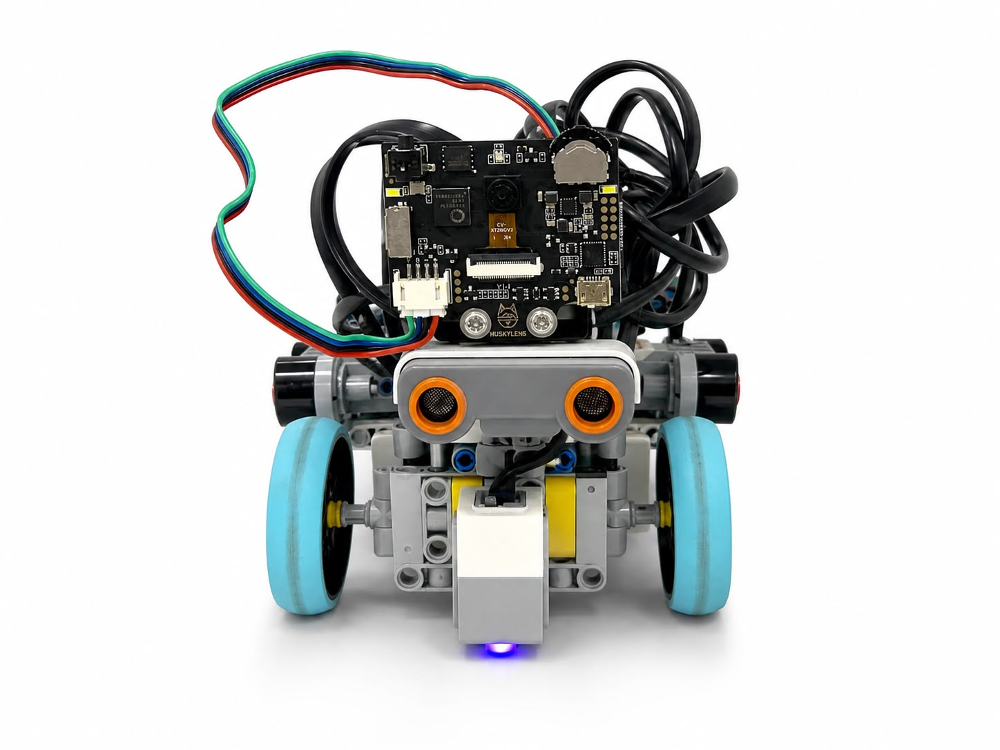
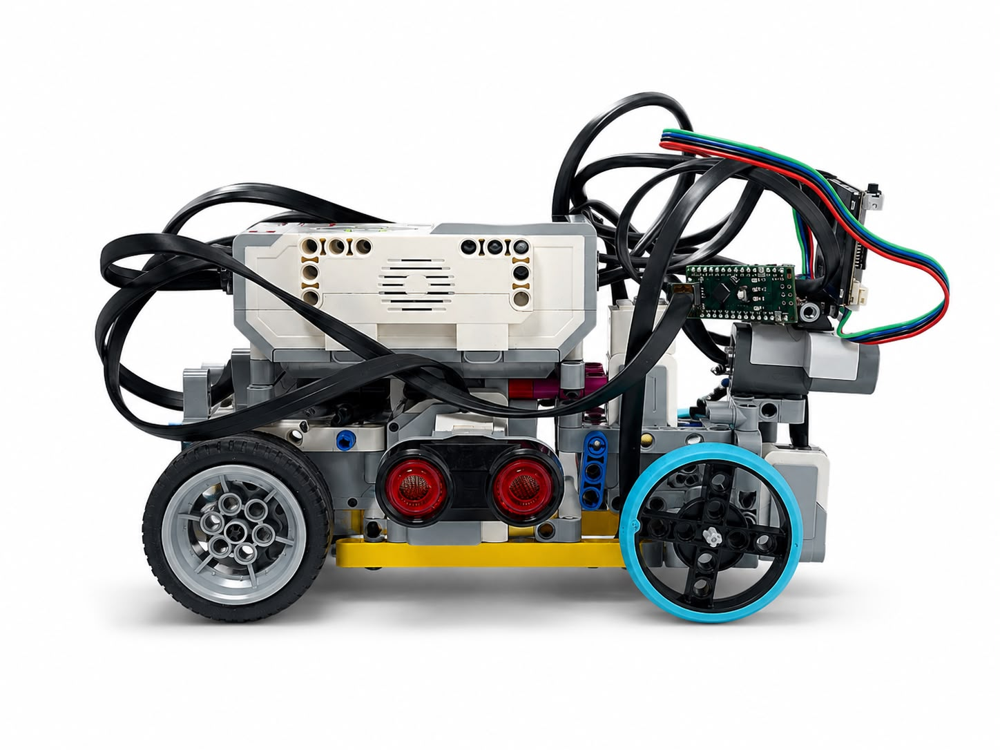
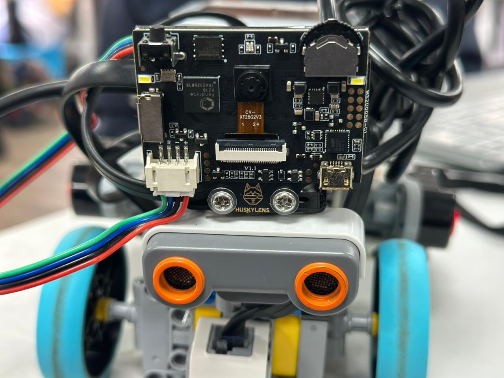
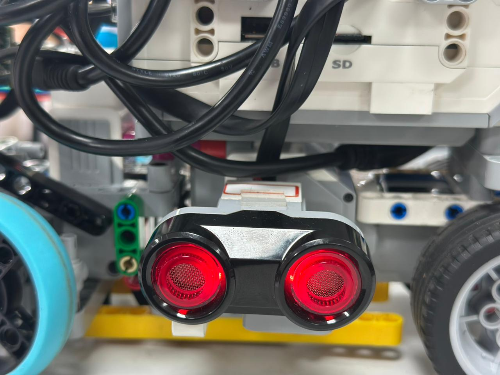
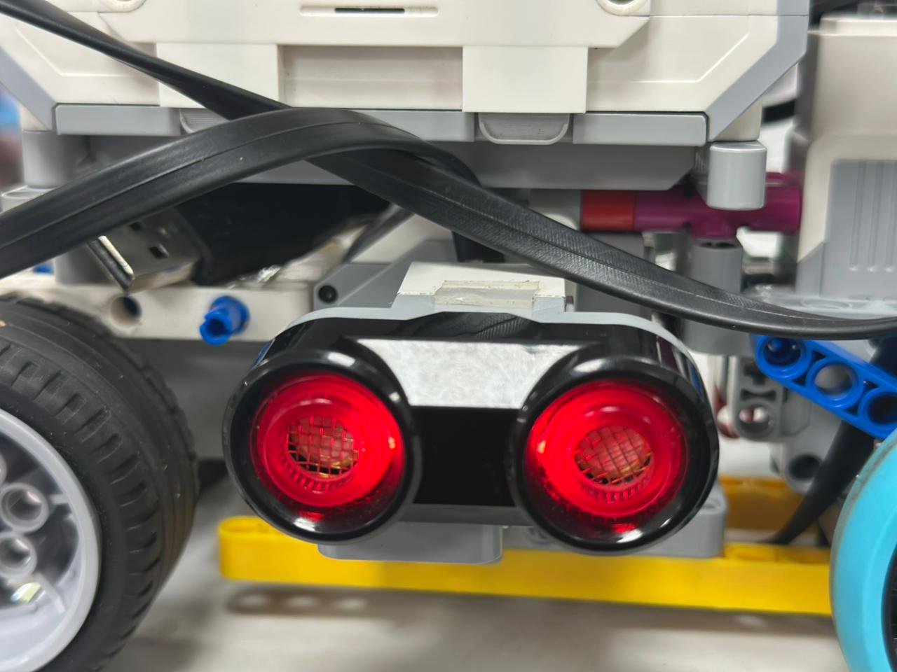

# ᯓ★ 1.4 Chassis Explanation ᯓ★

  
  
  

  <em>This section explains how Cheese’s chassis supports every subsystem, why the v4 layout became more compact, and how structural decisions affected stability, sensor placement, wiring, and reproducibility.</em>

  ✦ ─── ⋆⋅☆⋅⋆ ─── (❁´◡`❁) ─── ⋆⋅☆⋅⋆ ─── ✦

The chassis is not only the body of the robot. It is the structural backbone that keeps every subsystem in the correct position while the robot moves. If the chassis is weak, too heavy, too tall, or too cluttered, the robot can become harder to control, harder to repair, and harder to reproduce.

For Cheese, the chassis must support the EV3 Brick, motors, sensors, wiring, lights, camera, steering linkage, and drive system. This means the chassis affects almost every part of the robot’s performance.

---

## ❀ 1.4.1 What the Chassis Is ────୨ৎ────────୨ৎ────

  
  

A **chassis** is the main frame of a robot, vehicle, or mechanical system. In LEGO robotics, the chassis is the rigid base that holds all important components together.

For a beginner, the chassis is like the robot’s skeleton. It does not detect colors, measure distance, or run code by itself, but it decides where every important component sits.

| Chassis Function | Beginner Explanation | Why It Matters for Cheese |
| :--- | :--- | :--- |
| **Structural support** | Holds the EV3 Brick and main parts securely. | Keeps the robot from bending or falling apart during movement. |
| **Component housing** | Provides fixed mounting points for motors, sensors, camera, and lights. | Helps every subsystem stay in the correct position. |
| **Weight distribution** | Controls where mass is placed on the robot. | Affects balance, turning stability, and center of gravity. |
| **Load bearing** | Handles repeated stress from driving, turning, and testing. | Protects pins, beams, axles, and motor mounts from unnecessary strain. |
| **Cable organization** | Gives cables a path through the robot. | Prevents wires from blocking sensors, motors, or moving parts. |
| **Reproducibility** | Makes the build easier to understand and rebuild. | Helps another team or judge understand how Cheese is assembled. |

The chassis is important because the robot’s code can only work correctly if the physical structure keeps the sensors, motors, and moving parts stable.

---

## ❀ 1.4.2 Chassis Layout Evidence ────୨ৎ────────୨ৎ────

  

  <em>Top view of Cheese v4 showing the compact chassis layout, EV3 Brick placement, cable routing, and main structural organization.</em>

  
  

  <em>Front and side views of Cheese v4 showing the lower, cleaner structure and the simplified layout around the sensors, camera, and steering area.</em>

  
  

  <em>Left and right views of Cheese v4 showing the reduced clutter, shorter cable paths, lowered ultrasonic sensor layout, and cleaner access to the robot’s subsystems.</em>

  

  <em>Planned chassis comparison evidence showing how Cheese changed from the heavier v3 layout to the lighter and cleaner v4 chassis.</em>

> **Photo note:** If any image appears broken, upload it with the exact file name shown in the path.

---

## ❀ 1.4.3 Why the Chassis Must Hold Subsystems Stable ────୨ৎ────────୨ৎ────

The chassis must hold all subsystems in stable positions because every subsystem depends on alignment. If the chassis shifts, bends, vibrates too much, or allows parts to move, the robot can behave differently from what the code expects.

| Subsystem | What the Chassis Must Do | What Can Go Wrong If It Moves |
| :--- | :--- | :--- |
| **Drive motor** | Keep the motor fixed to the rear drive structure. | The drive system can lose alignment or feel less reliable. |
| **Steering motor** | Keep the motor mount stable. | The commanded steering angle may not match the real wheel angle. |
| **Steering linkage** | Hold pivot points and supports in the correct position. | The robot may turn too late, too sharply, or inconsistently. |
| **Ultrasonic sensors** | Hold side sensors at stable angles toward the walls. | Wall readings can become inconsistent. |
| **Color sensor** | Keep the sensor facing the floor at a stable height. | Floor color readings can fail or become unreliable. |
| **HuskyLens camera** | Keep the camera facing forward toward obstacles. | Obstacles can appear unclear, dark, or misaligned. |
| **Wiring** | Keep cables away from motors, wheels, and sensors. | Cables can block movement, pull sensors, or interfere with detection. |
| **EV3 Brick** | Hold the controller securely and accessibly. | The robot becomes harder to inspect, start, or debug. |
| **Lights** | Keep illumination stable near the sensors. | Sensor readings may change because lighting changes. |

This is why the chassis is not just a container. It is the mechanical system that keeps all other systems usable.

  <strong>Stable chassis → stable components → stable readings → more predictable robot behavior</strong>

---

## ❀ 1.4.4 Component Protection and Lifespan ────୨ৎ────────୨ৎ────

A good chassis also protects components during repeated testing. Cheese has to drive, turn, correct its path, and sometimes hit small imperfections or walls during testing. These movements create vibration and stress.

| Chassis Problem | Possible Effect |
| :--- | :--- |
| **Structural twisting** | Motors, sensors, and mounts can shift out of alignment. |
| **Excessive vibration** | Pins can loosen and internal components can wear faster. |
| **Weak support** | Heavy parts can sag, bend, or pull on surrounding pieces. |
| **Poor cable routing** | Cables can stretch, pinch, rub, or block moving parts. |
| **Too much upper mass** | The robot can become harder to control during turns. |

In LEGO robotics, this matters because most structural connections are made with plastic beams, pins, axles, and connectors. Repeated force can loosen or break small parts over time. A planned chassis reduces unnecessary stress by keeping the robot compact, balanced, and organized.

---

## ❀ 1.4.5 v4 Compact Layout ────୨ৎ────────୨ৎ────

  
  
  

The v4 chassis became more compact because we removed unnecessary structure and kept only the pieces that clearly supported the robot’s function. This changed how the robot behaved in several ways.

The previous structure had more parts that made the robot heavier and more cluttered. Those parts required more mechanical effort from the motors and created more stress on pins, beams, and connectors. In v4, the chassis supports fewer unnecessary structural components, making the robot lighter and more manageable.

| v4 Change | Why It Helped |
| :--- | :--- |
| **Robot became lighter** | Less mass for the drive system to move and the steering system to redirect. |
| **Structure became more compact** | Easier to control, inspect, and modify. |
| **Unnecessary upper support was removed** | Reduced height and top-heavy behavior. |
| **Important support points stayed** | Motors, sensors, steering, and drive systems remained stable. |
| **Cable routing became shorter** | Less clutter around motors, sensors, and moving parts. |

The goal was not to remove pieces randomly. The goal was to make the chassis more intentional. Each remaining part needed to have a clear purpose: support, stability, sensor positioning, wiring, or movement reliability.

---

## ❀ 1.4.6 Why Shorter Cables Help Organization ────୨ৎ────────୨ৎ────

Shorter cables help because they reduce clutter inside the robot. When cables are too long, they can loop around the chassis, block access to parts, or get close to moving mechanisms.

In Cheese, cable organization matters because the robot has motors, ultrasonic sensors, a color sensor, a camera, and lights. Each cable must reach its component without interfering with another subsystem.

| Cable Problem | Why It Matters |
| :--- | :--- |
| **Cable blocks a sensor** | The sensor may not read the wall, floor, or obstacle correctly. |
| **Cable hangs near a motor** | It can get caught or pulled during movement. |
| **Cable covers the camera view** | Obstacle detection can become less reliable. |
| **Cable touches the steering linkage** | Steering can become restricted or harder to inspect. |
| **Cable clutter hides parts** | Debugging and repair become slower. |

In v4, shorter cables made the robot cleaner and easier to inspect. This helps each motor and sensor do its job without being physically obstructed.

  

  <em>Planned cable routing evidence showing how shorter cables reduce clutter and make the chassis easier to inspect.</em>

> **Photo note:** If `cable_routing_v4.jpg` appears broken, upload a clear photo of the cable routing into `v-photos/v4/`.

---

## ❀ 1.4.7 Why the Camera Structure Was Simplified ────୨ৎ────────୨ৎ────

The camera structure was simplified because the previous mount placed the camera too high and added unnecessary upper structure. This created two problems: it made the robot taller and heavier, and it also affected how clearly the camera could detect obstacles.

In v3, the higher camera structure generated more shadow and made obstacles appear darker or less clear. This made obstacle recognition harder because the HuskyLens needs a clear forward view.

In v4, the camera was moved lower and closer to the front. The goal was to keep the camera facing forward while removing unnecessary height and support pieces.

| Camera Mount Issue in v3 | v4 Response |
| :--- | :--- |
| **Camera was mounted higher** | Camera was lowered toward the front. |
| **Extra support added weight** | Camera support was simplified. |
| **More upper structure created shadow** | Lower mount improved the viewing area. |
| **Bulky mount increased clutter** | Cleaner chassis made inspection easier. |
| **Camera still needed a forward view** | The camera stayed forward-facing for obstacle detection. |

The camera function was still important, especially for the Obstacle Challenge. The change was not removing the camera’s job. The change was removing the extra structure that made the camera mount heavier, taller, and harder to manage.

  

  <em>Camera placement evidence showing the simplified v4 camera mount, lower forward position, and cleaner support structure.</em>

> **Photo note:** If `sensor_placement_cam_v4.jpg` appears broken, upload the v4 camera placement photo into `v-photos/v4/`.

---

## ❀ 1.4.8 Why Some Pieces Were Removed ────୨ৎ────────୨ৎ────

Not every extra piece improves the robot. Some pieces add support, but other pieces only add height, mass, or clutter. In our robot, several pieces were mainly supporting the old camera mount or adding structure around areas that did not directly improve movement, sensor placement, or stability.

In v4, we removed pieces that did not have a clear purpose. This helped reduce the robot’s weight and made the chassis easier to understand.

| Removed / Reduced Area | Why It Was Removed |
| :--- | :--- |
| **Extra camera mount support** | Added height and mass without improving steering or drive. |
| **Unnecessary upper structure** | Made the robot more top-heavy and cluttered. |
| **Long cable paths** | Made inspection harder and could interfere with components. |
| **Non-critical reinforcement** | Added weight without improving the main structure. |
| **Pieces that only filled space** | Did not directly support motors, sensors, wiring, or stability. |

This redesign shows an important engineering idea:

  <strong>More pieces do not always mean a better robot.</strong> 
  A better chassis is one where every part has a reason to exist.

  

  <em>Planned evidence of removed structural pieces from v3 to v4. These pieces were removed because they added height, mass, or clutter without directly improving performance.</em>

> **Photo note:** If `removed_chassis_pieces_v4.jpg` appears broken, take a flat-lay photo of the removed pieces and upload it into `v-photos/v4/`.

---

## ❀ 1.4.9 Ultrasonic Sensor Support in v4 ────୨ৎ────────୨ৎ────

The chassis also supports the ultrasonic sensors. In v4, the ultrasonic sensors were lowered. This matters because the ultrasonic sensors are used to read wall distance, and their position affects how consistent those readings can be.

A sensor mount must hold the sensor at the correct height and angle. If the sensor moves, shakes, or points in the wrong direction, the robot may misunderstand its distance from the wall.

| v4 Sensor Support Change | Why It Helps |
| :--- | :--- |
| **Ultrasonic sensors lowered** | Helps create a more compact sensor layout. |
| **Sensor supports kept stable** | Prevents sensor angle changes during movement. |
| **Cables shortened around sensors** | Makes sensor wiring easier to inspect. |
| **Chassis became less cluttered** | Easier to notice if a sensor is blocked or misaligned. |

This connects the chassis to sensor architecture. The sensor itself gives data, but the chassis decides whether the sensor stays in the correct place to collect that data.

  
  

  <em>Left and right ultrasonic sensor placement evidence showing how the v4 chassis supports the side sensors in a lower and cleaner layout.</em>

> **Photo note:** If these images appear broken, upload `sensor_placement_left_v4.jpg` and `sensor_placement_right_v4.jpg` into `v-photos/v4/`.

---

## ❀ 1.4.10 Weight Across Versions ────୨ৎ────────୨ৎ────

| Version | Weight | Notes |
| :--- | :---: | :--- |
| **v1** | Not measurable | Digital model only. BrickLink assumes ideal LEGO parts, and our real build mixes LEGO with third-party pieces, so the model's estimate would not have been accurate. |
| **v2** | 763.5 g | First physical build. |
| **v3** | 888.1 g | Heavier build after adding the HuskyLens camera, custom camera mount, and extra supporting structure. |
| **v4** | 666 g | Current lighter build after removing unnecessary upper structure, simplifying the camera support, shortening cable routing, and keeping only the support needed for movement, sensors, and stability. |

The robot first gained about **125 g** between v2 and v3. This increase was mainly caused by the HuskyLens camera and the custom mount we built to hold it. That trade-off was necessary because the camera made the Obstacle Challenge possible.

However, after more testing, we found that the v3 structure had become heavier and more cluttered than necessary. In v4, we reduced the mass from **888.1 g to 666 g**, removing about **222 g**.

  <strong>888.1 g - 666 g ≈ 222 g removed</strong>

This weight reduction matters because a lighter robot is easier for the drive system to move and easier for the steering system to redirect during curves. The goal was not to remove structure randomly, but to remove pieces that added height, mass, or clutter without directly improving movement, sensor placement, or stability.

---

## ❀ 1.4.11 Chassis Iterations ────୨ৎ────────୨ৎ────

| Version | Chassis State | What Drove the Change |
| :--- | :--- | :--- |
| **v1** | Compact, EV3 vertical, digital model only | Built for speed on the assumption that smaller is faster. |
| **v2** | EV3 horizontal, first physical build | Real parts exposed the connection problems the model hid. |
| **v3** | Reinforced structure with HuskyLens camera support | Camera and support structure made the Obstacle Challenge possible, but added weight and clutter. |
| **v4** | Lighter, lower, cleaner structure with simplified upper support | Removed unnecessary mass, shortened cables, improved inspection access, and kept only the support needed for steering, drive, sensors, and stability. |

The chassis evolution shows that our design did not improve by simply adding more parts. v3 solved important support problems, especially around the camera and steering structure, but it also made the robot heavier. v4 was built to correct that trade-off.

In v4, the robot became lighter and more compact while still keeping the structural areas that matter: the steering support, drive motor support, wheel alignment, sensor mounts, EV3 Brick placement, camera position, and cable organization.

---

## ❀ 1.4.12 Chassis Evidence Map ────୨ৎ────────୨ৎ────

  
  
  

| Evidence | File | What It Proves |
| :--- | :--- | :--- |
| **Top v4 view** | `../../v-photos/v4/top_v4.jpg` | Shows the overall chassis layout, EV3 placement, cables, and compact structure. |
| **Front v4 view** | `../../v-photos/v4/front_v4.jpg` | Shows the front layout, camera area, sensor placement, and steering area. |
| **Back v4 view** | `../../v-photos/v4/back_v4.jpg` | Shows the rear structure, drive support area, and cable organization from the back. |
| **Bottom v4 view** | `../../v-photos/v4/bottom_v4.jpg` | Shows the lower chassis structure, steering/drive support, and wheel alignment. |
| **Left v4 view** | `../../v-photos/v4/left_v4.jpeg` | Shows the left side structure and ultrasonic sensor support. |
| **Right v4 view** | `../../v-photos/v4/right_v4.jpg` | Shows the opposite side structure and sensor support. |
| **v3 vs v4 chassis comparison** | `../../v-photos/v4/v3_vs_v4_chassis_comparison.jpg` | Shows the chassis simplification from v3 to v4. |
| **Removed chassis pieces** | `../../v-photos/v4/removed_chassis_pieces_v4.jpg` | Shows which extra structural pieces were removed during the v4 redesign. |
| **Cable routing v4** | `../../v-photos/v4/cable_routing_v4.jpg` | Shows how shorter cables improved organization and inspection. |
| **Camera placement v4** | `../../v-photos/v4/sensor_placement_cam_v4.jpg` | Shows the simplified camera structure and lower forward placement. |

This evidence map connects each visual to a specific chassis design decision. The photos show that v4 was not only a visual redesign; it was a structural improvement meant to reduce mass, improve organization, and keep subsystems stable.

---

## ❀ 1.4.13 Reproducibility Notes ────୨ৎ────────୨ৎ────

A good chassis should be understandable and reproducible. Another team should be able to look at the photos and understand where the main components are placed.

| Reproducibility Detail | Why It Helps |
| :--- | :--- |
| **Top, front, side, left, and right photos** | Show the robot from multiple angles. |
| **Close-up sensor photos** | Show how each sensor is mounted. |
| **Cable routing photo** | Shows how wires are organized to avoid interference. |
| **Removed pieces photo** | Shows what changed from v3 to v4. |
| **Chassis comparison photo** | Shows the design evolution clearly. |
| **Tables explaining changes** | Connect photos to engineering decisions. |

This supports reproducibility because the chassis is not only described in words. It is supported with planned visual evidence, version comparison, and clear reasoning for each major design choice.

---

## ❀ Visual Evidence Still Needed ────୨ৎ────────୨ৎ────

Some images may appear broken until the final photos are uploaded to the repository. These are the remaining visuals needed to make this section fully reproducible and easier to understand.

| Needed Evidence | Suggested File Name | What It Should Show |
| :--- | :--- | :--- |
| **Top v4 chassis photo** | `top_v4.jpg` | EV3 placement, cables, main chassis layout, and compact structure. |
| **Front v4 photo** | `front_v4.jpg` | Camera area, steering/front wheel area, and sensor placement. |
| **Side v4 photo** | `side_v4.jpg` | Lower profile, reduced upper structure, and overall chassis shape. |
| **Left v4 photo** | `left_v4.jpg` | Left side structure and ultrasonic sensor support. |
| **Right v4 photo** | `right_v4.jpg` | Right side structure and ultrasonic sensor support. |
| **v3 vs v4 chassis comparison** | `v3_vs_v4_chassis_comparison.jpg` | Structural difference between the heavier v3 and lighter v4 chassis. |
| **Removed pieces photo** | `removed_chassis_pieces_v4.jpg` | Structural pieces removed because they added height, mass, or clutter. |
| **Cable routing photo** | `cable_routing_v4.jpg` | Shorter cable organization and reduced clutter. |
| **Camera placement photo** | `sensor_placement_cam_v4.jpg` | Simplified lower camera support. |

These visuals will help a judge or another team understand the chassis without needing to see the robot in person.

---

## ✦ Final Chassis Summary ─── ⋆⋅☆⋅⋆ ───

The v4 chassis became more intentional because every remaining part had a clearer purpose: support, stability, sensor positioning, or cable organization.

Cheese’s chassis is not only the robot’s body. It is the structure that holds the drive motor, steering motor, sensors, camera, lights, EV3 Brick, and cables in stable positions. Because of that, the chassis affects movement, sensor reliability, steering stability, testing speed, and reproducibility.

The v4 redesign improved the chassis by reducing unnecessary upper structure, simplifying the camera support, shortening cables, lowering the sensor layout, and removing pieces that did not directly improve performance. The robot became lighter, cleaner, easier to inspect, and easier to control while still keeping the support needed for movement and stability.

  <strong>Final chassis lesson:</strong> 
  A better chassis is not the one with the most pieces. It is the one where every remaining piece has a clear reason to exist.

  ✦ ─── ⋆⋅☆⋅⋆ ─── (❁´◡`❁) ─── ⋆⋅☆⋅⋆ ─── ✦

  

