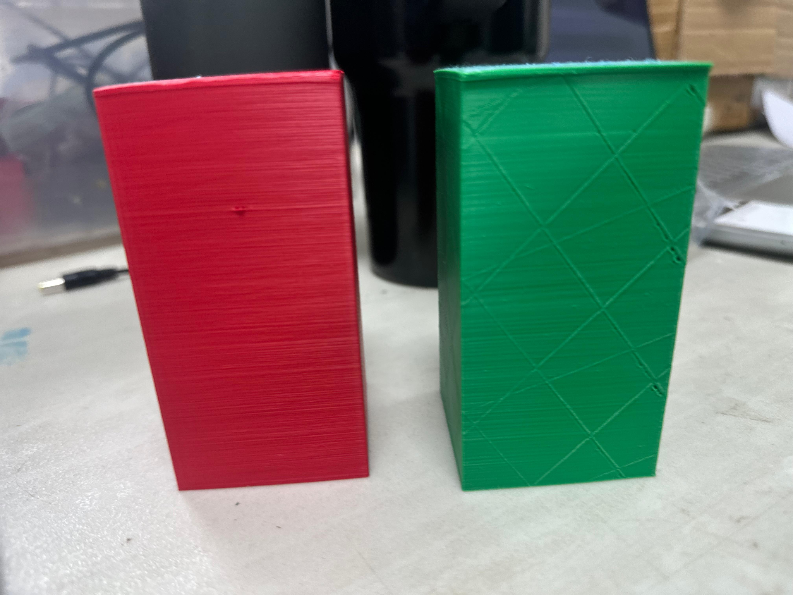
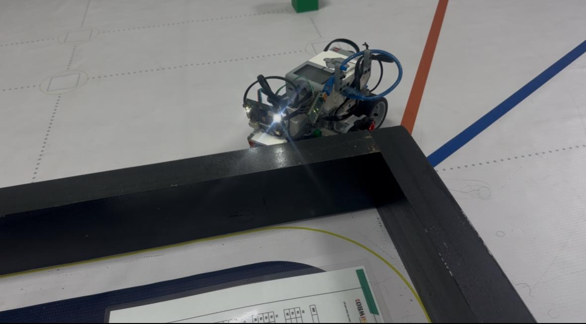

<h1 align="center">ᯓ★ 3.0 Cheese Logic Overview ᯓ★</h1>

<p align="center">
  
  
  
  
</p>

<p align="center">
  <em>
    A high-level overview of how Cheese v4 senses the field,
    interprets its environment, chooses a response,
    moves, recovers, and tracks progress during the WRO Future Engineers challenges.
  </em>
</p>

<p align="center">
  ✦ ─── ⋆⋅☆⋅⋆ ─── 🧀🤖 ─── ⋆⋅☆⋅⋆ ─── ✦
</p>

---

# ❀ 3.0.1 Software Philosophy ────୨ৎ────────୨ৎ────

Cheese v4 is controlled through a **sensor-driven, priority-based architecture**.

The software does not simply execute a fixed sequence such as:

```text
DRIVE 3 SECONDS
TURN
DRIVE 5 SECONDS
TURN
```

Instead, Cheese continuously observes what is happening around it.

```text
SENSE
  ↓
VALIDATE
  ↓
INTERPRET
  ↓
DECIDE
  ↓
ACT
  ↓
RECOVER
  ↓
REPEAT
```

This allows the robot to respond to the real field rather than assuming that every lap, curve, wall distance, or obstacle will appear exactly the same.

The central philosophy is:

<p align="center">
  <strong>
    Correct only when necessary, protect the robot when danger increases,
    and always prepare the next movement before the current one is considered complete.
  </strong>
</p>

---

# ❀ 3.0.2 Two Challenge Modes ────୨ৎ────────୨ৎ────

Cheese v4 currently uses two related but separate software systems.

<div align="center">

| Challenge | Main Objective | Current Status |
| :--- | :--- | :--- |
| 🟦 **Open Challenge** | Complete three laps, count curves and return to parking | 🟢 Near-final calibration |
| 🚧 **Obstacle Challenge** | Navigate while detecting and avoiding red / green pillars | 🟡 Active development |

</div>

Both modes share the same basic engineering principle:

```text
READ ENVIRONMENT
      ↓
UNDERSTAND CURRENT SITUATION
      ↓
CHOOSE USEFUL CONTROL
      ↓
MOVE
      ↓
READ AGAIN
```

However, their priorities are different.

---

# ❀ 3.0.3 Current Software Files ────୨ৎ────────୨ৎ────

The current development files are:

<div align="center">

| Challenge | Current Main File |
| :--- | :--- |
| **Open Challenge** | `GOOD_CURVE_COUNTER_TEST11_PROGRESSIVE_ESCAPE_REVERSE_RETRACE.py` |
| **Obstacle Challenge** | `GOODYIPEE (1)(3) (21).py` |

</div>

The Open file contains the more mature navigation system.

It currently handles:

- ultrasonic navigation,
- color-based curve counting,
- minimum-correction PID,
- progressive wall protection,
- front-wall recovery,
- three-lap progress,
- and final parking.

The Obstacle file extends the navigation system with:

- HuskyLens vision,
- Arduino Nano communication,
- red / green pillar detection,
- camera-based steering influence,
- obstacle avoidance,
- and recovery testing.

Keeping these files separate protects the more stable Open system while the obstacle strategy continues to evolve.

---

# ❀ 3.0.4 Software Architecture Map ────୨ৎ────────୨ৎ────

The software is divided into several connected subsystems.

<p align="center">
  
</p>

<p align="center">
  <em>
    Overview of the main Cheese v4 software subsystems documented throughout Section 3.
  </em>
</p>

The architecture can be viewed as:

```text
                 ┌──────────────────┐
                 │     SENSORS      │
                 └────────┬─────────┘
                          ↓
                 ┌──────────────────┐
                 │    VALIDATION    │
                 └────────┬─────────┘
                          ↓
                 ┌──────────────────┐
                 │  INTERPRETATION  │
                 └────────┬─────────┘
                          ↓
                 ┌──────────────────┐
                 │    PRIORITIES    │
                 └────────┬─────────┘
                          ↓
        ┌─────────────────┼─────────────────┐
        ↓                 ↓                 ↓
   NAVIGATION          SAFETY           PROGRESS
        │                 │                 │
        └─────────────────┼─────────────────┘
                          ↓
                   MOTOR OUTPUT
                          ↓
                     MOVEMENT
                          ↓
                     NEW DATA
```

In Obstacle mode, vision becomes an additional branch before the final steering command.

---

# ❀ 3.0.5 Main Hardware Inputs ────୨ৎ────────୨ৎ────

Cheese v4 uses several sensors because no single sensor can describe the entire field.

<p align="center">
  
</p>

<p align="center">
  <em>
    Current Cheese v4 sensing architecture combining lateral distance,
    forward safety, floor detection and vision.
  </em>
</p>

<div align="center">

| Sensor / Device | Main Software Role |
| :--- | :--- |
| **Left Ultrasonic** | Measures left-side wall distance |
| **Right Ultrasonic** | Measures right-side wall distance |
| **Front Ultrasonic** | Detects dangerous forward proximity |
| **EV3 Color Sensor** | Detects floor markers and tracks curves |
| **HuskyLens** | Detects colored pillars during Obstacle mode |
| **Arduino Nano** | Transfers simplified HuskyLens information to the EV3 |

</div>

The software combines these inputs instead of expecting one sensor to solve every navigation problem.

---

# ❀ 3.0.6 Main Hardware Outputs ────୨ৎ────────୨ৎ────

Cheese has two primary motor outputs.

<div align="center">

| Motor | Function |
| :--- | :--- |
| **Large Motor** | Rear-wheel propulsion |
| **Medium Motor** | Front Ackermann steering |

</div>

The software ultimately converts every decision into:

```text
DRIVE SPEED
     +
STEERING ANGLE
     ↓
PHYSICAL MOVEMENT
```

The next sensor readings are then affected by that movement.

This creates a closed control loop.

---

# ❀ 3.0.7 Main Control Loop ────୨ৎ────────୨ৎ────

<p align="center">
  
</p>

<p align="center">
  <em>
    Repeated control cycle used to continuously update Cheese's movement.
  </em>
</p>

At a high level:

```text
START
  ↓
READ SENSORS
  ↓
CHECK SAFETY
  ↓
UPDATE PROGRESS
  ↓
CALCULATE NAVIGATION
  ↓
APPLY ALLOWED VISION RESPONSE
  ↓
COMMAND MOTORS
  ↓
CHECK FINISH
  ↓
REPEAT
```

The robot therefore does not make one decision per curve.

It repeatedly updates its decision while moving.

---

# ❀ 3.0.8 Sensor Validation ────୨ৎ────────୨ৎ────

A major part of Cheese's logic is deciding whether information is trustworthy enough to use.

<p align="center">
  
</p>

The general concept is:

```text
RAW SENSOR VALUE
       ↓
IS IT VALID?
   ┌───┴───┐
  NO      YES
  │         │
IGNORE    FILTER
            ↓
        INTERPRET
            ↓
          USE
```

Examples include:

- filtering ultrasonic readings,
- validating floor-color sequences,
- requiring curve confirmation,
- confirming dangerous front distances,
- checking whether camera data is fresh,
- and clearing outdated obstacle commands.

This reduces the chance that one incorrect sample creates a large physical reaction.

---

# ❀ 3.0.9 Open Challenge Logic ────୨ৎ────────୨ৎ────

The Open Challenge is currently the most stable navigation mode.

Its high-level logic is:

```text
START
  ↓
SAVE STARTING DISTANCES
  ↓
DRIVE
  ↓
READ SIDE ULTRASONICS
  ↓
PID / WALL PROTECTION
  ↓
READ FLOOR COLOR
  ↓
VALID CURVE?
  ↓
UPDATE CURVE COUNT
  ↓
FRONT DANGER?
  ↓
RECOVER IF NEEDED
  ↓
12 CURVES?
  ↓
RETURN TO START REGION
  ↓
PARK
```

The Open system is explained in detail in **Section 3.3 Open Challenge**.

---

# ❀ 3.0.10 Minimum-Correction Navigation ────୨ৎ────────୨ৎ────

Cheese does not continuously force itself toward an exact mathematical center.

The controller instead asks:

```text
IS THE CURRENT PATH SAFE?
```

If yes:

```text
KEEP MOVING
```

If useful correction is needed:

```text
APPLY PID
```

If danger becomes greater:

```text
INCREASE PROTECTION
```

<p align="center">
  
</p>

This architecture was developed to reduce unnecessary zig-zag and steering conflict.

---

# ❀ 3.0.11 Progressive Wall Protection ────୨ৎ────────୨ৎ────

Wall response is not simply:

```text
SAFE / CRASH
```

It becomes stronger as the situation becomes more dangerous.

```text
NORMAL DISTANCE
      ↓
NORMAL NAVIGATION

CLOSER
      ↓
GENTLE PROTECTION

TOO CLOSE
      ↓
SEVERE PROTECTION

CRITICAL
      ↓
STRONG AVOIDANCE / RECOVERY
```

This gives Cheese multiple opportunities to correct its trajectory before contact occurs.

---

# ❀ 3.0.12 Front Safety and Reverse Recovery ────୨ৎ────────୨ৎ────

The front ultrasonic provides a separate safety mechanism.

<p align="center">
  
</p>

<p align="center">
  <em>
    Front ultrasonic sensor used to detect dangerous forward proximity.
  </em>
</p>

If the robot gets too close to a wall:

```text
FRONT DANGER
      ↓
CONFIRM
      ↓
REVERSE
      ↓
CREATE PHYSICAL SPACE
      ↓
RETURN TO NAVIGATION
```

<p align="center">
  
</p>

This is important because a steering command cannot help if Cheese is already physically trapped against a wall.

---

# ❀ 3.0.13 Color-Based Progress Tracking ────୨ৎ────────୨ৎ────

The EV3 Color Sensor tracks progress through the Open course.

<p align="center">
  
</p>

<p align="center">
  <em>
    Current color sensor position used for track-event detection.
  </em>
</p>

The software interprets:

```text
BLUE
```

and groups several warm EV3 classifications as:

```text
ORANGE
```

A curve requires a valid transition such as:

```text
BLUE → ORANGE
```

or:

```text
ORANGE → BLUE
```

<p align="center">
  
</p>

The complete Open run requires:

```text
4 CURVES
   ×
3 LAPS
   =
12 CURVES
```

This count determines when parking is allowed to begin.

---

# ❀ 3.0.14 Open Parking Logic ────୨ৎ────────୨ৎ────

Parking does not depend only on elapsed time.

Cheese stores environmental information at the start.

After completing the required progress:

```text
12 CURVES
    ↓
PARKING ENABLED
    ↓
RETURN TOWARD START REGION
    ↓
COMPARE CURRENT DISTANCE
WITH SAVED START REFERENCE
    ↓
SLOW APPROACH
    ↓
STOP
```

<p align="center">
  
</p>

This links:

```text
PROGRESS
   +
POSITION
   ↓
FINISH
```

rather than relying only on timing.

---

# ❀ 3.0.15 Obstacle Challenge Logic ────୨ৎ────────୨ৎ────

Obstacle mode adds vision to the navigation architecture.

The high-level process becomes:

```text
NORMAL NAVIGATION
       ↓
PILLAR DETECTED?
       ↓
IDENTIFY COLOR
       ↓
DETERMINE PASSING SIDE
       ↓
APPLY CAMERA STEERING INFLUENCE
       ↓
CLEAR PILLAR
       ↓
REMOVE OLD CAMERA INFLUENCE
       ↓
RECOVER
       ↓
CONTINUE
```

The Obstacle Challenge is explained in detail in **Section 3.4**.

---

# ❀ 3.0.16 Current HuskyLens Detection Evidence ────୨ৎ────────୨ৎ────

The current vision system has been physically tested with both competition pillar colors.

<p align="center">
  
  &nbsp;
  
</p>

<p align="center">
  <em>
    Current physical HuskyLens recognition evidence:
    green is detected as Color ID 1 and red as Color ID 2.
  </em>
</p>

The current trained vision classes shown during testing are:

<div align="center">

| Physical Pillar | Current HuskyLens Detection |
| :--- | :---: |
| 🟢 **Green** | **Color ID 1** |
| 🔴 **Red** | **Color ID 2** |

</div>

This visual evidence is important because it verifies the actual camera configuration instead of documenting only the intended software behavior.

---

# ❀ 3.0.17 Physical Obstacle References ────୨ৎ────────୨ৎ────

The team tests recognition and avoidance using physical red and green pillar models.

<p align="center">
  
</p>

<p align="center">
  <em>
    Physical red and green pillars used during vision and obstacle-navigation development.
  </em>
</p>

The obstacle rules require different trajectories depending on pillar color.

```text
GREEN
  ↓
PASS LEFT
```

```text
RED
  ↓
PASS RIGHT
```

Therefore the software must connect:

```text
COLOR
  ↓
RULE
  ↓
STEERING RESPONSE
```

---

# ❀ 3.0.18 Vision Communication Architecture ────୨ৎ────────୨ৎ────

The HuskyLens does not communicate directly with the main Python navigation logic.

Instead:

```text
HUSKYLENS
    ↓
I²C
    ↓
ARDUINO NANO
    ↓
USB SERIAL
    ↓
EV3
```

<p align="center">
  
  &nbsp;
  
</p>

<p align="center">
  <em>
    Arduino Nano bridge and USB communication path used by the current vision system.
  </em>
</p>

The Nano converts camera information into a simpler form for the EV3.

Conceptually:

```text
CAMERA DATA
     ↓
NANO
     ↓
COLOR + POSITION + SIZE
     ↓
EV3
```

---

# ❀ 3.0.19 Camera Steering Influence ────୨ৎ────────୨ৎ────

The camera does not receive unlimited steering authority.

<p align="center">
  
</p>

The architecture is approximately:

```text
NORMAL NAVIGATION
       +
CAMERA BIAS
       ↓
WALL SAFETY
       ↓
FINAL STEERING
```

This means:

- vision can influence the trajectory,
- wall sensors remain relevant,
- unsafe camera commands can be limited,
- and old camera influence should disappear after the obstacle is lost.

---

# ❀ 3.0.20 Why Camera Position Matters ────୨ৎ────────୨ৎ────

<p align="center">
  
</p>

<p align="center">
  <em>
    Current HuskyLens viewing angle used during obstacle detection.
  </em>
</p>

Vision reliability depends on robot geometry.

```text
GOOD ROBOT HEADING
      ↓
PILLAR ENTERS CAMERA EARLY
      ↓
EARLIER DETECTION
      ↓
MORE TIME TO AVOID
```

But:

```text
BAD EXIT ANGLE
      ↓
PILLAR ENTERS CAMERA LATE
      ↓
LESS REACTION TIME
      ↓
HARDER AVOIDANCE
```

This is why camera placement, steering, curves and recovery must be developed together.

---

# ❀ 3.0.21 Obstacle Recovery ────୨ৎ────────୨ৎ────

The current obstacle-development priority is not simply recognizing colors.

The larger challenge is:

```text
DETECT
  ↓
AVOID
  ↓
CLEAR
  ↓
RECOVER
  ↓
PREPARE FOR NEXT PILLAR
```

A pillar can be avoided successfully while the overall maneuver still fails.

For example:

```text
PILLAR 1 CLEARED
      ↓
BAD EXIT ANGLE
      ↓
NEXT PILLAR ENTERS FOV LATE
      ↓
NEXT AVOIDANCE FAILS
```

Therefore recovery is considered part of obstacle avoidance itself.

---

# ❀ 3.0.22 Current Real Obstacle Testing ────୨ৎ────────୨ৎ────

<p align="center">
  
</p>

<p align="center">
  <em>
    Cheese v4 during physical obstacle-field testing with a green pillar present on the course.
  </em>
</p>

Real-field testing combines:

```text
CAMERA
 +
PILLARS
 +
WALLS
 +
STEERING
 +
SPEED
 +
FIELD OF VIEW
 +
RECOVERY
      ↓
REAL OBSTACLE PERFORMANCE
```

This image belongs to the **Obstacle Challenge evidence**, not the Open Challenge.

---

# ❀ 3.0.23 Behavior Priority ────୨ৎ────────୨ৎ────

Not every software behavior should have equal authority.

A simplified priority chain is:

```text
CRITICAL SAFETY
      ↓
WALL PROTECTION
      ↓
VALID NAVIGATION / PROGRESS
      ↓
VISION RESPONSE
      ↓
NORMAL MOVEMENT
```

Parking becomes a finishing priority once the required run progress is complete.

The goal is to prevent conflicting commands such as:

```text
CAMERA REQUESTS RIGHT
        +
RIGHT WALL IS DANGEROUS
        ↓
DO NOT BLINDLY FOLLOW CAMERA
```

---

# ❀ 3.0.24 Speed Is Part of the Logic ────୨ৎ────────୨ৎ────

Speed is not treated as a completely separate variable.

It changes how much time the robot has to:

- detect,
- calculate,
- steer,
- clear a wall,
- avoid a pillar,
- and recover.

The basic strategy is:

```text
SAFE
 ↓
FASTER

HIGHER RISK
 ↓
SLOWER

FINAL PARKING
 ↓
PRECISE

EMERGENCY
 ↓
REVERSE
```

This is especially important during obstacle testing because faster movement reduces the time between first useful detection and physical contact with a pillar.

---

# ❀ 3.0.25 Software Is Connected to Mechanics ────୨ৎ────────୨ৎ────

Software commands do not directly move Cheese through mathematics alone.

They act through physical components.

```text
SOFTWARE
    ↓
MEDIUM MOTOR
    ↓
ACKERMANN LINKAGE
    ↓
FRONT WHEELS
    ↓
ROBOT CHANGES HEADING
    ↓
SENSOR VIEW CHANGES
    ↓
SOFTWARE
```

This means that:

- steering geometry,
- motor response,
- robot mass,
- sensor placement,
- wheel traction,
- and battery condition

all affect the behavior of the same code.

---

# ❀ 3.0.26 Battery Condition ────୨ৎ────────୨ৎ────

Battery condition can change the physical response of Cheese even if the program itself is unchanged.

Possible effects include:

```text
LOWER MOTOR RESPONSE
        ↓
DIFFERENT TURN
        ↓
DIFFERENT SENSOR POSITION
        ↓
DIFFERENT NEXT DECISION
```

Therefore the team does not automatically assume:

```text
FAILED TEST = BAD CODE
```

Instead, testing considers:

```text
SOFTWARE?
SENSOR?
MECHANICS?
BATTERY?
CAMERA ANGLE?
TRACK POSITION?
```

This is especially important when comparing repeated runs.

---

# ❀ 3.0.27 Current Software Status ────୨ৎ────────୨ৎ────

<div align="center">

| System | Status |
| :--- | :--- |
| **EV3 motor control** | 🟢 Stable |
| **Ultrasonic sensing** | 🟢 Functional |
| **Color sensing** | 🟢 Functional |
| **Sensor filtering** | 🟢 Implemented |
| **Minimum-correction PID** | 🟢 Functional |
| **Progressive wall protection** | 🟢 Functional |
| **Front reverse recovery** | 🟢 Functional |
| **Curve counting** | 🟢 Functional |
| **Three-lap Open navigation** | 🟢 Mostly reliable |
| **Open parking** | 🟢 Functional |
| **Green HuskyLens detection** | 🟢 Confirmed |
| **Red HuskyLens detection** | 🟢 Confirmed |
| **Nano communication** | 🟢 Functional |
| **Camera steering influence** | 🟢 Implemented |
| **Obstacle avoidance consistency** | 🟡 In calibration |
| **Post-obstacle recovery** | 🟠 Main current challenge |
| **Obstacle parking** | 🟠 Pending stabilization |

</div>

---

# ❀ 3.0.28 Software Development Method ────୨ৎ────────୨ৎ────

Cheese's software was developed through repeated testing rather than one final program written from the beginning.

The team's preferred development cycle is:

```text
OBSERVE FAILURE
      ↓
IDENTIFY CAUSE
      ↓
IDENTIFY RISK
      ↓
CHANGE ONE SYSTEM
      ↓
TEST
      ↓
COMPARE RESULT
      ↓
KEEP / REJECT CHANGE
```

This allows software decisions to be supported by physical behavior.

---

# ❀ 3.0.29 Failure → Cause → Fix Examples ────୨ৎ────────୨ৎ────

<div align="center">

| Observation | Cause / Interpretation | Engineering Change | Result / Current Direction |
| :--- | :--- | :--- | :--- |
| Zig-zag on straights | Excessive correction | Minimum-correction PID | Straighter normal motion |
| Wall approached too closely | Normal correction insufficient | Progressive wall protection | Earlier safety response |
| Robot became trapped near front wall | Steering lacked physical space | Reverse recovery | Space created before continuing |
| Orange classification varied | EV3 warm-color interpretation | Grouped warm colors | More tolerant curve detection |
| Curve could count twice | One physical event created multiple readings | Cooldown + validation | Better progress tracking |
| Pillar seen but still contacted | Detection did not create enough physical clearance | Tune approach + avoidance | Active obstacle calibration |
| Next pillar appeared too late | Previous recovery left bad heading | Treat recovery as part of avoidance | Main current obstacle focus |

</div>

The important engineering chain is:

```text
FAILURE
   ↓
CAUSE
   ↓
RISK
   ↓
FIX
   ↓
TEST
   ↓
RESULT
   ↓
LEARNING
```

---

# ❀ 3.0.30 Section 3 Roadmap ────୨ৎ────────୨ৎ────

This overview introduces the systems that are explained in greater detail throughout Section 3.

<div align="center">

| Section | Focus |
| :--- | :--- |
| **3.0** | Cheese Logic Overview |
| **3.1** | Algorithm Architecture |
| **3.2** | Flowchart |
| **3.3** | Open Challenge |
| **3.4** | Obstacle Challenge |
| **3.5** | Corner Handling |
| **3.6** | Tuning Process |

</div>

The sections move from:

```text
GENERAL LOGIC
      ↓
ARCHITECTURE
      ↓
VISUAL FLOW
      ↓
OPEN STRATEGY
      ↓
OBSTACLE STRATEGY
      ↓
CORNER BEHAVIOR
      ↓
TESTING + TUNING
```

---

# ✦ Engineering Lessons ─── ⋆⋅☆⋅⋆ ───

### 1. A robot should not react to every sensor value equally

Information must first be validated and interpreted.

---

### 2. Stable navigation often requires less correction

Continuous steering can create the instability it is trying to remove.

---

### 3. Safety must have authority over normal navigation

When Cheese is physically close to collision, normal steering may no longer be enough.

---

### 4. Progress tracking affects the entire run

A curve-counting error can eventually become a parking error.

---

### 5. Camera recognition alone does not solve obstacles

A successful obstacle maneuver requires detection, reaction, clearance and recovery.

---

### 6. The robot's movement changes its next sensor input

Steering changes wall distances and camera field of view.

Software and mechanics therefore form one closed system.

---

### 7. Recovery is preparation

The end of one maneuver determines the starting conditions of the next one.

---

# ✦ 3.0 Cheese Logic Summary ─── ⋆⋅☆⋅⋆ ───

Cheese v4 uses a **sensor-driven, priority-based and minimum-correction control philosophy**.

The Open Challenge combines:

- three ultrasonic sensors,
- floor-color detection,
- minimum-correction PID,
- progressive wall protection,
- front reverse recovery,
- validated curve counting,
- three-lap progress tracking,
- and final parking.

The Obstacle Challenge adds:

- HuskyLens vision,
- Arduino Nano communication,
- physical red / green recognition,
- camera steering influence,
- pillar-specific passing rules,
- wall-aware obstacle avoidance,
- and post-obstacle recovery.

Current physical vision evidence confirms:

```text
GREEN = Color ID 1
RED   = Color ID 2
```

The overall Cheese v4 software philosophy can therefore be summarized as:

<p align="center">
  <strong>
    Sense → Validate → Understand → Prioritize → Act → Recover → Repeat
  </strong>
</p>

<p align="center">
  ✦ ─── ⋆⋅☆⋅⋆ ─── 🧀 Cheese Logic Vault 🧀 ─── ⋆⋅☆⋅⋆ ─── ✦
</p>

<p align="center">
  <a href="https://github.com/Quesovamos2662/WRO2026_FE_Go-Cheese#general-project-index">
    
  </a>
</p>
