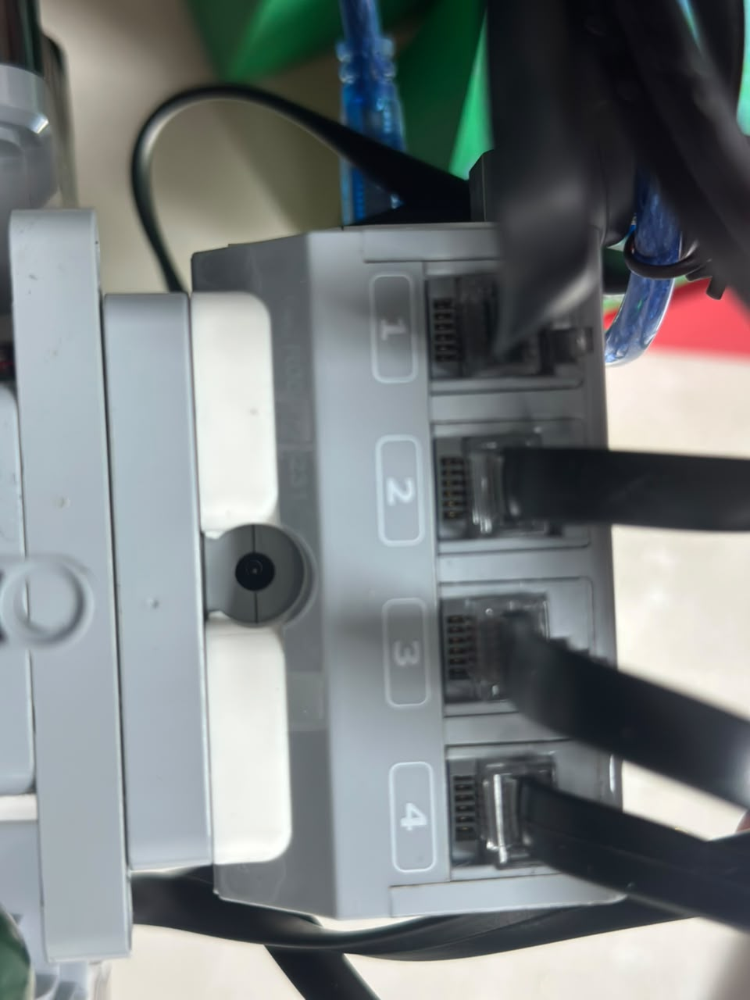
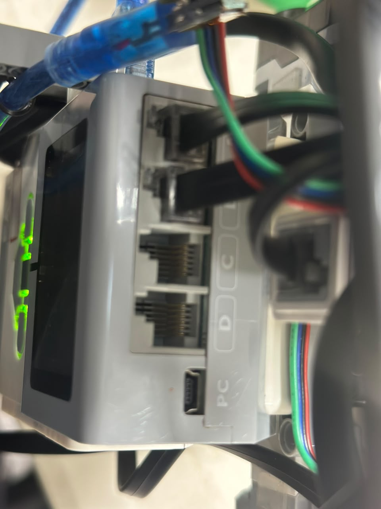
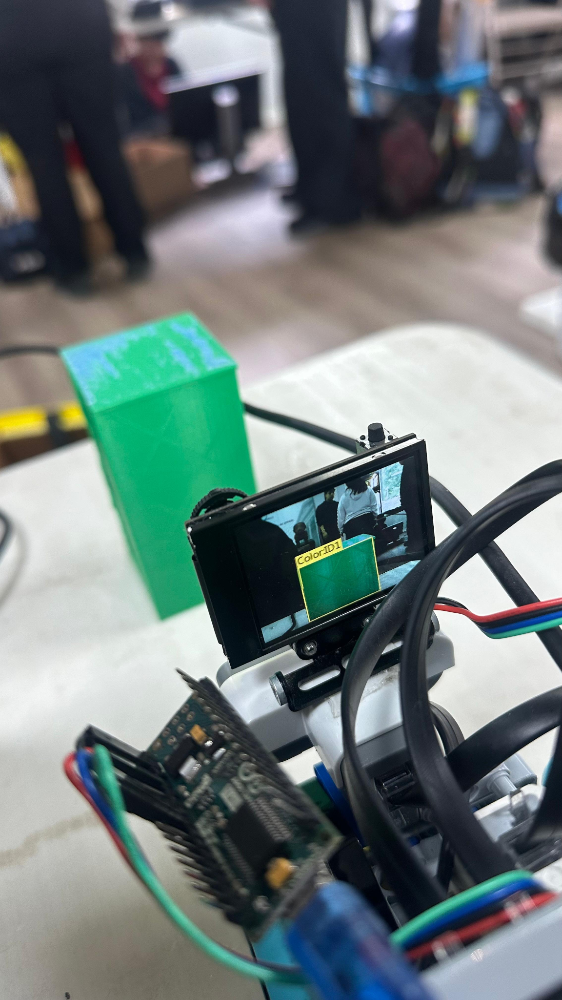
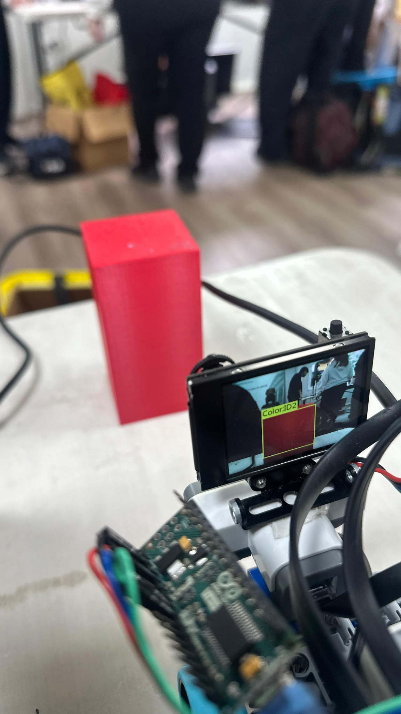

<h1 align="center">ᯓ★ 3.1 Algorithm Architecture ᯓ★</h1>

<p align="center">
  
  
  
  
</p>

<p align="center">
  <em>
    This section explains how Cheese v4 organizes sensing, validation,
    navigation, safety, curve tracking, vision, obstacle response,
    recovery, and parking into one structured control architecture.
  </em>
</p>

<p align="center">
  ✦ ─── ⋆⋅☆⋅⋆ ─── 🧀🤖 ─── ⋆⋅☆⋅⋆ ─── ✦
</p>

---

Cheese v4 is built around a **priority-based, minimum-correction architecture**.

The robot does not attempt to correct every small difference detected by its sensors.

Instead, the software asks:

```text
IS A CORRECTION ACTUALLY NEEDED?
```

If not:

```text
DRIVE WITH MINIMAL STEERING
```

If correction is needed:

```text
IDENTIFY WHY
      ↓
APPLY THE APPROPRIATE CONTROL
```

This reduces unnecessary steering and helps prevent several control systems from fighting each other.

The general architecture is:

```text
SENSE
  ↓
VALIDATE
  ↓
REMEMBER STATE
  ↓
INTERPRET
  ↓
PRIORITIZE
  ↓
CONTROL
  ↓
MOVE
  ↓
RECOVER
  ↓
REPEAT
```

---

# ❀ 3.1.1 Current Software Files ────୨ৎ────────୨ৎ────

Cheese currently uses separate programs for the two Future Engineers rounds.

<div align="center">

| Challenge | Current Main File | Main Purpose | Status |
| :--- | :--- | :--- | :--- |
| **Open Challenge** | `GOOD_CURVE_COUNTER_TEST11_PROGRESSIVE_ESCAPE_REVERSE_RETRACE.py` | Navigation, curve counting, wall safety, front recovery, three laps and parking | 🟢 Near-final calibration |
| **Obstacle Challenge** | `GOODYIPEE (1)(3) (21).py` | Navigation plus camera detection, pillar avoidance and recovery | 🟡 Active calibration |

</div>

The two programs remain separate because the Obstacle Challenge introduces additional experimental behaviors that should not destabilize the more mature Open system.

```text
OPEN
 ↓
NAVIGATION
CURVE COUNT
SAFETY
PARKING
```

while:

```text
OBSTACLE
 ↓
NAVIGATION
   +
VISION
   +
PILLAR RESPONSE
   +
RECOVERY
```

---

# ❀ 3.1.2 Architecture Goal ────୨ৎ────────୨ৎ────

The main architecture goal is to allow several behaviors to cooperate without producing contradictory motor commands.

<div align="center">

| Behavior | Why It Needs Control |
| :--- | :--- |
| **Normal driving** | Cheese must continue moving when no correction is needed |
| **Wall correction** | Prevent side-wall contact |
| **Front safety** | Prevent direct front-wall collisions |
| **Curve tracking** | Know how much of the course is complete |
| **Parking** | Finish after the correct progress |
| **Obstacle detection** | Detect red and green pillars |
| **Obstacle avoidance** | Pass each pillar on the required side |
| **Recovery** | Return to a useful trajectory afterward |

</div>

Without an architecture, these behaviors could all request steering at the same time.

The purpose of the control system is therefore not only to calculate an angle.

It must decide **which behavior should matter most at that moment**.

---

# ❀ 3.1.3 Software Architecture Overview ────୨ৎ────────୨ৎ────

<p align="center">
  
</p>

<p align="center">
  <em>
    Map of the main Cheese v4 software subsystems documented throughout Section 3.
  </em>
</p>

The architecture can be divided into:

```text
INPUT
 ↓
VALIDATION
 ↓
STATE
 ↓
DECISION
 ↓
CONTROL
 ↓
OUTPUT
```

More specifically:

<div align="center">

| Layer | Function |
| :--- | :--- |
| **Input layer** | Read sensors and camera data |
| **Validation layer** | Remove unreliable information |
| **State layer** | Remember previous events |
| **Decision layer** | Determine current situation |
| **Priority layer** | Decide which behavior has authority |
| **Control layer** | Calculate steering and speed |
| **Output layer** | Command drive and steering motors |

</div>

---

# ❀ 3.1.4 Hardware Map Used by the Algorithm ────୨ৎ────────୨ৎ────

The software architecture depends on the physical hardware map matching the code.

<p align="center">
  
  &nbsp;
  
</p>

<p align="center">
  <em>
    Current EV3 input and output connections used by Cheese v4.
  </em>
</p>

<div align="center">

| Component | Port / Connection | Algorithm Role |
| :--- | :---: | :--- |
| **Medium Motor** | `OUTPUT_A` | Ackermann steering |
| **Large Motor** | `OUTPUT_B` | Rear-wheel propulsion |
| **Left Ultrasonic** | `INPUT_1` | Left wall distance |
| **Right Ultrasonic** | `INPUT_2` | Right wall distance |
| **Front Ultrasonic** | `INPUT_3` | Forward-distance safety |
| **EV3 Color Sensor** | `INPUT_4` | Floor-color / curve tracking |
| **Arduino Nano** | EV3 USB | Vision communication bridge |
| **HuskyLens** | Nano via I²C | Obstacle detection |

</div>

The detailed physical connections are documented in **Section 2.2 Wiring Diagram**.

---

# ❀ 3.1.5 Program Structure ────୨ৎ────────୨ৎ────

The current Cheese code follows a modular structure.

<div align="center">

| Program Block | Purpose |
| :--- | :--- |
| **Imports** | Load EV3 motor, sensor, timing and communication tools |
| **Hardware setup** | Assign sensors and motors |
| **Constants** | Store tuning values |
| **State variables** | Remember information between cycles |
| **Sensor functions** | Read hardware |
| **Validation functions** | Reject unreliable values |
| **Steering functions** | Control steering movement |
| **PID functions** | Calculate navigation correction |
| **Curve functions** | Detect track progress |
| **Safety functions** | Handle dangerous front distance |
| **Vision functions** | Receive and interpret obstacle data |
| **Parking functions** | Detect final position |
| **Main loop** | Coordinate all subsystems |
| **Shutdown logic** | Stop motors safely |

</div>

This structure makes failures easier to isolate.

Instead of asking:

```text
WHY DID THE WHOLE ROBOT FAIL?
```

the team can ask:

```text
WAS IT:
SENSING?
VALIDATION?
PID?
CURVE COUNT?
VISION?
RECOVERY?
PARKING?
```

---

# ❀ 3.1.6 Main Control Loop ────୨ৎ────────୨ৎ────

<p align="center">
  
</p>

<p align="center">
  <em>
    Repeated control cycle used during autonomous navigation.
  </em>
</p>

A simplified cycle is:

```text
LOOP START
    ↓
CHECK STOP CONDITION
    ↓
READ FRONT SENSOR
    ↓
RUN SAFETY IF REQUIRED
    ↓
READ FLOOR COLOR
    ↓
UPDATE CURVE STATE
    ↓
READ SIDE SENSORS
    ↓
VALIDATE / FILTER
    ↓
CALCULATE NAVIGATION
    ↓
READ CAMERA DATA
(Obstacle mode)
    ↓
APPLY ALLOWED CAMERA INFLUENCE
    ↓
COMMAND MOTORS
    ↓
CHECK FINISH
    ↓
REPEAT
```

The Open loop uses an approximately:

```text
0.01 s
```

delay between iterations.

---

# ❀ 3.1.7 Priority-Based Control ────୨ৎ────────୨ৎ────

Cheese does not treat every behavior equally.

A simplified control hierarchy is:

```text
SAFETY
  ↓
WALL PROTECTION
  ↓
TRACK / NAVIGATION LOGIC
  ↓
VISION RESPONSE
  ↓
NORMAL MOVEMENT
```

Parking becomes dominant when the run-completion condition is reached.

<div align="center">

| Control Layer | Main Trigger | Response |
| :--- | :--- | :--- |
| **Front safety** | Dangerous front distance | Create space / recover |
| **Wall protection** | Dangerous lateral distance | Protective steering |
| **Curve progress** | Valid color transition | Update progress |
| **PID navigation** | Useful navigation error | Correct trajectory |
| **Vision response** | Valid fresh pillar detection | Add obstacle steering influence |
| **Normal movement** | No important correction | Minimal steering |
| **Parking** | Required progress complete | Finish sequence |

</div>

The main architectural principle is:

<p align="center">
  <strong>
    Higher-risk situations should prevent lower-priority commands from creating a worse situation.
  </strong>
</p>

---

# ❀ 3.1.8 Sensor Validation Architecture ────୨ৎ────────୨ৎ────

<p align="center">
  
</p>

Sensor information is processed before it controls movement.

```text
RAW VALUE
   ↓
VALID?
 ↓   ↓
NO   YES
│     │
IGNORE FILTER
       ↓
    INTERPRET
       ↓
      USE
```

Current reliability mechanisms include:

- ultrasonic distance validation,
- ultrasonic filtering,
- derivative filtering,
- color-sequence validation,
- curve cooldown,
- steering confirmation,
- front-distance confirmations,
- camera freshness checks,
- lost-pillar reset,
- and control-state resets.

---

# ❀ 3.1.9 State and Memory ────୨ৎ────────୨ৎ────

Cheese needs memory because one sensor reading only describes one instant.

State variables connect different moments of the run.

### Navigation State

<div align="center">

| State | Purpose |
| :--- | :--- |
| PID integral | Stores limited accumulated error |
| Previous error | Supports derivative calculation |
| Filtered derivative | Reduces sharp steering changes |
| Filtered sensor values | Smooth distance measurements |

</div>

### Curve State

<div align="center">

| State | Purpose |
| :--- | :--- |
| First color | Beginning of possible curve sequence |
| First-color time | Sequence timeout |
| Completed curves | Overall progress |
| Previous count time | Cooldown |
| Steering confirmation | Validate physical turning |
| Pending second color | Wait for final validation |

</div>

### Parking State

<div align="center">

| State | Purpose |
| :--- | :--- |
| Starting left distance | Initial side reference |
| Starting right distance | Initial side reference |
| Starting front distance | Main final reference |
| Finish confirmations | Prevent noisy final stop |
| Previous finish measurement | Detect target crossing |

</div>

### Vision State

<div align="center">

| State | Purpose |
| :--- | :--- |
| Current pillar color | Green / red / none |
| xCenter | Horizontal camera position |
| Width | Apparent pillar size |
| Last update time | Determine freshness |
| Camera bias | Current obstacle steering influence |
| Lost-pillar state | Clear old obstacle commands |

</div>

---

# ❀ 3.1.10 Minimum-Correction PID ────୨ৎ────────୨ৎ────

<p align="center">
  
</p>

The controller does not continuously try to center Cheese perfectly.

Instead:

```text
SAFE
 ↓
STRAIGHT


USEFUL ERROR
 ↓
PID


GREATER DANGER
 ↓
STRONGER PROTECTION
```

Current Open PID values include:

<div align="center">

| Constant | Current Value |
| :--- | :---: |
| `KP` | `0.28` |
| `KI` | `0.001` |
| `KD` | `0.08` |
| Integral limit | `20` |
| Center deadband | `1.5` |
| Maximum PID angle | `32°` |

</div>

The goal is not mathematical perfection.

The goal is **stable physical movement**.

---

# ❀ 3.1.11 Why Minimum Correction Was Chosen ────୨ৎ────────୨ৎ────

Earlier aggressive correction can produce:

```text
SMALL ERROR
   ↓
STEER
   ↓
CROSS TARGET
   ↓
STEER BACK
   ↓
CROSS AGAIN
   ↓
ZIG-ZAG
```

The current philosophy instead aims for:

```text
SAFE
 ↓
STRAIGHT

DRIFT
 ↓
CORRECT

SAFE AGAIN
 ↓
STRAIGHT
```

This reduces steering oscillation.

---

# ❀ 3.1.12 Progressive Wall Protection ────୨ৎ────────୨ৎ────

The Open controller uses progressively stronger wall protection.

<div align="center">

| Parameter | Current Value |
| :--- | :---: |
| Gentle wall distance | `28.0 cm` |
| Severe wall distance | `22.0 cm` |
| Full wall avoidance | `15.0 cm` |
| Gentle wall angle | `14°` |
| Severe wall angle | `18°` |

</div>

The architecture becomes:

```text
SAFE
 ↓
NORMAL NAVIGATION

CLOSER
 ↓
GENTLE RESPONSE

DANGEROUS
 ↓
SEVERE RESPONSE

CRITICAL
 ↓
FULL PROTECTION
```

This allows Cheese to respond before physical contact.

---

# ❀ 3.1.13 Steering Command Architecture ────୨ৎ────────୨ৎ────

Steering commands are also limited.

<div align="center">

| Steering Parameter | Current Value |
| :--- | :---: |
| Steering speed | `60` |
| Deadband | `0.8°` |
| Turn step | `3.0°` |
| Return step | `5.0°` |
| Soft steering start | `10°` |
| Full steering authority | `24°` |
| Maximum PID angle | `32°` |

</div>

The command chain is:

```text
REQUEST ANGLE
      ↓
LIMIT
      ↓
COMPARE WITH CURRENT POSITION
      ↓
CONTROLLED STEERING STEP
      ↓
MEDIUM MOTOR
      ↓
ACKERMANN LINKAGE
```

The software therefore respects the physical steering mechanism.

---

# ❀ 3.1.14 Front-Wall Safety Architecture ────୨ৎ────────୨ৎ────

<p align="center">
  
</p>

<p align="center">
  <em>
    Front ultrasonic placement used for forward-distance safety.
  </em>
</p>

<p align="center">
  
</p>

The safety branch works conceptually as:

```text
READ FRONT DISTANCE
        ↓
DANGER?
   ┌────┴────┐
  NO        YES
  │          │
CONTINUE   CONFIRM
             ↓
          RECOVER
             ↓
        CREATE SPACE
             ↓
        RETURN TO LOOP
```

Current values include:

<div align="center">

| Parameter | Value |
| :--- | :---: |
| Front assist begins | `70 cm` |
| Maximum front assist | `10°` |
| Too-close threshold | `10 cm` |
| Recovery target | `30 cm` |
| Confirmations | `3` |
| Recovery timeout | `1.8 s` |
| Maximum reverse steering | `10°` |

</div>

---

# ❀ 3.1.15 Curve-Counting Architecture ────୨ৎ────────୨ৎ────

The EV3 Color Sensor provides progress information.

<p align="center">
  
</p>

<p align="center">
  <em>
    Current floor-facing color sensor position.
  </em>
</p>

The software interprets:

```text
BLUE → BLUE
```

and groups several warm classifications into:

```text
RED
YELLOW
BROWN
   ↓
ORANGE
```

A valid curve sequence is:

```text
BLUE → ORANGE
```

or:

```text
ORANGE → BLUE
```

<p align="center">
  
</p>

Current curve-count values include:

<div align="center">

| Parameter | Value |
| :--- | :---: |
| Total curves | `12` |
| Color-change window | `3.0 s` |
| Curve cooldown | `1.5 s` |
| Minimum steering angle | `0.1°` |
| Minimum steering time | `0.03 s` |
| Post-color steering window | `0.9 s` |

</div>

---

# ❀ 3.1.16 Curve Counter as a State Machine ────୨ৎ────────୨ৎ────

The curve counter does not simply count every detected color.

It behaves like a small state machine.

```text
NO FIRST COLOR
      ↓
DETECT BLUE / ORANGE
      ↓
STORE FIRST COLOR
      ↓
WAIT
      ↓
OPPOSITE COLOR?
      ↓
YES
      ↓
VALID TIMING?
      ↓
STEERING CONFIRMATION?
      ↓
COUNT
      ↓
RESET
```

This architecture greatly reduces duplicate or false progress events.

---

# ❀ 3.1.17 Parking Architecture ────୨ৎ────────୨ৎ────

Parking is connected to both run progress and starting-position memory.

<p align="center">
  
</p>

The architecture is:

```text
START
 ↓
SAVE DISTANCE REFERENCES
 ↓
COMPLETE RUN
 ↓
12 CURVES
 ↓
PARKING ENABLED
 ↓
RETURN TOWARD START
 ↓
COMPARE FRONT DISTANCE
 ↓
SLOW
 ↓
STOP
```

Current parking speeds include:

<div align="center">

| Stage | Speed |
| :--- | :---: |
| Parking approach | `-28` |
| Medium approach | `-18` |
| Final creep | `-10` |

</div>

This makes parking part of the same sensor-driven architecture rather than a timed final movement.

---

# ❀ 3.1.18 Obstacle Vision Architecture ────୨ৎ────────୨ৎ────

Obstacle mode adds a vision branch to the normal navigation architecture.

<p align="center">
  
</p>

The data path is:

```text
HUSKYLENS
    ↓
I²C
    ↓
ARDUINO NANO
    ↓
USB SERIAL
    ↓
EV3
    ↓
CAMERA STEERING LOGIC
```

The camera provides information about:

```text
COLOR
POSITION
SIZE
```

rather than directly commanding the motors.

---

# ❀ 3.1.19 Current Vision Classification Evidence ────୨ৎ────────୨ৎ────

The current HuskyLens configuration has been tested physically with both obstacle colors.

<p align="center">
  
  &nbsp;
  
</p>

<p align="center">
  <em>
    Current HuskyLens recognition evidence:
    Green = Color ID 1 and Red = Color ID 2.
  </em>
</p>

<div align="center">

| Physical Pillar | Current HuskyLens ID | Required Passing Rule |
| :--- | :---: | :--- |
| 🟢 **Green** | **ID 1** | Pass on the **left** |
| 🔴 **Red** | **ID 2** | Pass on the **right** |

</div>

This is important because the software architecture must match the **actual trained camera configuration**.

The chain is:

```text
HUSKYLENS ID
      ↓
SOFTWARE COLOR
      ↓
PASSING RULE
      ↓
STEERING RESPONSE
```

A mismatch at any step could create the wrong physical behavior.

---

# ❀ 3.1.20 Vision Packet Architecture ────୨ৎ────────୨ৎ────

The Nano sends simplified information to the EV3.

```text
R,xCenter,width
```

for red,

```text
G,xCenter,width
```

for green,

and:

```text
N,0,0
```

when no useful pillar is detected.

<div align="center">

| Packet Part | Purpose |
| :--- | :--- |
| **Color code** | Determine obstacle rule |
| **xCenter** | Determine horizontal pillar location |
| **width** | Estimate visual size / approach state |
| **Freshness** | Prevent old data from controlling steering |

</div>

This lets the EV3 reason about both:

```text
WHAT IS THE PILLAR?
```

and:

```text
WHERE IS THE PILLAR?
```

---

# ❀ 3.1.21 Camera Steering Bias Architecture ────୨ৎ────────୨ৎ────

<p align="center">
  
</p>

The camera does not replace normal navigation.

Instead:

```text
NORMAL STEERING
      +
CAMERA BIAS
      ↓
SAFETY LIMIT
      ↓
FINAL STEERING
```

Important camera-response mechanisms include:

- fresh-packet validation,
- minimum useful detection size,
- color-specific passing rule,
- xCenter-based response,
- width-based response,
- smoothing,
- approach-speed reduction,
- wall-clearance limitation,
- and lost-pillar reset.

---

# ❀ 3.1.22 Why Camera Bias Is Limited ────୨ৎ────────୨ৎ────

Suppose the camera requests:

```text
MOVE RIGHT
```

but the right ultrasonic detects:

```text
RIGHT WALL DANGEROUS
```

If both systems had unlimited authority, Cheese could receive contradictory commands.

The architecture therefore aims for:

```text
CAMERA REQUEST
      ↓
CHECK SAFETY
      ↓
SAFE?
 ┌────┴────┐
YES        NO
│           │
ALLOW      LIMIT
```

This is one of the central systems-design decisions in the obstacle controller.

---

# ❀ 3.1.23 Camera Geometry as Part of the Algorithm ────୨ৎ────────୨ৎ────

<p align="center">
  
</p>

<p align="center">
  <em>
    Current HuskyLens viewing angle used during obstacle navigation.
  </em>
</p>

Camera performance depends on physical geometry.

```text
ROBOT HEADING
      ↓
CAMERA FIELD OF VIEW
      ↓
PILLAR POSITION IN IMAGE
      ↓
VISION DATA
      ↓
STEERING RESPONSE
```

Therefore a vision failure may not originate inside the camera.

It can begin with a poor robot trajectory.

---

# ❀ 3.1.24 Obstacle Avoidance Architecture ────୨ৎ────────୨ৎ────

A successful obstacle sequence requires:

```text
DETECT
 ↓
IDENTIFY
 ↓
REACT EARLY
 ↓
CLEAR
 ↓
REMOVE OLD BIAS
 ↓
RECOVER
 ↓
CONTINUE
```

Detection is only one stage.

The physical maneuver must still produce enough clearance to avoid contact.

---

# ❀ 3.1.25 Recovery Architecture ────୨ৎ────────୨ৎ────

Recovery is currently one of the most important obstacle-development areas.

The ideal sequence is:

```text
PILLAR CLEARED
      ↓
CAMERA BIAS REDUCES
      ↓
NORMAL NAVIGATION RETURNS
      ↓
ROBOT STABILIZES
      ↓
NEXT PILLAR ENTERS USEFUL FOV
```

A poor recovery can create:

```text
BAD EXIT ANGLE
      ↓
NEXT PILLAR APPEARS LATE
      ↓
LATE DETECTION
      ↓
FAILED NEXT AVOIDANCE
```

This means recovery is part of both **movement** and **future perception**.

---

# ❀ 3.1.26 Speed as a Control Variable ────୨ৎ────────୨ৎ────

Speed changes how much time the robot has to react.

Current Open values include:

<div align="center">

| State | Speed |
| :--- | :---: |
| Normal drive | `-62` |
| Gentle wall response | `-44` |
| Severe wall response | `-24` |
| Parking | `-28` |
| Parking medium | `-18` |
| Parking creep | `-10` |
| Emergency reverse | `28` |

</div>

The architecture therefore treats speed as part of the current control state.

```text
SAFE
 ↓
FASTER

DANGER
 ↓
SLOWER

PARKING
 ↓
PRECISE

EMERGENCY
 ↓
REVERSE
```

---

# ❀ 3.1.27 Software + Mechanical Feedback Loop ────୨ৎ────────୨ৎ────

The algorithm works inside a physical feedback loop.

```text
SOFTWARE REQUEST
      ↓
STEERING MOTOR
      ↓
LINKAGE
      ↓
WHEELS
      ↓
ROBOT MOVES
      ↓
SENSOR GEOMETRY CHANGES
      ↓
NEW INPUT
      ↓
SOFTWARE
```

This is why changes in:

- steering friction,
- linkage geometry,
- robot mass,
- wheel traction,
- sensor position,
- or battery condition

can change software behavior without changing one line of code.

---

# ❀ 3.1.28 Battery as a Systems Variable ────୨ৎ────────୨ৎ────

Battery condition can affect:

- drive strength,
- steering speed,
- acceleration,
- reverse recovery,
- and obstacle-response timing.

Therefore:

```text
FAILED TEST
   ≠
AUTOMATICALLY BAD CODE
```

The team considers several possible causes:

```text
SOFTWARE?
SENSOR?
MECHANICS?
BATTERY?
CAMERA ANGLE?
TRACK POSITION?
```

before changing control constants.

---

# ❀ 3.1.29 Full Software Architecture Flowchart ────୨ৎ────────୨ৎ────

<p align="center">
  
</p>

<p align="center">
  <em>
    Complete Cheese v4 architecture connecting sensing, validation,
    navigation, safety, vision and parking.
  </em>
</p>

The complete control philosophy can be summarized as:

```text
SENSE
 ↓
VALIDATE
 ↓
REMEMBER
 ↓
INTERPRET
 ↓
PRIORITIZE
 ↓
ACT
 ↓
RECOVER
 ↓
REPEAT
```

---

# ❀ 3.1.30 Failure → Architecture Change ────୨ৎ────────୨ৎ────

The current architecture developed through repeated failure analysis.

<div align="center">

| Failure | Interpretation | Architecture Change | Current Result |
| :--- | :--- | :--- | :--- |
| Zig-zag on straights | Too much correction | Minimum-correction PID | Straighter default movement |
| Wall approached too closely | Normal PID insufficient | Progressive wall protection | Earlier response |
| Front wall trapped robot | No room to steer | Reverse recovery | Physical space restored |
| Orange classification varied | Built-in classification inconsistent | Warm-color grouping | Better detection |
| Duplicate curve counts | Raw events trusted too easily | Timing + confirmation + cooldown | Better progress tracking |
| Camera request conflicted with wall | Multiple control systems fighting | Wall-limited camera bias | Safer obstacle control |
| Old obstacle steering continued | Stale camera state | Freshness + lost-pillar reset | Cleaner transitions |
| Next pillar appeared late | Poor recovery | Recovery treated as full subsystem | Current obstacle focus |

</div>

The engineering process is:

```text
FAILURE
   ↓
CAUSE
   ↓
RISK
   ↓
ARCHITECTURE CHANGE
   ↓
TEST
   ↓
RESULT
```

---

# ❀ 3.1.31 Current Architecture Status ────୨ৎ────────୨ৎ────

<div align="center">

| Architecture Area | Status |
| :--- | :--- |
| **Motor control** | 🟢 Stable |
| **Ultrasonic input** | 🟢 Functional |
| **Color input** | 🟢 Functional |
| **Sensor filtering** | 🟢 Implemented |
| **Minimum-correction PID** | 🟢 Functional |
| **Wall protection** | 🟢 Functional |
| **Front reverse recovery** | 🟢 Functional |
| **Curve tracking** | 🟢 Functional |
| **Three-lap Open navigation** | 🟢 Mostly reliable |
| **Open parking** | 🟢 Functional |
| **Green = ID 1 recognition** | 🟢 Confirmed |
| **Red = ID 2 recognition** | 🟢 Confirmed |
| **Nano communication** | 🟢 Functional |
| **Camera steering influence** | 🟢 Implemented |
| **Obstacle avoidance consistency** | 🟡 Tuning |
| **Post-obstacle recovery** | 🟠 Main current development area |
| **Obstacle parking** | 🟠 Pending |

</div>

---

# ❀ 3.1.32 Supporting Repository Resources ────୨ৎ────────୨ৎ────

<div align="center">

| Resource | Purpose |
| :--- | :--- |
| [`00_v4_flowchart_set_map.png`](../../img/software-flowcharts%20v4/00_v4_flowchart_set_map.png) | Software subsystem map |
| [`01_v4_main_loop_control_cycle.png`](../../img/software-flowcharts%20v4/01_v4_main_loop_control_cycle.png) | Main control loop |
| [`02_v4_color_detection_curve_counting.png`](../../img/software-flowcharts%20v4/02_v4_color_detection_curve_counting.png) | Curve-count logic |
| [`03_v4_minimum_correction_pid_controller.png`](../../img/software-flowcharts%20v4/03_v4_minimum_correction_pid_controller.png) | PID architecture |
| [`04_v4_front_wall_safety_reverse_recovery.png`](../../img/software-flowcharts%20v4/04_v4_front_wall_safety_reverse_recovery.png) | Safety recovery |
| [`05_v4_obstacle_detection_camera_bias.png`](../../img/software-flowcharts%20v4/05_v4_obstacle_detection_camera_bias.png) | Vision steering architecture |
| [`06_v4_parking_finish_logic.png`](../../img/software-flowcharts%20v4/06_v4_parking_finish_logic.png) | Parking architecture |
| [`07_v4_sensor_validation_reliability.png`](../../img/software-flowcharts%20v4/07_v4_sensor_validation_reliability.png) | Sensor validation |
| [`08_v4_main_software_flowchart.png`](../../img/software-flowcharts%20v4/08_v4_main_software_flowchart.png) | Complete architecture |
| [`huskylens_green_id1_detection_v4.png`](../../v-photos/v4/huskylens_green_id1_detection_v4.png) | Current green recognition evidence |
| [`huskylens_red_id2_detection_v4.png`](../../v-photos/v4/huskylens_red_id2_detection_v4.png) | Current red recognition evidence |

</div>

<p align="center">
  <a href="https://quesovamos2662.github.io/WRO2026_FE_Go-Cheese/embeds/v4_software_priority_chain.html">
    
  </a>

  <a href="https://quesovamos2662.github.io/WRO2026_FE_Go-Cheese/embeds/v4_sensor_configuration.html">
    
  </a>

  <a href="https://quesovamos2662.github.io/WRO2026_FE_Go-Cheese/embeds/v4_obstacle_testing_status.html">
    
  </a>
</p>

---

# ❀ 3.1.33 v3 → v4 Architecture Evolution ────୨ৎ────────୨ৎ────

Earlier software remains useful as engineering history, but the active reference is Cheese v4.

<div align="center">

| Area | Earlier Direction | Current v4 Direction |
| :--- | :--- | :--- |
| **Straight navigation** | More continuous correction | Minimum correction |
| **Wall response** | More dependent on general steering | Progressive protection |
| **Front safety** | Less independent | Dedicated reverse recovery |
| **Color logic** | Earlier experimental approaches | Current `COL-COLOR` grouping |
| **Distance sensing** | Earlier configurations | Three-ultrasonic architecture |
| **Vision** | Earlier camera experimentation | HuskyLens + Nano data path |
| **Obstacle response** | Less integrated | Camera steering influence |
| **Recovery** | Less explicit | Treated as a full subsystem |

</div>

The v4 architecture is simpler in concept:

<p align="center">
  <strong>
    Use each sensor for a clear purpose and give each control behavior a defined level of authority.
  </strong>
</p>

---

# ✦ Engineering Lessons ─── ⋆⋅☆⋅⋆ ───

### 1. Architecture matters as much as individual algorithms

A good PID and a good camera controller can still fail if they fight each other.

---

### 2. Sensors should provide information, not uncontrolled authority

The software decides how much each sensor should influence movement.

---

### 3. Validation should happen before action

One unreliable reading should not be enough to create a major steering change.

---

### 4. Minimum correction can improve stability

Not every small deviation deserves a response.

---

### 5. Physical safety needs its own behavior

Sometimes reversing is more useful than steering harder.

---

### 6. Vision depends on robot geometry

Camera field of view changes with the robot's heading and previous movement.

---

### 7. Recovery is part of the algorithm

The next maneuver depends on the position created by the previous maneuver.

---

### 8. Real evidence must match software documentation

The current camera evidence confirms:

```text
GREEN = ID 1
RED   = ID 2
```

so the software documentation must preserve that exact mapping.

---

# ✦ 3.1 Algorithm Architecture Summary ─── ⋆⋅☆⋅⋆ ───

Cheese v4 uses a **priority-based, sensor-driven, minimum-correction architecture**.

The Open Challenge combines:

- three ultrasonic sensors,
- floor-color tracking,
- sensor validation,
- PID navigation,
- progressive wall protection,
- front reverse recovery,
- validated curve counting,
- and distance-based parking.

The Obstacle Challenge adds:

- HuskyLens vision,
- Arduino Nano communication,
- **Green = ID 1** recognition,
- **Red = ID 2** recognition,
- camera-based steering influence,
- color-specific passing rules,
- wall-aware obstacle response,
- and post-obstacle recovery.

The architecture can therefore be summarized as:

<p align="center">
  <strong>
    Sense → Validate → Remember → Prioritize → Control → Recover → Repeat
  </strong>
</p>

<p align="center">
  ✦ ─── ⋆⋅☆⋅⋆ ─── 🧀 Algorithm Architecture Vault 🧀 ─── ⋆⋅☆⋅⋆ ─── ✦
</p>

<p align="center">
  <a href="https://github.com/Quesovamos2662/WRO2026_FE_Go-Cheese#general-project-index">
    
  </a>
</p>
