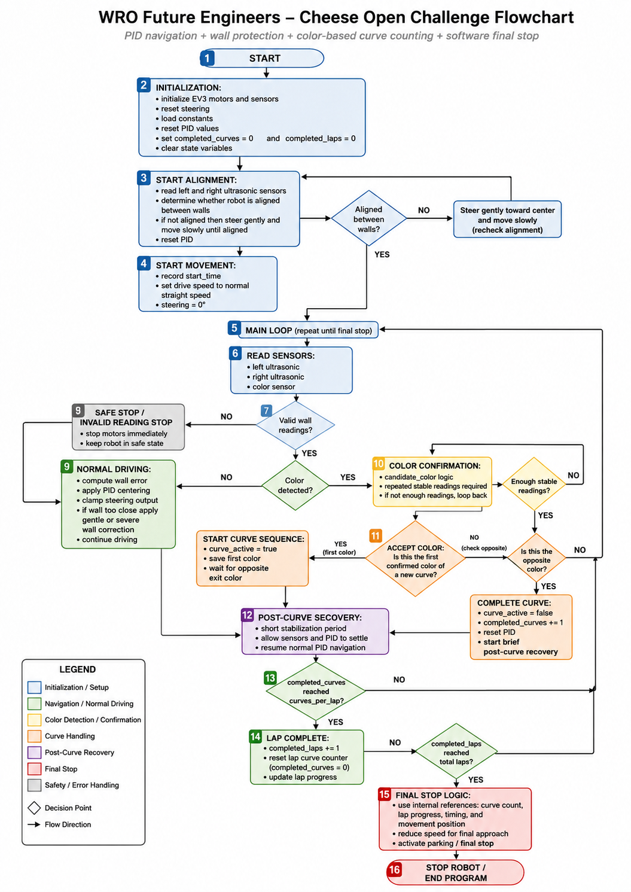

# ᯓ★ 3.3 Open Challenge ᯓ★

---

<p align="center">
  
  
  
</p>

<p align="center">
  <em>This section explains Cheese’s strategy for the WRO Future Engineers Open Challenge. In this round, the robot must complete the track without obstacles by using wall-following, curve detection, lap counting, and final stopping logic.</em>
</p>

---

## ❀ Open Challenge Objective ────୨ৎ────────୨ৎ────

The Open Challenge focuses on stable autonomous navigation. Cheese must drive around the track, complete the required laps, avoid touching the walls, and stop after finishing the run. Since there are no red or green obstacles in this round, the robot does not need to choose an obstacle avoidance path. Instead, the main priority is consistent movement.

For Cheese, the Open Challenge is solved through a combination of **ultrasonic wall sensing**, **PID centering**, **protected wall correction**, **floor color detection**, **curve counting**, and **final stop logic**. These systems work together so the robot can understand where it is in the track and when it should finish.

The goal is not only to make the robot move forward. The robot must move forward in a controlled way, stay between the walls, detect curves at the correct moments, avoid counting false color readings, and stop only after completing the required number of curves and laps.

---

## ❀ Open Challenge Flowchart ────୨ৎ────────୨ৎ────

<p align="center">
  
</p>

<p align="center">
  <em>This flowchart represents Cheese’s Open Challenge logic. It shows how the robot starts from initialization, performs alignment, reads ultrasonic and color sensor data, uses PID centering for normal driving, activates protected wall correction when needed, confirms floor colors, counts curves and laps, and finally enters the software-based final stop sequence after completing the required run.</em>
</p>

The Open Challenge flowchart helps explain how Cheese separates **movement control** from **progress tracking**. The ultrasonic sensors are responsible for helping the robot stay between the walls through PID and wall protection, while the color sensor is responsible for detecting floor color events used to count curves. This separation makes the logic easier to tune because navigation and curve counting are not treated as the same task.

The diagram also shows why the robot uses a priority-based structure. Normal PID driving is used during stable movement, but wall protection can override it when Cheese gets too close to a wall. Color confirmation prevents false curve counts by requiring stable readings before accepting a color. After the required curves and laps are completed, the robot switches from navigation mode into final stop mode.

---

## ❀ Open Challenge System Architecture ────୨ৎ────────୨ৎ────

Cheese uses different sensors and motors for different parts of the Open Challenge. Each component has a specific role so the robot does not depend on one sensor for every task.

<div align="center">

| Subsystem | Component Used | Role in the Open Challenge |
| :--- | :--- | :--- |
| **Propulsion** | EV3 Large Motor | Moves the robot forward through the rear drive system. |
| **Steering** | EV3 Medium Motor | Controls the Ackermann steering mechanism. |
| **Wall sensing** | Left and right ultrasonic sensors | Measure side distances for PID centering and wall protection. |
| **Floor detection** | Color sensor | Detects floor colors used to track curve events. |
| **Progress tracking** | Curve and lap counters | Determines how far Cheese has progressed in the run. |
| **Final stop** | Software-based timing/position logic | Stops Cheese after the required laps are completed. |

</div>

This architecture separates navigation into two main responsibilities. The ultrasonic sensors control **how Cheese moves between the walls**, while the color sensor helps determine **where Cheese is in the lap sequence**. This separation makes the system easier to tune because wall-following and curve-counting are not treated as the same problem.

---

## ❀ 1. Starting Procedure ────୨ৎ────────୨ৎ────

Before Cheese begins moving, the robot must start from a clean and controlled state. The program initializes the motors, sensors, counters, PID values, and display. This is important because any old value from a previous test could affect the new run.

The steering motor is reset so the robot has a known steering reference. The curve counter and lap counter also begin at zero, which prevents Cheese from activating final stop logic before the run actually starts.

```text
completed_curves = 0
completed_laps = 0
reset_pid()
set steering center
wait for start button
```

Cheese waits for a start button press before moving. This allows the driver to place the robot correctly on the mat and confirm that the robot is ready. Once the button is pressed, the robot begins driving with the normal Open Challenge speed.

---

## ❀ 2. Normal Driving Strategy ────୨ৎ────────୨ৎ────

During normal Open Challenge movement, Cheese uses the left and right ultrasonic sensors to estimate its position between the walls. The goal is to stay centered enough that the robot can continue smoothly without touching either side.

The robot compares the wall distances and calculates an error. If the robot is too close to one wall, the error changes and the steering motor corrects the angle. This allows Cheese to make small adjustments continuously instead of waiting until it is already in danger.

```text
error = right_distance - left_distance
correction = KP × error + KI × integral + KD × derivative
steering_angle = limited correction value
```

The steering correction is limited because too much steering can make the robot unstable. A very aggressive correction may push Cheese toward the opposite wall, creating oscillation. For this reason, the PID output is clamped to a safe maximum steering angle.

Normal PID driving is used only when no more urgent behavior is needed. If the robot gets too close to a wall, wall protection takes priority.

---

## ❀ 3. Protected Wall Correction ────୨ৎ────────୨ৎ────

Wall protection is used when Cheese gets closer to a wall than expected. This logic is stronger than normal PID because it is meant to prevent collisions, not simply keep the robot centered.

Cheese uses two wall correction levels:

<div align="center">

| Correction Level | When It Activates | Robot Response |
| :--- | :--- | :--- |
| **Gentle wall correction** | Robot is close to a wall but not in immediate danger. | Reduces speed and steers away from the closer wall. |
| **Severe wall correction** | Robot is very close to a wall. | Reduces speed more strongly and uses a larger steering angle. |

</div>

This system is important because the robot may not always approach the wall slowly. If Cheese exits a curve at a poor angle or drifts during a straight section, normal PID may not be strong enough to recover in time. Wall protection gives the robot a stronger emergency correction.

When wall protection activates, the PID values are reset. This prevents the robot from carrying a large previous PID error into the next movement state.

---

## ❀ 4. Color-Based Curve Tracking ────୨ৎ────────୨ৎ────

The Open Challenge track includes floor color markers that Cheese uses to track curves. The color sensor is not used as a general steering sensor. Its main job is to detect the floor colors that indicate curve progress.

Cheese uses a **blue/orange pairing system**. One stable color starts a curve sequence, and the opposite stable color completes the curve. This prevents the robot from counting a single color as a full curve.

```text
first stable color → start curve sequence
opposite stable color → complete curve
completed_curves += 1
```

This is important because the robot needs a reliable way to know when it has completed corners. Counting only one color could create false counts, especially if the sensor sees the same color more than once because of flicker, lighting, or slow movement. Using a pair makes the curve count more intentional.

---

## ❀ 5. Color Confirmation System ────୨ৎ────────୨ৎ────

Cheese does not accept every color reading immediately. The color sensor can sometimes read brief false values because of shadows, reflections, sensor height, or lighting changes. If the robot reacted to every single reading, it could count curves too early or too many times.

To reduce this risk, the program uses a confirmation system. A detected color becomes a candidate color first. The robot only accepts that color if it appears enough times in a row.

```text
candidate_color = detected color
candidate_count += 1

if candidate_count >= required readings:
    accept color
```

The logic also waits for the color to be released before accepting another event. This prevents the same floor marker from being counted repeatedly while the sensor is still passing over it.

This confirmation process makes the curve counter more reliable because it filters out quick sensor noise and duplicate readings.

---

## ❀ 6. Curve Counting and Lap Tracking ────୨ৎ────────୨ৎ────

Each time Cheese confirms a complete blue/orange pair, it counts one completed curve. The robot uses this count to understand its progress through the Open Challenge.

In the Open Challenge, Cheese must complete multiple curves per lap and three laps total. The curve counter acts as the progress reference for the run.

```text
completed_curves += 1

if completed_curves reaches required total:
    activate final stop logic
```

The curve count is important because time alone is not reliable enough. If Cheese drives slightly faster or slower during a run, a fixed timer may stop the robot in the wrong place. Counting curves gives the robot a better reference for where it is on the track.

The lap counter can be calculated from the curve count. For example, if one lap contains four completed curves, then every four curves represent one completed lap.

```text
completed_laps = completed_curves // curves_per_lap
```

This lets Cheese track whether it is still on lap one, lap two, or lap three.

---

## ❀ 7. Software-Based Final Stop Logic ────୨ৎ────────୨ৎ────

After Cheese reaches the required number of completed curves, the robot activates final stop logic. This version of the Open Challenge strategy does **not** depend on a rear ultrasonic sensor. Instead, it uses internal run information such as completed curves, lap count, timing references, and motor movement references.

The final stop should not happen randomly. It should happen only after Cheese has completed the required number of curve events. This prevents the robot from stopping during an early lap or before finishing the track.

```text
if completed_curves >= TOTAL_CURVES:
    activate_final_stop()
```

A software-based final stop can use one or more references depending on the code version:

<div align="center">

| Reference | Purpose |
| :--- | :--- |
| **Completed curve count** | Confirms that the robot has finished the required path. |
| **Completed lap count** | Confirms that the robot has completed the full run. |
| **Start-to-first-curve timing** | Helps estimate the starting row or starting offset. |
| **Motor position / travel distance** | Helps estimate how far Cheese has moved. |
| **Final slow speed** | Improves stopping accuracy after the last curve. |

</div>

The most important part is that parking begins only after the curve/lap condition is met. Before that moment, the robot stays in normal navigation mode.

---

## ❀ 8. Parking Without Rear Ultrasonic Sensor ────୨ৎ────────୨ৎ────

In this Open Challenge strategy, parking is handled without a rear ultrasonic sensor. This means Cheese does not measure the rear wall at the beginning or try to match that distance at the end.

Instead, the final stop depends on software references collected during the run. The robot uses the number of completed curves and the timing or movement references recorded earlier to estimate when it should slow down and stop.

This approach is simpler mechanically because it does not require an additional sensor, cable, or mounting structure. It also reduces the risk of the rear sensor causing false stops during the run. However, the tradeoff is that the software references must be tuned carefully. If the curve count is wrong or the stop timing is not calibrated, Cheese may stop too early or too late.

<div align="center">

| Advantage | Tradeoff |
| :--- | :--- |
| Fewer sensors and less wiring. | Final stop depends more on timing and curve-count reliability. |
| Lower mechanical complexity. | Needs careful testing for different starting positions. |
| Less risk of a rear sensor triggering incorrectly. | Parking accuracy can change if speed or curve detection changes. |

</div>

Because of this, the final stop must be tested separately after the robot can already complete the laps. Parking should be treated as its own tuning stage, not as a detail added at the end.

---

## ❀ 9. Behavior Priorities During the Open Challenge ────୨ৎ────────୨ৎ────

Cheese’s Open Challenge logic is organized by priority. This prevents different behaviors from fighting each other.

<div align="center">

| Priority | Behavior | Why It Has This Priority |
| :---: | :--- | :--- |
| **1** | Manual stop / safety stop | The robot must be able to stop immediately if needed. |
| **2** | Final stop logic | After the required curves, finishing becomes the main goal. |
| **3** | Color confirmation and curve counting | Progress tracking must stay accurate. |
| **4** | Severe wall protection | Prevents immediate wall collisions. |
| **5** | Gentle wall protection | Corrects the robot before the situation becomes dangerous. |
| **6** | PID centering | Handles normal movement when no higher-priority behavior is active. |

</div>

This priority system is necessary because Cheese may detect multiple conditions at once. For example, the robot could be close to a wall while also detecting a floor color. The program must decide which action matters most at that moment.

---

## ❀ 10. Testing Plan for the Open Challenge ────୨ৎ────────୨ৎ────

The Open Challenge strategy should be tested in stages. Testing everything at once makes debugging harder because it becomes unclear whether a failure comes from steering, wall sensing, color detection, or final stop logic.

<div align="center">

| Test Stage | What to Test | Success Condition |
| :---: | :--- | :--- |
| **1** | Straight movement | Cheese drives forward without strong drifting. |
| **2** | PID centering | Robot corrects itself between the walls smoothly. |
| **3** | Gentle wall correction | Robot moves away from the wall without oversteering. |
| **4** | Severe wall correction | Robot avoids collision when very close to a wall. |
| **5** | Color detection | Blue/orange floor colors are detected consistently. |
| **6** | Curve pairing | One full blue/orange pair counts as one curve. |
| **7** | Lap counting | Four curves are counted as one lap. |
| **8** | Full three-lap run | Robot completes the required curve count. |
| **9** | Final stop | Robot stops after the required curves. |
| **10** | Repeatability | Robot performs similarly across multiple runs. |

</div>

If a test fails, only the related subsystem should be changed first. For example, if Cheese misses a color, the color sensor height and lighting should be checked before changing PID values. If Cheese crashes near walls, ultrasonic readings and steering alignment should be checked before changing the curve counter.

---

## ❀ Open Challenge Risks and Responses ────୨ৎ────────୨ৎ────

The Open Challenge may look simpler than the Obstacle Challenge because there are no pillars, but it still has several risks. Most failures come from timing, sensor reliability, steering delay, or incorrect curve counting.

<div align="center">

| Risk | Possible Effect | Response |
| :--- | :--- | :--- |
| **Ultrasonic readings are unstable** | PID correction becomes inaccurate. | Check sensor angle, cable clearance, and wall distance thresholds. |
| **PID is too aggressive** | Robot oscillates between walls. | Reduce steering output or tune PID values. |
| **PID is too weak** | Robot drifts slowly into a wall. | Increase correction strength carefully. |
| **Color sensor misses a marker** | Curve count becomes wrong. | Adjust sensor height, lighting, and confirmation values. |
| **Color sensor double-counts** | Robot thinks it completed more curves than it did. | Use color release and pairing logic. |
| **Curves are too wide** | Time loss and poor exit angle. | Tune steering behavior and post-curve recovery. |
| **Final stop happens early** | Robot stops before completing the run. | Check curve count and final stop trigger. |
| **Final stop happens late** | Robot passes the intended finish area. | Reduce final speed or adjust final timing reference. |

</div>

This risk analysis is important because it shows that each issue has a specific cause. Cheese is easier to improve when failures are connected to the correct subsystem.

---

## ❀ Open Challenge Summary ────୨ৎ────────୨ৎ────

The Open Challenge strategy for Cheese is based on controlled movement and reliable progress tracking. The robot uses ultrasonic sensors to stay between the walls, PID to make smooth steering corrections, wall protection to avoid collisions, and the color sensor to count curves through confirmed blue/orange pairs.

After enough curves are counted, the robot activates final stop logic. This version does not depend on a rear ultrasonic sensor. Instead, the robot uses software-based references such as curve count, lap progress, timing, and movement distance to decide when to stop.

<p align="center">
  <strong>Final interpretation:</strong><br>
  Cheese’s Open Challenge strategy separates movement control from progress tracking: ultrasonic sensors guide the robot between the walls, while the color sensor tracks curve completion so the robot knows when to finish.
</p>
