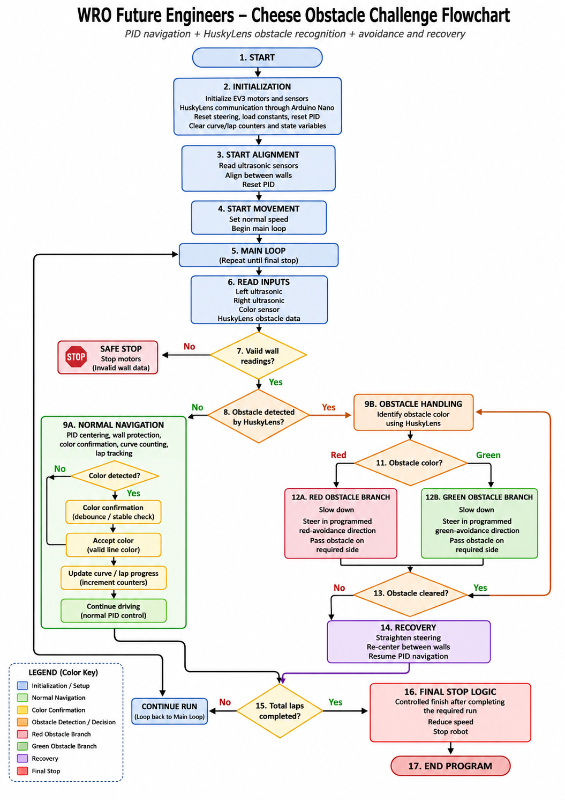

# ᯓ★ 3.4 Obstacle Challenge ᯓ★

<p align="center">
  
  
  
</p>

<p align="center">
  <em>This section explains Cheese’s obstacle challenge strategy. The obstacle round adds red and green pillars to the track, so the robot must combine its normal navigation system with camera-based obstacle recognition and controlled avoidance behavior.</em>
</p>

---

## ❀ Obstacle Challenge Objective ────୨ৎ────────୨ৎ────

The Obstacle Challenge is more complex than the Open Challenge because Cheese must still complete the track while also reacting to colored obstacles. In this round, the robot cannot only follow the walls and count curves. It must also identify red and green pillars, decide which side to pass from, and return to stable navigation after avoiding them.

For Cheese, the obstacle strategy is built on top of the Open Challenge logic. The robot still needs **PID wall centering**, **protected wall correction**, **curve detection**, and **lap tracking**, but it also adds a vision system using the **HuskyLens AI Camera** and **Arduino Nano**.

The main goal is not only to detect an obstacle. The robot must detect it early enough, classify its color correctly, move around it without crashing, and recover its position before the next wall, curve, or obstacle.

---

## ❀ Obstacle Challenge Flowchart ────୨ৎ────────୨ৎ────

<p align="center">
  
</p>

<p align="center">
  <em>This flowchart represents Cheese’s Obstacle Challenge logic. It shows how the robot combines normal PID wall-following with HuskyLens-based obstacle recognition, Arduino Nano communication, red and green obstacle decisions, controlled avoidance movement, recovery after passing an obstacle, lap tracking, and final stop behavior.</em>
</p>

The Obstacle Challenge flowchart shows how Cheese adds a vision-based decision layer on top of its normal navigation system. The robot still uses ultrasonic sensors, PID centering, wall protection, color detection, and lap tracking, but it also checks HuskyLens data to determine whether a red or green obstacle is present.

This diagram is useful because obstacle handling cannot be treated as normal wall correction. When an obstacle is confirmed, Cheese must temporarily prioritize avoidance behavior, choose a direction based on the obstacle color, reduce or control speed, pass the pillar safely, and then recover before returning to normal PID navigation. This makes the obstacle logic a separate behavior layer rather than just another small steering correction.

---

## ❀ Obstacle Challenge Architecture ────୨ৎ────────୨ৎ────

Cheese’s obstacle system is divided into three main layers: navigation, vision, and reaction. Each layer has a different responsibility.

<div align="center">

| Layer | Components Used | Main Role |
| :--- | :--- | :--- |
| **Navigation layer** | EV3, Large Motor, Medium Motor, ultrasonic sensors, color sensor | Keeps the robot moving, centered, and aware of curves. |
| **Vision layer** | HuskyLens camera and Arduino Nano | Detects red and green obstacles and sends useful data to the robot. |
| **Reaction layer** | Steering motor, drive motor, and software logic | Changes the robot’s path based on the detected obstacle color. |

</div>

This architecture separates the robot’s tasks. The ultrasonic sensors continue helping Cheese stay between the walls, while the HuskyLens focuses on obstacle recognition. This prevents the robot from depending on one sensor for every type of decision.

---

## ❀ Visual Reference: Camera Placement ────୨ৎ────────୨ৎ────

<p align="center">
  
</p>

<p align="center">
  <em>Camera placement showing the HuskyLens position used for obstacle recognition.</em>
</p>

The HuskyLens is mounted in the upper front section of Cheese so it can see the obstacle area before the robot reaches it. This placement is important because obstacle reaction depends on timing. If the camera detects the pillar too late, the robot may not have enough distance to steer around it safely.

The camera must stay stable during movement. If the mount shakes, the detection area changes and the robot may receive inconsistent information. This is why the upper support tower needs to be rigid and why cable management around the camera is important.

---

## ❀ 1. Normal Navigation Still Runs First ────୨ৎ────────୨ৎ────

Even in the Obstacle Challenge, Cheese still needs to drive around the track normally. The robot cannot focus only on obstacles because it must also stay between the walls, handle curves, and complete the required laps.

The base navigation logic includes:

```text
read ultrasonic sensors
calculate wall error
apply PID correction
activate wall protection if too close
read color sensor
update curve and lap progress
```

This means the obstacle logic is added as another behavior layer, not as a replacement for the whole navigation system. If no obstacle is detected, Cheese continues using the same movement principles from the Open Challenge.

This is important because the robot must remain stable between obstacle events. A good obstacle system is not useful if the robot cannot drive smoothly before and after seeing the pillar.

---

## ❀ 2. HuskyLens Detection Role ────୨ৎ────────୨ৎ────

The HuskyLens AI Camera is used to identify colored obstacles. Its job is to detect whether the object in front of the robot is red or green. This information is then used by the robot to choose the correct avoidance direction.

The HuskyLens does not drive the robot by itself. It provides vision data, while the EV3-based system controls the motors and steering. This separation is important because the EV3 remains responsible for movement stability.

<div align="center">

| Vision Information | Why It Matters |
| :--- | :--- |
| **Obstacle detected** | Confirms that the robot should prepare for avoidance. |
| **Obstacle color** | Determines which avoidance direction should be used. |
| **Obstacle position in camera view** | Helps estimate whether the object is centered, left, or right. |
| **Obstacle size / visibility** | Can help estimate how close or clear the object appears. |

</div>

The obstacle logic depends on reliable detection. If the camera misreads the color, detects the object too late, or loses the object while approaching it, Cheese may choose the wrong path or fail to avoid the obstacle cleanly.

---

## ❀ 3. Arduino Nano as Vision Bridge ────୨ৎ────────୨ৎ────

The Arduino Nano supports the obstacle system by acting as a bridge between the HuskyLens and the EV3 architecture. The EV3 is very effective for controlling LEGO motors and LEGO sensors, but the HuskyLens requires a communication setup that is easier to manage through Arduino.

<p align="center">
  
</p>

<p align="center">
  <em>HuskyLens to Arduino Nano wiring diagram used to support the camera communication system.</em>
</p>

The Arduino Nano allows the vision system to stay separate from the main EV3 control system. This means the EV3 can continue focusing on steering, drive speed, ultrasonic readings, and color sensor logic, while the Arduino helps manage the camera data.

This design choice reduces the risk of overloading the main navigation logic with camera communication details. It also makes the system easier to debug because vision communication and EV3 movement can be tested separately.

---

## ❀ 4. Obstacle Color Meaning ────୨ৎ────────୨ৎ────

In the obstacle round, Cheese uses the color of the pillar to decide how it should avoid it. The robot follows a programmed convention for red and green obstacles.

<div align="center">

| Obstacle Color | Planned Reaction | Reason |
| :--- | :--- | :--- |
| **Red obstacle** | Steer to pass on the required side of the red pillar. | Red tells the robot to choose one avoidance direction. |
| **Green obstacle** | Steer to pass on the required side of the green pillar. | Green tells the robot to choose the opposite avoidance direction. |

</div>

This color-based decision must be consistent with the final competition rules and the team’s programmed direction convention. The most important requirement is that red and green cannot trigger the same movement. They must produce opposite avoidance responses.

Because the robot moves quickly, the avoidance behavior cannot wait until the obstacle is extremely close. Cheese needs enough reaction distance for the steering motor to reach the required angle and for the chassis to physically move around the pillar.

---

## ❀ 5. Lighting Support for Obstacle Recognition ────୨ৎ────────୨ৎ────

Lighting became a major part of the obstacle strategy because the HuskyLens depends on what it can physically see. During testing, poor lighting made the colors appear distorted. Green could look almost black, and red could look brownish or chocolate-colored. This made obstacle recognition less reliable.

To improve this, Cheese uses an upper helping lamp directed toward the obstacle area. This light supports the HuskyLens by making the pillar colors clearer and closer to their real appearance.

<p align="center">
  
</p>

<p align="center">
  <em>Dual-light support system. The upper lamp supports HuskyLens obstacle visibility, while the lower lamp supports floor color detection.</em>
</p>

The lighting system is not only an extra accessory. It is part of the sensing architecture. If the camera sees distorted colors, the software may receive incorrect information even if the code is written correctly.

---

## ❀ 6. Obstacle Detection Process ────୨ৎ────────୨ৎ────

The obstacle detection process should happen continuously while the robot is driving. The camera checks whether a trained red or green object is visible. If no valid obstacle is detected, the robot continues with normal navigation.

A simplified obstacle detection process is:

```text
read HuskyLens data
if no obstacle is detected:
    continue normal navigation
else:
    identify obstacle color
    choose avoidance direction
    activate obstacle response
```

This process must include filtering or confirmation so the robot does not react to a false detection. A single unstable camera reading should not immediately control the robot. Similar to the color sensor logic, the obstacle system should prefer stable detection before making a movement decision.

---

## ❀ 7. Obstacle Avoidance Behavior ────୨ৎ────────୨ৎ────

Once an obstacle is confirmed, Cheese needs to temporarily adjust its steering behavior. During this moment, obstacle avoidance should have higher priority than normal PID centering because the robot must move around the pillar.

The avoidance behavior can be divided into three phases:

<div align="center">

| Phase | Purpose |
| :--- | :--- |
| **Approach phase** | Detect the obstacle early and prepare the steering direction. |
| **Avoidance phase** | Steer around the obstacle while maintaining controlled speed. |
| **Recovery phase** | Return to stable wall-following after passing the obstacle. |

</div>

The recovery phase is very important. If Cheese avoids the obstacle but exits at a poor angle, it may crash into a wall afterward. This means the robot must not only dodge the pillar; it must return to a stable path after the dodge.

---

## ❀ 8. Speed Control During Obstacles ────୨ৎ────────୨ৎ────

Obstacle avoidance requires controlled speed. If Cheese approaches an obstacle too fast, the steering motor may not have enough time to turn the wheels and move around the pillar. If it moves too slowly, the robot may lose too much time.

Because of this, the obstacle strategy should use a speed that gives the robot enough reaction time. The robot can drive faster during clear straight sections, but it should reduce speed when obstacle detection becomes active.

<div align="center">

| Situation | Speed Behavior | Reason |
| :--- | :--- | :--- |
| **No obstacle detected** | Normal navigation speed | Maintains efficient movement. |
| **Obstacle detected ahead** | Controlled approach speed | Gives the robot time to react. |
| **Avoiding obstacle** | Reduced or stable avoidance speed | Prevents overshooting the steering path. |
| **After obstacle** | Recovery speed before full speed | Helps the robot return to stable wall-following. |

</div>

This connects the obstacle challenge to the drivetrain and steering reasoning. The robot may be mechanically capable of moving faster, but speed must be limited when the steering system needs time to react.

---

## ❀ 9. Behavior Priority in the Obstacle Challenge ────୨ৎ────────୨ৎ────

The obstacle challenge requires clear behavior priorities. Without priorities, the robot could receive conflicting instructions. For example, PID could try to center the robot while obstacle avoidance tries to steer around a pillar.

<div align="center">

| Priority | Behavior | Reason |
| :---: | :--- | :--- |
| **1** | Manual stop / safety stop | The robot must always be able to stop safely. |
| **2** | Final stop logic | After the required laps, finishing becomes the main goal. |
| **3** | Confirmed obstacle avoidance | A pillar requires immediate path adjustment. |
| **4** | Severe wall protection | Prevents collisions with the wall. |
| **5** | Curve handling / curve tracking | Keeps progress through the track accurate. |
| **6** | Gentle wall protection | Corrects the robot before it becomes dangerous. |
| **7** | PID centering | Controls normal movement when no higher-priority behavior is active. |

</div>

This priority structure helps the robot choose one main behavior at a time. Obstacle avoidance should not be treated as just another small correction. It is a special situation that temporarily changes the path of the robot.

---

## ❀ 10. Main Risks in the Obstacle Challenge ────୨ৎ────────୨ৎ────

The obstacle challenge adds several risks that are not present in the open round. Most of these risks are connected to camera reliability, timing, lighting, and recovery after avoidance.

<div align="center">

| Risk | Possible Effect | Response |
| :--- | :--- | :--- |
| **Camera detects too late** | Robot has little time to avoid the pillar. | Adjust camera angle and approach speed. |
| **Camera misreads color** | Robot chooses the wrong avoidance direction. | Improve lighting and retrain HuskyLens if needed. |
| **Obstacle is lost during approach** | Robot may stop reacting or react inconsistently. | Use confirmation and short memory of last valid detection. |
| **Avoidance steering is too weak** | Robot may hit the obstacle. | Increase avoidance angle carefully and retest. |
| **Avoidance steering is too strong** | Robot may hit the wall after avoiding. | Add recovery logic and limit steering duration. |
| **Robot returns to PID too early** | PID may pull robot back toward the obstacle path. | Use a controlled recovery phase. |
| **Lighting shifts during run** | Detection becomes inconsistent. | Secure upper lamp and battery. |

</div>

This risk analysis is important because it shows that obstacle failures are not always caused by one thing. A missed obstacle can come from camera angle, lighting, speed, training, wiring, or recovery behavior.

---

## ❀ 11. Testing Plan for Obstacle Challenge ────୨ৎ────────୨ৎ────

The obstacle system should be tested in stages. Testing the full obstacle round immediately makes debugging harder because many systems are active at the same time.

<div align="center">

| Test Stage | What to Test | Success Condition |
| :---: | :--- | :--- |
| **1** | HuskyLens red detection | Red obstacle is detected consistently under the upper lamp. |
| **2** | HuskyLens green detection | Green obstacle is detected consistently under the upper lamp. |
| **3** | Camera distance / angle | Obstacle appears early enough for reaction. |
| **4** | Arduino communication | Vision data reaches the robot system consistently. |
| **5** | Single obstacle avoidance | Robot moves around one obstacle without hitting it. |
| **6** | Avoidance recovery | Robot returns to stable wall-following after passing the obstacle. |
| **7** | Obstacle + curve interaction | Robot does not confuse obstacle response with curve behavior. |
| **8** | Multiple obstacle run | Robot handles more than one obstacle in a run. |
| **9** | Full obstacle round | Robot completes navigation with obstacle decisions. |
| **10** | Repeatability test | Robot performs similarly across multiple runs. |

</div>

The first tests should be done slowly. Once the robot detects colors reliably and avoids a single obstacle safely, speed can be increased carefully. If detection fails, the camera angle, lighting, and HuskyLens training should be checked before changing steering behavior.

---

## ❀ 12. Development Status ────୨ৎ────────୨ৎ────

The obstacle challenge is treated as a developing system because it depends on more variables than the open round. The open round mainly depends on wall distance, color floor detection, and curve counting. The obstacle round adds camera recognition, lighting conditions, communication through Arduino Nano, obstacle timing, and avoidance recovery.

For this reason, the obstacle system must be tested separately from normal navigation. A robot can complete the open round and still fail the obstacle challenge if the camera detects too late, if colors appear distorted, or if the avoidance movement is not recovered correctly.

At this stage, the goal of the obstacle strategy is to create a stable foundation: clear detection, correct color classification, controlled avoidance, and safe recovery. Once those parts are reliable, the team can tune speed and timing for better performance.

---

## ❀ Obstacle Challenge Summary ────୨ৎ────────୨ৎ────

The obstacle challenge strategy adds vision-based decision-making to Cheese’s normal navigation system. The robot still uses ultrasonic sensors for wall following, PID for centering, wall protection for safety, and color detection for curve progress. The HuskyLens and Arduino Nano add an extra layer that allows Cheese to recognize red and green obstacles.

The most important engineering idea is that obstacle avoidance must be treated as a temporary priority behavior. When an obstacle is confirmed, the robot must control its speed, steer around the pillar, and then recover before returning to normal PID driving.

<p align="center">
  <strong>Final interpretation:</strong><br>
  Cheese’s obstacle strategy combines normal wall-following navigation with camera-supported obstacle recognition, using lighting and controlled steering behavior to make red and green pillar avoidance more reliable.
</p>

<p align="center">
  ✦ ─── ⋆⋅☆⋅⋆ ─── (❁´◡`❁) ─── ⋆⋅☆⋅⋆ ─── ✦
</p>

<p align="center">
  <a href="https://github.com/Quesovamos2662/WRO2026_FE_Go-Cheese#general-project-index">
    
  </a>
</p>
