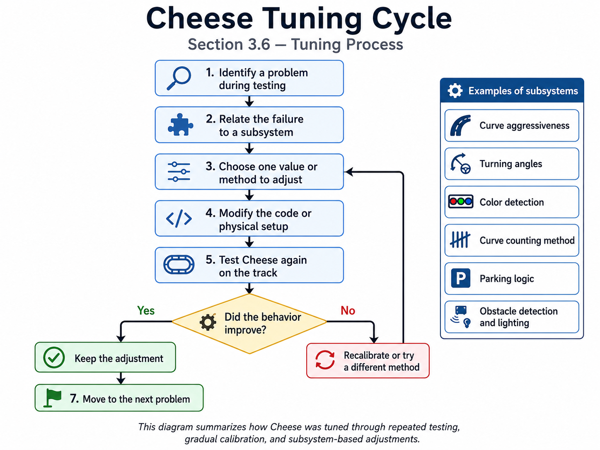

# ᯓ★ 3.6 Tuning Process ᯓ★

<p align="center">
  
  
  
</p>

<p align="center">
  <em>This section explains how Cheese’s movement, curve behavior, color detection, parking logic, and obstacle recognition were tuned through repeated testing. The values were adjusted gradually based on how the robot behaved on the real track.</em>
</p>

---

## ❀ Tuning Purpose ────୨ৎ────────୨ৎ────

The purpose of tuning was to make Cheese more stable, predictable, and consistent during competition-style runs. Even when the main algorithm was already planned, the robot still needed many adjustments because real movement depends on speed, steering angle, sensor readings, lighting, wheel traction, and mechanical response.

Most of the tuning process was based on repeated tests. We adjusted one value or method, observed how Cheese reacted, identified the new problem, and then adjusted again. This was especially important for curves because the robot’s turning behavior changed depending on how aggressive the steering was, how early the color sensor detected the floor marker, and how quickly the robot entered the curve.

The main goal was not simply to make Cheese faster. The goal was to balance **speed, curve aggressiveness, wall safety, color detection reliability, parking accuracy, and obstacle detection under irregular lighting**.

---

## ❀ Tuning Cycle Diagram ────୨ৎ────────୨ৎ────

<p align="center">
  
</p>

<p align="center">
  <em>This diagram summarizes Cheese’s tuning cycle. During testing, we identified a problem, connected it to the subsystem most likely responsible, adjusted one value or method, tested the robot again, and kept or changed the adjustment depending on the result. This cycle was repeated for curve aggressiveness, turning angles, color detection, curve-counting methods, parking logic, and obstacle detection under irregular lighting.</em>
</p>

The diagram shows that tuning was not a one-step process. Cheese improved through repeated testing, small changes, and comparison between the expected behavior and the real behavior. This helped us avoid changing random values without understanding the cause of each failure.

---

## ❀ What We Were Trying to Improve ────୨ৎ────────୨ৎ────

During testing, we focused on the problems that affected Cheese the most. These problems were connected to movement, sensing, software logic, and environmental conditions.

<div align="center">

| Problem Area | What Was Happening | What We Tried to Improve |
| :--- | :--- | :--- |
| **Curve aggressiveness** | Some curves were too wide, while others made the robot turn too sharply. | Adjust steering angle, curve timing, and recovery behavior. |
| **Turning angles** | The robot sometimes entered curves at a bad angle or exited too close to a wall. | Tune steering response and post-curve stabilization. |
| **Color detection** | The color sensor could miss or confuse floor colors depending on lighting and speed. | Test different detection methods and confirmation values. |
| **Curve-counting method** | Some methods counted too early, counted too late, or missed curves completely. | Use a more reliable confirmed blue/orange pairing system. |
| **Parking accuracy** | Parking became descalibrated when the robot miscounted curves or stopped with bad timing. | Connect final stop logic more carefully to curve/lap progress. |
| **Obstacle detection** | The camera struggled when lighting was irregular. | Improve lighting, test camera position, and recalibrate recognition. |

</div>

This shows that tuning was not only about changing numbers in the code. It was a process of connecting each failure to the subsystem that caused it.

---

## ❀ Curve Aggressiveness Tuning ────୨ৎ────────୨ৎ────

One of the most important tuning areas was curve aggressiveness. During testing, Cheese sometimes took curves too widely, which caused time loss and made the robot exit the curve in an unstable position. In other tests, the steering was too aggressive, causing the robot to turn too sharply or approach the inner wall.

Because of this, curve tuning was done gradually. We adjusted curve-related values little by little and tested how the robot reacted in different parts of the track. The goal was to make the robot turn strongly enough to complete the curve, but not so strongly that it lost stability after the turn.

<div align="center">

| Curve Behavior Observed | Tuning Direction |
| :--- | :--- |
| **Curve too wide** | Increase steering response or make the curve reaction start earlier. |
| **Curve too sharp** | Reduce steering angle or shorten the aggressive steering period. |
| **Robot hits inner wall** | Reduce curve aggressiveness or improve wall protection during/after the curve. |
| **Robot hits outer wall after curve** | Improve curve exit angle and post-curve recovery. |
| **Robot reacts too late** | Improve color detection timing or curve trigger logic. |

</div>

This tuning showed us that curves are not only a steering problem. They depend on the interaction between steering angle, speed, color detection, and recovery after the curve.

---

## ❀ Turning Angle Tuning ────୨ৎ────────୨ৎ────

Turning angle tuning focused on how much the steering motor should turn during normal corrections, wall protection, and curve-related movement. If the steering angle was too low, Cheese reacted too slowly and could drift into a wall. If the steering angle was too high, the robot could overcorrect and create a zig-zag movement.

This was especially important after curves. Cheese could complete a curve but exit at an angle that made the next straight section harder to control. When that happened, the robot needed extra correction immediately after the turn, which increased the risk of hitting a wall.

<div align="center">

| Turning Problem | Effect on Cheese | Adjustment Direction |
| :--- | :--- | :--- |
| **Steering angle too weak** | Robot could not correct before reaching the wall. | Increase correction strength carefully. |
| **Steering angle too strong** | Robot overcorrected and became unstable. | Reduce steering angle or limit correction output. |
| **Late steering response** | Robot entered curves too straight. | Make curve reaction start earlier or reduce speed. |
| **Bad curve exit angle** | Robot needed strong correction after the turn. | Improve post-curve recovery and PID reset behavior. |

</div>

The main lesson was that steering values cannot be tuned only by looking at straight movement. A value that works on a straight section can still fail after a curve because the robot enters the next section at a different angle.

---

## ❀ Color Detection and Curve Method Tuning ────୨ৎ────────୨ৎ────

Another major part of tuning was improving how Cheese detected floor colors. The color sensor was used to recognize curve markers, but raw color readings were not always reliable. Lighting, sensor height, movement speed, and floor reflection could all affect what the sensor detected.

At first, different curve-detection methods were tested. Some methods reacted too quickly and risked counting false colors. Other methods waited too long and caused the robot to miss real markers. Because of this, we moved toward a more controlled method where the robot confirms a stable color before accepting it.

The final idea was based on a color-pair system:

```text
first confirmed color → start curve sequence
opposite confirmed color → complete curve
one completed pair → count one curve
```

This method helped reduce false counting because Cheese did not count a curve from a single color alone. The robot had to detect a valid first color and then detect the opposite color to confirm that the curve sequence was complete.

<div align="center">

| Color Detection Issue | Possible Effect | Tuning Response |
| :--- | :--- | :--- |
| **Color detected too briefly** | False curve start or false curve end. | Require stable confirmation readings. |
| **Same marker detected repeatedly** | Risk of double-counting. | Use release logic before accepting another color. |
| **Orange color misread** | Curve sequence may not complete. | Group similar color readings as orange when needed. |
| **Color missed at high speed** | Curve count becomes lower than expected. | Reduce confirmation strictness and improve lighting. |
| **Lighting changes** | Sensor readings become inconsistent. | Use lower lamp support and test color values again. |

</div>

This tuning was important because curve counting affects the entire run. If Cheese counts the wrong number of curves, the lap progress and final stop logic become inaccurate.

---

## ❀ Wall and Steering Tuning ────୨ৎ────────୨ৎ────

Wall correction was tuned because Cheese needed to stay between the walls without zig-zagging too much. If the correction was too weak, the robot drifted toward the wall. If the correction was too strong, the robot could overcorrect and move toward the opposite wall.

We tested different steering responses to find a balance between smooth correction and fast reaction. The robot needed small corrections during normal driving, but stronger corrections when it got too close to a wall.

<div align="center">

| Situation | Tuning Goal |
| :--- | :--- |
| **Normal driving** | Keep movement smooth and centered. |
| **Approaching wall slowly** | Correct early without overreacting. |
| **Very close to wall** | Apply stronger protection to avoid collision. |
| **After curves** | Stabilize the robot before returning fully to PID. |

</div>

This helped us understand that wall correction is not separate from curve behavior. A curve exit can place the robot close to a wall, so wall protection must be strong enough to help but controlled enough to avoid throwing the robot into the opposite side.

---

## ❀ Parking Tuning ────୨ৎ────────୨ৎ────

Parking was one of the most difficult parts to tune because it depended on the rest of the run. If Cheese miscounted a curve, missed a floor color, or completed a curve at a different angle, the final stop could become descalibrated.

This meant that parking could not be fixed only by changing the final stop command. The curve counter, lap progress, speed, and final approach all had to be reliable first. Once the robot could count curves more consistently, the parking logic became easier to adjust.

<div align="center">

| Parking Problem | Possible Cause | Tuning Response |
| :--- | :--- | :--- |
| **Stops too early** | Curve count triggered final logic too soon. | Check curve counting and final stop timing. |
| **Stops too late** | Final stop reference was delayed. | Adjust final timing or final movement distance. |
| **Stops inconsistently** | Speed or curve count varied between runs. | Tune curve detection before tuning parking. |
| **Does not stop correctly after laps** | Final condition was not connected clearly enough to lap progress. | Make final stop depend on confirmed run progress. |

</div>

The main lesson was that parking is not just the last step of the code. It is connected to the accuracy of the whole run. If curve counting is not stable, parking cannot be stable either.

---

## ❀ Obstacle Detection and Lighting Tuning ────୨ৎ────────୨ৎ────

Obstacle detection required separate tuning because the HuskyLens camera depended heavily on lighting. Under irregular lighting, obstacle colors did not always appear correctly. Green could look too dark, and red could look brownish instead of clearly red.

To improve this, we tested lighting position, camera angle, and obstacle recognition. The goal was to make the camera see the colors closer to how they looked in real life. This was important because if the camera receives bad visual information, the robot can make the wrong obstacle decision even if the code is correct.

<div align="center">

| Lighting / Vision Problem | Effect | Tuning Response |
| :--- | :--- | :--- |
| **Irregular lighting** | Colors appeared distorted. | Add and adjust helping lights. |
| **Camera angle not ideal** | Obstacle detected too late or unclearly. | Adjust HuskyLens position. |
| **Green appeared too dark** | Risk of missed green detection. | Improve upper lighting. |
| **Red appeared brownish** | Risk of wrong color classification. | Recalibrate recognition under better light. |

</div>

This showed us that tuning is not always software-based. Sometimes the most important adjustment is physical, such as changing lighting, sensor angle, sensor height, or sensor position.

---

## ❀ How We Tested Each Change ────୨ৎ────────୨ৎ────

Each tuning change was tested through repeated runs. We did not change every value at once because that would make it difficult to know which adjustment helped or made the robot worse.

Our testing process followed this pattern:

```text
1. Identify the problem during a run.
2. Choose the value or system most related to that problem.
3. Make a small adjustment.
4. Test the robot again.
5. Compare the new behavior with the previous behavior.
6. Keep the change if it improved consistency.
7. Adjust again if the problem remained.
```

This process helped us calibrate gradually instead of guessing. For example, if Cheese was turning too widely, we focused on curve aggressiveness and steering timing. If Cheese missed a color, we focused on sensor height, lighting, and confirmation logic. If parking failed, we checked curve count and final stop timing before changing unrelated code.

---

## ❀ Tuning Evidence Table ────୨ৎ────────୨ৎ────

<div align="center">

| Tuning Area | Problem We Saw | What We Changed | How We Tested It |
| :--- | :--- | :--- | :--- |
| **Curve aggressiveness** | Curves were too wide or too sharp. | Adjusted steering angle, curve behavior, and recovery. | Ran repeated curve tests and checked wall contact. |
| **Turning angles** | Robot entered or exited curves at poor angles. | Tuned steering response and stabilization. | Observed curve exits and next straight-section stability. |
| **Color detection** | Sensor missed or confused colors. | Tested detection methods, lighting, and confirmation values. | Passed robot over markers and checked whether colors were accepted correctly. |
| **Curve method** | Some methods miscounted curves. | Used confirmed blue/orange pairing. | Checked whether one pair counted as one completed curve. |
| **Parking** | Final stop became descalibrated. | Adjusted final stop logic and run references. | Tested after full lap completion. |
| **Obstacle detection** | HuskyLens struggled with irregular lighting. | Adjusted lighting and camera setup. | Tested red/green detection under the lamps. |

</div>

This table summarizes the connection between the problem observed, the adjustment made, and the test used to verify whether the adjustment improved Cheese’s behavior.

---

## ❀ Supporting Evidence References ────୨ৎ────────୨ৎ────

The tuning process was supported by repeated testing, code adjustments, sensor calibration, and visual observations from the robot’s behavior on the track. The evidence below connects the main tuning problems with the adjustments made during development.

<div align="center">

| Evidence | Related File | What It Supports |
| :--- | :--- | :--- |
| **Tuning cycle diagram** | [Tuning Cycle Diagram](../../img/tuning_cycle_diagram.png) | Shows the repeated process used to identify problems, adjust one value or method, test again, and keep or change the adjustment. |
| **Dual-light system** | [Dual-Light System](../../v-photos/v3/dual_light_system_v3.jpeg) | Supports the tuning process for color detection and HuskyLens obstacle recognition under irregular lighting. |
| **Front sensor placement** | [Front Sensor Placement](../../v-photos/v3/sensor_placement_front_v3.jpg) | Shows the color sensor position used for floor color detection and curve-counting calibration. |
| **Camera sensor placement** | [Camera Placement](../../v-photos/v3/sensor_placement_cam_v3.jpg) | Shows the HuskyLens placement used during obstacle detection and lighting calibration. |
| **Final v3 front layout** | [Front Layout](../../v-photos/v3/front_v3.jpg) | Shows the final arrangement of steering, sensing, and lighting after several tuning decisions. |
| **Open Challenge flowchart** | [Open Challenge Flowchart](../../img/open_challenge_flowchart.png) | Shows how PID navigation, wall protection, color confirmation, curve counting, and final stop logic connect. |
| **Corner handling flowchart** | [Corner Handling Flowchart](../../img/corner_handling_flowchart.png) | Shows the specific logic used to confirm colors, count curves, reset curve state, and return to normal driving. |
| **Obstacle Challenge flowchart** | [Obstacle Challenge Flowchart](../../img/obstacle_challenge_flowchart.png) | Shows how obstacle detection, red/green decisions, avoidance, recovery, and normal navigation interact. |

</div>

This evidence shows that the tuning process was not only based on changing numbers in the code. Many adjustments were connected to physical testing, sensor placement, lighting direction, steering behavior, and repeated observations on the track.

---

## ❀ Final Tuning Workflow ────୨ৎ────────୨ৎ────

The final tuning workflow followed this order:

```text
1. Check mechanical alignment.
2. Check cable clearance.
3. Test motors individually.
4. Test ultrasonic readings.
5. Tune PID centering.
6. Tune wall protection.
7. Test color sensor readings.
8. Tune color confirmation.
9. Test curve counting.
10. Test full lap behavior.
11. Tune final stop.
12. Test obstacle detection under lighting.
13. Repeat full-run testing.
```

This order was important because software tuning should not hide mechanical problems. If the steering linkage is blocked, the color sensor is too high, or the lighting is inconsistent, changing code values will not fully solve the problem.

---

## ❀ Final Tuning Summary ────୨ৎ────────୨ৎ────

The tuning process for Cheese was based on testing and gradual calibration. We adjusted values depending on how aggressive the curves were, how well the robot detected colors, how stable the parking logic was, and how reliably the HuskyLens detected obstacles under different lighting conditions.

We tested different code versions, different detection methods, and different calibration values until the robot moved closer to the behavior we wanted. Each change was made to solve a specific problem instead of changing values randomly.

<p align="center">
  ✦ ─── ⋆⋅☆⋅⋆ ─── (❁´◡`❁) ─── ⋆⋅☆⋅⋆ ─── ✦
</p>

<p align="center">
  <a href="https://github.com/Quesovamos2662/WRO2026_FE_Go-Cheese#general-project-index">
    
  </a>
</p>

<p align="center">
  <strong>Final interpretation:</strong><br>
  Cheese’s tuning process shows that reliable performance comes from repeated testing, small adjustments, and understanding how speed, steering, sensors, lighting, curve logic, and parking affect each other.
</p>
