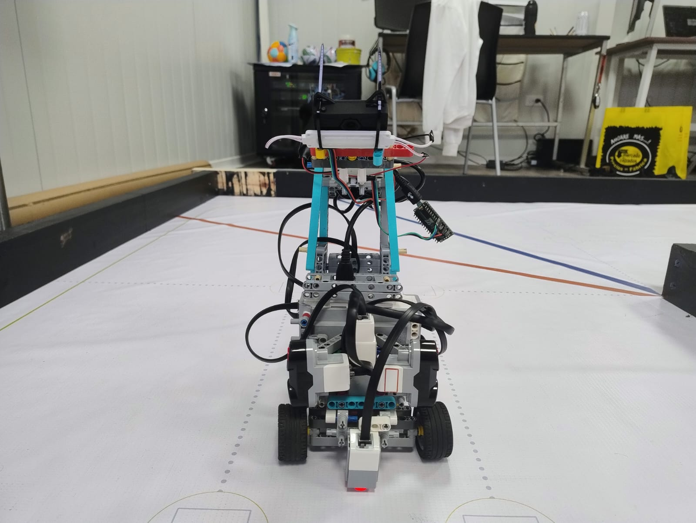
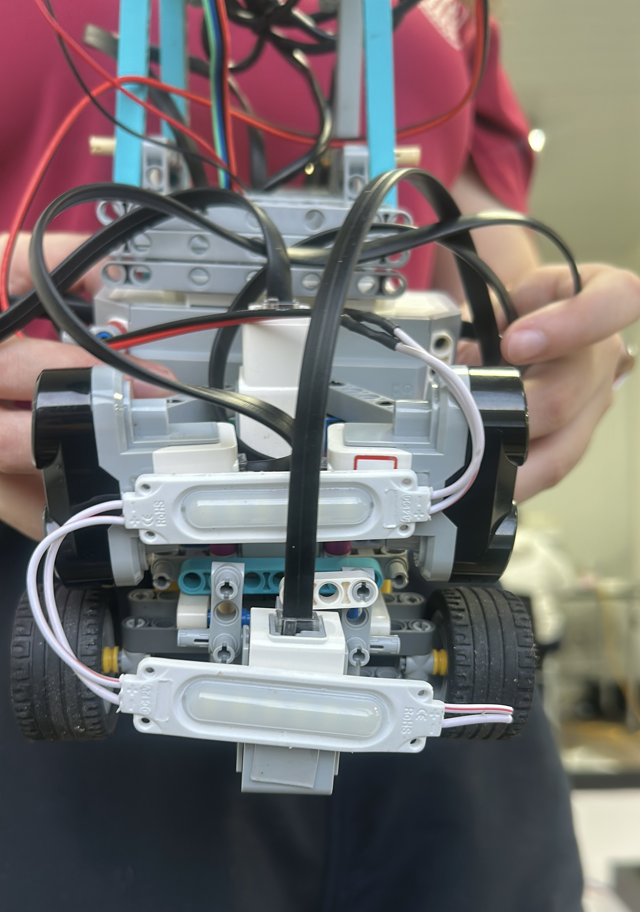
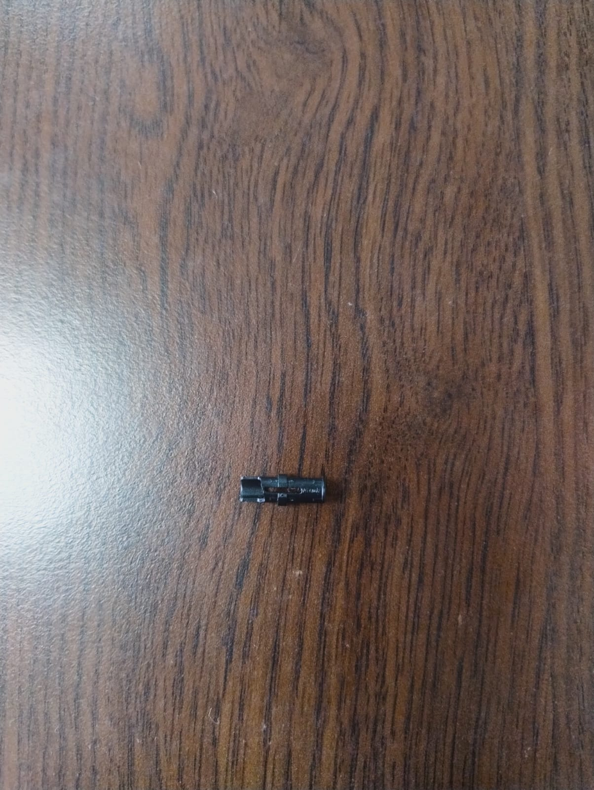

# ᯓ★ 4.1 Design Decision Log ᯓ★

  
  
  

  <em>This section explains the main design decisions that shaped Cheese. Each decision is presented through the engineering reasoning behind it: the constraint, the tradeoff, the final choice, and the effect on the robot.</em>

---

## ❀ Engineering Decision Framework ────୨ৎ────────୨ৎ────

Our design process was built around one main idea: **a reliable system is better than a complicated system that cannot be tested consistently**.

Since this is our first season in the WRO Future Engineers category, we had to make decisions based not only on what was technically possible, but also on what was realistic with our materials, time, experience, and testing conditions.

| Engineering Factor | How It Affected Cheese |
| :--- | :--- |
| **Constraints** | Limited materials, late component availability, lighting problems, sensor instability, and competition timing shaped our decisions. |
| **Tradeoffs** | We often chose reliability and simplicity over more advanced but riskier systems. |
| **Iteration** | v1, v2, and v3 each tested different sensing and structural approaches. |
| **Risk mitigation** | We changed the controller plan, simplified the code, adjusted sensors, and added a dual-light system to reduce failure points. |
| **Testing evidence** | Each major change came from something that failed, became unstable, or reduced performance during practice. |

---

## ❀ Visual Reference: Cheese v3 Front Layout ────୨ৎ────────୨ৎ────

  

  <em>Labeled front view of Cheese v3 showing the main sensing, lighting, and control components used in the final design decisions.</em>

---

## ❀ Decision Overview ────୨ৎ────────୨ৎ────

| Decision Area | Constraint or Problem | Final Decision | Engineering Reason |
| :--- | :--- | :--- | :--- |
| **Main controller** | Arduino was considered, but materials arrived late and full integration became risky. | Keep the **EV3 Brick** as the main controller. | EV3 was already compatible with our motors and sensors, reducing integration risk. |
| **Arduino role** | Arduino was not ready to control the whole vehicle. | Use Arduino Nano as a **vision bridge** instead. | It could support the HuskyLens without replacing the EV3 control system. |
| **Code structure** | Earlier code versions became too long and created behavior conflicts. | Simplify the program into clearer logic layers. | Easier debugging, tuning, and explanation. |
| **Front sensor system** | Infrared and front ultrasonic sensors caused different reliability issues. | Use task-specific sensing: side ultrasonic sensors for walls and color sensor for curve timing. | Each sensor is used for the type of data it reads best. |
| **Obstacle visibility** | HuskyLens recognition changed with lighting conditions. | Add an upper helping lamp. | More stable visual input improves obstacle recognition. |
| **Floor visibility** | Light near the camera did not illuminate the floor enough. | Add a lower helping lamp near the color sensor. | Better floor illumination improves color detection. |
| **Lighting architecture** | One lighting position could not support both the camera and the color sensor. | Use a **dual-light support system**. | Two lamps at different heights support two different sensing tasks. |

---

## ❀ Decision 1: Keeping EV3 as the Main Controller ────୨ৎ────────୨ৎ────

  
  
  

At the beginning, we considered using Arduino as the main control platform for Cheese. This would have given us more flexibility for electronics and communication, but it also depended on having the correct materials, wiring, and integration ready on time.

The main constraint was that some materials arrived late. Depending on Arduino as the full control system would have created a major risk close to competition because the system would need extra wiring, testing, debugging, and troubleshooting before being reliable.

Because of this, we chose to keep the **LEGO EV3 Brick** as the main controller. This reduced risk because the EV3 already worked directly with our motors and sensors. It allowed us to focus on movement, steering, sensor readings, and software behavior instead of spending most of our time solving hardware compatibility issues.

| Option | Advantage | Risk |
| :--- | :--- | :--- |
| **Arduino as main controller** | More electronics flexibility | Higher integration risk, more wiring complexity, late materials |
| **EV3 as main controller** | Direct motor and sensor compatibility | Less flexible than a custom electronics system |
| **Final choice** | EV3 main control with Arduino support role | Balanced reliability with added vision support |

**Final reasoning:** We did not choose EV3 because it was the most advanced option. We chose it because it was the most reliable option for our actual constraints.

---

## ❀ Decision 2: Using Arduino Nano as a Vision Bridge ────୨ৎ────────୨ৎ────

  
  

Even though Arduino was not used as the main controller, it still became useful in the robot. We decided to use the **Arduino Nano** as a bridge between the HuskyLens camera and the EV3-based architecture.

This choice allowed us to keep the EV3 focused on navigation and motor control while the Arduino supported the vision system. Instead of forcing one controller to do every task, we separated responsibilities between systems.

| Subsystem | Controller Role |
| :--- | :--- |
| **EV3 Brick** | Main navigation, motor control, sensor logic |
| **Arduino Nano** | Communication bridge for HuskyLens vision data |
| **HuskyLens Camera** | Obstacle recognition support |

**Final reasoning:** Arduino was not removed from the project; its role was adjusted to match what it could reliably contribute.

---

## ❀ Decision 3: Simplifying the Code ────୨ৎ────────୨ৎ────

  
  
  

One of our biggest software lessons was that a longer code does not automatically make a better robot. Earlier versions reached approximately **1500 lines** because we kept adding new conditions, exceptions, and fixes every time Cheese failed during testing.

Instead of making the robot more reliable, this sometimes created conflicts between behaviors. For example, one part of the code could try to keep the robot centered while another part was trying to handle a curve or avoid a wall. When too many behaviors competed at the same time, Cheese became harder to tune and less predictable.

Our decision was to synthesize the code into a clearer structure of approximately **300 lines**, where each behavior had a defined purpose and priority.

| Behavior Layer | Purpose |
| :--- | :--- |
| **Curve handling** | Takes priority when the robot is executing a turn. |
| **Post-curve recovery** | Helps the robot stabilize after leaving a curve. |
| **Wall protection** | Prevents the robot from getting too close to the walls. |
| **PID centering** | Keeps the robot centered during normal straight movement. |
| **Parking logic** | Controls the final stop after completing the required laps. |

**Final reasoning:** We chose clearer logic over longer logic. This made the robot easier to debug, explain, and improve.

---

## ❀ Decision 4: Changing the Front Sensor Strategy Across Versions ────୨ৎ────────୨ৎ────

  
  
  

The front sensor strategy changed across the three versions of Cheese because each version revealed a different limitation.

| Version | Front Sensor Choice | Problem Found | Resulting Decision |
| :--- | :--- | :--- | :--- |
| **v1** | Infrared sensor | Readings were disrupted by external light. | Stop depending on infrared for front detection. |
| **v2** | Front ultrasonic sensor | It detected too many changes at once and made steering unstable during curves. | Remove front ultrasonic dependency for curve behavior. |
| **v3** | Color sensor for curve timing | Better matched to floor markings. | Use color detection for curve events. |

In **v1**, the infrared sensor was too sensitive to ambient light. Since the competition environment can include shadows, reflections, and inconsistent lighting, the infrared readings were not stable enough.

In **v2**, we replaced it with a front ultrasonic sensor. This solved one problem but created another: the sensor detected too many changes at once, especially during curves. This made the steering less precise, increased the time between laps, and caused the robot to crash more often.

In **v3**, we changed the logic so the robot uses sensors according to their strongest purpose. Side ultrasonic sensors are used for wall distance, while the color sensor is used for floor-based curve timing.

  

  <em>Cheese v3 front view showing the final physical layout after changing the front sensing strategy.</em>

**Final reasoning:** We did not choose sensors based only on what they could measure. We chose them based on whether their readings stayed useful during the robot’s real movement.

---

## ❀ Decision 5: Adding a Dual-Light Support System ────୨ৎ────────୨ৎ────

  
  
  

During testing, we noticed that lighting affected both the HuskyLens camera and the color sensor, but not in the same way. The HuskyLens needed clearer frontal visibility to recognize obstacles, while the color sensor needed stronger illumination close to the floor to read the track surface.

At first, one lighting position seemed like it could support the robot’s vision system. However, testing showed that one lamp position was not enough for both sensing tasks. When the light was placed higher, it helped the camera view, but the floor was still not bright enough for the color sensor. When the light was lower, it helped the floor reading, but did not support the camera’s obstacle view as well.

Because of this, Cheese uses a **dual-light support system** powered by a separate 9V battery. The upper lamp supports the HuskyLens camera by improving obstacle visibility, while the lower lamp illuminates the floor near the color sensor.

  

  <em>Cheese v3 dual-light support system. The upper lamp helps the HuskyLens camera see the obstacle area more clearly, while the lower lamp improves floor illumination near the color sensor.</em>

| Lighting Element | Position | Sensor Supported | Purpose |
| :--- | :--- | :--- | :--- |
| **Upper helping lamp** | Upper front area | HuskyLens camera | Improves obstacle visibility and helps the camera see pillar colors more accurately. |
| **Lower helping lamp** | Lower front area, near the floor | Color sensor | Improves floor illumination for more consistent track color detection. |
| **External 9V battery** | Lighting circuit | Both lamps | Powers the lights separately from the EV3 rechargeable battery. |

**Final reasoning:** A lighting solution must match the sensor it supports. One lamp position could not solve both camera recognition and floor detection, so we separated the lighting into two support points.

---

## ❀ Decision 6: Improving Obstacle Color Recognition ────୨ৎ────────୨ৎ────

  
  
  

The HuskyLens camera did not always detect the obstacles reliably when the lighting was poor. During testing, the obstacle colors appeared darker than they should: the green obstacle looked almost black, and the red obstacle looked brownish or chocolate-colored.

This created a serious risk because the obstacle challenge depends on recognizing red and green pillars correctly. If the camera cannot see the obstacle colors accurately, the robot may make the wrong movement decision.

After adding the lighting support, the obstacles appeared closer to their real colors. This improved the camera’s ability to recognize the objects and made obstacle detection more reliable during testing.

| Before Lighting Support | After Dual-Light Support |
| :--- | :--- |
| Green obstacle looked blackish. | Green appeared closer to its real color. |
| Red obstacle looked brownish or chocolate-colored. | Red appeared clearer and easier to detect. |
| Recognition was less reliable. | Obstacle detection improved. |

**Final reasoning:** Vision reliability depends on lighting quality. The dual-light system reduced color distortion and helped the robot make safer obstacle decisions.

---

## ❀ Decision 7: Treating Mechanical Stress as a Design Constraint ────୨ৎ────────୨ৎ────

  
  
  

During building and testing, some Technic pins broke because of excess force during assembly or because they were under too much pressure in loaded parts of the structure. This showed us that even small LEGO components can become important mechanical failure points.

Because of this, we treated pin placement and connection strength as part of the engineering process. Instead of only focusing on motors and sensors, we also paid attention to how much stress the structure was placing on its connectors.

  

  <em>Broken Technic pin caused by excess force and structural pressure during testing. This helped us treat connection stress as a real mechanical design constraint.</em>

| Mechanical Issue | Risk | Design Response |
| :--- | :--- | :--- |
| Pins broke from excessive force | Weaker joints | Handle parts more carefully during assembly. |
| Pins carried too much pressure | Structural stress | Reinforce loaded connections. |
| Connections could loosen or fail | Less reliable chassis | Improve joint support in critical areas. |

**Final reasoning:** A robot is only as reliable as its weakest connection. Reinforcing small structural points helped make Cheese more durable during repeated testing.

---

## ❀ Decision 8: Prioritizing Tighter Curves and Smoother Movement ────୨ৎ────────୨ৎ────

  
  
  

Another important decision was improving how Cheese handled curves. Earlier testing showed that curves that were too wide caused time loss and reduced fluidity between laps. Even if the robot completed the turn, a wide curve could make it exit at a poor angle, forcing the robot to correct itself afterward.

This made the full lap less efficient. The robot did not only need to turn; it needed to turn smoothly, exit in a stable position, and continue into the next straight section without wasting time.

| Curve Problem | Effect on Run | Engineering Direction |
| :--- | :--- | :--- |
| Curves were too wide | More time per lap | Tune curve steering behavior. |
| Movement lacked fluidity | Less consistent path | Improve transition after curves. |
| Poor exit angle | More correction needed afterward | Improve post-curve recovery. |

**Final reasoning:** Completing a curve is not enough. The robot must complete the curve in a way that supports the next movement section.

---

## ❀ Final Engineering Impact ────୨ৎ────────୨ৎ────

| Final Decision | Constraint Addressed | Impact on Cheese |
| :--- | :--- | :--- |
| **EV3 as main controller** | Material delays and integration risk | More stable development path |
| **Arduino as vision bridge** | Need for HuskyLens communication | Supports vision without replacing EV3 |
| **Simplified code** | Behavior conflicts and debugging difficulty | More predictable control logic |
| **Sensor changes across versions** | Unstable front sensing | Better match between sensor and task |
| **Dual-light support system** | Camera and floor lighting needs were different | Improved both obstacle visibility and color detection |
| **Reinforced mechanical connections** | Broken pins and structural stress | More durable chassis |
| **Curve tuning** | Wide curves and time loss | Smoother and more efficient movement |

---

## ❀ Final Reflection ────୨ৎ────────୨ৎ────

The strongest design decisions in Cheese came from testing, not guessing. We did not keep a system just because it was part of an earlier version, and we did not add complexity only to make the robot seem more advanced.

Our final choices focused on making Cheese more reliable, easier to debug, and easier to explain. By keeping the EV3 as the main controller, simplifying the code, changing sensors based on real failures, improving lighting for both the camera and color sensor, and reinforcing mechanical weak points, we created a stronger foundation for the v3 robot.

  <strong>Cheese improved because every major decision was connected to a real constraint, tradeoff, or test result.</strong>

