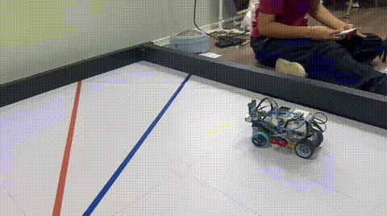
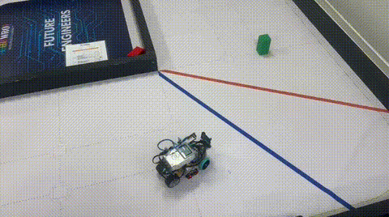

<h1 align="center">ᯓ★ 4.2 What Did Not Work ᯓ★</h1>

  
  
  
  

  <em>
    Cheese was not developed through successful tests alone.
    Crashes, unstable curves, incorrect sensor readings, structural problems,
    failed solutions and inconsistent obstacle behavior provided some of the
    most useful engineering evidence in the entire project.
  </em>

  ✦ ─── ⋆⋅☆⋅⋆ ─── 💥🧀🤖 ─── ⋆⋅☆⋅⋆ ─── ✦

---

A failed test is useful when it helps explain **why the robot failed**.

During Cheese development, the team learned not to treat every crash as simply a "code problem."

A collision can be influenced by:

- ultrasonic geometry,
- PID correction,
- steering response,
- curve entry,
- curve exit,
- robot mass,
- wheel grip,
- sensor timing,
- battery condition,
- or several of these at the same time.

For that reason, failures were analyzed using:

  <strong>
    Failure → Evidence → Cause → Risk → Change → Retest → Result
  </strong>

This section documents the failures that most strongly influenced Cheese v4.

---

# ❀ 4.2.1 Failure Analysis Method ────୨ৎ────────୨ৎ────

When Cheese failed, the visible result was only the beginning of the analysis.

For example:

  <strong>
    Robot Hits Wall ≠ Automatically a PID Problem
  </strong>

A wall collision could originate from several interacting systems.

| Question | Engineering Purpose |
| :--- | :--- |
| **What happened?** | Identify the visible failure |
| **Where did it happen?** | Connect it to field geometry |
| **What happened immediately before it?** | Find the event that triggered the failure |
| **Which subsystem had authority?** | Identify whether navigation, safety or recovery was controlling |
| **What physical factor contributed?** | Check sensors, steering, structure and battery |
| **What software factor contributed?** | Check thresholds, PID, timing and state logic |
| **What should change?** | Select one useful modification |
| **Did the next test improve?** | Validate the decision |

This prevented the team from changing several unrelated values after every failed run.

---

# ❀ 4.2.2 Real Collision Evidence ────୨ৎ────────୨ৎ────

Two Open Challenge tests provide direct evidence of the type of navigation failures encountered during development.

  

  <em>
    Real Open Challenge failure during testing.
    Cheese reaches an unsafe trajectory and collides instead of maintaining
    sufficient wall clearance.
  </em>

This type of failure cannot be understood only from the final collision.

The important engineering question is:

  <strong>
    What caused Cheese to enter the collision trajectory?
  </strong>

Possible contributors include the previous steering command, wall distance, correction timing, curve geometry and available recovery space.

---

  

  <em>
    Real curve-related failure recorded during Open Challenge development.
    This evidence helped evaluate how corner behavior affects the trajectory that follows.
  </em>

The second failure demonstrates an important systems relationship:

  <strong>
    Bad Curve → Bad Exit Heading → Strong Correction → Wall Risk
  </strong>

A collision occurring after a corner may therefore have begun **during the corner itself**.

These GIFs are kept in the repository because successful runs show what Cheese can do, while failed runs explain **why the engineering changed**.

---

# ❀ 4.2.3 Failure Overview ────୨ৎ────────୨ৎ────

The most important failures were not isolated.

Many affected several subsystems simultaneously.

| What Did Not Work | Main Effect | Engineering Response |
| :--- | :--- | :--- |
| **Excess v3 structure** | Increased mass and complexity | Rebuild lighter v4 |
| **Large camera structure** | Added height and unnecessary supports | Simplify camera area |
| **Stressed Technic connections** | Mechanical reliability risk | Reduce unnecessary structural load |
| **Poor ultrasonic geometry** | Less useful wall measurements | Reposition sensors |
| **Constant/aggressive correction** | Zig-zag and unstable movement | Minimum-correction PID |
| **Late wall response** | Collision risk | Progressive wall protection |
| **Front-wall trapping** | Steering had insufficient space | Reverse recovery |
| **Poor corner exit** | Bad heading after turn | Tune curve behavior |
| **Color sensor sunlight sensitivity** | Missed floor events | Test shielding and sensor height |
| **Dragging color-sensor cover** | Mechanical interference | Remove cover |
| **Incorrect curve counts** | Parking early or late | Sequence + timing + cooldown validation |
| **Late pillar detection** | Less reaction distance | Tune camera position and timing |
| **Weak obstacle avoidance** | Pillar contact/carrying | Strengthen maneuver |
| **Poor post-obstacle recovery** | Next pillar approached badly | Recovery remains a tuning priority |
| **Obstacle parking** | Final state not yet reliable | Continue after navigation stabilizes |
| **Battery variation** | Same code can respond differently | Battery-aware testing |

The major lesson was:

  <strong>
    The visible failure is not always the root cause.
  </strong>

---

# ❀ 4.2.4 Excess Weight and Structure Did Not Work ────୨ৎ────────୨ৎ────

Cheese v3 had a measured mass of **888.8 g**.

Cheese v4 has a measured mass of **666 g**.

The approximately **222.8 g reduction** did not happen because the team wanted the lightest robot possible.

It happened because testing showed that some structures no longer justified their mass.

  

| Problem | System Effect |
| :--- | :--- |
| **More mass** | Greater inertia during changes of direction |
| **More upper structure** | More material away from the base |
| **More components** | More possible movement or failure points |
| **More supports** | Harder inspection |
| **More crowded layout** | Slower adjustment between tests |

### Response

Remove pieces that no longer served a clear structural or functional purpose.

### Trade-off

Removing too much could reduce chassis rigidity.

### Result

The objective became:

  <strong>
    Remove Unnecessary Mass — Not Necessary Strength
  </strong>

This produced the current 666 g v4 architecture.

---

# ❀ 4.2.5 The Large Camera Structure Did Not Work ────୨ৎ────────୨ৎ────

The HuskyLens itself was not the failure.

The oversized structure surrounding the earlier camera configuration became unnecessary as the design evolved.

The older architecture required:

- more upper support,
- more mounting pieces,
- greater height,
- and additional visibility hardware.

### Response

Keep the camera function but simplify the structure around it.

  

  <em>
    Current v4 HuskyLens position after simplifying the previous camera structure.
  </em>

The lesson was:

  <strong>
    Keep the Function → Remove the Unnecessary Structure
  </strong>

This reduced mechanical complexity without abandoning obstacle vision.

---

# ❀ 4.2.6 The Previous Auxiliary Lighting System Was Removed ────୨ৎ────────୨ৎ────

Earlier Cheese versions used auxiliary lighting around the sensing system.

As the camera position and overall structure changed, keeping the old lighting architecture became less useful.

  

The lights themselves were not necessarily defective.

The problem was that maintaining them required:

- additional mounting structure,
- additional components,
- additional mass,
- and a layout designed around an older camera configuration.

### Response

The current v4 architecture removed the auxiliary lighting system.

### Lesson

  <strong>
    A solution can stop being useful when the rest of the system changes.
  </strong>

---

# ❀ 4.2.7 Structural Stress Became a Real Failure ────୨ৎ────────୨ৎ────

Mechanical stress was not only theoretical.

A Technic pin physically failed during earlier development.

  

  <em>
    Physical evidence of a small structural component becoming a real failure point.
  </em>

| Mechanical Issue | Possible Effect |
| :--- | :--- |
| **Broken pin** | Loss of structural support |
| **Stressed connection** | Progressive weakening |
| **Small alignment change** | Steering or sensor geometry can shift |
| **Difficult disassembly** | Repairs take longer |
| **Repeated loading** | Failure may appear only after several tests |

This helped establish another v4 principle:

  <strong>
    A small mechanical failure can become a large navigation failure.
  </strong>

The lighter v4 structure reduces unnecessary structural load while retaining essential supports.

---

# ❀ 4.2.8 Ultrasonic Placement Did Not Fully Work ────୨ৎ────────୨ৎ────

Wall-following software depends on the measurements it receives.

If the physical ultrasonic geometry is poor, changing PID values alone may not solve the problem.

### Earlier issue

The ultrasonic arrangement was not always positioned optimally relative to the field walls.

### System chain

  <strong>
    Poor Sensor Geometry → Poor Distance Data → Incorrect Error → Incorrect Steering
  </strong>

### Response

The v4 sensors were repositioned lower and organized into a three-ultrasonic architecture.

  

| Sensor | Current Role |
| :--- | :--- |
| **Left ultrasonic** | Left-wall distance |
| **Right ultrasonic** | Right-wall distance |
| **Front ultrasonic** | Forward safety / recovery |

The engineering lesson was:

  <strong>
    Improve the Measurement Before Asking Software to Correct It.
  </strong>

---

# ❀ 4.2.9 Constant Correction Produced Unstable Movement ────୨ৎ────────୨ৎ────

One major Open Challenge problem was unnecessary steering correction.

If Cheese tries to correct every small distance difference, it can begin oscillating.

  <strong>
    Small Error → Correction → Overshoot → Opposite Error → Correction → Zig-Zag
  </strong>

This is especially dangerous at speed.

### Response

The Open controller evolved toward a **minimum-correction PID philosophy**.

  

Instead of continuously forcing the robot toward an exact theoretical center, the controller allows Cheese to remain mostly straight when its position is already safe.

### Result

  <strong>
    Safe Position → Small or No Correction
  </strong>

This reduced the need for constant steering activity.

---

# ❀ 4.2.10 Normal PID Alone Did Not Prevent Every Wall Collision ────୨ৎ────────୨ৎ────

The real collision GIFs demonstrate why normal PID correction could not be the only safety mechanism.

As the robot approaches a wall, the consequence of waiting becomes progressively more serious.

The response therefore evolved from one correction layer into several.

| Distance State | Response |
| :--- | :--- |
| **Safe** | Normal minimum-correction PID |
| **Closer** | Gentle wall protection |
| **Too close** | Severe wall protection |
| **Critical** | Strong avoidance |
| **Front trapped** | Reverse recovery |

The principle became:

  <strong>
    Risk Increases → Protection Increases
  </strong>

This is more useful than waiting until Cheese is already at collision distance.

---

# ❀ 4.2.11 Steering Alone Could Not Recover From Every Front-Wall Situation ────୨ৎ────────୨ৎ────

A particularly important failure happened when Cheese became too close to a wall.

At that point, requesting a stronger steering angle did not necessarily solve the problem.

Why?

Because the robot physically lacked enough room to turn.

  <strong>
    No Space → Steering Cannot Create Space
  </strong>

### Response

The Open software introduced front-wall reverse recovery.

  

The strategy became:

  <strong>
    Detect Danger → Confirm → Reverse → Create Space → Resume Navigation
  </strong>

This was an important change in thinking.

Moving backward is not automatically a failure.

Sometimes reversing is the action required to **recover from a failure state**.

---

# ❀ 4.2.12 Corner Execution Could Create the Next Failure ────୨ৎ────────୨ৎ────

One of the most useful lessons from Open testing was that a corner does not end when the steering returns toward center.

The robot still carries the heading and position created by that turn.

The recorded collision evidence demonstrates why this matters.

  

A problematic sequence can become:

  <strong>
    Wide / Incorrect Turn → Poor Exit Heading → Wall Approaches → Late Correction → Collision
  </strong>

This means a crash on the straight after a curve can actually originate from **corner geometry**.

### Response

Curve tuning focused on:

- steering strength,
- turn duration,
- curve width,
- exit heading,
- wall clearance,
- and the transition back to normal PID.

### Lesson

  <strong>
    A Good Corner Must Prepare the Robot for What Comes Next.
  </strong>

---

# ❀ 4.2.13 The First Color-Sensor Light Shield Did Not Work ────୨ৎ────────୨ৎ────

Ambient light caused problems during early color-sensor testing.

The first response was an improvised physical cover around the sensor.

The idea was reasonable:

  <strong>
    Block External Light → Stabilize Floor Reading
  </strong>

But testing revealed a new problem.

The cover was close enough to the floor that it could **drag against the mat**.

So the solution to an optical problem created a mechanical problem.

### What happened

| Stage | Result |
| :--- | :--- |
| **Problem** | Ambient light affected color readings |
| **First solution** | Add improvised light-blocking cover |
| **New failure** | Cover could drag against the floor |
| **Decision** | Remove the cover |
| **New approach** | Adjust the sensor slightly lower while keeping safe clearance |
| **Current state** | Improved detection without the dragging cover |

  

This became one of the clearest examples of iterative engineering in Cheese:

  <strong>
    Fix A Problem → Discover New Problem → Reject Fix → Find Better Solution
  </strong>

---

# ❀ 4.2.14 Raw Color Events Did Not Produce Reliable Curve Counts ────୨ৎ────────୨ৎ────

Detecting a color once was not enough to prove that Cheese completed a physical curve.

A false or duplicate event could change the entire run.

### Duplicate count

  <strong>
    1 Physical Curve → 2 Counts → 12 Reached Early → Parking Early
  </strong>

### Missed count

  <strong>
    Curve Missed → Count Below 12 → Parking Late
  </strong>

### Response

The curve counter evolved to validate:

- opposite-color progression,
- a color-change time window,
- steering confirmation,
- post-color steering,
- and cooldown.

  

The engineering lesson was:

  <strong>
    Detection ≠ Valid Event
  </strong>

A sensor reading becomes useful only after the software determines what that reading means physically.

---

# ❀ 4.2.15 Parking Failed When Earlier Systems Failed ────୨ৎ────────୨ৎ────

Parking initially looked like a final independent action.

Testing showed that it is actually dependent on the entire previous run.

For Open:

  <strong>
    Correct Curves → Correct Count → Correct Finish Timing → Correct Parking Activation
  </strong>

If Cheese reaches 12 counts early, parking can begin early.

If a curve is missed, parking can begin late.

If the robot approaches the finish with a poor heading, it can stop at an angle.

### Current Open result

Open parking is functional and normally reaches the correct region, although final alignment can still be slightly angled.

### Obstacle Challenge

Obstacle parking remains a later development problem because obstacle avoidance changes the robot's trajectory before it reaches the final area.

The lesson became:

  <strong>
    Parking Is Not Only the End of the Run — It Is the Result of the Run.
  </strong>

---

# ❀ 4.2.16 Obstacle Detection Alone Did Not Solve Obstacle Avoidance ────୨ৎ────────୨ৎ────

The HuskyLens can currently recognize both competition pillar colors.

| Pillar | Current HuskyLens Training | Required Side |
| :--- | :---: | :---: |
| 🟢 **Green** | **Color ID 1** | **Left** |
| 🔴 **Red** | **Color ID 2** | **Right** |

The important failure was discovering that correct recognition does **not** guarantee correct physical avoidance.

  <strong>
    Correct Detection ≠ Successful Avoidance
  </strong>

A successful obstacle maneuver requires:

  <strong>
    Detect → React Early → Steer → Clear Pillar → Recover → Continue
  </strong>

Current failures can occur when:

- detection happens too late,
- the pillar enters the field of view at an unfavorable angle,
- avoidance steering is too weak,
- Cheese contacts or carries the pillar,
- or recovery leaves the robot in a bad position for the next obstacle.

This is why the current obstacle work focuses on **physical maneuver reliability**, not only recognition accuracy.

---

# ❀ 4.2.17 Post-Obstacle Recovery Did Not Work Reliably Enough ────୨ৎ────────୨ৎ────

Passing one pillar is not sufficient.

Cheese must also be ready for the next pillar.

A successful first avoidance can still lead to a later failure if the robot exits at the wrong heading.

  <strong>
    Avoid Pillar → Bad Exit → Next Pillar Appears Late → Late Reaction → Failure
  </strong>

This has made post-obstacle recovery one of the most important remaining tuning problems.

The desired behavior is:

  <strong>
    Avoid → Clear → Recover → Stabilize → Detect Next Pillar
  </strong>

This demonstrates why Obstacle Challenge development cannot be divided into isolated pillar maneuvers.

Each maneuver creates the starting condition for the next one.

---

# ❀ 4.2.18 Battery Condition Made Some Tests Misleading ────୨ৎ────────୨ৎ────

One frustrating testing problem was that the same software did not always produce exactly the same physical response.

Battery condition can influence:

- propulsion strength,
- steering response,
- acceleration,
- reverse recovery,
- and timing.

This can create:

  <strong>
    Same Code + Different Battery State → Different Physical Behavior
  </strong>

Without considering battery condition, the team could incorrectly change a software constant to compensate for a temporary power-related behavior.

### Response

Battery condition became another variable considered before changing software.

### Lesson

  <strong>
    Not Every Different Result Means the Code Changed.
  </strong>

---

# ❀ 4.2.19 Newer Code Was Not Always Better ────୨ৎ────────୨ৎ────

Testing before competition also produced an important software-engineering lesson.

A newer version of the code could contain more features while being **less trustworthy** than an older tested version.

During development pressure, some newer iterations did not perform reliably enough.

This meant an older version sometimes became the safer option.

| Situation | Lesson |
| :--- | :--- |
| **New code had more changes** | More features did not guarantee reliability |
| **Older code was better understood** | Known behavior can be valuable |
| **Testing time was limited** | Every new variable increased debugging time |
| **Competition pressure increased** | Reliability became more important than novelty |

The software-development philosophy became:

  <strong>
    Newest Version ≠ Best Competition Version
  </strong>

The best version is the one that has been sufficiently tested and understood.

---

# ❀ 4.2.20 Failure → Cause → Change → Result ────୨ৎ────────୨ৎ────

The main development failures can be summarized as:

| Failure | Cause / Contributing Factor | Change | Current Result |
| :--- | :--- | :--- | :--- |
| **Excess v3 mass** | Accumulated structure | Remove unnecessary components | 666 g v4 |
| **Large upper structure** | Camera/light supports | Simplify front architecture | Lower, cleaner layout |
| **Broken Technic pin** | Structural stress | Reduce unnecessary load | Lesson incorporated into v4 |
| **Poor wall information** | Sensor geometry | Reposition ultrasonics | Better physical sensing conditions |
| **Zig-zag** | Too much correction | Minimum-correction PID | Straighter normal behavior |
| **Late wall response** | Normal correction insufficient near danger | Progressive wall protection | Earlier protection |
| **Front-wall trapping** | No physical turning space | Reverse recovery | Robot can create space |
| **Curve-related collision** | Poor corner/exit trajectory | Tune corner behavior | Improved but still monitored |
| **Sunlight affected color** | External illumination | Test sensor cover | Optical problem reduced but new mechanical problem appeared |
| **Cover dragged on mat** | Shield too close to floor | Remove cover + adjust sensor | Current simpler solution |
| **Duplicate/missed curves** | Raw detections insufficient | Validate sequence/timing/steering | Better counting |
| **Parking early/late** | Incorrect progress count | Improve curve validation | Better parking activation |
| **Late obstacle reaction** | Detection geometry/timing | Tune camera position | Still under calibration |
| **Weak obstacle pass** | Insufficient maneuver authority | Tune avoidance | Still under calibration |
| **Poor obstacle recovery** | Bad post-pass heading | Develop recovery behavior | Current major obstacle challenge |
| **Different physical response** | Battery condition | Battery-aware testing | Better diagnosis |

This table represents the engineering value of failure:

  <strong>
    Every Important Failure Should Teach Us What to Test Next.
  </strong>

---

# ❀ 4.2.21 How Failure Shaped Cheese v4 ────୨ৎ────────୨ৎ────

Cheese v4 was not designed from a blank page.

Its architecture is a physical record of previous problems.

| Previous Problem | Visible v4 Response |
| :--- | :--- |
| **Too much structure** | 666 g compact chassis |
| **Large camera support** | Simplified lower HuskyLens arrangement |
| **Old lighting architecture** | Auxiliary lights removed |
| **Wall-reading limitations** | Lower three-ultrasonic layout |
| **Color-light interference** | Revised floor gap without dragging shield |
| **Front-wheel steering behavior** | SPIKE front wheels |
| **Cable clutter** | Shorter Nano USB cable |
| **Difficult inspection** | Cleaner component layout |
| **Constant corrections** | Minimum-correction software philosophy |
| **Front trapping** | Reverse recovery |
| **Curve-count errors** | Validated color-event architecture |

The strategy changed from:

  <strong>
    Add More Until It Works
  </strong>

to:

  <strong>
    Understand the Failure → Change the Correct System → Test Again
  </strong>

---

# ❀ 4.2.22 Why We Keep Failure Evidence ────୨ৎ────────୨ৎ────

Successful testing footage proves capability.

Failure footage proves engineering development.

The two collision GIFs are therefore intentionally kept in the documentation.

| Evidence Type | What It Shows |
| :--- | :--- |
| **Successful Open GIF** | Cheese can execute the intended behavior |
| **Successful corner GIF** | The tuned corner can physically work |
| **Wall-collision GIF** | Navigation still had failure states |
| **Curve-collision GIF** | Corner behavior can affect later trajectory |
| **Broken pin photo** | Mechanical failure occurred physically |
| **Removed-parts photos** | The redesign responded to previous complexity |

Together they show:

  <strong>
    Success + Failure + Redesign = Engineering Evidence
  </strong>

A repository containing only successful tests would hide an important part of how Cheese was actually developed.

---

# ❀ 4.2.23 Current Problems We Are Not Hiding ────୨ৎ────────୨ৎ────

Not every problem documented in this section belongs only to the past.

Some remain active tuning areas.

| Current Area | Status |
| :--- | :--- |
| **Open three-lap completion** | 🟢 Mostly reliable |
| **Open navigation** | 🟢 Functional |
| **Curve counting** | 🟢 Functional, still important to repeatability |
| **Front recovery** | 🟢 Functional |
| **Open parking** | 🟢 Functional |
| **Final parking angle** | 🟡 Still tunable |
| **HuskyLens recognition** | 🟢 Functional |
| **Obstacle avoidance** | 🟡 Still being calibrated |
| **Post-obstacle recovery** | 🟡 Major current challenge |
| **Obstacle parking** | 🟡 Pending / in progress |
| **Battery sensitivity** | 🟡 Still relevant |

Documenting these limitations is important because:

  <strong>
    An Engineering Log Should Show the Real State of the Robot.
  </strong>

---

# ✦ Engineering Lessons from Failure ─── ⋆⋅☆⋅⋆ ───

### 1. A crash is the result, not necessarily the cause

The event that created the collision may have happened several moments earlier.

---

### 2. Software cannot completely compensate for poor physical data

Sensor geometry must be improved before increasingly aggressive corrections are added.

---

### 3. A solution can create a new failure

The color-sensor cover reduced external light but introduced floor contact.

That made removing the solution the correct next decision.

---

### 4. Successful detection is not successful navigation

The HuskyLens can correctly identify a pillar while the physical maneuver still fails.

---

### 5. Recovery is part of the maneuver

Avoiding a wall or pillar is incomplete if Cheese cannot return to a useful trajectory afterward.

---

### 6. More complexity is not automatically more capability

Some of the strongest v4 improvements came from removing components.

---

### 7. The newest code is not automatically the best code

A simpler tested version can be more valuable than an advanced unreliable one.

---

### 8. Failure evidence belongs in engineering documentation

The unsuccessful tests explain why the successful version exists.

---

# ✦ 4.2 What Did Not Work — Final Reflection ─── ⋆⋅☆⋅⋆ ───

The most important thing that failed during Cheese development was not one sensor, one piece of code or one mechanical component.

It was the assumption that every problem should be solved by **adding more**.

Testing showed that:

- more structure did not automatically create more stability,
- more steering did not automatically improve navigation,
- a larger camera mount did not automatically improve vision,
- one correct sensor reading did not automatically represent a valid event,
- correct obstacle recognition did not automatically produce correct avoidance,
- and a successful avoidance did not automatically create a successful recovery.

Cheese v4 became stronger because failures were treated as information.

The robot became:

- lighter,
- lower,
- cleaner,
- easier to inspect,
- easier to calibrate,
- and more intentional.

The two real collision GIFs are an important part of this story because they show exactly why continued testing was necessary.

  <strong>
    Failure → Evidence → Understanding → Change → Better Robot
  </strong>

  <strong>
    What did not work became the evidence that shaped what finally improved.
  </strong>

  ✦ ─── ⋆⋅☆⋅⋆ ─── 💥 → 🔧 → 🧀🤖 ─── ⋆⋅☆⋅⋆ ─── ✦

  

