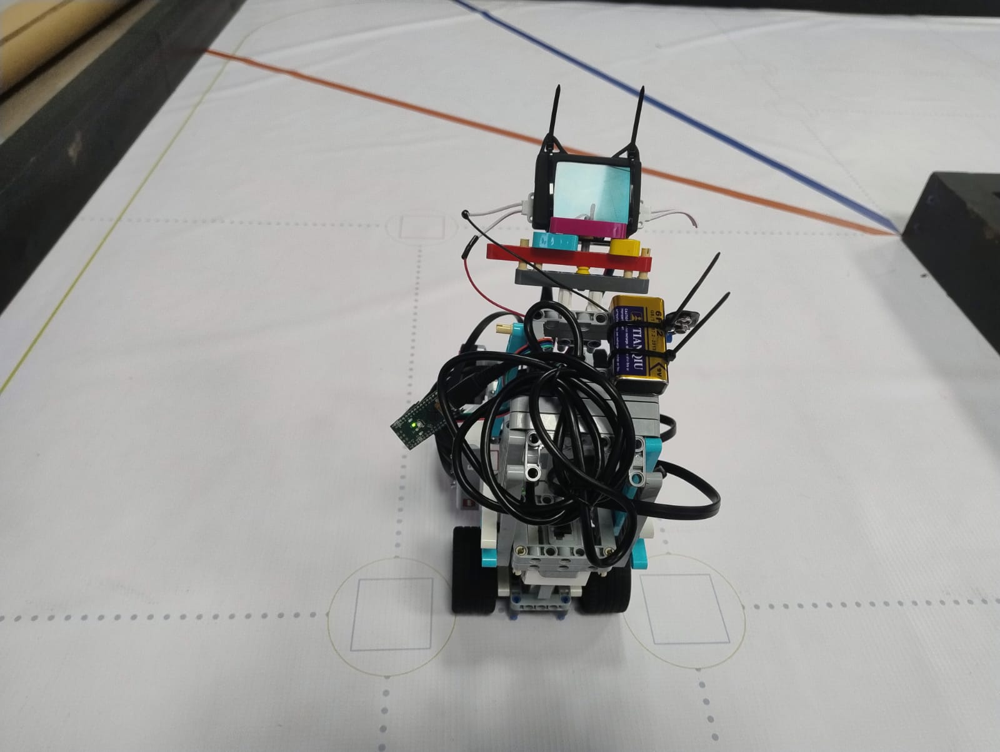
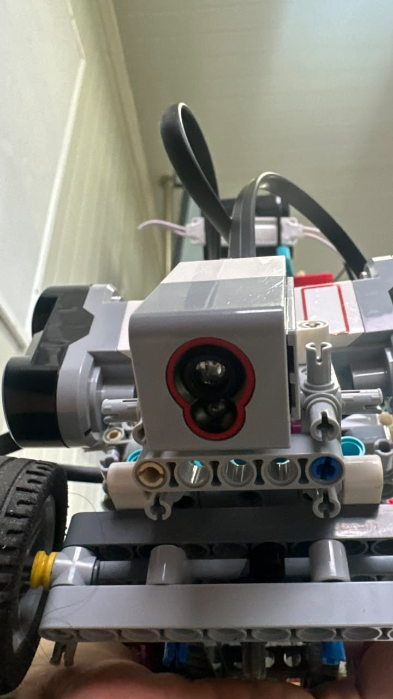
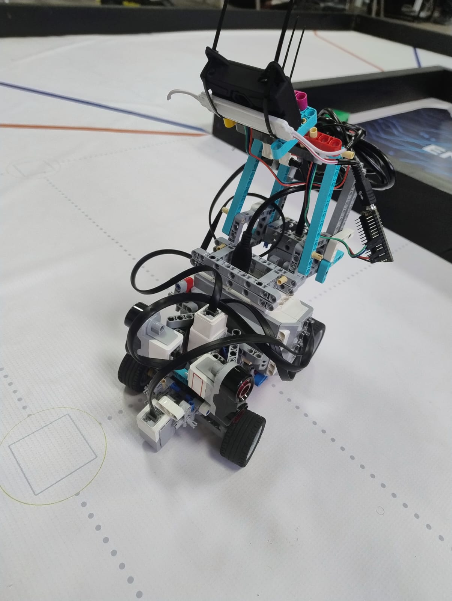

# ᯓ★ 5.1 Bill of Materials ᯓ★

  
  
  

  <em>This Bill of Materials lists the main electronic, mechanical, sensing, lighting, wiring, and structural components used to build Cheese v3. Its purpose is to make the robot easier to understand, rebuild, repair, and reproduce.</em>

---

## ❀ Visual Reference ────୨ৎ────────୨ৎ────

  

  <em>Labeled front view of Cheese v3 showing the main sensing, lighting, control, and structural components used in the final build.</em>

  

  <em>Top view of Cheese v3 showing the general component layout, wiring area, upper structure, and control architecture.</em>

---

## ❀ Component Overview ────୨ৎ────────୨ৎ────

| System | Main Components | Purpose |
| :--- | :--- | :--- |
| **Control System** | EV3 Brick, EV3 rechargeable battery | Runs the main code and controls the robot. |
| **Drive System** | EV3 Large Motor, rear wheels, tires | Moves Cheese forward around the track. |
| **Steering System** | EV3 Medium Motor, Ackermann steering linkage, front wheels | Controls direction and turning. |
| **Wall Detection System** | Ultrasonic sensors | Helps Cheese detect wall distance and stay between the walls. |
| **Floor Detection System** | Color sensor, lower helping lamp | Detects track colors and supports curve timing. |
| **Vision System** | HuskyLens AI Camera, Arduino Nano, upper helping lamp | Supports obstacle recognition. |
| **Lighting System** | Two helping lamps, external 9V battery | Improves visibility for both camera and color sensing. |
| **Mechanical Structure** | Technic liftarms, beams, pins, axles, connectors | Holds all subsystems together. |
| **Wiring System** | EV3 cables, I2C wires, USB connection, lighting wires | Connects power, sensors, motors, and communication systems. |

---

## ❀ Main Control and Electronic Components ────୨ৎ────────୨ৎ────

| Component | Quantity | Main Function | Location on Cheese | Notes |
| :--- | :---: | :--- | :--- | :--- |
| **LEGO EV3 Brick** | 1 | Main controller | Center/main body of the robot | Runs the navigation code and controls the EV3 motors and sensors. |
| **EV3 Rechargeable Battery** | 1 | Main power source | Inside the EV3 Brick | Powers the EV3 system, motors, and EV3-connected sensors. |
| **Arduino Nano ATmega328P** | 1 | Vision communication bridge | Upper/side wiring area | Used as an intermediate bridge between the HuskyLens camera and the EV3-based control architecture. |
| **HuskyLens AI Camera** | 1 | Obstacle recognition | Upper front camera mount | Used to recognize red and green obstacles during the obstacle challenge. |
| **External 9V Battery** | 1 | Lighting power source | Upper structure / lighting circuit area | Powers the two auxiliary helping lamps separately from the EV3 battery. |

---

## ❀ Motors and Movement System ────୨ৎ────────୨ৎ────

| Component | Quantity | Main Function | Location on Cheese | Notes |
| :--- | :---: | :--- | :--- | :--- |
| **EV3 Large Motor** | 1 | Propulsion / drive power | Rear drive system | Provides the torque needed to move the robot forward. |
| **EV3 Medium Motor** | 1 | Steering control | Front steering system | Controls the Ackermann steering linkage and front wheel angle. |
| **Rear Drive Wheels** | 2 | Movement and traction | Rear axle / drive area | Connected to the propulsion system. |
| **Front Steering Wheels** | 2 | Direction control | Front Ackermann system | Turn through the steering mechanism to guide the robot. |
| **Tires** | 4 | Ground contact and traction | All wheels | Provide grip on the WRO Future Engineers mat. |
| **Rear Drive Axle / Connection** | 1 system | Transfers motor rotation to the rear wheels | Rear drive system | Supports propulsion and wheel alignment. |
| **Ackermann Steering Linkage** | 1 system | Turns both front wheels together | Front steering system | Connects the Medium Motor to the front wheel steering mechanism. |

  

  <em>Front view of Cheese v3 showing the final steering, wheel, sensor, and lighting layout.</em>

---

## ❀ Sensor Components ────୨ৎ────────୨ৎ────

| Component | Quantity | Main Function | Location on Cheese | Notes |
| :--- | :---: | :--- | :--- | :--- |
| **Ultrasonic Sensors** | 2 | Wall distance detection | Left and right side/front-side areas | Used to help Cheese detect its distance from the walls and support centering logic. |
| **Color Sensor** | 1 | Floor color detection | Lower front area, close to the ground | Used to detect track colors and support curve timing. |
| **HuskyLens AI Camera** | 1 | Obstacle color/object recognition | Upper front camera mount | Detects red and green obstacles during the obstacle challenge. |

  

  <em>Front sensor placement showing how the final v3 sensing system is physically arranged.</em>

| Sensor Placement Evidence | Related File | What It Shows |
| :--- | :--- | :--- |
| **Front sensor placement** | [`sensor_placement_front_v3.jpg`](../../v-photos/v3/sensor_placement_front_v3.jpg) | Shows the front sensor layout and floor-detection area. |
| **Left sensor placement** | [`sensor_placement_left_v3.jpg`](../../v-photos/v3/sensor_placement_left_v3.jpg) | Shows the left-side ultrasonic sensor placement. |
| **Right sensor placement** | [`sensor_placement_right_v3.jpg`](../../v-photos/v3/sensor_placement_right_v3.jpg) | Shows the right-side ultrasonic sensor placement. |
| **Camera sensor placement** | [`sensor_placement_cam_v3.jpg`](../../v-photos/v3/sensor_placement_cam_v3.jpg) | Shows the HuskyLens/camera mounting position. |

---

## ❀ Dual-Light Support System ────୨ৎ────────୨ৎ────

  

  <em>Cheese v3 dual-light support system. The upper lamp supports obstacle visibility for the HuskyLens, while the lower lamp improves floor illumination for the color sensor.</em>

| Component | Quantity | Main Function | Location on Cheese | Notes |
| :--- | :---: | :--- | :--- | :--- |
| **Upper Helping Lamp** | 1 | Camera visibility support | Upper front area | Helps the HuskyLens see obstacle colors more clearly. |
| **Lower Helping Lamp** | 1 | Floor illumination support | Lower front area, close to the color sensor | Helps the color sensor read the track surface more consistently. |
| **External 9V Battery** | 1 | Power for both lamps | Upper structure / lighting circuit | Keeps the lighting system separate from the EV3 power system. |
| **9V Battery Connector / Clip** | 1 | Connects battery to lighting circuit | Upper/front lighting area | Allows the two lamps to be powered by the external 9V battery. |
| **Upper Lamp Mount** | 1 | Holds upper helping lamp | Upper front structure | Keeps the lamp aimed toward the HuskyLens obstacle view. |
| **Lower Lamp Mount** | 1 | Holds lower helping lamp | Lower front structure | Keeps the lamp aimed toward the floor and color sensor area. |
| **Lighting Wires** | Various | Electrical connection | Lighting circuit | Connects both lamps to the 9V battery system. |

---

## ❀ LEGO Technic Structural Components ────୨ৎ────────୨ৎ────

| Component | Quantity | Main Function | Location on Cheese | Notes |
| :--- | :---: | :--- | :--- | :--- |
| **Technic Liftarms** | Various | Main chassis structure | Frame, sides, front, rear, upper tower | Used to build the main body and strengthen the robot. |
| **Technic Beams** | Various | Frame support | Chassis and sensor areas | Help keep the robot rigid and aligned. |
| **Technic Pins** | Various | Mechanical connections | Throughout the chassis | Used to connect liftarms and beams. Some pins became stress points during testing. |
| **Technic Axles** | Various | Rotation and wheel connection | Wheelbase, steering, and drive systems | Transfer rotation and connect moving components. |
| **Bushings / Spacers** | Various | Alignment and spacing | Wheel axles and moving joints | Help keep wheels and mechanisms aligned. |
| **Angle Connectors** | Various | Structural geometry | Chassis, tower, and sensor support areas | Used to create stable mounting angles. |
| **Mounting Brackets / LEGO Connectors** | Various | Component support | Front, side, and upper structures | Used to hold sensors, lamps, camera, and wiring in place. |
| **Vertical Support Tower** | 1 structure | Holds upper electronics and vision components | Upper structure | Supports the HuskyLens, 9V battery, wiring, and lighting system. |
| **Sensor Mounts** | Various | Holds sensors at fixed positions | Front and side sensor areas | Keeps ultrasonic sensors, color sensor, and camera aligned during movement. |
| **Camera Mount** | 1 | Holds the HuskyLens in position | Upper front area | Keeps the camera angled toward the obstacle field. |
| **Lamp Mounts** | 2 | Holds both helping lamps | Upper and lower front areas | Keeps each lamp aimed at its target sensing area. |

  

  <em>Side view of Cheese v3 showing the vertical support structure, wiring route, wheelbase, and upper component mounting.</em>

---

## ❀ Wiring and Cable Components ────୨ৎ────────୨ৎ────

| Component | Quantity | Main Function | Location on Cheese | Notes |
| :--- | :---: | :--- | :--- | :--- |
| **EV3 Motor Cables** | 2 | Connect motors to EV3 outputs | EV3 to Large Motor and Medium Motor | Used for drive and steering motor control. |
| **EV3 Sensor Cables** | 3 | Connect EV3 sensors to input ports | EV3 to ultrasonic and color sensors | Used for wall distance and floor color detection. |
| **USB Cable / EV3-Arduino Connection** | 1 | Communication/power support | EV3 to Arduino Nano system | Supports the Arduino Nano integration with the EV3 architecture. |
| **HuskyLens I2C Wires** | 4 | Power and I2C communication | HuskyLens to Arduino Nano | Includes 5V, GND, SDA, and SCL connections. |
| **Arduino Connection Wires** | Various | Data and power connection | Arduino Nano area | Used to connect Arduino Nano with the HuskyLens and communication setup. |
| **Lighting Wires** | Various | Lamp power connection | 9V battery to helping lamps | Powers the dual-light support system. |
| **Cable Ties / Wire Fasteners** | Various | Cable management | Around upper frame and wiring area | Used to hold cables in place and reduce movement during runs. |

---

## ❀ Mechanical Evidence and Failure Parts ────୨ৎ────────୨ৎ────

  

  <em>Broken Technic pin caused by excess force and structural pressure during testing. This failure helped us reinforce the robot’s connection points.</em>

| Component / Evidence | Quantity | Why It Matters |
| :--- | :---: | :--- |
| **Broken Technic Pin** | 1 documented example | Shows that small connection pieces can fail under pressure or repeated force. |
| **Reinforced Connection Points** | Various | Added to reduce stress on loaded joints and improve reliability. |
| **Additional Structural Supports** | Various | Used to reduce chassis movement, bending, and connection failure. |

---

## ❀ Full System Breakdown ────୨ৎ────────୨ৎ────

| System | Included Components | Reproducibility Purpose |
| :--- | :--- | :--- |
| **Control System** | EV3 Brick, EV3 battery | Required to run the robot and control the main program. |
| **Drive System** | Large Motor, rear drive wheels, tires, rear drive axle | Required for propulsion and forward movement. |
| **Steering System** | Medium Motor, Ackermann linkage, front steering wheels | Required for direction control and turns. |
| **Wall Detection System** | Two ultrasonic sensors, EV3 sensor cables, sensor mounts | Required for wall distance detection and centering logic. |
| **Floor Detection System** | Color sensor, lower helping lamp, sensor mount | Required for floor color readings and curve timing. |
| **Vision System** | HuskyLens, Arduino Nano, I2C wires, upper helping lamp, camera mount | Required for obstacle recognition. |
| **Lighting System** | Two helping lamps, 9V battery, battery clip, lighting wires, lamp mounts | Required to improve obstacle and floor visibility. |
| **Mechanical Frame** | Liftarms, beams, pins, axles, connectors, vertical tower | Required to hold all systems in position. |
| **Cable Management** | Cable ties, wire fasteners, routing supports | Required to keep wires from interfering with movement. |

---

## ❀ v3 Photo References ────୨ৎ────────୨ৎ────

These files show the physical layout of Cheese v3 from different angles and support the reproducibility of the build.

| View | File |
| :--- | :--- |
| **Front view** | [`front_v3.jpg`](../../v-photos/v3/front_v3.jpg) |
| **Back view** | [`back_v3.jpg`](../../v-photos/v3/back_v3.jpg) |
| **Left view** | [`left_v3.jpg`](../../v-photos/v3/left_v3.jpg) |
| **Right view** | [`right_v3.jpg`](../../v-photos/v3/right_v3.jpg) |
| **Side view** | [`side_v3.jpg`](../../v-photos/v3/side_v3.jpg) |
| **Top view** | [`top_v3.jpg`](../../v-photos/v3/top_v3.jpg) |
| **Bottom view** | [`bottom_v3.jpg`](../../v-photos/v3/bottom_v3.jpg) |
| **Dual-light system** | [`dual_light_system_v3.jpeg`](../../v-photos/v3/dual_light_system_v3.jpeg) |
| **Labeled front angle** | [`named_angle_front.jpeg`](../../v-photos/v3/named%20angles/named_angle_front.jpeg) |
| **Labeled top angle** | [`named_angle_top.jpeg`](../../v-photos/v3/named%20angles/named_angle_top.jpeg) |
| **Labeled bottom angle** | [`named_angle_bottom.jpeg`](../../v-photos/v3/named%20angles/named_angle_bottom.jpeg) |

---

## ❀ Reproducibility Notes ────୨ৎ────────୨ৎ────

This Bill of Materials focuses on the components used in the current **Cheese v3** build. Exact quantities for small LEGO Technic pieces such as pins, axles, bushings, spacers, beams, and connectors may vary slightly depending on the builder’s available parts and reinforcement choices.

For full reproducibility, this list should be used together with:

| Related Documentation | Purpose |
| :--- | :--- |
| `5.2-build-instructions.md` | Explains how to assemble and prepare the robot. |
| `2.2-wiring-diagram.md` | Shows the wiring and power architecture. |
| `v-photos/v3/` | Shows the physical v3 build from multiple angles. |
| `v-photos/v3/named angles/` | Identifies the main robot components visually. |
| `sections/04-engineering-decisions/` | Explains why the final components and systems were chosen. |

---

## ❀ Builder Notes ────୨ৎ────────୨ৎ────

Before rebuilding Cheese v3, the builder should verify:

| Check | Why It Matters |
| :--- | :--- |
| **All sensors are mounted at the correct height and angle** | Sensor readings depend on placement. |
| **The HuskyLens has clear visibility of obstacles** | Obstacle recognition depends on camera position and lighting. |
| **The lower lamp illuminates the floor near the color sensor** | Color detection depends on floor visibility. |
| **Cables are secured away from wheels and steering parts** | Loose cables can interfere with movement. |
| **Pins and loaded joints are not under excessive pressure** | Overloaded connections can break during testing. |
| **The steering linkage moves freely** | Steering friction affects curve accuracy. |
| **The rear wheels are aligned and firmly connected** | Drive alignment affects straight movement and lap consistency. |

  <strong>The goal of this Bill of Materials is to make Cheese v3 easier to rebuild, inspect, repair, and improve.</strong>

  ✦ ─── ⋆⋅☆⋅⋆ ─── (❁´◡`❁) ─── ⋆⋅☆⋅⋆ ─── ✦

  

