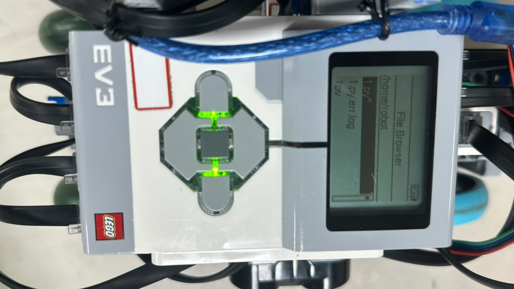
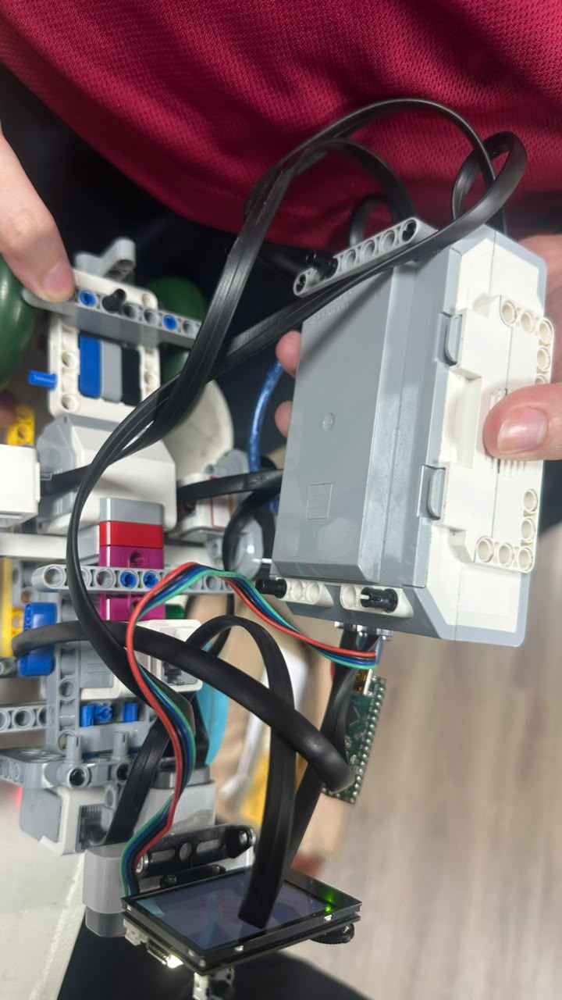
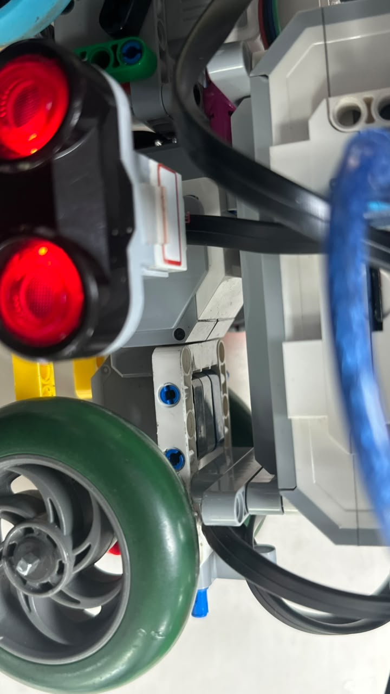
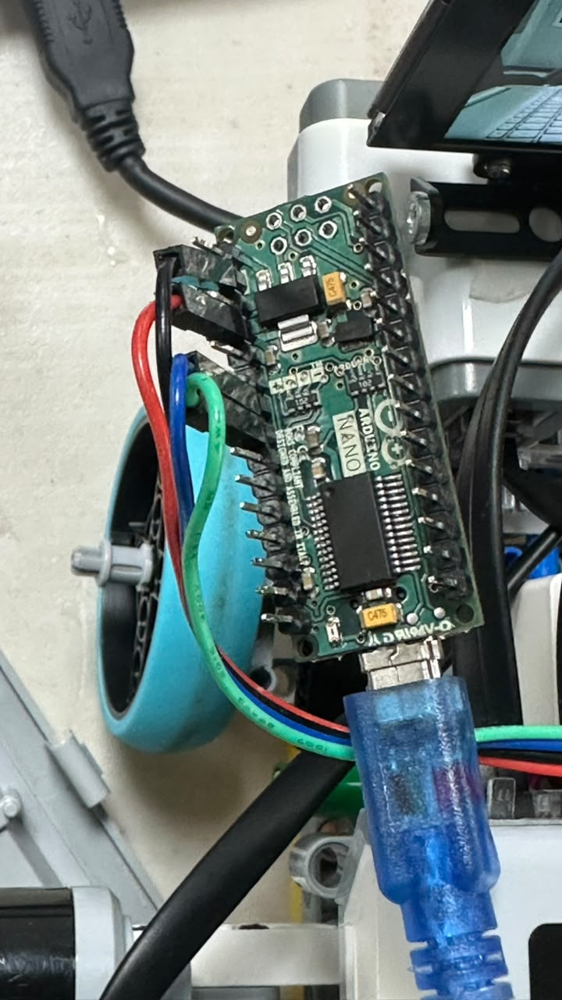
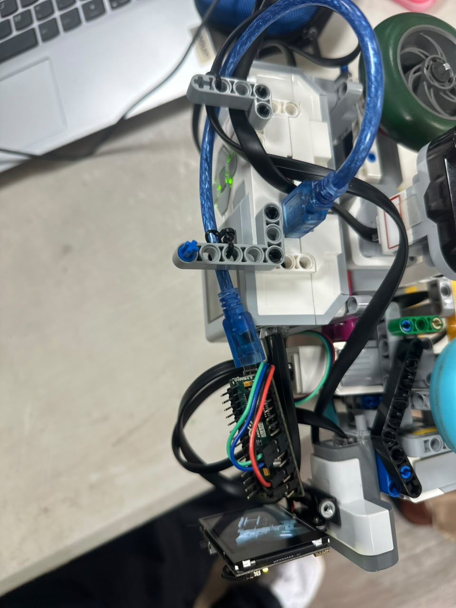
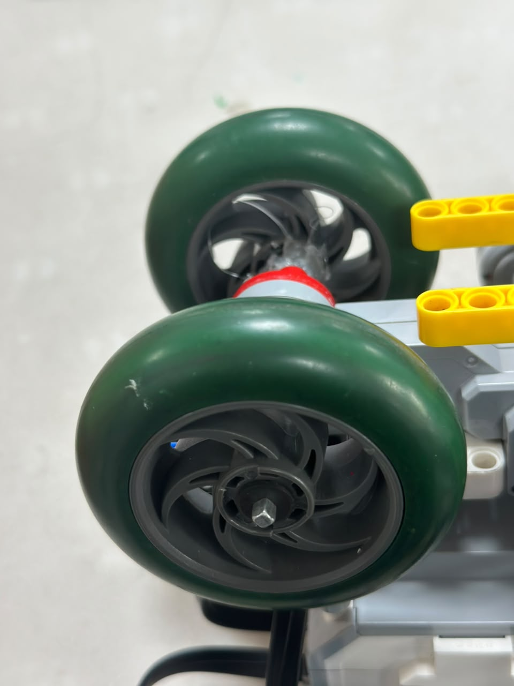

<h1 align="center">ᯓ★ 5.1 Bill of Materials — Cheese v4 ᯓ★</h1>

  
  
  

  <em>
    This Bill of Materials documents the components currently used in Cheese v4,
    their quantity, model, role, connection and importance for reproducing the robot.
  </em>

  ✦ ─── ⋆⋅☆⋅⋆ ─── (❁´◡`❁) ─── ⋆⋅☆⋅⋆ ─── ✦

---

## 5.1.1 Current Build Summary

Cheese v4 is built around the LEGO MINDSTORMS EV3 platform, with an Arduino Nano and HuskyLens added for the vision system.

| Build Property | Current Cheese v4 |
| :--- | :--- |
| **Main controller** | LEGO EV3 Intelligent Brick |
| **Power source** | EV3 Rechargeable Battery |
| **Drive motor** | 1 EV3 Large Servo Motor |
| **Steering motor** | 1 EV3 Medium Servo Motor |
| **Ultrasonic sensors** | 3 |
| **Color sensors** | 1 |
| **Vision sensor** | 1 HuskyLens |
| **Vision bridge** | 1 Arduino Nano |
| **Steering system** | Front Ackermann steering |
| **Drive system** | Rear-wheel propulsion |
| **Current measured mass** | **666 g** |
| **Auxiliary lighting** | Not used in v4 |

  

  <em>Current Cheese v4 configuration.</em>

---

## 5.1.2 Complete Cheese v4 Bill of Materials

The following table lists the major components required to reproduce Cheese v4.

| Reference Image | Component | Qty. | Model / Reference | Function in Cheese | Connection |
| :---: | :--- | :---: | :--- | :--- | :--- |
|  | **EV3 Intelligent Brick** | 1 | LEGO 45500 | Main controller | Central control |
|  | **EV3 Rechargeable Battery** | 1 | LEGO 45501 | Main power source | EV3 Brick |
|  | **EV3 Large Servo Motor** | 1 | LEGO 45502 | Rear propulsion | Output B |
|  | **EV3 Medium Servo Motor** | 1 | LEGO 45503 | Ackermann steering | Output A |
|  | **EV3 Ultrasonic Sensor** | 3 | LEGO 45504 | Left, right and front distance sensing | Inputs 1–3 |
|  | **EV3 Color Sensor** | 1 | LEGO 45506 | Floor-color / curve-event detection | Input 4 |
|  | **HuskyLens AI Vision Sensor** | 1 | SEN0305 / K210 | Colored-pillar recognition | I²C → Arduino Nano |
|  | **Arduino Nano** | 1 | ATmega328 | Vision communication bridge | USB → EV3 |
| — | **Front SPIKE wheel assemblies** | 2 | Approx. 56 × 14 mm class | Front steering contact | Front axle |
| — | **Rear EV3 / Technic wheels** | 2 | LEGO Technic | Propulsion | Rear axle |
| — | **Ackermann steering linkage** | 1 system | LEGO Technic | Converts motor rotation into front-wheel steering | Front chassis |
| — | **Rear drive axle system** | 1 system | LEGO Technic | Transfers propulsion to rear wheels | Rear chassis |
| — | **Technic liftarms / beams** | ~50 | Assorted | Main chassis structure | Throughout robot |
| — | **Technic pins** | ~70 | Assorted | Structural connections | Throughout robot |
| — | **Technic axles** | 9 | Assorted | Steering, drivetrain and wheels | Mechanical systems |
| — | **Bushings / spacers** | 7 | Assorted | Axle alignment and spacing | Mechanical systems |
| — | **EV3 motor cables** | 2 | EV3 cable | Motor connection | EV3 outputs |
| — | **EV3 sensor cables** | 4 | EV3 cable | Sensor connection | EV3 inputs |
| — | **USB Type-A → Mini-B cable** | 1 | Short USB cable | Nano ↔ EV3 communication | EV3 USB |
| — | **HuskyLens I²C wires** | 4 conductors | VCC, GND, SDA, SCL | Camera ↔ Nano connection | Nano A4/A5 + power |

> External product images in this table are used only as component-identification references. The linked source pages identify the original component.

---

## 5.1.3 Main Controller — LEGO EV3 Intelligent Brick

  

  <em>LEGO EV3 Intelligent Brick — external reference image, BrickLink.</em>

The EV3 Intelligent Brick is the main controller of Cheese.

Its responsibilities include:

- running the navigation program,
- reading all EV3 sensors,
- controlling the Large Motor,
- controlling the Medium Motor,
- receiving vision information from the Arduino Nano,
- managing Open Challenge navigation,
- and coordinating obstacle behavior.

### Cheese v4 placement

  

The Brick is mounted flatter than in earlier Cheese versions, with the screen facing upward for easier inspection and operation.

---

## 5.1.4 Power Supply — EV3 Rechargeable Battery

  

  <em>LEGO EV3 Rechargeable DC Battery — external reference image, BrickLink.</em>

The EV3 Rechargeable Battery supplies the main electrical power for Cheese.

The battery powers:

- the EV3 Brick,
- both motors,
- EV3 sensors,
- and the connected control architecture.

Battery condition can influence motor response and therefore affects calibration consistency.

  

The v4 structure keeps the battery accessible so it can be charged without major disassembly.

---

## 5.1.5 Propulsion Motor — EV3 Large Servo Motor

  

  <em>LEGO EV3 Large Servo Motor 45502 — external reference image, BrickLink.</em>

**Quantity:** 1  
**Port:** Output B  
**Role:** Propulsion

The Large Motor drives Cheese through the rear-wheel drivetrain.

In v4, the Large Motor is positioned horizontally.

  

  <strong>Large Motor → Rear Drivetrain → Rear Wheels</strong>

The motor position is important because changing its integration can affect chassis geometry, drivetrain alignment and weight distribution.

---

## 5.1.6 Steering Motor — EV3 Medium Servo Motor

  

  <em>LEGO EV3 Medium Servo Motor 45503 — external reference image, BrickLink.</em>

**Quantity:** 1  
**Port:** Output A  
**Role:** Steering actuator

The Medium Motor controls the front Ackermann steering mechanism.

  

It does not propel the robot.

Its purpose is:

  <strong>Medium Motor → Steering Linkage → Front Wheel Angle</strong>

---

## 5.1.7 Ultrasonic Sensors

  

  <em>LEGO EV3 Ultrasonic Sensor 45504 — external reference image, BrickLink.</em>

Cheese v4 uses **three ultrasonic sensors**.

| Position | EV3 Input | Function |
| :--- | :---: | :--- |
| **Left** | Input 1 | Left-wall distance |
| **Right** | Input 2 | Right-wall distance |
| **Front** | Input 3 | Forward safety and recovery |

### Left and right sensors

  

The two lateral sensors provide wall-distance information to the Open navigation controller.

### Front sensor

  

The front sensor supports forward-wall detection and reverse-recovery behavior.

The placement of these sensors is considered critical.

  <strong>Sensor Geometry → Distance Measurement → Steering Decision</strong>

Changing their height or angle can require PID recalibration.

---

## 5.1.8 Color Sensor

  

  <em>LEGO EV3 Color Sensor 45506 — external reference image, BrickLink.</em>

**Quantity:** 1  
**Port:** Input 4  
**Orientation:** Floor-facing

The Color Sensor is used to identify floor-color events used by the Open Challenge curve-counting logic.

  

Its distance from the floor is important.

  

The current v4 position was selected after testing an earlier improvised light shield that created floor-dragging problems.

The current design keeps the sensor low enough for useful readings without relying on the previous dragging cover.

---

## 5.1.9 HuskyLens Vision Sensor

  

  <em>HuskyLens AI Vision Sensor — external reference image, DFRobot.</em>

**Quantity:** 1  
**Role:** Obstacle Challenge vision

The HuskyLens recognizes the colored WRO pillars.

Current Cheese training:

| Pillar | HuskyLens ID | Required Passing Side |
| :--- | :---: | :---: |
| **Green** | **ID 1** | **Left** |
| **Red** | **ID 2** | **Right** |

  

The camera position and angle affect:

- when the pillar enters the image,
- apparent pillar position,
- reaction distance,
- and avoidance timing.

Because of this, the camera geometry is considered a reproducibility-critical part of the robot.

---

## 5.1.10 Arduino Nano

  

  <em>Classic Arduino Nano — external reference image, Arduino.</em>

The Arduino Nano is used as the communication bridge between the HuskyLens and the EV3.

### Main Nano information

| Property | Value |
| :--- | :--- |
| **Microcontroller** | ATmega328 |
| **Operating voltage** | 5 V |
| **USB connector** | Mini-B |
| **I²C SDA** | A4 |
| **I²C SCL** | A5 |

The communication architecture is:

  <strong>HuskyLens → I²C → Arduino Nano → USB Serial → EV3</strong>

  

The Nano is not Cheese's main controller.

It performs a specialized bridge role for the vision system.

---

## 5.1.11 HuskyLens-to-Nano Wiring

The HuskyLens communicates with the Arduino Nano using I²C.

| HuskyLens | Arduino Nano |
| :--- | :--- |
| **VCC / +** | 5V |
| **GND / −** | GND |
| **SDA / T** | A4 |
| **SCL / R** | A5 |

  

The Nano then connects to the EV3 using a USB Type-A to Mini-B cable.

  

---

## 5.1.12 Wheel System

Cheese uses different front and rear wheel roles.

| Wheel Position | Qty. | Function |
| :--- | :---: | :--- |
| **Front SPIKE assemblies** | 2 | Steering contact |
| **Rear EV3 / Technic wheels** | 2 | Propulsion |

### Front wheels

  

Only the front wheels were changed during the major v4 redesign.

They primarily influence:

- front grip,
- steering response,
- and curve behavior.

### Rear wheels

  

The rear wheels remain the propulsion contact points.

---

## 5.1.13 Ackermann Steering Assembly

  

The steering system is made from LEGO Technic elements rather than a single purchased component.

Main elements include:

- Medium Motor,
- steering axle,
- steering linkage,
- front wheel supports,
- axles,
- bushings,
- and structural beams.

The geometry matters as much as the parts themselves.

  <strong>Same Parts + Different Steering Geometry = Different Turning Behavior</strong>

---

## 5.1.14 Structural LEGO Technic Inventory

The exact colors of structural elements are not important.

Their geometry and purpose are.

| Structural Component | Approx. Quantity | Purpose |
| :--- | :---: | :--- |
| **Technic liftarms / beams** | ~50 | Main chassis and support structure |
| **Technic pins** | ~70 | Structural connections |
| **Technic axles** | 9 | Wheels, drivetrain and steering |
| **Bushings / spacers** | 7 | Axle spacing and alignment |
| **Minor support pieces** | As required | Local reinforcement |
| **Dedicated separate sensor mounts** | 0 | Sensors mounted directly into Technic structure |

The purpose of this approximate count is to help another builder estimate the number of structural elements needed.

Minor reinforcement can vary slightly if the main geometry remains unchanged.

---

## 5.1.15 Wiring Inventory

| Cable / Connection | Qty. | Function |
| :--- | :---: | :--- |
| **EV3 motor cables** | 2 | EV3 to Large and Medium Motors |
| **EV3 sensor cables** | 4 | EV3 to 3 Ultrasonic Sensors and Color Sensor |
| **USB Type-A → Mini-B** | 1 | EV3 to Arduino Nano |
| **I²C conductors** | 4 | HuskyLens to Arduino Nano |
| **Cable retention pieces** | As needed | Keep wiring away from wheels and steering |

Only the Nano USB cable was intentionally changed to a shorter cable during the v4 redesign.

The main EV3 motor and sensor cables remained standard.

  

---

## 5.1.16 Port Map

The software assumes the following physical connections.

| Device | Cheese v4 Connection |
| :--- | :---: |
| **Medium Steering Motor** | Output A |
| **Large Drive Motor** | Output B |
| **Left Ultrasonic Sensor** | Input 1 |
| **Right Ultrasonic Sensor** | Input 2 |
| **Front Ultrasonic Sensor** | Input 3 |
| **Color Sensor** | Input 4 |
| **Arduino Nano** | EV3 USB |
| **HuskyLens** | Arduino Nano via I²C |

Connecting the same sensor to another EV3 port without changing the code can cause the software to interpret the wrong input.

---

## 5.1.17 Critical and Flexible Components

Not every component needs the same level of reproduction accuracy.

| Component / Property | Classification | Reason |
| :--- | :---: | :--- |
| EV3 Brick | Critical | Main controller |
| Large Motor | Critical | Propulsion |
| Medium Motor | Critical | Steering |
| 3 Ultrasonic Sensors | Critical | Navigation and safety sensing |
| Ultrasonic positions | Critical | Changes wall measurements |
| Color Sensor | Critical | Curve-event detection |
| Color Sensor floor gap | Critical | Changes readings |
| HuskyLens | Critical | Obstacle vision |
| Camera position / angle | Critical | Changes recognition timing |
| Arduino Nano | Critical | Vision communication |
| Wheel dimensions | Critical | Affects physical motion |
| Ackermann geometry | Critical | Defines turn behavior |
| Axle lengths | Critical | Mechanical alignment |
| Liftarm color | Flexible | Cosmetic |
| Pin color | Flexible | Cosmetic if mechanically equivalent |
| Minor reinforcement | Semi-critical | May vary without changing main geometry |
| Cable retention method | Flexible | Must only avoid interference |
| Nano support method | Semi-critical | Can vary if connection remains safe |

---

## 5.1.18 v3 → v4 Component Transition

Cheese v4 reused the systems that were still useful while modifying or removing components that created unnecessary mass or complexity.

| Carried Over | Modified / Repositioned | Removed |
| :--- | :--- | :--- |
| EV3 Brick | EV3 orientation | Large camera structure |
| EV3 Battery | Large Motor orientation | Auxiliary lights |
| Large Motor | HuskyLens position | Lamp mounts |
| Medium Motor | Ultrasonic placement | External lighting support |
| Color Sensor | Color Sensor floor gap | Lighting wiring |
| Ultrasonic Sensors | Front wheel system | Upper tower structure |
| HuskyLens | Nano USB cable | Extra liftarms |
| Arduino Nano | Cable organization | Extra pins |
| Rear wheels | Overall chassis layout | Extra axles |
| Useful Technic pieces | Steering integration | Redundant supports |

  

  

The goal was not simply to use fewer parts.

It was to remove parts that no longer justified their mechanical or functional cost.

---

## 5.1.19 Mass Transition

| Version | Mass |
| :--- | :---: |
| **Cheese v3** | **888.8 g** |
| **Cheese v4** | **666 g** |
| **Difference** | **222.8 g less** |
| **Approximate reduction** | **25%** |

The reduction was achieved mainly by simplifying the structure, removing obsolete supports and eliminating the old auxiliary-light system.

---

## 5.1.20 Replacement Rules

A reproducible robot does not require every cosmetic LEGO element to be identical.

However, functional geometry should remain consistent.

| Proposed Change | Safe Without Recalibration? | Reason |
| :--- | :---: | :--- |
| Same liftarm in another color | Yes | Geometry unchanged |
| Equivalent pin color | Yes | Connection unchanged |
| Different cable retention | Usually | Does not alter motion |
| Minor extra reinforcement | Usually | Must not change geometry |
| Different Nano support | Usually | Must remain secure |
| Different ultrasonic position | No | Changes measurements |
| Different Color Sensor height | No | Changes floor reading |
| Different wheel diameter | No | Changes robot behavior |
| Different steering linkage | No | Changes turning geometry |
| Different motor type | No | Changes actuation |
| Different camera angle | No | Changes obstacle detection timing |

---

## 5.1.21 Real Robot Component Map

The following views show how the BOM components are integrated into the real robot.

| Front | Rear |
| :---: | :---: |
|  |  |

| Top | Bottom |
| :---: | :---: |
|  |  |

Generic product images identify **what each component is**.

These robot photographs show **where and how the component is used in Cheese**.

---

## 5.1.22 External Component References

The following sources were used to identify the main purchased electronic and EV3 components shown in this Bill of Materials.

| Component | External Reference |
| :--- | :--- |
| **EV3 Intelligent Brick 45500** | [BrickLink component reference](https://www.bricklink.com/v2/catalog/catalogitem.page?S=45500) |
| **EV3 Rechargeable Battery 45501** | [BrickLink component reference](https://www.bricklink.com/v2/catalog/catalogitem.page?S=45501) |
| **EV3 Large Servo Motor 45502** | [BrickLink component reference](https://www.bricklink.com/v2/catalog/catalogitem.page?S=45502) |
| **EV3 Medium Servo Motor 45503** | [BrickLink component reference](https://www.bricklink.com/v2/catalog/catalogitem.page?S=45503) |
| **EV3 Ultrasonic Sensor 45504** | [BrickLink component reference](https://www.bricklink.com/v2/catalog/catalogitem.page?S=45504) |
| **EV3 Color Sensor 45506** | [BrickLink component reference](https://www.bricklink.com/v2/catalog/catalogitem.page?S=45506) |
| **Arduino Nano** | [Arduino official product reference](https://store.arduino.cc/products/arduino-nano) |
| **HuskyLens** | [DFRobot official product reference](https://www.dfrobot.com/product-1989.html) |

These external images are used for component identification only.  
All configuration, quantity, placement and robot-specific information is based on the actual Cheese v4 build.

---

## 5.1.23 Reproducibility Checklist

Before considering a Cheese v4 reconstruction complete:

- [ ] EV3 Brick installed securely
- [ ] EV3 Battery accessible
- [ ] Large Motor connected to Output B
- [ ] Medium Motor connected to Output A
- [ ] Ackermann linkage moves freely
- [ ] Rear drivetrain rotates freely
- [ ] Two front SPIKE wheel assemblies installed
- [ ] Rear drive wheels aligned
- [ ] Left Ultrasonic connected to Input 1
- [ ] Right Ultrasonic connected to Input 2
- [ ] Front Ultrasonic connected to Input 3
- [ ] Color Sensor connected to Input 4
- [ ] Color Sensor has correct floor clearance
- [ ] HuskyLens faces forward
- [ ] Camera angle checked
- [ ] Arduino Nano connected
- [ ] HuskyLens I²C wiring checked
- [ ] Nano USB connection checked
- [ ] Wiring does not interfere with steering
- [ ] Wiring does not touch wheels
- [ ] Chassis remains rigid
- [ ] Battery is sufficiently charged
- [ ] Sensor readings are checked before autonomous testing

---

## 5.1.24 Related Documentation

| Document | Purpose |
| :--- | :--- |
| [`5.2 Build Instructions`](5.2-build-instructions.md) | Physical assembly procedure |
| [`2.2 Wiring Diagram`](../02-power-and-sensor-architecture/2.2-wiring-diagram.md) | Electrical and communication architecture |
| [`2.3 Sensor Selection and Placement`](../02-power-and-sensor-architecture/2.3-sensor-selection-and-placement.md) | Sensor purpose and geometry |
| [`2.4 Sensor Calibration`](../02-power-and-sensor-architecture/2.4-sensor-calibration.md) | Sensor tuning |
| [`1.3 Steering and Drive`](../01-mobility-and-mechanical-design/1.3-steering-and-drive.md) | Drivetrain and steering system |
| [`4.1 Design Decision Log`](../04-engineering-decisions/4.1-design-decision-log.md) | Engineering reasoning |
| [`4.2 What Did Not Work`](../04-engineering-decisions/4.2-what-didnt-work.md) | Failures and redesign decisions |
| [`v-photos/v4`](../../v-photos/v4/) | Complete current robot photographs |

---

## 5.1.25 Final BOM Summary

The current Cheese v4 architecture can be separated into six major groups.

| System | Main Components |
| :--- | :--- |
| **Control** | EV3 Brick |
| **Power** | EV3 Rechargeable Battery |
| **Movement** | Large Motor, Medium Motor, wheels and Ackermann steering |
| **Sensing** | 3 Ultrasonic Sensors and 1 Color Sensor |
| **Vision** | HuskyLens and Arduino Nano |
| **Structure** | Technic beams, pins, axles and bushings |

The Bill of Materials alone does not completely reproduce Cheese.

Another builder must also preserve:

- sensor position,
- sensor height,
- camera angle,
- steering geometry,
- wheel geometry,
- wiring,
- motor assignment,
- and calibration.

  <strong>
    Components + Geometry + Connections + Calibration = Reproducible Cheese v4
  </strong>

  ✦ ─── ⋆⋅☆⋅⋆ ─── (❁´◡`❁) ─── ⋆⋅☆⋅⋆ ─── ✦

  

