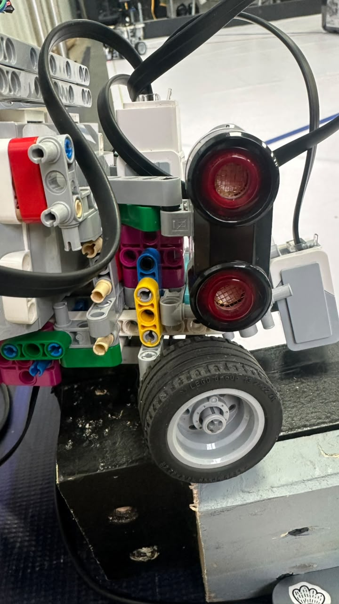
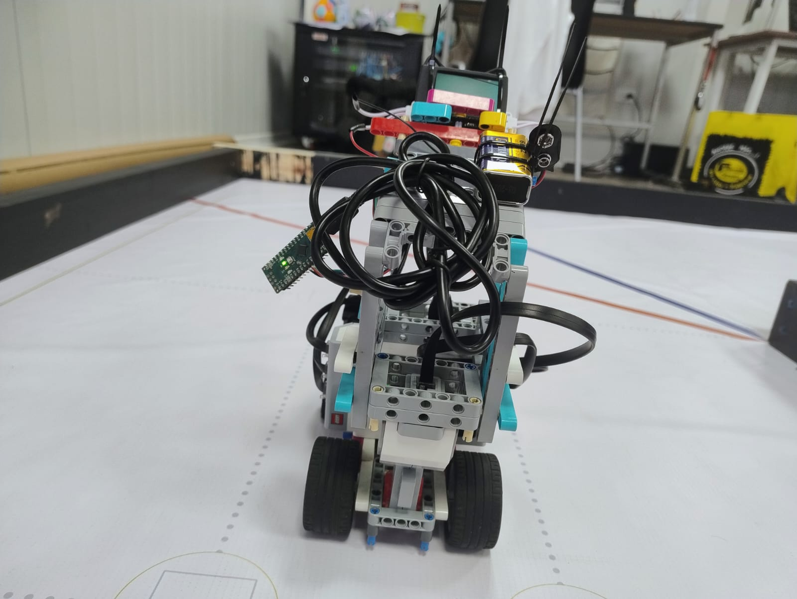

# ᯓ★ 5.2 Build Instructions ᯓ★

  
  
  

  <em>This section explains how to rebuild, wire, calibrate, and test Cheese v3. The goal is to make the robot reproducible by documenting the build order, subsystem placement, wiring layout, calibration routine, and testing workflow.</em>

---

## ❀ Build Overview ────୨ৎ────────୨ৎ────

These instructions are for **Cheese v3**, our current WRO Future Engineers robot. This version uses an EV3-based control system, rear-wheel propulsion, Ackermann steering, ultrasonic wall sensing, floor color detection, HuskyLens obstacle recognition, and a dual-light support system.

| Build Area | Main Purpose |
| :--- | :--- |
| **Base chassis** | Holds the EV3, motors, sensors, wiring, and upper structure. |
| **Drive system** | Uses the EV3 Large Motor to move the robot forward. |
| **Steering system** | Uses the EV3 Medium Motor to control the Ackermann linkage. |
| **Wall sensing** | Uses two ultrasonic sensors to detect wall distance. |
| **Floor sensing** | Uses a color sensor to detect track colors and curve markers. |
| **Vision system** | Uses the HuskyLens and Arduino Nano for obstacle recognition. |
| **Lighting system** | Uses two auxiliary lamps powered by a separate 9V battery. |
| **Cable management** | Keeps wires away from wheels, steering parts, and sensors. |

---

## ❀ Visual References ────୨ৎ────────୨ৎ────

  

  <em>Labeled front angle of Cheese v3 showing the main components used in the final build.</em>

  

  <em>Side view showing the vertical support tower, wheelbase, wiring route, and upper electronics.</em>

---

## ❀ Recommended Build Order ────୨ৎ────────୨ৎ────

Cheese should be built in stages so each subsystem can be checked before the next one is added.

| Stage | Build Step | Why It Matters |
| :---: | :--- | :--- |
| **1** | Build the base chassis | Creates the foundation for the whole robot. |
| **2** | Install the rear drive system | Allows propulsion to be checked early. |
| **3** | Install the Ackermann steering system | Allows steering alignment and centering to be tested. |
| **4** | Mount the EV3 Brick | Establishes the main control and power location. |
| **5** | Build the upper support tower | Holds the HuskyLens, Arduino Nano, 9V battery, lights, and wiring. |
| **6** | Install sensors | Adds wall, floor, and vision detection. |
| **7** | Install the dual-light system | Improves camera and floor visibility. |
| **8** | Wire all components | Connects motors, sensors, camera, Arduino, and lights. |
| **9** | Calibrate the robot | Makes sure readings and movement are reliable. |
| **10** | Test in stages | Confirms the robot works before full runs. |

---

## ❀ 1. Base Chassis ────୨ৎ────────୨ৎ────

Start by building the lower chassis using LEGO Technic liftarms, beams, pins, axles, and connectors. The chassis must be strong enough to hold the EV3 Brick, motors, sensors, wheels, and upper tower without twisting during motion.

The base chassis should include:

| Chassis Area | Purpose |
| :--- | :--- |
| **Main lower frame** | Holds the EV3 Brick and connects the front and rear mechanisms. |
| **Side supports** | Reduce bending and keep the body aligned. |
| **Front steering area** | Holds the Ackermann steering system and front wheels. |
| **Rear drive area** | Holds the Large Motor and rear wheels. |
| **Upper tower mounting points** | Support the camera, lights, 9V battery, and wiring. |

  

  <em>Bottom view showing the lower structure, wheelbase, and chassis support layout.</em>

### Chassis checks

| Check | Correct Result |
| :--- | :--- |
| **Frame rigidity** | The chassis should not twist easily. |
| **Pin pressure** | Pins should not be forced into place or overloaded. |
| **Symmetry** | Left and right sides should be aligned. |
| **Wheel clearance** | Wheels should not rub against liftarms, cables, or sensors. |
| **Mounting strength** | Motors and EV3 should stay firmly attached during movement. |

---

## ❀ 2. Rear Drive System ────୨ৎ────────୨ৎ────

The rear drive system is responsible for propulsion. Install the **EV3 Large Motor** in the rear drive section and connect it to the rear wheels through a stable axle or drive connection.

| Component | Quantity | Placement | Purpose |
| :--- | :---: | :--- | :--- |
| **EV3 Large Motor** | 1 | Rear drive section | Provides propulsion torque. |
| **Rear wheels** | 2 | Rear axle area | Move the robot forward. |
| **Rear tires** | 2 | Rear wheels | Provide traction on the WRO mat. |
| **Rear drive axle / connection** | 1 system | Between motor and wheels | Transfers rotation from the motor to the wheels. |

Before adding more weight, rotate the rear wheels by hand. Both wheels should spin freely and stay aligned. If the rear wheels are misaligned, Cheese may drift, lose speed, or require unnecessary steering correction.

---

## ❀ 3. Ackermann Steering System ────୨ৎ────────୨ৎ────

The steering system uses an **EV3 Medium Motor** connected to an Ackermann-style linkage. This allows the front wheels to turn together and guide the robot through straight sections and curves.

| Component | Quantity | Placement | Purpose |
| :--- | :---: | :--- | :--- |
| **EV3 Medium Motor** | 1 | Front/center steering area | Controls the steering angle. |
| **Ackermann steering linkage** | 1 system | Front wheel mechanism | Turns both front wheels together. |
| **Front steering wheels** | 2 | Front axle/steering area | Control robot direction. |
| **Steering axles and connectors** | Various | Front mechanism | Transfer motor movement to the wheels. |

  

  <em>Front view of Cheese v3 showing the wheel, steering, sensor, and lighting layout.</em>

### Steering checks

| Check | Correct Result |
| :--- | :--- |
| **Left/right movement** | Front wheels turn smoothly both ways. |
| **Center position** | Wheels return to a straight neutral position. |
| **Linkage movement** | No part jams, scrapes, or bends. |
| **Motor stability** | Medium Motor does not shift when steering. |
| **Cable clearance** | No wire pulls on the steering linkage. |

A wrong steering center can make the robot drift even when the code is correct, so mechanical centering must be checked before software tuning.

---

## ❀ 4. EV3 Brick Placement ────୨ৎ────────୨ৎ────

Mount the **EV3 Brick** in the central body of the robot. It should be firmly attached so the robot’s weight distribution stays consistent during turns and corrections.

| EV3 Placement Requirement | Reason |
| :--- | :--- |
| **Stable mounting** | Prevents the EV3 from shifting during movement. |
| **Accessible ports** | Makes wiring and debugging easier. |
| **Balanced position** | Reduces tipping and uneven weight distribution. |
| **Clear cable paths** | Keeps wires away from moving parts. |

The EV3 Brick acts as the main controller and main power source for the EV3 motors and EV3-connected sensors.

---

## ❀ 5. Upper Support Tower ────୨ৎ────────୨ৎ────

Build the vertical support tower above the main chassis. This structure holds the HuskyLens camera, Arduino Nano, 9V battery, lamps, and some of the wiring.

| Tower Component | Purpose |
| :--- | :--- |
| **Vertical liftarms** | Hold upper electronics above the chassis. |
| **Cross supports** | Reduce tower movement and vibration. |
| **Camera mount** | Holds the HuskyLens at the correct height and angle. |
| **9V battery support** | Holds the external lighting battery. |
| **Cable routing area** | Keeps wires organized and away from wheels and steering. |

  

  <em>Top view showing the upper support structure, wiring organization, and component layout.</em>

The tower should not swing or twist during movement. If the tower moves, the camera angle and lamp direction can change, making obstacle recognition and color detection less reliable.

---

## ❀ 6. Ultrasonic Sensor Installation ────୨ৎ────────୨ৎ────

Cheese uses two ultrasonic sensors to detect wall distance. These sensors help the robot understand its position between the walls.

| Sensor | Placement | Purpose |
| :--- | :--- | :--- |
| **Left ultrasonic sensor** | Left side/front-side area | Measures distance from the left wall. |
| **Right ultrasonic sensor** | Right side/front-side area | Measures distance from the right wall. |

  

  <em>Left-side ultrasonic sensor placement used for wall distance detection.</em>

  

  <em>Right-side ultrasonic sensor placement used for wall distance detection.</em>

### Ultrasonic placement rules

| Rule | Reason |
| :--- | :--- |
| **Keep sensor faces clear** | Cables or LEGO parts can block readings. |
| **Mount sensors firmly** | Moving sensors change the measured distance. |
| **Avoid extreme angles** | Readings may bounce away from the wall. |
| **Keep both sides comparable** | Helps the robot interpret left and right distances correctly. |

---

## ❀ 7. Color Sensor Installation ────୨ৎ────────୨ৎ────

Mount the color sensor close to the ground in the lower front area. This sensor reads track colors and supports curve timing.

| Requirement | Reason |
| :--- | :--- |
| **Close to the floor** | Improves color reading accuracy. |
| **Stable height** | Prevents readings from changing during movement. |
| **Clear view of the mat** | Avoids blocked or shadowed readings. |
| **Lower lamp support** | Improves floor visibility and color consistency. |

  

  <em>Front sensor placement showing the lower sensing area and final v3 sensor layout.</em>

If the color sensor misses colors, check the sensor height, the lower lamp angle, and the color thresholds in the code before changing the full navigation logic.

---

## ❀ 8. HuskyLens and Arduino Nano Installation ────୨ৎ────────୨ৎ────

Mount the **HuskyLens AI Camera** on the upper front area of the robot. It should have a clear view of the obstacle field. The **Arduino Nano** should be mounted near the camera and wiring area so it can act as a communication bridge.

| Component | Placement | Purpose |
| :--- | :--- | :--- |
| **HuskyLens AI Camera** | Upper front camera mount | Detects red and green obstacles. |
| **Arduino Nano ATmega328P** | Upper/side wiring area | Bridges HuskyLens data into the EV3-based architecture. |
| **I2C wires** | HuskyLens to Arduino Nano | Provides communication and power connection. |

  

  <em>Camera placement showing the HuskyLens position used for obstacle detection.</em>

The HuskyLens should not be blocked by wires, liftarms, lamps, or the 9V battery. If the camera view is blocked, obstacle recognition becomes unreliable.

---

## ❀ 9. Dual-Light Support System ────୨ৎ────────୨ৎ────

Cheese uses two auxiliary lamps powered by a separate 9V battery. The lamps support two different sensing tasks.

| Lamp | Placement | Sensor Supported | Purpose |
| :--- | :--- | :--- | :--- |
| **Upper helping lamp** | Upper front area | HuskyLens camera | Improves obstacle visibility and color recognition. |
| **Lower helping lamp** | Lower front area, near the floor | Color sensor | Improves floor illumination and color reading consistency. |

  

  <em>Dual-light support system. The upper lamp supports obstacle recognition, while the lower lamp supports floor color detection.</em>

The lamps should be powered by the external **9V battery**, not by the EV3. This keeps the lighting system separated from the main EV3 power system, which already powers the motors, sensors, and robot control logic.

---

## ❀ 10. Wiring and Port Map ────୨ৎ────────୨ৎ────

Connect the motors, sensors, Arduino Nano, HuskyLens, and lamps according to the robot’s wiring architecture.

| Device | Port / Connection | Purpose |
| :--- | :--- | :--- |
| **EV3 Large Motor** | Output B | Rear propulsion. |
| **EV3 Medium Motor** | Output A | Steering control. |
| **Left Ultrasonic Sensor** | Input S3 | Left wall detection. |
| **Right Ultrasonic Sensor** | Input S2 | Right wall detection. |
| **Color Sensor** | Input S4 | Floor color detection. |
| **Arduino Nano** | EV3 USB / communication setup | Vision bridge. |
| **HuskyLens** | Arduino Nano I2C pins | Obstacle recognition. |
| **Upper and lower helping lamps** | External 9V battery circuit | Lighting support. |

> **Important:** The physical wiring must match the code. If a motor or sensor is moved to another port, the code must be updated too.

Related file:  
[`2.2-wiring-diagram.md`](../02-power-and-sensor-architecture/2.2-wiring-diagram.md)

---

## ❀ 11. Cable Management ────୨ৎ────────୨ৎ────

Cable management is part of the build because loose wires can affect movement, sensor readings, and reliability.

| Cable Management Rule | Why It Matters |
| :--- | :--- |
| **Keep cables away from wheels** | Prevents friction and unexpected stops. |
| **Keep cables away from steering linkage** | Prevents steering resistance or delayed steering. |
| **Do not block ultrasonic sensors** | Keeps wall distance readings reliable. |
| **Do not block the HuskyLens lens** | Keeps obstacle recognition clear. |
| **Do not block the color sensor** | Keeps floor detection consistent. |
| **Secure wires on the upper tower** | Reduces disconnections and cable movement. |
| **Leave controlled slack where needed** | Prevents cables from pulling during turns. |

  

  <em>Back view showing wiring routes, upper structure, and rear layout.</em>

---

## ❀ 12. Pre-Run Calibration ────୨ৎ────────୨ৎ────

Before full testing, calibrate the mechanical, sensor, lighting, and software systems.

| Calibration Area | What to Check | Why It Matters |
| :--- | :--- | :--- |
| **Steering center** | Front wheels point straight when centered. | Prevents drifting during straight movement. |
| **Large Motor direction** | Robot moves forward when drive motor runs. | Prevents reversed movement. |
| **Medium Motor direction** | Steering turns in the expected direction. | Prevents opposite corrections. |
| **Ultrasonic readings** | Left and right sensors return stable distances. | Supports PID and wall protection. |
| **Color sensor readings** | Track colors are detected under the lower lamp. | Supports curve timing. |
| **HuskyLens recognition** | Red and green obstacles are detected correctly. | Supports obstacle strategy. |
| **Upper lamp angle** | Obstacle colors are visible to the camera. | Improves vision reliability. |
| **Lower lamp angle** | Floor is illuminated near the color sensor. | Improves color detection. |
| **Cable clearance** | No wires touch wheels or steering. | Prevents mechanical interference. |

---

## ❀ 13. Testing Workflow ────୨ৎ────────୨ৎ────

Test Cheese in stages instead of starting with a full competition run immediately.

| Test Stage | What to Test | Goal |
| :---: | :--- | :--- |
| **1** | EV3 startup | Confirm the program starts correctly. |
| **2** | Large Motor | Confirm drive direction and speed. |
| **3** | Medium Motor | Confirm steering direction and centering. |
| **4** | Ackermann linkage | Confirm smooth steering movement. |
| **5** | Ultrasonic sensors | Confirm left and right distance readings. |
| **6** | Color sensor | Confirm floor color detection. |
| **7** | HuskyLens | Confirm red/green obstacle recognition. |
| **8** | Dual-light system | Confirm both lamps improve visibility. |
| **9** | Short straight run | Confirm stable movement between walls. |
| **10** | Curve test | Confirm curve entry and exit behavior. |
| **11** | Full open round test | Confirm three-lap navigation. |
| **12** | Parking test | Confirm final stop position. |
| **13** | Obstacle test | Confirm obstacle recognition and response. |

Testing in stages makes debugging easier because each problem can be connected to a specific subsystem.

---

## ❀ 14. Common Problems and Fixes ────୨ৎ────────୨ৎ────

| Problem | Possible Cause | Suggested Fix |
| :--- | :--- | :--- |
| **Robot pulls to one side** | Steering center is off or wheels are misaligned. | Recenter steering and check wheel alignment. |
| **Steering gets stuck** | Linkage friction, tight pins, or cable interference. | Check linkage movement and reroute cables. |
| **Robot oscillates between walls** | PID values are too aggressive or ultrasonic readings are unstable. | Tune PID and check sensor mounts. |
| **Robot crashes after curves** | Poor curve exit angle or weak recovery logic. | Tune curve behavior and post-curve recovery. |
| **Curves are too wide** | Steering angle or curve timing is too weak. | Increase curve steering carefully and retest. |
| **Color sensor misses colors** | Sensor is too high or floor is too dark. | Adjust sensor height or lower lamp angle. |
| **HuskyLens misses obstacles** | Camera angle, lighting, or training is incorrect. | Adjust camera, upper lamp, and training settings. |
| **Cables interfere with movement** | Wires are loose near wheels or steering. | Secure cables and reroute them through the upper frame. |
| **Pins break or loosen** | Too much pressure on the connection. | Reinforce the joint and avoid forcing pins. |
| **Parking fails** | Stop logic or final reference point is not tuned. | Test parking separately after lap navigation. |

---

## ❀ 15. Build Verification Checklist ────୨ৎ────────୨ৎ────

Before considering Cheese v3 ready for testing, verify:

- [ ] EV3 Brick is firmly mounted.
- [ ] EV3 battery is charged.
- [ ] Large Motor is connected to the rear drive system.
- [ ] Medium Motor moves the Ackermann steering linkage.
- [ ] Front wheels turn freely and return to center.
- [ ] Rear wheels spin freely and are aligned.
- [ ] Left ultrasonic sensor is secure and readable.
- [ ] Right ultrasonic sensor is secure and readable.
- [ ] Color sensor is close enough to the floor.
- [ ] HuskyLens camera has a clear view of obstacles.
- [ ] Arduino Nano is secured and wired correctly.
- [ ] Upper helping lamp supports the HuskyLens view.
- [ ] Lower helping lamp illuminates the floor near the color sensor.
- [ ] External 9V battery is connected securely.
- [ ] Wires are secured away from wheels and steering parts.
- [ ] Pins and loaded joints are not under excessive pressure.
- [ ] The robot can complete a short movement test without mechanical interference.
- [ ] The robot can complete sensor tests before full runs.
- [ ] Parking and obstacle behavior are tested separately.

---

## ❀ 16. Photo Reference Index ────୨ৎ────────୨ৎ────

These files show the physical layout of Cheese v3 and support build reproducibility.

| View | File |
| :--- | :--- |
| **Front view** | [`front_v3.jpg`](../../v-photos/v3/front_v3.jpg) |
| **Back view** | [`back_v3.jpg`](../../v-photos/v3/back_v3.jpg) |
| **Left view** | [`left_v3.jpg`](../../v-photos/v3/left_v3.jpg) |
| **Right view** | [`right_v3.jpg`](../../v-photos/v3/right_v3.jpg) |
| **Side view** | [`side_v3.jpg`](../../v-photos/v3/side_v3.jpg) |
| **Top view** | [`top_v3.jpg`](../../v-photos/v3/top_v3.jpg) |
| **Bottom view** | [`bottom_v3.jpg`](../../v-photos/v3/bottom_v3.jpg) |
| **Dual-light system** | [`dual_light_system_v3.jpeg`](../../v-photos/v3/dual_light_system_v3.jpeg) |
| **Front sensor placement** | [`sensor_placement_front_v3.jpg`](../../v-photos/v3/sensor_placement_front_v3.jpg) |
| **Left sensor placement** | [`sensor_placement_left_v3.jpg`](../../v-photos/v3/sensor_placement_left_v3.jpg) |
| **Right sensor placement** | [`sensor_placement_right_v3.jpg`](../../v-photos/v3/sensor_placement_right_v3.jpg) |
| **Camera sensor placement** | [`sensor_placement_cam_v3.jpg`](../../v-photos/v3/sensor_placement_cam_v3.jpg) |
| **Labeled front angle** | [`named_angle_front.jpeg`](../../v-photos/v3/named%20angles/named_angle_front.jpeg) |
| **Labeled top angle** | [`named_angle_top.jpeg`](../../v-photos/v3/named%20angles/named_angle_top.jpeg) |
| **Labeled bottom angle** | [`named_angle_bottom.jpeg`](../../v-photos/v3/named%20angles/named_angle_bottom.jpeg) |

---

## ❀ 17. Related Documentation ────୨ৎ────────୨ৎ────

| File / Folder | Purpose |
| :--- | :--- |
| [`5.1-bill-of-materials.md`](5.1-bill-of-materials.md) | Lists the components needed to build Cheese v3. |
| [`2.2-wiring-diagram.md`](../02-power-and-sensor-architecture/2.2-wiring-diagram.md) | Shows the wiring and power architecture. |
| [`v-photos/v3/`](../../v-photos/v3/) | Contains photos of the current v3 build. |
| [`v-photos/v3/named angles/`](../../v-photos/v3/named%20angles/) | Contains labeled images identifying major components. |
| [`sections/04-engineering-decisions/`](../04-engineering-decisions/) | Explains why the final design decisions were made. |

---

## ❀ Final Build Note ────୨ৎ────────୨ৎ────

Cheese v3 should not be rebuilt only by copying its shape. To reproduce it correctly, the builder must also reproduce the purpose of each subsystem: stable propulsion, controlled steering, reliable wall sensing, consistent floor color detection, safer obstacle recognition, separated lighting power, and secure cable management.

  <strong>A reproducible robot is not only one that can be rebuilt, but one that can be rebuilt, tested, understood, debugged, and improved.</strong>

