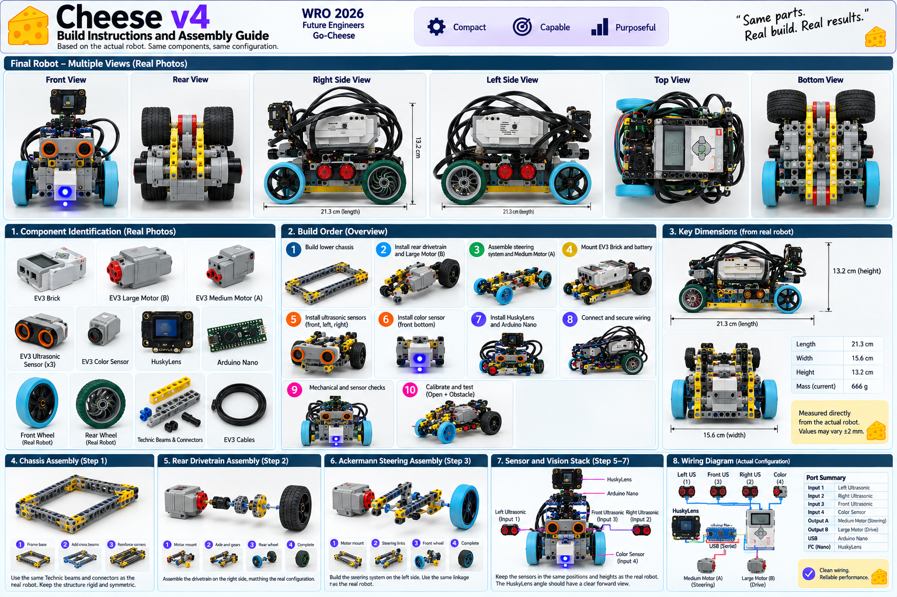
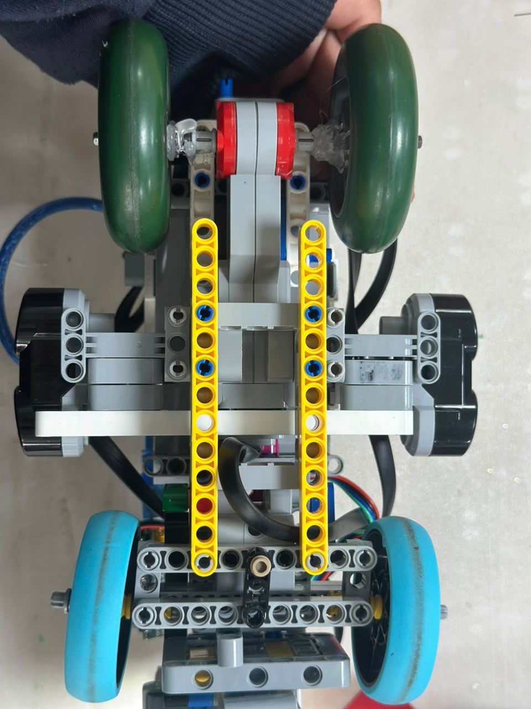
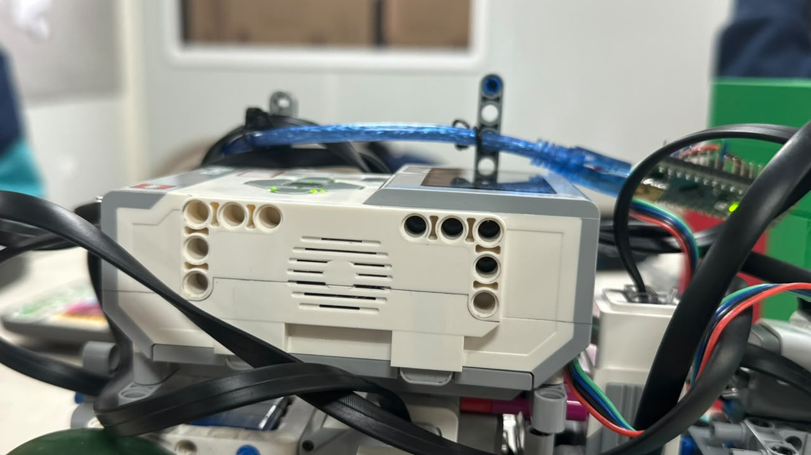
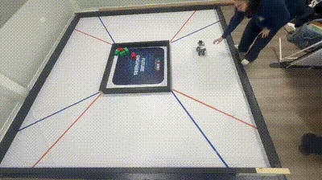
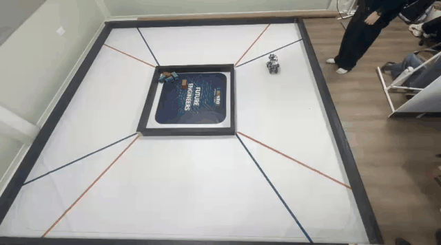
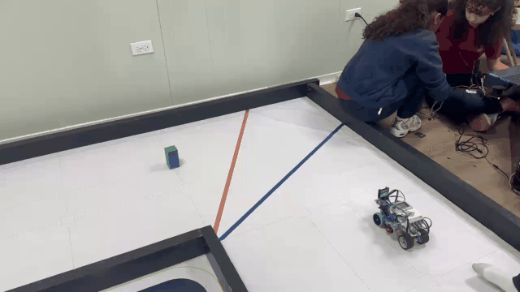

<h1 align="center">ᯓ★ 5.2 Build Instructions and Assembly Guide ᯓ★</h1>

  
  
  
  

  <em>
    This guide documents how the current Cheese v4 is assembled as a complete
    mechanical, sensing and control system. Real photographs of the final robot
    remain the primary construction reference.
  </em>

  ✦ ─── ⋆⋅☆⋅⋆ ─── (❁´◡`❁) ─── ⋆⋅☆⋅⋆ ─── ✦

---

## 5.2.1 Building Cheese v4

Cheese v4 was not created by simply adding components to the previous robot.

The robot was rebuilt around four priorities:

| Priority | Design Objective |
| :---: | :--- |
| **Compact** | Remove unnecessary upper structure and unused supports |
| **Accessible** | Keep the EV3, battery, sensors and wiring inspectable |
| **Stable** | Maintain rigid steering, drivetrain and sensor geometry |
| **Testable** | Make individual subsystems easier to verify before full runs |

The previous v3 robot weighed approximately **888.8 g**.

The current Cheese v4 weighs approximately **666 g**.

That represents a reduction of approximately:

  <strong>888.8 g → 666 g = 222.8 g removed</strong>

  <strong>≈ 25% reduction in total robot mass</strong>

The result is a significantly simpler physical architecture while preserving the systems required for the WRO Future Engineers challenges.

---

# 5.2.2 Visual Build Guide

The following poster summarizes the main physical systems and construction sequence of Cheese v4.

  

  <em>
    Visual assembly reference created from the real Cheese v4 configuration and
    the team's photographic documentation. Click the image to open it at full size.
  </em>

> **Important:** the diagram is a visual assembly aid.  
> The real robot photographs in this repository are the definitive reference for
> exact LEGO element placement, cable routing and small structural connections.

---

# 5.2.3 Real Robot Reference Views

Before rebuilding Cheese, the final robot should be studied from several directions.

| Front | Rear |
| :---: | :---: |
|  |  |
| **Front sensor / steering area** | **Rear drivetrain area** |

| Left | Right |
| :---: | :---: |
|  |  |
| **Left-side component relationship** | **Right-side component relationship** |

| Top | Bottom |
| :---: | :---: |
|  |  |
| **EV3, wiring and upper layout** | **Chassis, drivetrain and steering structure** |

No single photograph contains enough information to reproduce the robot.

Together, these views reveal:

- chassis structure,
- front/rear orientation,
- motor position,
- wheel types,
- steering geometry,
- EV3 placement,
- ultrasonic placement,
- Color Sensor position,
- HuskyLens position,
- Arduino Nano position,
- and cable routing.

---

# 5.2.4 System Layers

Cheese can be understood as a set of connected construction layers.

| Layer | Main Elements | Function |
| :---: | :--- | :--- |
| **1 — Chassis** | Technic beams, pins, axles and supports | Structural foundation |
| **2 — Drive** | Large Motor, rear axle and rear wheels | Propulsion |
| **3 — Steering** | Medium Motor, Ackermann linkage and front wheels | Direction control |
| **4 — Control** | EV3 Brick and rechargeable battery | Main processing and power |
| **5 — Sensors** | 3 Ultrasonics + Color Sensor | Wall, front and floor sensing |
| **6 — Vision** | HuskyLens + Arduino Nano | Obstacle recognition and communication |

  <strong>
    Structure → Motion → Control → Sensing → Vision
  </strong>

These systems should be assembled and tested progressively instead of installing everything before the first test.

---

# 5.2.5 Recommended Construction Sequence

| Stage | Assembly Operation | Verification |
| :---: | :--- | :--- |
| **01** | Build lower chassis | Frame is rigid and straight |
| **02** | Install rear drivetrain | Axle rotates freely |
| **03** | Install Large Motor | Motor securely transfers drive |
| **04** | Assemble Ackermann steering | Linkage moves without binding |
| **05** | Install Medium Motor | Steering can center correctly |
| **06** | Install wheels | All wheels have correct clearance |
| **07** | Mount EV3 + battery | Controller is stable and accessible |
| **08** | Mount Ultrasonics | Sensors maintain intended orientation |
| **09** | Mount Color Sensor | Correct floor clearance |
| **10** | Mount HuskyLens + Nano | Vision direction remains stable |
| **11** | Connect wiring | Ports match software configuration |
| **12** | Secure cables | No interference with moving systems |
| **13** | Mechanical verification | Robot rolls and steers freely |
| **14** | Sensor verification | Sensors produce valid readings |
| **15** | Open calibration | Navigation and parking tested |
| **16** | Obstacle calibration | Detection, avoidance and recovery tested |

  <strong>
    Build → Check → Add Next System → Check Again
  </strong>

---

# 5.2.6 Step 1 — Construct the Lower Chassis

The lower chassis is the reference structure for every other subsystem.

  

The current v4 chassis is intentionally simpler than the previous design.

The team removed unnecessary structural elements rather than adding reinforcement everywhere.

### Construction objectives

- maintain a rigid central structure,
- provide secure motor supports,
- maintain left/right alignment,
- leave space for the steering linkage,
- support the EV3 at a lower position,
- and avoid unnecessary mass.

### Before continuing

Check that:

- beams are not visibly twisted,
- pins are fully inserted,
- axles are not under sideways load,
- steering space remains clear,
- and the chassis sits naturally on a flat surface.

---

# 5.2.7 Step 2 — Rear Drive Assembly

The rear wheels provide propulsion.

  

The rear axle should be installed so that both wheels rotate without rubbing nearby LEGO elements.

The assembly must remain mechanically aligned because unnecessary resistance changes how the robot responds to the same motor command.

### Manual check

Rotate the rear wheels before powering the robot.

They should rotate without:

- strong friction,
- axle binding,
- structural rubbing,
- or excessive side movement.

---

# 5.2.8 Step 3 — Large Drive Motor

Cheese uses an EV3 Large Motor as its propulsion actuator.

  

  

The current v4 Large Motor is installed horizontally.

### Electrical connection

  <strong>Large Motor → EV3 Output B</strong>

### Mechanical chain

  <strong>Large Motor → Drive Transmission → Rear Axle → Rear Wheels</strong>

After mounting it, verify that the motor itself cannot shift inside the chassis.

---

# 5.2.9 Step 4 — Ackermann Steering Assembly

The front steering system is one of the most mechanically sensitive assemblies on Cheese.

  

The system uses a mechanical linkage so that the front wheels can follow different paths during a turn.

This is important because the wheel on the inside of a corner follows a smaller radius than the outside wheel.

### Assembly check

Move the mechanism manually through:

  <strong>
    Full Left → Center → Full Right → Center
  </strong>

There should be:

- no binding,
- no beam contact,
- no cable contact,
- no wheel/chassis collision,
- and no excessive looseness.

  <a href="../../schemes/steering_comparison_v3_to_v4.pdf">
    <strong>Open the Cheese v3 → v4 Steering Comparison</strong>
  </a>

---

# 5.2.10 Step 5 — Steering Motor

The EV3 Medium Motor controls the steering mechanism.

  

### Electrical connection

  <strong>Medium Motor → EV3 Output A</strong>

The motor should be mechanically secure because movement of the motor mount changes the effective steering angle.

### Establish physical center

Before autonomous testing:

1. place the steering approximately at its mechanical center,
2. verify both front wheels point approximately forward,
3. check available travel to the left,
4. check available travel to the right,
5. then establish the software steering reference.

A badly misaligned mechanical center should not be hidden with a large software correction.

---

# 5.2.11 Step 6 — Front Wheel Assemblies

The current front wheels are the distinctive light-blue wheel assemblies shown on the real robot.

  

Only the **front wheel assemblies** were changed during the v4 redesign.

The rear drive wheels remain a different EV3/Technic-style wheel assembly.

This distinction is important when reproducing Cheese:

  <strong>
    Front Wheels ≠ Rear Wheels
  </strong>

After installation, verify:

- both wheels rotate freely,
- both steering pivots move freely,
- the wheels clear the chassis,
- and both wheels maintain appropriate floor contact.

---

# 5.2.12 Step 7 — EV3 Brick Placement

The EV3 Brick is mounted relatively low and flat in Cheese v4.

  

  

The screen remains accessible from above.

This arrangement also keeps:

- input ports accessible,
- output ports accessible,
- USB accessible,
- and the battery reachable.

---

# 5.2.13 Step 8 — Battery Access

The EV3 rechargeable battery should remain accessible after assembly.

  

This is a practical design requirement.

Competition testing involves repeated charging, inspection and restarting, so routine battery access should not require rebuilding major structural sections.

Battery condition should also be checked before interpreting a change in robot behavior as a software problem.

---

# 5.2.14 Step 9 — Ultrasonic Sensor Installation

Cheese v4 uses **three EV3 Ultrasonic Sensors**.

| Sensor | Port | Primary Role |
| :--- | :---: | :--- |
| **Left Ultrasonic** | **Input 1** | Left-wall distance |
| **Right Ultrasonic** | **Input 2** | Right-wall distance |
| **Front Ultrasonic** | **Input 3** | Front safety / recovery |

### Left sensor

  

### Right sensor

  

### Front sensor

  

### Side relationship

  

Sensor orientation matters as much as the sensor itself.

A sensor that is several degrees out of alignment can produce a different wall measurement even when the code is unchanged.

---

# 5.2.15 Step 10 — Color Sensor Installation

The EV3 Color Sensor is mounted underneath the robot facing the field.

  

### Connection

  <strong>Color Sensor → EV3 Input 4</strong>

The sensor should be positioned close to the field without physically touching it.

  

The floor gap is especially important.

Too high can reduce reading consistency.

Too low can cause the sensor or its support to drag during motion.

An earlier light-blocking cover was removed after it created physical interference. The current v4 arrangement instead uses the improved sensor position and floor clearance.

---

# 5.2.16 Step 11 — HuskyLens Installation

The HuskyLens provides the vision input used during the Obstacle Challenge.

  

Its angle should remain stable.

  

The camera must have an unobstructed forward field of view.

A change in camera angle can alter:

- when a pillar enters the image,
- its apparent horizontal position,
- detection consistency,
- and therefore avoidance timing.

### Current trained mapping

| Obstacle | HuskyLens ID | Required Passing Side |
| :---: | :---: | :---: |
| **Green Pillar** | **ID 1** | **Left** |
| **Red Pillar** | **ID 2** | **Right** |

---

# 5.2.17 Step 12 — Arduino Nano

The Arduino Nano provides the communication bridge between the HuskyLens and EV3.

  

The current Nano does not require a heavy dedicated tower.

Instead, its placement prioritizes:

- low added mass,
- safe wiring,
- USB access,
- and separation from moving mechanisms.

---

# 5.2.18 HuskyLens → Nano Wiring

  

The current I²C connection is:

| HuskyLens | Arduino Nano |
| :---: | :---: |
| **VCC / +** | **5V** |
| **GND / −** | **GND** |
| **SDA / T** | **A4** |
| **SCL / R** | **A5** |

  <strong>HuskyLens → I²C → Arduino Nano</strong>

For the detailed wiring reference:

  <a href="../../schemes/arduino_nano_huskylens_wiring_v4.pdf">
    <strong>Open Arduino Nano ↔ HuskyLens Wiring Diagram</strong>
  </a>

---

# 5.2.19 Nano → EV3 Communication

The Nano communicates with the EV3 through USB.

  

The complete vision data path is therefore:

  <strong>
    Colored Pillar → HuskyLens → I²C → Arduino Nano → USB Serial → EV3
  </strong>

The shorter USB cable used in v4 reduces unnecessary cable length around the robot.

---

# 5.2.20 Complete Port Map

| Device | Connection |
| :--- | :---: |
| **Medium Steering Motor** | **Output A** |
| **Large Drive Motor** | **Output B** |
| **Left Ultrasonic Sensor** | **Input 1** |
| **Right Ultrasonic Sensor** | **Input 2** |
| **Front Ultrasonic Sensor** | **Input 3** |
| **Color Sensor** | **Input 4** |
| **Arduino Nano** | **EV3 USB** |
| **HuskyLens** | **Nano I²C** |

### EV3 inputs

  

### EV3 outputs

  

The physical connections must match the software configuration.

---

# 5.2.21 Cable Routing

Once all devices are connected, route the cables around the mechanical systems.

  

Cheese does not require perfectly hidden wiring.

It requires **safe wiring**.

The important requirement is that cables do not interfere with:

- steering linkage,
- front wheel movement,
- rear wheels,
- drive axle,
- or sensor view.

  <strong>
    Electrical Cable in Moving Mechanism = Mechanical Failure Risk
  </strong>

---

# 5.2.22 Mechanical Verification

Before autonomous testing, Cheese should pass a complete physical inspection.

| Check | Expected Result |
| :--- | :--- |
| Roll Cheese manually | Smooth movement |
| Rotate rear wheels | No abnormal binding |
| Move steering left/right | Free linkage movement |
| Return steering to center | Wheels return near neutral |
| Inspect motor mounts | No movement |
| Inspect EV3 | Secure |
| Inspect side Ultrasonics | Stable orientation |
| Inspect front Ultrasonic | Clear forward view |
| Inspect Color Sensor | Does not contact floor |
| Inspect HuskyLens | Stable forward angle |
| Inspect cables | No mechanical interference |

If one of these tests fails, fix the physical system before modifying software.

---

# 5.2.23 Sensor Verification

After mechanical inspection, test the sensors individually.

### Ultrasonics

Move a flat object toward each sensor.

The measured distance should decrease consistently.

### Color Sensor

Move the sensor across:

- neutral floor,
- blue marking,
- orange / recognized curve marking.

Verify that the software distinguishes the expected events.

### HuskyLens

Present real obstacle pillars individually.

Confirm:

  <strong>Green → ID 1</strong> 
  <strong>Red → ID 2</strong>

Do not begin avoidance tuning until recognition itself is sufficiently repeatable.

---

# 5.2.24 Software Verification Order

A full run should not be the first software test.

Use progressively larger tests.

  <strong>
    Component → Subsystem → Combined Behavior → Full Challenge
  </strong>

For example:

| Test Level | Example |
| :---: | :--- |
| **Component** | Read one ultrasonic |
| **Subsystem** | Wall-following correction |
| **Combined** | Wall following + corner |
| **Full system** | Complete three-lap Open run |

This makes failures much easier to isolate.

---

# 5.2.25 Open Challenge Build Validation

After assembly, the Open Challenge should be validated in this order:

  <strong>
    Straight → PID → Walls → Corners → Curve Count → Recovery → 3 Laps → Parking
  </strong>

### Straight

Verify basic propulsion and steering center.

### PID

Verify that small distance errors produce small corrections instead of large oscillations.

### Wall protection

Test progressively closer wall positions.

### Corners

Check both entry and exit trajectory.

### Curve counting

Confirm that one physical curve corresponds to one valid count.

### Recovery

Test front safety behavior separately.

### Full run

Only then attempt three complete laps.

### Parking

Parking should be tested after curve counting is sufficiently reliable because the finish depends on progress tracking.

---

# 5.2.26 Open Challenge Verification Evidence

  

  <em>
    Full Open Challenge testing demonstrates how the mechanical build,
    sensors and software operate together after assembly and calibration.
  </em>

A shorter corner demonstration can also be used to inspect steering behavior:

  

---

# 5.2.27 Obstacle Challenge Build Validation

Obstacle calibration follows a different progression.

  <strong>
    Detect → Identify → Choose Side → Avoid → Clear Pillar → Recover → Continue
  </strong>

Test one behavior at a time.

### 1. Detection

Can HuskyLens consistently see the pillar?

### 2. Identification

Is the correct ID returned?

### 3. Passing rule

- Green → left
- Red → right

### 4. Clearance

Does Cheese completely clear the obstacle?

### 5. Recovery

Does the robot return toward a useful trajectory after avoidance?

This final step is especially important because recovery after an obstacle remains one of the principal tuning challenges of the current system.

---

# 5.2.28 Obstacle Corner Verification

  

  <em>
    Real testing evidence showing the interaction between corner handling,
    sensing and obstacle navigation.
  </em>

Testing complete situations like this is performed only after the individual systems have already been checked.

---

# 5.2.29 Failure Isolation Guide

When something goes wrong, first identify **which system failed**.

| Observed Failure | Inspect First |
| :--- | :--- |
| Strong drift while driving | Wheel alignment / drivetrain |
| Steering remains turned | Steering linkage / Medium Motor |
| Constant zig-zag | Sensor readings / PID response |
| Incorrect wall correction | Ultrasonic position / port |
| Front recovery missing | Front Ultrasonic |
| Incorrect curve count | Color Sensor / validation logic |
| HuskyLens sees pillar but EV3 does not react | Nano / USB communication |
| Correct recognition but pillar is hit | Avoidance timing / strength |
| Pillar cleared but robot later hits wall | Post-obstacle recovery |
| Parking starts early or late | Curve count |
| Same code suddenly behaves weaker | Battery / mechanical resistance |

  <strong>
    Failure → Isolate → Change One Variable → Retest
  </strong>

---

# 5.2.30 Construction Mistakes to Avoid

### Do not use software to compensate for severe mechanical problems

A crooked wheel is not a PID problem.

### Do not change sensor position casually

Sensor geometry is part of the calibration.

### Do not allow the Color Sensor to drag

The robot changes height slightly during motion and curves.

### Do not leave the HuskyLens loose

Camera movement changes obstacle geometry.

### Do not route cables through steering

The cable can physically restrict the mechanism.

### Do not rebuild removed v3 systems

Cheese v4 does **not** use the previous auxiliary-light system or its large supporting structure.

### Do not assume front and rear wheels are interchangeable

They are intentionally different assemblies.

---

# 5.2.31 Final Pre-Run Checklist

### Mechanical

- [ ] Chassis rigid
- [ ] No loose structural pieces
- [ ] Rear wheels rotate freely
- [ ] Front wheels rotate freely
- [ ] Steering moves through full required range
- [ ] Steering returns to center
- [ ] Large Motor secure
- [ ] Medium Motor secure

### Controller and Power

- [ ] EV3 secure
- [ ] Battery charged
- [ ] Battery accessible
- [ ] EV3 boots normally

### Ports

- [ ] Output A → Medium Motor
- [ ] Output B → Large Motor
- [ ] Input 1 → Left Ultrasonic
- [ ] Input 2 → Right Ultrasonic
- [ ] Input 3 → Front Ultrasonic
- [ ] Input 4 → Color Sensor
- [ ] USB → Arduino Nano

### Sensors

- [ ] Left Ultrasonic stable
- [ ] Right Ultrasonic stable
- [ ] Front Ultrasonic stable
- [ ] Color Sensor has correct floor clearance
- [ ] Color readings verified

### Vision

- [ ] HuskyLens powered
- [ ] Camera angle stable
- [ ] Green = ID 1
- [ ] Red = ID 2
- [ ] Nano communication verified

### Wiring

- [ ] No cable contacts steering
- [ ] No cable contacts wheels
- [ ] USB cable secure
- [ ] HuskyLens wires secure

---

# 5.2.32 Reproducibility Test

A reconstruction is not complete simply because it visually resembles Cheese.

It should pass four verification levels.

| Level | Requirement |
| :---: | :--- |
| **1 — Mechanical** | Robot rolls and steers correctly |
| **2 — Electrical** | Motors and sensors are correctly connected |
| **3 — Sensing** | Distance, floor and vision data are valid |
| **4 — Autonomous** | Systems work together during navigation |

  <strong>
    Similar Appearance ≠ Functional Reproduction
  </strong>

A reproducible Cheese must preserve the relationships between its systems.

---

# 5.2.33 Construction Reference Hierarchy

When reproducing the robot, use the repository references in this order:

| Priority | Reference | Best Used For |
| :---: | :--- | :--- |
| **1** | **Real v4 photographs** | Exact physical arrangement |
| **2** | **Build Assembly Guide** | Understanding system relationships |
| **3** | **Wiring diagrams** | Electrical architecture |
| **4** | **Bill of Materials** | Component inventory |
| **5** | **Software documentation** | Port and behavior verification |

The real photographs have the highest priority whenever a simplified diagram does not show a small connection clearly.

---

# 5.2.34 Related Construction Resources

| Resource | Purpose |
| :--- | :--- |
| [`5.1 Bill of Materials`](5.1-bill-of-materials.md) | Components required to reproduce Cheese |
| [`1.2 Structural Components`](../01-mobility-and-mechanical-design/1.2-structural-component.mds.md) | LEGO structural architecture |
| [`1.3 Steering and Drive`](../01-mobility-and-mechanical-design/1.3-steering-and-drive.md) | Steering and drivetrain |
| [`1.4 Chassis Explanation`](../01-mobility-and-mechanical-design/1.4-chassis-explanation.md) | Chassis design reasoning |
| [`2.1 Power Supply and EV3`](../02-power-and-sensor-architecture/2.1-power-supply-and-ev3.md) | Power architecture |
| [`2.2 Wiring Diagram`](../02-power-and-sensor-architecture/2.2-wiring-diagram.md) | Electrical connections |
| [`2.3 Sensor Selection and Placement`](../02-power-and-sensor-architecture/2.3-sensor-selection-and-placement.md) | Sensor geometry |
| [`2.4 Sensor Calibration`](../02-power-and-sensor-architecture/2.4-sensor-calibration.md) | Calibration |
| [`3.3 Open Challenge`](../03-software-and-obstacle-strategy/3.3-open-challenge.md) | Open navigation |
| [`3.4 Obstacle Challenge`](../03-software-and-obstacle-strategy/3.4-obstacle-challenge.md) | Obstacle navigation |
| [`4.1 Design Decision Log`](../04-engineering-decisions/4.1-design-decision-log.md) | Why v4 was built this way |
| [`4.2 What Didn't Work`](../04-engineering-decisions/4.2-what-didnt-work.md) | Failures that shaped v4 |

### Technical schemes

  <a href="../../schemes/Cheese_V4_Build_Assembly_Guide.png">
    <strong>Cheese v4 Build & Assembly Guide</strong>
  </a>
  &nbsp;&nbsp;•&nbsp;&nbsp;
  <a href="../../schemes/Cheese_V4_Complete_System_Architecture_Wiring_Diagram.pdf">
    <strong>Complete System Architecture</strong>
  </a>
  &nbsp;&nbsp;•&nbsp;&nbsp;
  <a href="../../schemes/arduino_nano_huskylens_wiring_v4.pdf">
    <strong>HuskyLens ↔ Nano Wiring</strong>
  </a>

---

# 5.2.35 Final Build Philosophy

Cheese v4 is not defined by one component.

Its behavior comes from the relationship between:

  <strong>
    Chassis + Steering + Drive + Sensors + Vision + Wiring + Software
  </strong>

A mechanical change can alter a sensor reading.

A sensor change can alter a steering correction.

A steering change can alter a corner exit.

A corner exit can alter when the next obstacle enters the camera.

For that reason, reproducing Cheese means reproducing **the system**, not simply its appearance.

  <strong>
    Correct Components 
    + Correct Geometry 
    + Correct Connections 
    + Correct Calibration 
    = Reproducible Cheese v4
  </strong>

  ✦ ─── ⋆⋅☆⋅⋆ ─── (❁´◡`❁) ─── ⋆⋅☆⋅⋆ ─── ✦

  

