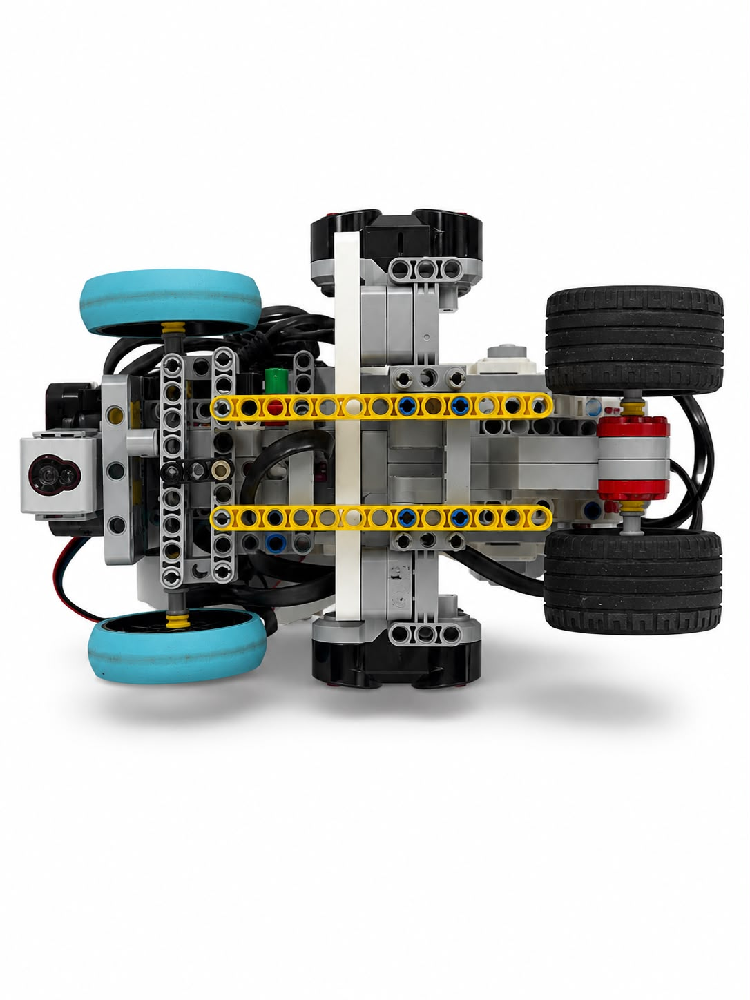

# ᯓ★ 5.2 Build Instructions and Assembly Guide ᯓ★

  
  
  
  

  <em>This section explains how to rebuild and verify Cheese v4 based on its current mechanical, electrical, sensing, and software architecture. The goal is not only to copy the shape of the robot, but to understand how each subsystem is placed, checked, calibrated, and tested.</em>

  ✦ ─── ⋆⋅☆⋅⋆ ─── 🧀🤖 ─── ⋆⋅☆⋅⋆ ─── ✦

Cheese v4 is a compact redesign of the previous v3 robot. The robot was rebuilt to reduce unnecessary weight, simplify the structure, lower important components, and make calibration easier.

The v3 robot weighed approximately **888.8 g**, documented as **888 g** for calculations. The current v4 robot weighs approximately **666 g**, including the EV3 Brick, EV3 battery, HuskyLens, Arduino Nano, three ultrasonic sensors, color sensor, motors, and SPIKE front wheels.

  <strong>Build principle:</strong> 
  Do not only rebuild the robot’s shape. Rebuild the purpose of each subsystem.

---

## ❀ 5.2.1 Quick Build Snapshot ────୨ৎ────────୨ৎ────

| 🧀 Robot | ⚙️ Main Controller | 🔋 Power | 📏 Current Mass |
| :---: | :---: | :---: | :---: |
| **Cheese v4** | **LEGO EV3 Brick** | **EV3 rechargeable battery** | **666 g** |

| System | Current v4 Setup |
| :--- | :--- |
| **Drive** | EV3 Large Motor on Output B, rear drive wheels. |
| **Steering** | EV3 Medium Motor on Output A, Ackermann steering. |
| **Wall / front sensing** | Three ultrasonic sensors on Inputs 1, 2, and 3. |
| **Floor sensing** | EV3 Color Sensor on Input 4. |
| **Vision** | HuskyLens connected through Arduino Nano. |
| **Wheels** | SPIKE blue wheels in front; rear wheels remain EV3 / Technic style. |
| **Lights** | No auxiliary lights in v4. The old dual-light system is legacy v3 only. |
| **Layout** | Compact / compressed structure. |

  

  <em>Planned labeled side view of Cheese v4. This image should identify the EV3 Brick, motors, sensors, HuskyLens, Arduino Nano, front SPIKE wheels, rear drive wheels, and compact layout.</em>

---

## ❀ 5.2.2 Build Architecture Overview ────୨ৎ────────୨ৎ────

Cheese v4 should be built from a compact base upward. Unlike v3, v4 does not use the old tall upper tower, dual-light system, 9V lighting battery, or lamp mounts. The current version focuses on a lower and cleaner structure.

| Architecture Layer | Main Components | Purpose |
| :--- | :--- | :--- |
| **Lower mechanical layer** | Chassis, rear drive wheels, front SPIKE wheels, steering linkage, axles | Provides movement, steering, alignment, and ground contact. |
| **Control layer** | EV3 Brick, EV3 battery, Large Motor, Medium Motor | Controls power, propulsion, steering, and EV3-connected sensors. |
| **Sensor layer** | Left ultrasonic, right ultrasonic, front ultrasonic, color sensor | Reads wall distance, front distance, and floor colors. |
| **Vision layer** | HuskyLens and Arduino Nano | Supports red and green obstacle detection. |
| **Wiring layer** | EV3 cables, Nano USB cable, HuskyLens I2C wires | Connects motors, sensors, camera bridge, and communication. |

The most important rule when rebuilding Cheese is that every subsystem must stay stable and must not interfere with another subsystem. A cable touching the steering linkage, a loose camera angle, or a tilted ultrasonic sensor can change the robot’s behavior even if the code is correct.

  <strong>Systems-thinking note:</strong> 
  The build affects the code. Sensor height, wheel grip, motor position, cable routing, and weight distribution all change how the robot drives.

---

## ❀ 5.2.3 Recommended Build Order ────୨ৎ────────୨ৎ────

  

  <em>Planned build order diagram for Cheese v4. This should show the assembly sequence from chassis to calibration.</em>

Cheese should be built in stages. Do not install everything at once and then test. Build, check, and test one subsystem at a time.

| Stage | Build Step | Why This Order Helps |
| :---: | :--- | :--- |
| **1** | Build the compact lower chassis. | Creates the foundation for every subsystem. |
| **2** | Install rear drive system and Large Motor. | Allows propulsion testing before the robot becomes complex. |
| **3** | Install Ackermann steering and front SPIKE wheels. | Allows steering centering and linkage testing early. |
| **4** | Mount the EV3 Brick flat with screen upward. | Sets the main controller and weight position. |
| **5** | Install the three ultrasonic sensors. | Adds wall and front-distance reading. |
| **6** | Install the color sensor. | Adds floor color detection for line and curve counting. |
| **7** | Install HuskyLens and Arduino Nano. | Adds obstacle detection support. |
| **8** | Connect all wiring. | Confirms ports match the code. |
| **9** | Secure cables. | Prevents steering, wheel, and sensor interference. |
| **10** | Run mechanical and sensor checks. | Finds physical problems before full testing. |
| **11** | Calibrate Open Challenge behavior. | Tests driving, curves, line counting, and parking. |
| **12** | Calibrate Obstacle Challenge behavior. | Tests HuskyLens detection, avoidance, recovery, and obstacle parking. |

This is the real order used by the team during assembly and testing:

  <strong>chassis → drive → steering → EV3 → sensors → camera/Nano → wiring → calibration</strong>

---

## ❀ 5.2.4 Step 1 — Build the Compact Lower Chassis ────୨ৎ────────୨ৎ────

Start with the lower chassis because every other subsystem depends on this foundation. The chassis must be rigid, straight, and symmetrical.

In v4, the goal is not to build the biggest or strongest-looking chassis. The goal is to build a structure that is strong enough while avoiding unnecessary mass.

  

  <em>Bottom view of Cheese v4 showing the compact chassis structure, wheelbase, drive connection, and lower layout.</em>

| Chassis Requirement | Why It Matters |
| :--- | :--- |
| **Straight frame** | Prevents natural drifting. |
| **Left-right symmetry** | Helps the robot drive and correct evenly. |
| **Low structure** | Supports better stability and center of gravity. |
| **Free steering area** | Prevents the Ackermann linkage from jamming. |
| **Strong motor support** | Prevents the drive or steering motor from shifting. |
| **Sensor support points** | Keeps ultrasonic and color sensors aligned. |

  

