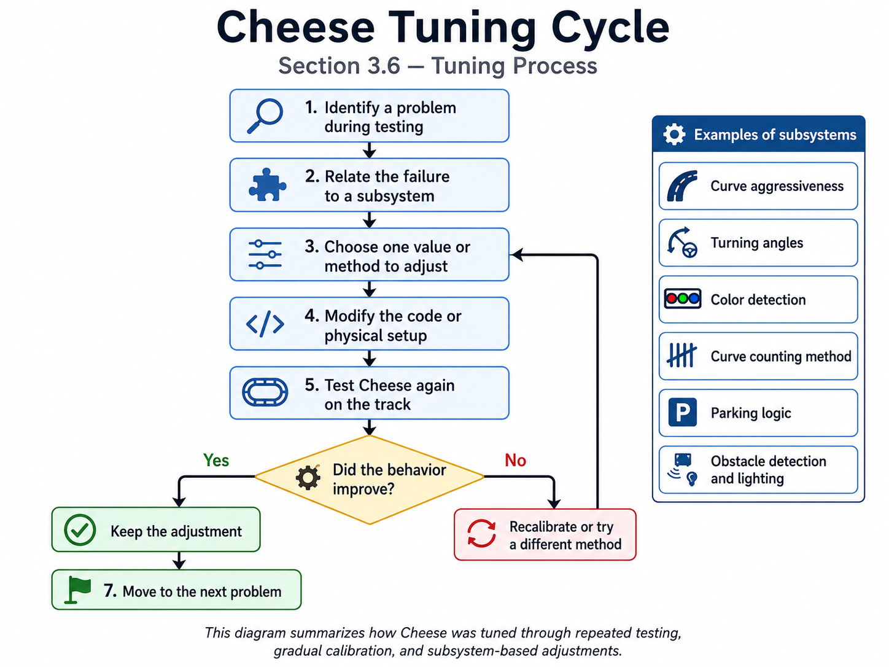

# ᯓ★ 6.1 Additional Resources and Engineering Evidence Vault ᯓ★

  
  
  
  

  

  <em>This section works as the engineering evidence vault for Go!Cheese. It collects interactive graphs, visual maps, diagrams, testing resources, and legacy evidence that support the full development story of Cheese.</em>

  ✦ ─── ⋆⋅☆⋅⋆ ─── 🧀🤖 ─── ⋆⋅☆⋅⋆ ─── ✦

This page is not only a collection of extra links. It helps judges and builders understand the project visually. The main documentation explains the robot’s mechanics, sensors, code, decisions, testing, and reproducibility. This resource vault connects those explanations to supporting evidence.

The resources are divided into three groups:

| Resource Group | Meaning |
| :--- | :--- |
| **Current v4 evidence** | Resources that describe the present Cheese v4 robot and current testing focus. |
| **v3 → v4 transition evidence** | Resources that explain how the robot changed from v3 to v4. |
| **Legacy v3 evidence** | Older resources kept to show the engineering history and previous design choices. |

  <strong>Resource rule:</strong> 
  Current v4 resources show the robot as it is now. Legacy v3 resources explain how the robot evolved.

---

## ❀ Quick Access Wall ────୨ৎ────────୨ৎ────

  
  
  

  
  
  

  <em>These buttons open the most important v4 resources through GitHub Pages.</em>

---

## ❀ Resource Status Board ────୨ৎ────────୨ৎ────

| Resource Type | Status | What It Means |
| :--- | :---: | :--- |
| **v4 graphs and diagrams** | Current | Main reference for the present Cheese v4 robot. |
| **v3 → v4 transition resources** | Current comparison evidence | Show how testing and failures led to redesign. |
| **v3 graphs** | Legacy evidence | Kept to document the earlier development process. |
| **v3 lighting resources** | Legacy evidence | Useful for history, but not part of the current v4 build. |
| **Build and calibration resources** | Current | Support reproducibility and testing workflow. |
| **Wiring and port maps** | Current / verify with code | Must match current ports and robot wiring. |

  

---

## ❀ Current v4 Graphs and Evidence ────୨ৎ────────୨ৎ────

These resources describe the current Cheese v4 build, testing status, wiring, calibration, and main engineering focus.

| Resource | Open Link | Why It Matters |
| :--- | :--- | :--- |
| **Cheese v4 Development Recipe** | [Open Graph](https://quesovamos2662.github.io/WRO2026_FE_Go-Cheese/embeds/cheese_development_recipe_v4.html) | Shows the current v4 development focus: PID calibration, line counting, camera angle, obstacle avoidance, recovery, parking, and documentation. |
| **v4 Sensor Configuration** | [Open Graph](https://quesovamos2662.github.io/WRO2026_FE_Go-Cheese/embeds/v4_sensor_configuration.html) | Explains the current sensor system: three ultrasonic sensors, color sensor, HuskyLens, and Arduino Nano. |
| **v4 Obstacle Testing Status** | [Open Graph](https://quesovamos2662.github.io/WRO2026_FE_Go-Cheese/embeds/v4_obstacle_testing_status.html) | Shows current obstacle progress and the main remaining issues: camera angle, late detection, avoidance, and recovery. |
| **v4 Calibration Workflow** | [Open Diagram](https://quesovamos2662.github.io/WRO2026_FE_Go-Cheese/embeds/v4_calibration_workflow.html) | Shows the order of pre-run checks before Open or Obstacle testing. |
| **v4 Build Order Flowchart** | [Open Diagram](https://quesovamos2662.github.io/WRO2026_FE_Go-Cheese/embeds/v4_build_order_flowchart.html) | Shows the assembly order used by the team: chassis, drive, steering, EV3, sensors, camera/Nano, wiring, and calibration. |
| **v4 Wiring and Port Map** | [Open Diagram](https://quesovamos2662.github.io/WRO2026_FE_Go-Cheese/embeds/v4_wiring_port_map.html) | Shows Output A, Output B, Inputs 1–4, EV3 USB, Arduino Nano, and HuskyLens connection. |
| **v4 Software Priority Chain** | [Open Diagram](https://quesovamos2662.github.io/WRO2026_FE_Go-Cheese/embeds/v4_software_priority_chain.html) | Explains the order of robot decisions during navigation and testing. |
| **Critical vs Flexible Components** | [Open Graph](https://quesovamos2662.github.io/WRO2026_FE_Go-Cheese/embeds/critical_vs_flexible_components.html) | Supports reproducibility by showing which parts must stay consistent and which can vary slightly. |
| **Front SPIKE Wheel Update v4** | [Open Graph](https://quesovamos2662.github.io/WRO2026_FE_Go-Cheese/embeds/front_spike_wheel_update_v4.html) | Explains why the front SPIKE wheels help steering, grip, and curve behavior. |

These v4 resources are the main reference for the present robot because they match the current version of Cheese.

---

## ❀ v3 → v4 Transition Evidence ────୨ৎ────────୨ৎ────

The following resources explain how Cheese changed from v3 to v4. They are important because they show that the redesign was based on testing, failures, and engineering decisions.

| Resource | Open Link | Why It Matters |
| :--- | :--- | :--- |
| **Robot Mass v3 → v4 Comparison** | [Open Graph](https://quesovamos2662.github.io/WRO2026_FE_Go-Cheese/embeds/robot_mass_v3_v4_comparison.html) | Shows the mass reduction from approximately 888 g to 666 g. |
| **BOM Transition v3 → v4** | [Open Graph](https://quesovamos2662.github.io/WRO2026_FE_Go-Cheese/embeds/bom_transition_v3_to_v4.html) | Shows which components were carried over, modified, and removed. |
| **Testing Journey v3 → v4** | [Open Graph](https://quesovamos2662.github.io/WRO2026_FE_Go-Cheese/embeds/testing_journey_v3_to_v4.html) | Shows how testing pressure and failures led to the v4 redesign. |
| **v4 Failure to Fix Map** | [Open Map](https://quesovamos2662.github.io/WRO2026_FE_Go-Cheese/embeds/v4_failure_to_fix_map.html) | Connects failures to causes, fixes, and current results. |

  <strong>Engineering meaning:</strong> 
  v4 was not a random rebuild. It was a controlled redesign based on what did not work in previous testing.

---

## ❀ Legacy v3 Graphs ────୨ৎ────────୨ৎ────

The v3 graphs are still useful because they document the previous engineering stage. They should not be treated as the current v4 reference, but they help show how the robot evolved.

| Legacy Resource | Open Link | Why It Is Kept |
| :--- | :--- | :--- |
| **Legacy Cheese Development Recipe** | [Open Graph](https://quesovamos2662.github.io/WRO2026_FE_Go-Cheese/embeds/cheese_development_recipe.html) | Shows the earlier v3 development focus, including systems and experiments that shaped the robot. |
| **Code Size Comparison** | [Open Graph](https://quesovamos2662.github.io/WRO2026_FE_Go-Cheese/embeds/code_size_comparison_fun.html) | Shows how code simplification became part of the engineering process. |
| **Curve Count Progress** | [Open Graph](https://quesovamos2662.github.io/WRO2026_FE_Go-Cheese/embeds/curve_count_progress_fun.html) | Explains the 12-curve logic used for 3 laps in the Open Challenge. |
| **Robot Mass Tradeoff Legacy Graph** | [Open Graph](https://quesovamos2662.github.io/WRO2026_FE_Go-Cheese/embeds/robot_mass_tradeoff_fun.html) | Preserves older mass reasoning before the v4 reduction was documented separately. |
| **Speed Layer Chart** | [Open Graph](https://quesovamos2662.github.io/WRO2026_FE_Go-Cheese/embeds/speed_layer_chart_fun.html) | Explains how different speed layers support normal driving and correction behavior. |
| **Testing Journey Legacy Graph** | [Open Graph](https://quesovamos2662.github.io/WRO2026_FE_Go-Cheese/embeds/testing_journey_fun.html) | Preserves the earlier testing cycle explanation. |
| **Tuning Focus Map Legacy Graph** | [Open Graph](https://quesovamos2662.github.io/WRO2026_FE_Go-Cheese/embeds/tuning_focus_map_fun.html) | Shows the previous tuning areas that influenced later improvements. |

  <strong>Legacy note:</strong> 
  These graphs are kept as engineering history. The current v4 resources above should be used as the main reference for the present robot.

---

## ❀ Flowchart and Logic Resources ────୨ৎ────────୨ৎ────

Flowcharts help explain how Cheese makes decisions during a run. Since the robot uses sensors, camera input, steering, curve counting, and parking logic, diagrams make the software easier to understand.

| Flowchart / Diagram | File | Purpose |
| :--- | :--- | :--- |
| **General Logic Flowchart** | [View Image](../../img/Flowchart_logic_cheese.png) | Shows the overall logic structure used by Cheese during navigation. |
| **Open Challenge Flowchart** | [View Image](../../img/open_challenge_flowchart.png) | Shows how Cheese handles Open Challenge movement, color detection, curve counting, and parking. |
| **Obstacle Challenge Flowchart** | [View Image](../../img/obstacle_challenge_flowchart.png) | Shows how Cheese combines navigation with HuskyLens obstacle detection. |
| **Corner Handling Flowchart** | [View Image](../../img/corner_handling_flowchart.png) | Shows how curve and color detection connect to movement behavior. |
| **Tuning Cycle Diagram** | [View Image](../../img/tuning_cycle_diagram.png) | Shows the repeated test, adjust, retest, and document cycle. |
| **v4 Software Priority Chain** | [Open Diagram](https://quesovamos2662.github.io/WRO2026_FE_Go-Cheese/embeds/v4_software_priority_chain.html) | Shows the current priority logic used to explain robot behavior. |

  

  <em>The tuning cycle diagram summarizes the way Cheese improved through repeated testing and gradual calibration.</em>

---

## ❀ Technical Schemes and Wiring Resources ────୨ৎ────────୨ৎ────

These resources support the wiring, electronics, communication, and reproducibility sections of the repository. For Cheese v4, the current wiring reference should not include the removed v3 lighting system as an active component.

| Resource | File / Link | Status | What It Supports |
| :--- | :--- | :---: | :--- |
| **v4 Wiring and Port Map** | [Open Diagram](https://quesovamos2662.github.io/WRO2026_FE_Go-Cheese/embeds/v4_wiring_port_map.html) | Current v4 | Shows Output A, Output B, Inputs 1–4, EV3 USB, Arduino Nano, and HuskyLens. |
| **HuskyLens to Arduino Nano Wiring** | [View Image](../../img/HuskyLens_to_Arduino_Nano_Wiring.png) | Current | Shows the I2C communication path between HuskyLens and Arduino Nano. |
| **Wiring Diagram Scheme** | [View Image](../../schemes/wiring_diagram_GC.jpeg) | Check version | Supports wiring documentation if it matches the current v4 setup. |
| **Older Wiring Diagram Topology** | [View Image](../../img/Wiring%20Diagram%20Topology.png) | Legacy / verify | May include older v3 references and should not be treated as the final v4 wiring map if it shows removed lighting. |
| **Final Robot PDF** | [Open PDF](../../schemes/finalrobot.pdf) | Check version | Useful only if it matches the current robot version or is clearly labeled as an older reference. |

  <strong>Current v4 wiring reminder:</strong> 
  Large Motor = Output B · Medium Motor = Output A · Left Ultrasonic = Input 1 · Right Ultrasonic = Input 2 · Front Ultrasonic = Input 3 · Color Sensor = Input 4 · Arduino Nano = EV3 USB.

---

## ❀ Visual Evidence Gallery ────୨ৎ────────୨ৎ────

The following images connect the written documentation to physical evidence from the robot. Current v4 photos show the present build. Legacy v3 photos show earlier decisions and previous systems.

### Current v4 Evidence

| Evidence | File | What It Supports |
| :--- | :--- | :--- |
| **v4 labeled side view** | [View Image](../../v-photos/v4/labeled_side_v4.jpg) | Shows the current compact component layout. |
| **v4 labeled front view** | [View Image](../../v-photos/v4/labeled_front_v4.jpg) | Shows the HuskyLens, front ultrasonic sensor, color sensor area, and SPIKE wheels. |
| **v4 labeled top view** | [View Image](../../v-photos/v4/labeled_top_v4.jpg) | Shows the EV3 Brick orientation, wiring area, and Nano placement. |
| **Front SPIKE wheels** | [View Image](../../v-photos/v4/front_spike_wheels_closeup.jpg) | Documents the v4 front wheel update. |
| **v3 to v4 comparison** | [View Image](../../v-photos/v4/v3_vs_v4_comparison.jpg) | Shows the structural transition from v3 to v4. |

### Legacy v3 Evidence

| Evidence | File | Why It Is Still Useful |
| :--- | :--- | :--- |
| **Dual-light system** | [View Image](../../v-photos/v3/dual_light_system_v3.jpeg) | Shows a previous v3 solution that is no longer used in v4. |
| **Broken pin evidence** | [View Image](../../img/broken_pin.jpeg) | Shows mechanical stress observed during testing. |
| **v3 camera placement** | [View Image](../../v-photos/v3/sensor_placement_cam_v3.jpg) | Helps compare the older camera structure with the current v4 layout. |
| **v3 front layout** | [View Image](../../v-photos/v3/front_v3.jpg) | Preserves evidence of the previous build. |

  <em>The v4 photos show the current robot. The v3 photos are kept only as legacy evidence to explain the design transition.</em>

---

## ❀ Models and Digital References ────୨ৎ────────୨ৎ────

The model resources support mechanical understanding and reproducibility. If the available model folders are from older robot versions, they should be treated as legacy references unless a v4 model is added.

| Model Folder | Link | Status | What It Supports |
| :--- | :--- | :---: | :--- |
| **Chassis Models** | [Open Folder](../../models/chassis/) | Check version | Supports chassis and mechanical design explanation. |
| **Steering Models** | [Open Folder](../../models/steering/) | Check version | Supports steering geometry and Ackermann mechanism explanation. |
| **Version 1 Models** | [Open Folder](../../models/v1/) | Legacy | Preserves early development evidence. |
| **Version 2 Models** | [Open Folder](../../models/v2/) | Legacy | Supports comparison between early versions. |
| **Version 3 Models** | [Open Folder](../../models/v3/) | Legacy / previous version | Shows the older v3 structure before the v4 redesign. |

  <strong>Model note:</strong> 
  A future v4 model would improve reproducibility, but older models are still useful when clearly labeled as legacy evidence.

---

## ❀ Torque and Speed Calculation Resources ────୨ৎ────────୨ৎ────

Torque and speed reasoning supports the mechanical analysis of Cheese. These resources help explain how the EV3 Large Motor, wheel size, programmed speed, drivetrain efficiency, and estimated wheel force affect movement.

| Calculation Resource | File | What It Supports |
| :--- | :--- | :--- |
| **Torque and Speed Calculation 01** | [View Image](../../img/torque%20and%20speed%20calculations%2001.jpeg) | Supports the first part of drivetrain and speed reasoning. |
| **Torque and Speed Calculation 02** | [View Image](../../img/torque%20and%20speed%20calculations%2002.jpeg) | Supports wheel-speed and programmed-speed explanation. |
| **Torque and Speed Calculation 03** | [View Image](../../img/torque%20and%20speed%20calculations%2003.jpeg) | Supports drivetrain force and torque reasoning. |
| **Torque and Speed Calculation 04** | [View Image](../../img/torque%20and%20speed%20calculations%2004.jpeg) | Supports the final interpretation of propulsion and movement performance. |

These resources connect the mechanical design section to real calculations, making the drivetrain explanation stronger and more evidence-based.

---

## ❀ Resource to Rubric Connection ────୨ৎ────────୨ৎ────

The resources in this section support multiple rubric areas. They are not added only for decoration; each one helps prove a different part of the engineering process.

| Rubric Area | Helpful Resources |
| :--- | :--- |
| **Mobility and Mechanical Design** | Front SPIKE wheel update, weight comparison, v4 photos, torque/speed calculations. |
| **Power and Sensor Architecture** | v4 wiring port map, sensor configuration graph, HuskyLens to Nano wiring diagram. |
| **Software Architecture and Obstacle Strategy** | v4 software priority chain, obstacle testing status, flowcharts, tuning graphs. |
| **Systems Thinking and Engineering Decisions** | Failure to fix map, BOM transition graph, testing journey v3 → v4. |
| **Reproducibility and GitHub Quality** | Build order flowchart, calibration workflow, visual evidence gallery, resource status board. |

  <strong>Why this matters:</strong> 
  A strong repository does not only show final results. It shows evidence, decisions, failures, tests, diagrams, and resources that explain how the robot was developed.

---

## ❀ How Everything Connects ────୨ৎ────────୨ৎ────

| Resource Type | Main Value | Related Documentation |
| :--- | :--- | :--- |
| **Chart.js graphs** | Make testing, tuning, weight, and transition decisions easier to understand visually. | Software, tuning process, engineering decisions, reproducibility. |
| **Flowcharts** | Explain how the robot makes decisions during a run. | Algorithm architecture, Open Challenge, Obstacle Challenge, Corner Handling. |
| **Wiring diagrams** | Support communication paths, ports, and reproduction. | Power and sensor architecture, wiring diagram, build instructions. |
| **Models** | Support mechanical design and structural understanding. | Mobility and mechanical design, reproducibility. |
| **Image evidence** | Connect written explanations to real robot photos. | Engineering decisions, what did not work, sensor placement. |
| **Calculations** | Support speed, torque, and drivetrain reasoning. | Mechanical design and drivetrain analysis. |

Each resource adds another layer to the project. The graphs show the testing story, the diagrams show the logic, the schemes show the wiring, the models support reproducibility, the images show physical evidence, and the calculations support engineering reasoning.

---

## ✦ Final Resource Note ─── ⋆⋅☆⋅⋆ ───

This section closes the technical documentation by collecting the resources that support the full story of Cheese. It brings together visuals, data, diagrams, models, calculations, and evidence so the project can be understood beyond only the final robot.

  <strong>Cheese is not only a robot that drives around a track.</strong> 
  It is a collection of tests, failures, fixes, decisions, calculations, diagrams, and teamwork.

  ✦ ─── ⋆⋅☆⋅⋆ ─── 🧀 Final Resource Vault 🧀 ─── ⋆⋅☆⋅⋆ ─── ✦

  <em>Every resource in this section helps show how Go!Cheese transformed an idea into a working WRO Future Engineers robot.</em>

  ✧･ﾟ: *✧･ﾟ:* 　　 *:･ﾟ✧*:･ﾟ✧

  

