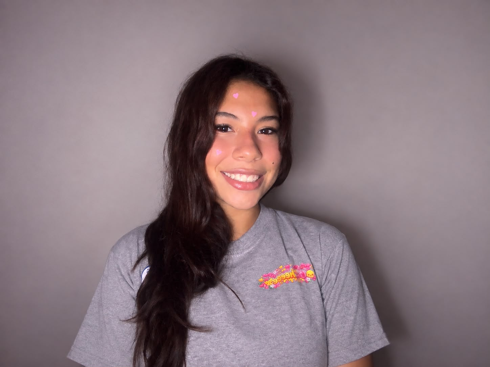
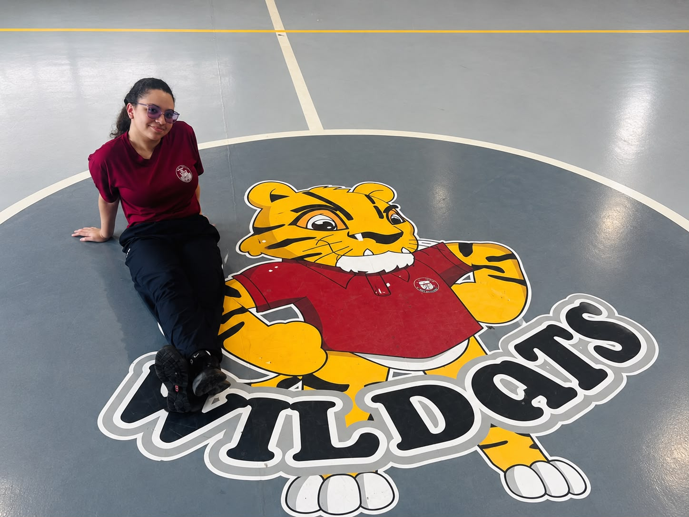

<h1 align="center">ᯓ★ Team Photos ᯓ★</h1>

<p align="center">
  
  
  
</p>

<p align="center">
  <em>
    This folder contains the team photo documentation for Go!Cheese,
    showing the people behind Cheese and the teamwork that supports
    our WRO Future Engineers 2026 project.
  </em>
</p>

<p align="center">
  ✦ ─── ⋆⋅☆⋅⋆ ─── (❁´◡`❁) ─── ⋆⋅☆⋅⋆ ─── ✦
</p>

---

## ❀ About This Folder ────୨ৎ────────୨ৎ────

The `t-photos/` folder contains the photographic documentation used to present
the Go!Cheese team.

While the technical folders document Cheese's mechanical design, electronics,
software, testing, and engineering development, this folder presents the people
behind that work.

The photographs are used throughout the repository to support team identity,
project presentation, and the **Meet the Team** documentation.

---

## ❀ Go!Cheese Team ────୨ৎ────────୨ৎ────

We are **Go!Cheese**, a two-member robotics team from San Miguelito, Panama,
competing in **WRO Future Engineers 2026**.

<p align="center">
  
</p>

<p align="center">
  <em>
    Go!Cheese Team — WRO Future Engineers 2026.
  </em>
</p>

<div align="center">

| Team Member | Main Role | Project Focus |
| :--- | :--- | :--- |
| **Caylee Rios** | Documentation & Engineering Analysis | Technical documentation, README organization, software analysis, testing observations, and engineering explanations |
| **Romina Mora** | Programming & Robot Building | Programming, robot construction, mechanical changes, implementation, and testing |

</div>

<p align="center">
  <strong>
    Build → Test → Observe → Discuss → Improve → Document
  </strong>
</p>

---

## ❀ Meet Caylee ────୨ৎ────────୨ৎ────

<p align="center">
  
</p>

<p align="center">
  <strong>Caylee Rios</strong><br>
  <em>Documentation & Engineering Analysis</em>
</p>

Caylee focuses on documenting and analyzing the engineering development of
Cheese. Her work includes organizing the repository, explaining technical
decisions, analyzing software behavior and testing results, and connecting
the team's development process with the final documentation.

Her main project contributions include:

- technical and engineering documentation,
- GitHub and README organization,
- software behavior analysis,
- testing observations,
- engineering decision documentation,
- and project presentation.

---

## ❀ Meet Romina ────୨ৎ────────୨ৎ────

<p align="center">
  
</p>

<p align="center">
  <strong>Romina Mora</strong><br>
  <em>Programming & Robot Building</em>
</p>

Romina focuses on the implementation and physical development of Cheese.
Her work connects the software directly with the robot's mechanical behavior
during testing.

Her main project contributions include:

- programming,
- robot construction,
- mechanical modifications,
- code implementation,
- physical testing,
- and system adjustments.

---

## ❀ Meet the Team ────୨ৎ────────୨ৎ────

<div align="center">

| Caylee Rios | Romina Mora |
| :---: | :---: |
|  |  |
| **Documentation & Engineering Analysis** | **Programming & Robot Building** |

</div>

Although each member has different primary responsibilities, the development
of Cheese requires both roles to interact continuously.

A mechanical adjustment can affect software behavior. A software change can
require new physical testing. Testing results can reveal a new mechanical
problem, and each major development must then be documented.

<p align="center">
  <strong>
    Mechanics ↔ Software ↔ Testing ↔ Documentation
  </strong>
</p>

---

## ❀ The Funny One ────୨ৎ────────୨ৎ────

<p align="center">
  
</p>

<p align="center">
  <em>
    Because not every part of building a robot has to look serious.
  </em>
</p>

This photograph is intentionally kept as part of the team documentation.

The repository contains a large amount of technical material, but Go!Cheese
is also a team built around collaboration, personality, long testing sessions,
failed runs, improvements, and enjoying the process together.

---

## ❀ Photo Directory ────୨ৎ────────୨ৎ────

The current team-photo structure is:

```text
t-photos/
│
├── Caylee-photos/
│   └── caylee_picture.png
│
├── Romina-photos/
│   └── romina_picture.png
│
├── funny_pic.jpeg
├── team_photo.jpeg
└── team_photo.png
```

The current images used by this README are:

<div align="center">

| Image | Purpose |
| :--- | :--- |
| **`team_photo.png`** | Current main Go!Cheese team photo |
| **`Caylee-photos/caylee_picture.png`** | Current Caylee individual photo |
| **`Romina-photos/romina_picture.png`** | Current Romina individual photo |
| **`funny_pic.jpeg`** | Funny / informal Go!Cheese team photo |

</div>

The older image files can remain in the repository as historical team
documentation, while the newer PNG files are used as the current presentation
images.

---

## ❀ Why Team Documentation Matters ────୨ৎ────────୨ৎ────

Cheese was developed through repeated collaboration.

Behind each software version or mechanical change was a process of testing,
observing, discussing, changing, and testing again.

<p align="center">
  <strong>
    Problem → Test → Discussion → Adjustment → Retest
  </strong>
</p>

The team photographs connect that engineering process to the people responsible
for it.

They show that the final robot is not only the result of hardware and code,
but also communication, persistence, experimentation, and teamwork.

---

## ❀ Human Side of Go!Cheese ────୨ৎ────────୨ৎ────

WRO Future Engineers is ultimately an engineering challenge, but the process
of developing Cheese also involved:

- learning from failed tests,
- rebuilding systems that did not work,
- debugging software,
- making mechanical changes,
- working under time pressure,
- documenting many iterations,
- and celebrating when an improvement finally worked.

That process is part of the story of Cheese.

<p align="center">
  <strong>
    Same Team. Same Cheese. Bigger Ideas.
  </strong>
</p>

---

## ✦ Final Note ─── ⋆⋅☆⋅⋆ ───

The `t-photos/` folder documents the people behind the robot.

The rest of this repository explains **how Cheese works**.

These photographs show **who made it work**.

<p align="center">
  ✦ ─── ⋆⋅☆⋅⋆ ─── (❁´◡`❁) ─── ⋆⋅☆⋅⋆ ─── ✦
</p>

<p align="center">
  <a href="https://github.com/Quesovamos2662/WRO2026_FE_Go-Cheese#general-project-index">
    
  </a>
</p>
