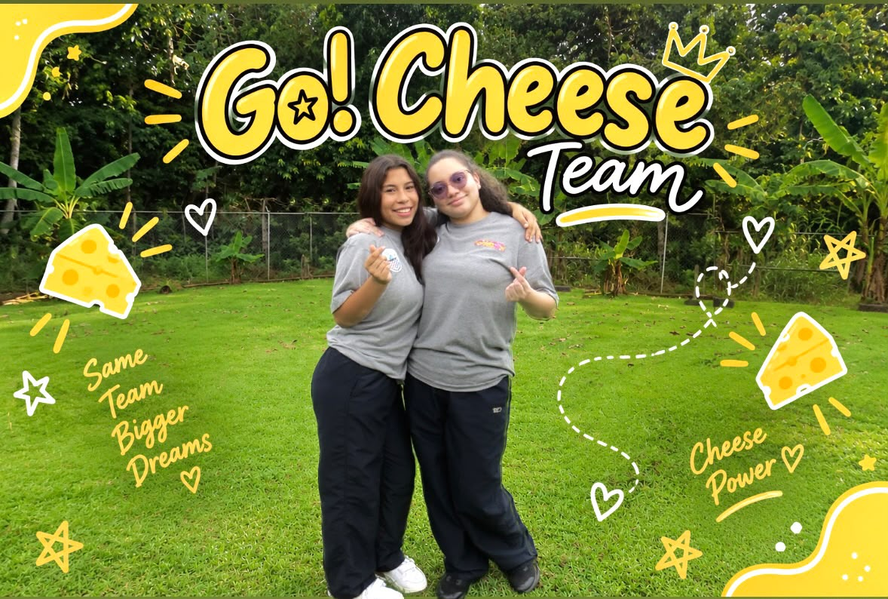
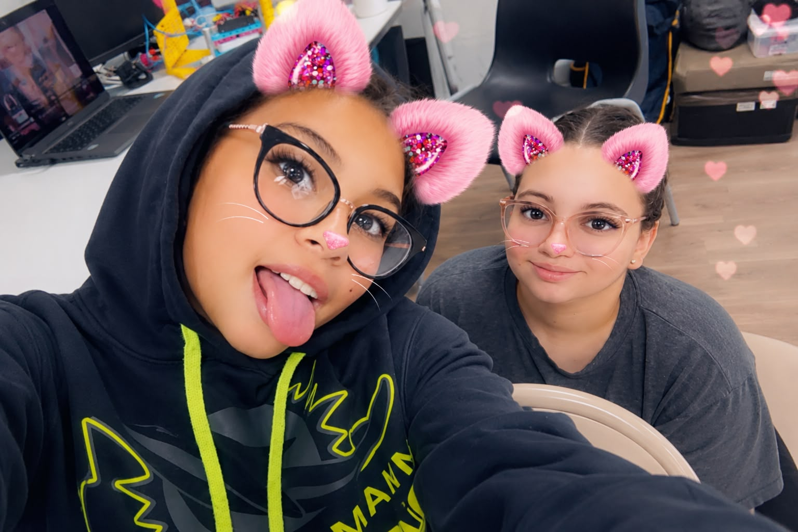

<h1 align="center">ᯓ★ Team Photos ᯓ★</h1>

<p align="center">
  
  
  
</p>

<p align="center">
  <em>
    This folder contains the team photo documentation for Go!Cheese,
    showing the people behind Cheese and the teamwork behind our
    WRO Future Engineers 2026 project.
  </em>
</p>

<p align="center">
  ✦ ─── ⋆⋅☆⋅⋆ ─── (❁´◡`❁) ─── ⋆⋅☆⋅⋆ ─── ✦
</p>

---

## ❀ About This Folder ────୨ৎ────────୨ৎ────

The `t-photos/` folder contains the photographic documentation used to present
the **Go!Cheese Team**.

While the technical folders document Cheese's mechanical design, electronics,
software, testing, and engineering development, this folder presents the people
behind that work.

The photographs are used throughout the repository to support:

- team identity,
- the Meet the Team section,
- project presentation,
- and the human side of the engineering process.

---

## ❀ Go!Cheese Team ────୨ৎ────────୨ৎ────

We are **Go!Cheese**, a two-member robotics team from San Miguelito, Panama,
competing in **WRO Future Engineers 2026**.

<p align="center">
  
</p>

<p align="center">
  <em>
    Go!Cheese Team — WRO Future Engineers 2026.
  </em>
</p>

<div align="center">

| Team Member | Main Role | Project Focus |
| :--- | :--- | :--- |
| **Caylee Rios** | Documentation & Engineering Analysis | Technical documentation, README organization, software analysis, testing observations, and engineering explanations |
| **Romina Mora** | Programming & Robot Building | Programming, robot construction, mechanical changes, code implementation, and testing |

</div>

<p align="center">
  <strong>
    Build → Test → Observe → Discuss → Improve → Document
  </strong>
</p>

---

## ❀ Meet the Team ────୨ৎ────────୨ৎ────

<div align="center">

| Caylee Rios | Romina Mora |
| :---: | :---: |
|  |  |
| **Documentation & Engineering Analysis** | **Programming & Robot Building** |

</div>

Although each member has different primary responsibilities, the development
of Cheese requires both roles to interact continuously.

<p align="center">
  <strong>
    Mechanics ↔ Software ↔ Testing ↔ Documentation
  </strong>
</p>

---

## ❀ Caylee Rios ────୨ৎ────────୨ৎ────

<p align="center">
  
</p>

<p align="center">
  <strong>Caylee Rios</strong><br>
  <em>Documentation & Engineering Analysis</em>
</p>

Caylee focuses on documenting and analyzing the engineering development of
Cheese.

Her work includes organizing the repository, explaining technical decisions,
analyzing software behavior and testing results, and connecting the team's
development process with the final engineering documentation.

### Main Contributions

- Technical and engineering documentation
- GitHub and README organization
- Software behavior analysis
- Testing observations
- Engineering decision documentation
- Project structure and presentation

Her role helps transform the team's experiments, changes, and testing results
into a clear record of how Cheese developed throughout the season.

---

## ❀ Romina Mora ────୨ৎ────────୨ৎ────

<p align="center">
  
</p>

<p align="center">
  <strong>Romina Mora</strong><br>
  <em>Programming & Robot Building</em>
</p>

Romina focuses on the implementation and physical development of Cheese.

Her work connects the software directly with the physical behavior of the
robot during testing and development.

### Main Contributions

- Programming
- Robot construction
- Mechanical modifications
- Code implementation
- Physical testing
- System adjustments

Her role is especially important when converting an engineering idea into
something that Cheese can physically perform on the field.

---

## ❀ Same Team, Bigger Dreams ────୨ৎ────────୨ৎ────

<p align="center">
  
</p>

<p align="center">
  <em>
    Same Team. Bigger Dreams.
  </em>
</p>

Not every part of building Cheese happens in front of a computer or on the
competition field.

This photo is intentionally kept as part of our documentation because it
represents the personality behind Go!Cheese.

The project has involved long testing sessions, failed runs, successful runs,
mechanical changes, code changes, documentation work, and a lot of learning
along the way.

---

## ❀ How We Work Together ────୨ৎ────────୨ৎ────

Cheese was developed through a repeated collaborative process:

<p align="center">
  <strong>
    Problem → Test → Observation → Discussion → Adjustment → Retest
  </strong>
</p>

Different parts of the project required different responsibilities, but they
were never completely independent.

<div align="center">

| If This Changes... | It Can Affect... |
| :--- | :--- |
| **Mechanical structure** | Sensor position and driving behavior |
| **Steering geometry** | Corner trajectory and software tuning |
| **Sensor placement** | Measurements and control decisions |
| **Software parameters** | Physical movement of Cheese |
| **Obstacle strategy** | Mechanical trajectory and recovery |
| **Testing results** | The next engineering decision |
| **Engineering decision** | Documentation and future testing |

</div>

This means communication between both team members is part of the engineering
process itself.

---

## ❀ Our Development Cycle ────୨ৎ────────୨ৎ────

Our work on Cheese generally follows this cycle:

<p align="center">
  <strong>
    BUILD → PROGRAM → TEST → FAIL → ANALYZE → MODIFY → RETEST → DOCUMENT
  </strong>
</p>

A failed test is not treated as the end of an idea.

Instead, we try to determine:

1. **What happened?**
2. **Which subsystem caused it?**
3. **Was the problem mechanical, electrical, sensing, or software-related?**
4. **What variable should be changed?**
5. **Did the change actually improve the next test?**

This process is reflected throughout the technical documentation in the rest
of the repository.

---

## ❀ Photo Directory ────୨ৎ────────୨ৎ────

The current team-photo directory is organized as:

```text
t-photos/
│
├── Caylee-photos/
│   ├── Caylee pic.jpg
│   └── caylee_picture.png
│
├── Romina-photos/
│   ├── Romina pic.jpg
│   └── romina_picture.png
│
└── team-photos/
    ├── funny_pic.jpeg
    ├── team_photo.jpeg
    └── team_photo.png
```

### Current Images Used

<div align="center">

| File | Purpose | Status |
| :--- | :--- | :---: |
| **`Caylee-photos/caylee_picture.png`** | Current Caylee profile photo | Current |
| **`Romina-photos/romina_picture.png`** | Current Romina profile photo | Current |
| **`team-photos/team_photo.png`** | Current Go!Cheese team photo | Current |
| **`team-photos/funny_pic.jpeg`** | Informal / funny team photo | Kept |

</div>

The older individual and team images remain in the repository as previous
team documentation.

---

## ❀ Why These Photos Matter ────୨ৎ────────୨ৎ────

The technical documentation explains the robot.

These photographs document the people responsible for developing it.

Every major part of Cheese involved human decisions:

- choosing a design,
- building it,
- discovering that something did not work,
- changing the code,
- changing the structure,
- testing again,
- comparing results,
- and documenting what was learned.

The final robot therefore represents much more than its LEGO components.

It represents the complete development process of the team.

---

## ❀ The Human Side of Engineering ────୨ৎ────────୨ৎ────

WRO Future Engineers is an engineering challenge, but developing Cheese also
required:

- patience during unsuccessful tests,
- communication between team members,
- learning unfamiliar systems,
- rebuilding parts of the robot,
- debugging software,
- working under time pressure,
- documenting many iterations,
- and continuing to improve after failures.

Those experiences are part of the project too.

<p align="center">
  <strong>
    Engineering is not only about making something work.<br>
    It is about understanding why it works — and why it sometimes doesn't.
  </strong>
</p>

---

## ✦ Final Note ─── ⋆⋅☆⋅⋆ ───

The `t-photos/` folder represents the people behind Cheese.

The rest of this repository explains **how Cheese works**.

These photographs show **who worked to make it work**.

<p align="center">
  <strong>
    Same Team. Same Cheese. Bigger Dreams.
  </strong>
</p>

<p align="center">
  ✦ ─── ⋆⋅☆⋅⋆ ─── (❁´◡`❁) ─── ⋆⋅☆⋅⋆ ─── ✦
</p>

<p align="center">
  <a href="https://github.com/Quesovamos2662/WRO2026_FE_Go-Cheese#general-project-index">
    
  </a>
</p>
