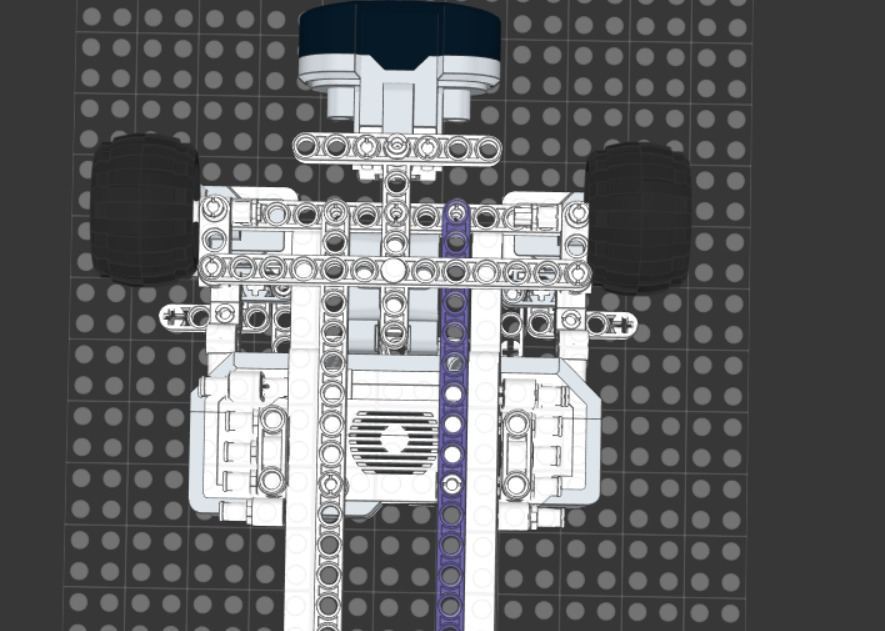
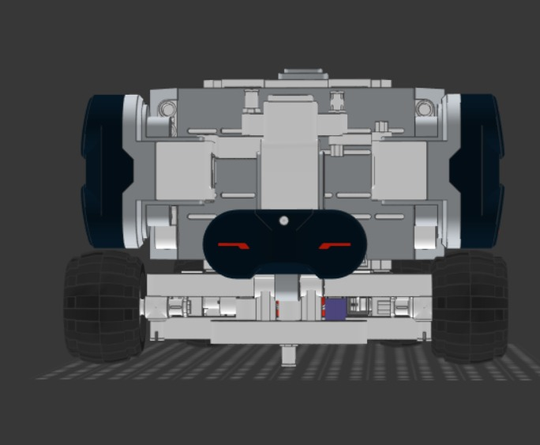
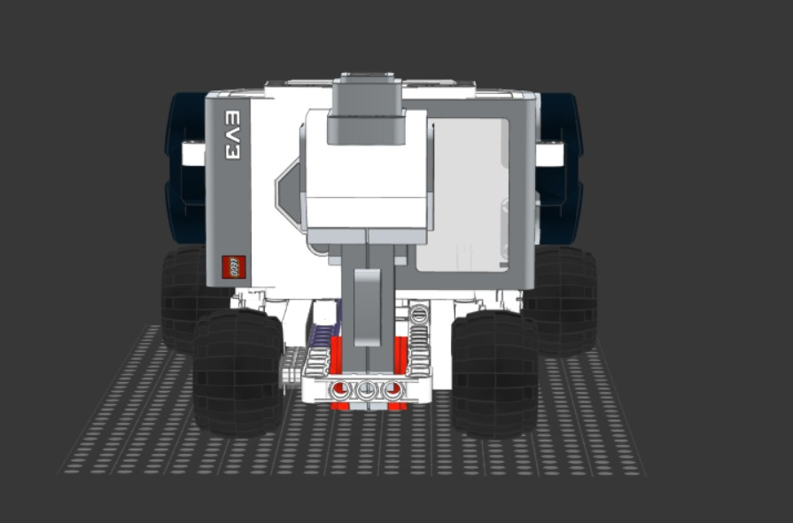
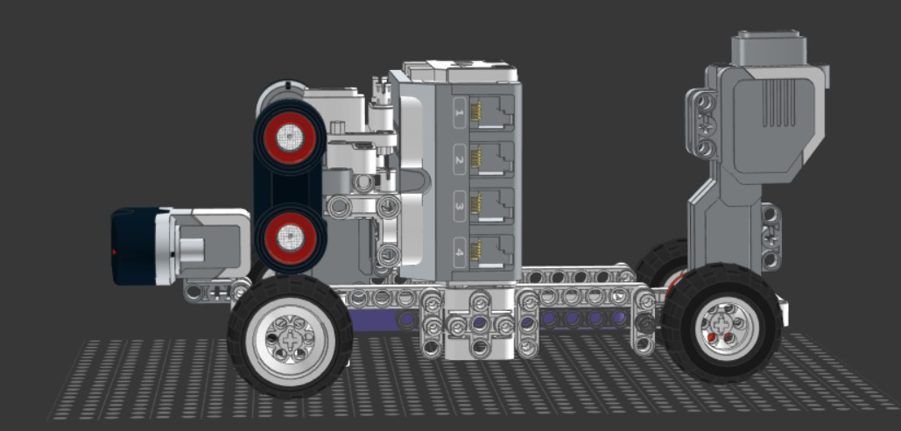
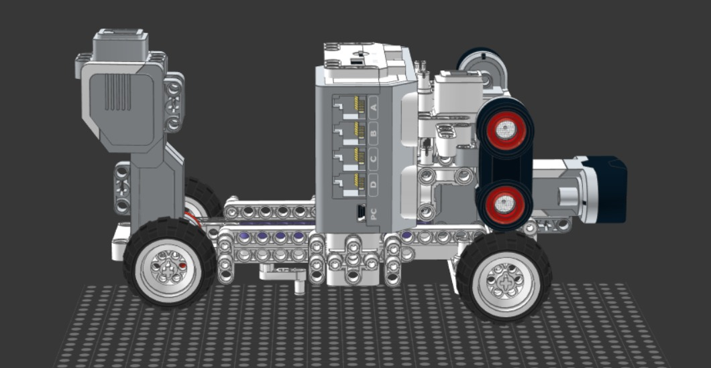
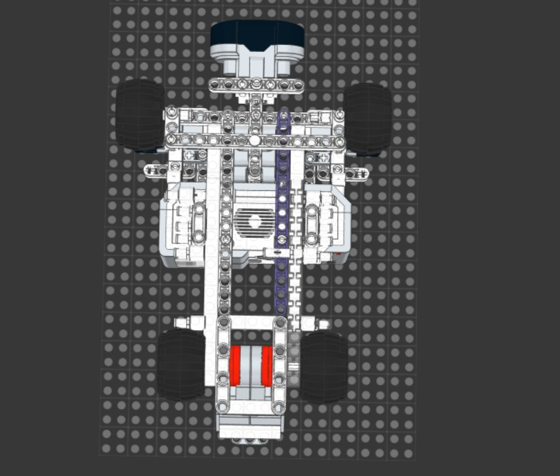

# Version 1 photos

This folder contains the visual documentation of **Version 1 (v1)** of Cheese, our first robot design reference for the WRO Future Engineers 2026 season. These photos help show the starting point of our mechanical development, including the early chassis layout, wheel placement, and Ackermann steering concept.

Documenting this version allows us to compare v1 with later versions and explain how the robot evolved through testing and redesign. Instead of only showing the final build, this folder gives evidence of our engineering iteration process and the decisions that led to a more stable and reliable robot.

---

## ❀ Photo Index ────୨ৎ────────୨ৎ────

| View                   |                               Preview                               | Purpose                                                                    |
| :--------------------- | :-----------------------------------------------------------------: | :------------------------------------------------------------------------- |
| **Ackermann steering** |  | Shows the first steering linkage concept and front-wheel turning geometry. |
| **Front view**         |             | Shows the front structure, steering layout, and wheel position.            |
| **Back view**          |               | Shows the rear structure and early drive-base arrangement.                 |
| **Left side**          |          | Shows the side profile, chassis length, and component height.              |
| **Right side**         |        | Shows the opposite side profile and structural symmetry.                   |
| **Top view**           |                 | Shows the full component layout, wheelbase, and chassis proportions.       |

  ✦ ─── ⋆⋅☆⋅⋆ ─── (❁´◡`❁) ─── ⋆⋅☆⋅⋆ ─── ✦

  

