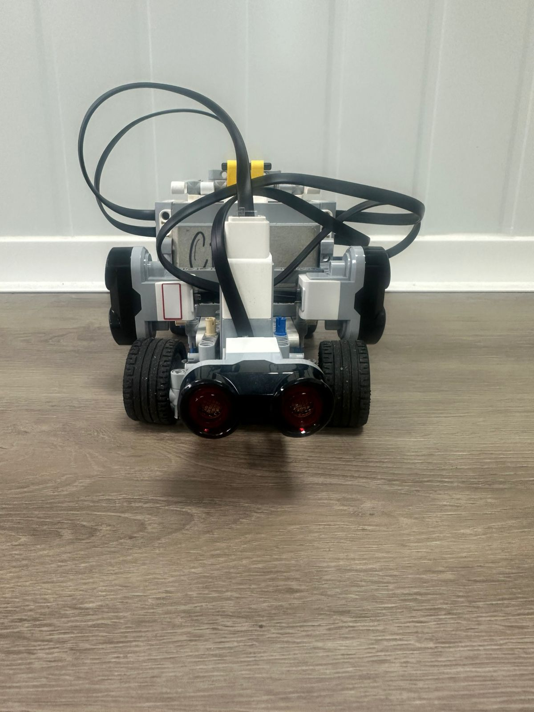
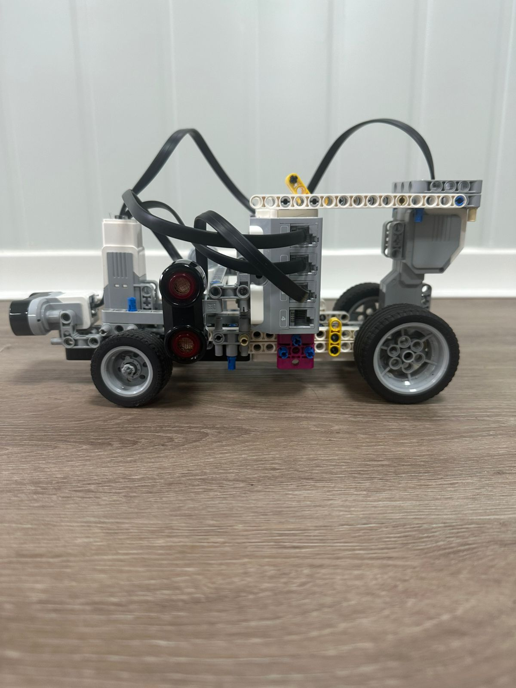
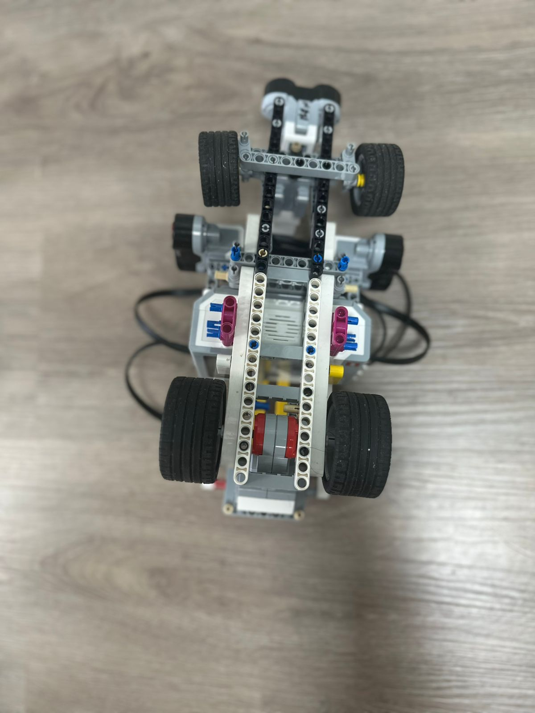
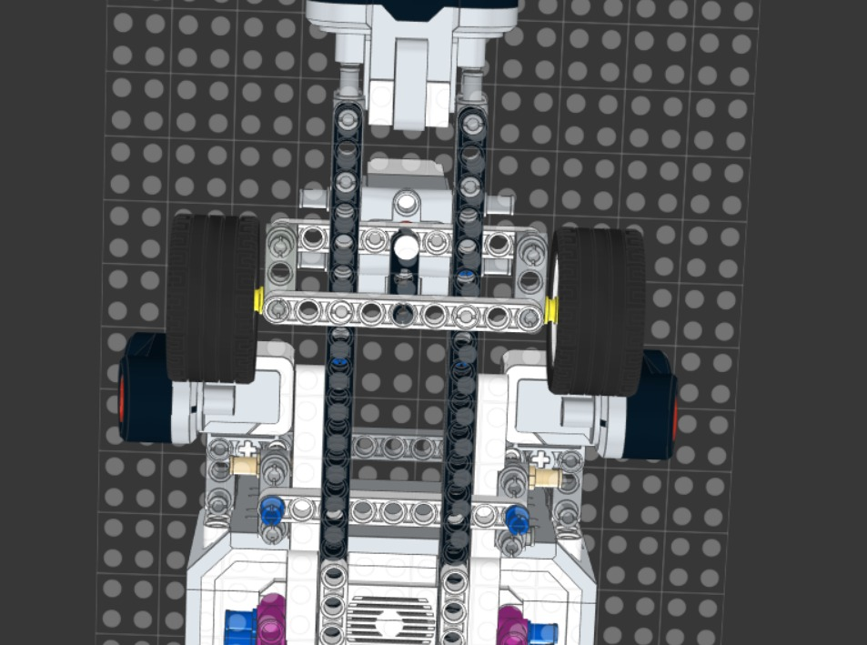
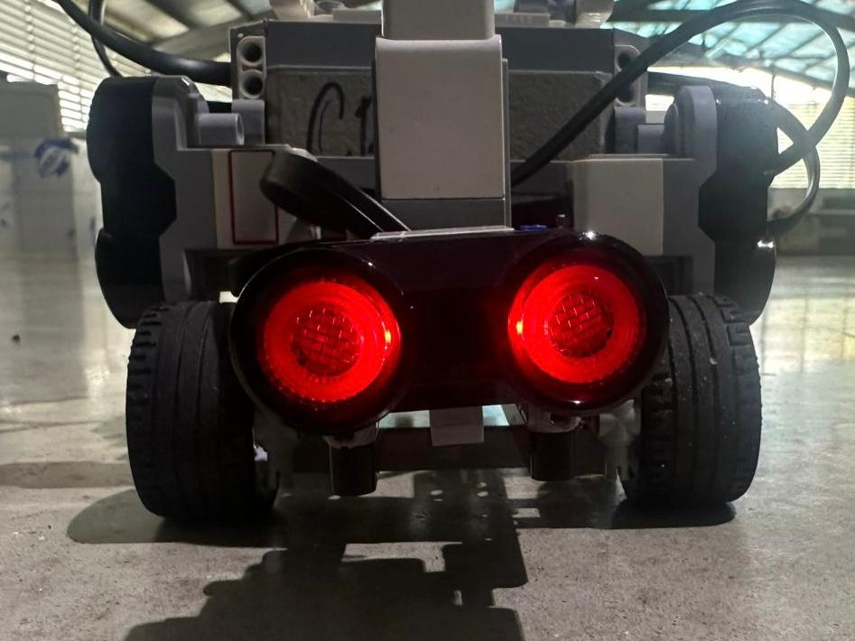
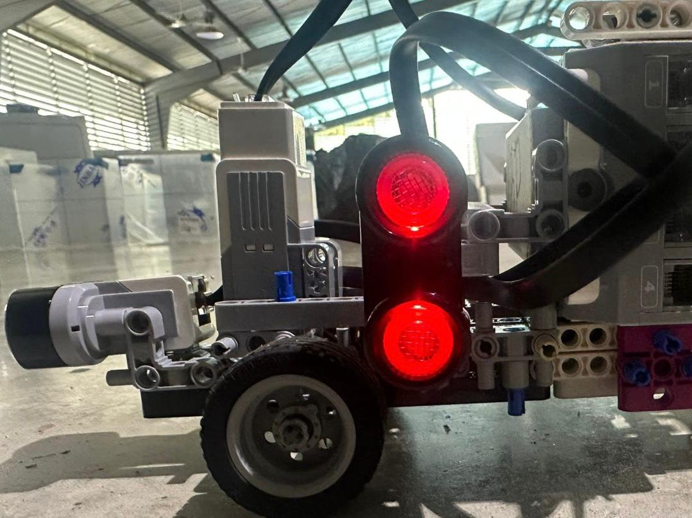
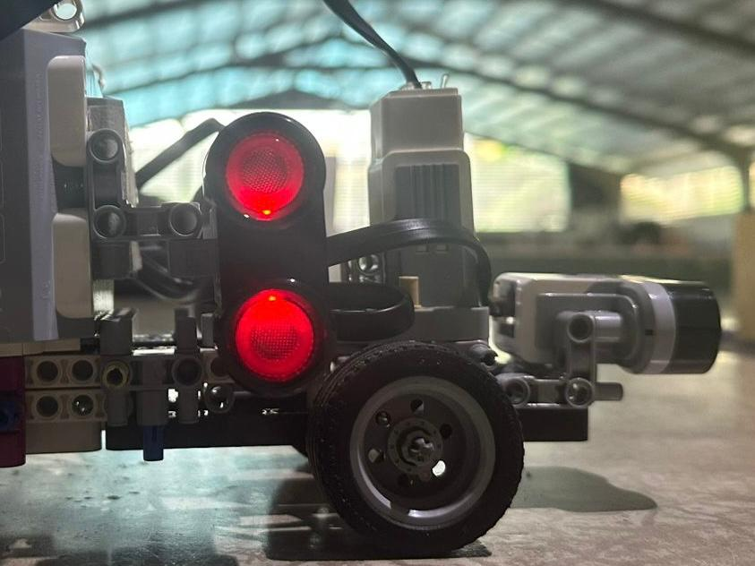

# Version 2 Photos

This folder documents **Version 2 (v2)** of Cheese, our first fully tested competition build. Compared to v1, this version helped us evaluate the robot’s real chassis stability, steering response, sensor placement, and drive-base behavior on the track. These photos are used as visual evidence for the improvements and problems that later guided the development of v3.

---

## ❀ Photo Index ────୨ৎ────────୨ৎ────

| View                       |                                        Preview                                        | Purpose                                                                         |
| :------------------------- | :-----------------------------------------------------------------------------------: | :------------------------------------------------------------------------------ |
| **Front view**             |                              | Shows the front structure, steering layout, and general sensor position.        |
| **Back view**              |                                | Shows the rear structure and drive-base arrangement.                            |
| **Left side**              |                           | Shows the side profile, wheelbase, chassis height, and component placement.     |
| **Right side**             |                         | Shows the opposite side profile and helps compare chassis balance.              |
| **Top view**               |                                  | Shows the EV3 placement, overall component layout, and wiring organization.     |
| **Bottom view**            |                            | Shows the underside structure, wheel connection, and mechanical support layout. |
| **Ackermann steering**     |                   | Shows the improved steering linkage and front-wheel turning geometry.           |
| **Front sensor placement** |  | Shows how the sensors were positioned at the front of the robot.                |
| **Left sensor placement**  |    | Shows the left-side sensor angle and placement for wall detection.              |
| **Right sensor placement** |  | Shows the right-side sensor angle and placement for wall detection.             |

---

## ❀ Why This Version Matters ────୨ৎ────────୨ৎ────

Version 2 matters because it was the first version that gave us real testing feedback on the track. It helped us identify which mechanical choices were working and which areas needed improvement, especially in steering consistency, sensor positioning, and chassis rigidity. The information collected from this version directly influenced the redesign choices made for v3.

