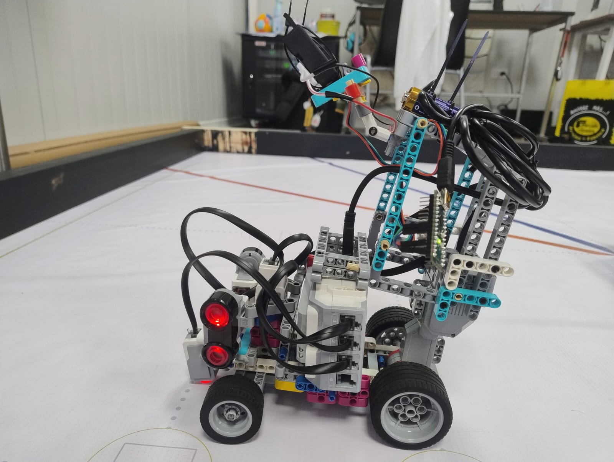
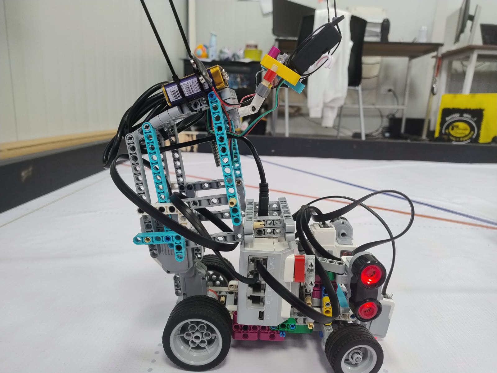

# Version 3 Photos

This folder documents **Version 3 (v3)** of Cheese, our current competition build for the WRO Future Engineers 2026 season. This version includes the reinforced chassis, improved sensor placement, updated camera mounting, and the final physical layout used for testing. The photos in this folder help show how the design evolved from v1 and v2 into a more stable and competition-ready vehicle.

Some digital resources, such as the 3D BrickLink model of the current Ackermann steering mechanism, will be added later once completed. For now, this folder focuses on the real physical build of v3.

---

## ❀ Photo Index ────୨ৎ────────୨ৎ────

| View                        |                                        Preview                                        | Purpose                                                                    |
| :-------------------------- | :-----------------------------------------------------------------------------------: | :------------------------------------------------------------------------- |
| **Front view**              |                               | Shows the front structure, steering area, and front sensor layout.         |
| **Back view**               |                                 | Shows the rear structure, drive base, and back chassis support.            |
| **Left view**               |                                 | Shows the left-side profile, wheelbase, and component height.              |
| **Right view**              |                               | Shows the right-side profile and helps document structural symmetry.       |
| **Side view**               |                                 | Shows the general side layout and overall chassis proportions.             |
| **Top view**                |                                   | Shows the EV3 placement, wiring layout, and main component organization.   |
| **Bottom view**             |                             | Shows the underside structure, chassis support, and wheel connections.     |
| **Camera sensor placement** |   | Shows the HuskyLens/camera mounting position for obstacle detection.       |
| **Front sensor placement**  |  | Shows the front-facing sensor arrangement and its position on the chassis. |
| **Left sensor placement**   |    | Shows the left ultrasonic sensor placement used for wall detection.        |
| **Right sensor placement**  |  | Shows the right ultrasonic sensor placement used for wall detection.       |

---

## ❀ Why This Version Matters ────୨ৎ────────୨ৎ────

Version 3 represents the current engineering direction of Cheese. After testing earlier versions, we focused on improving rigidity, sensor visibility, wiring organization, and overall stability. These photos document the final physical layout used during testing and help explain why v3 is more reliable than the previous builds.

