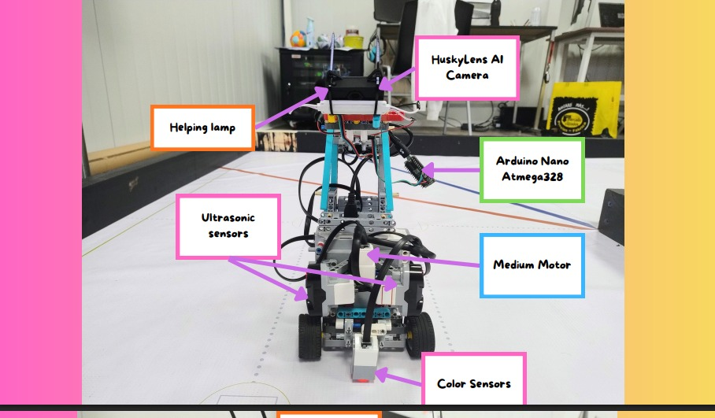
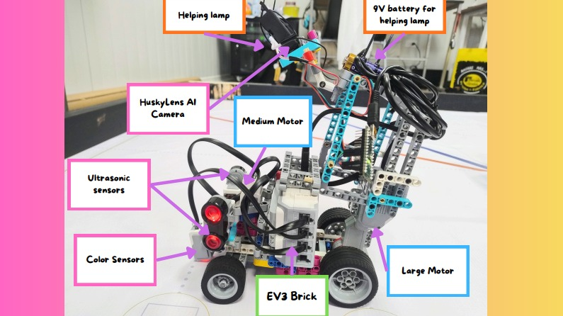
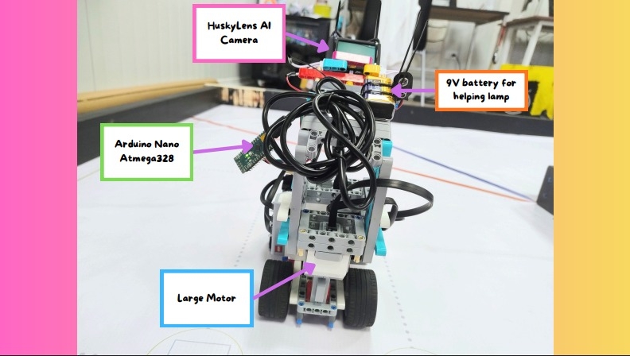
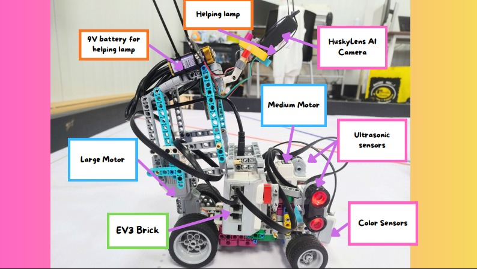
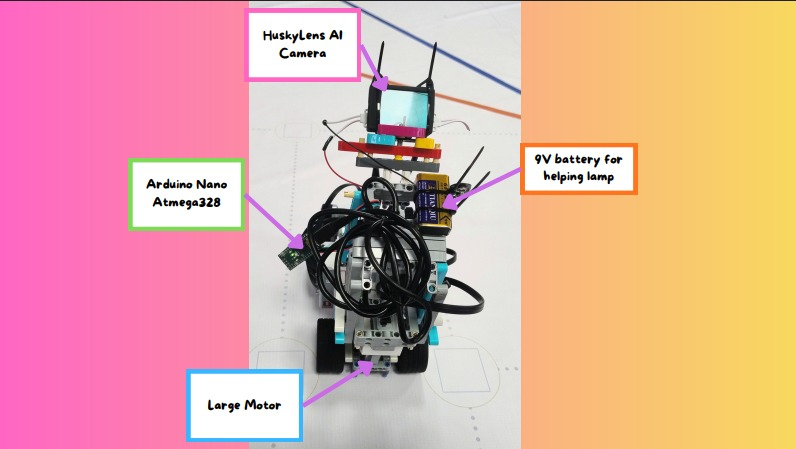
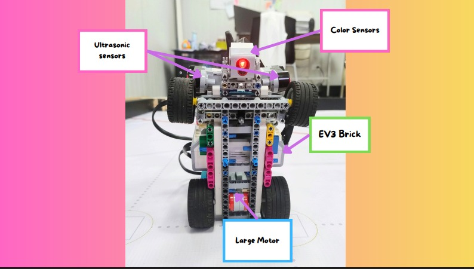

# ᯓ★ Cheese v3 Named Angles ᯓ★

This folder contains labeled photos of **Cheese v3** from different angles. These images identify the main components of the robot, including the EV3 Brick, motors, sensors, HuskyLens camera, Arduino Nano, lighting system, and chassis structure.

---

## ❀ Named Angle Index ────୨ৎ────────୨ৎ────

| View                   |                                       Preview                                      | What it identifies                                                                                               |
| :--------------------- | :--------------------------------------------------------------------------------: | :--------------------------------------------------------------------------------------------------------------- |
| **Front named angle**  |    | Front layout, HuskyLens camera, helping lamp, ultrasonic sensors, color sensor, Arduino Nano, and steering area. |
| **Left named angle**   |      | Left-side structure, EV3 Brick placement, motors, sensor alignment, lighting system, and chassis support.        |
| **Back named angle**   |      | Rear structure, Large Motor position, Arduino Nano, HuskyLens camera, wiring area, and lighting battery.         |
| **Right named angle**  |    | Right-side component layout, motors, sensors, EV3 Brick position, and support structure.                         |
| **Top named angle**    |        | Top-down organization, wiring path, camera system, Arduino Nano placement, and rear motor area.                  |
| **Bottom named angle** |  | Underside structure, wheelbase, chassis support, EV3 position, sensor visibility, and motor placement.           |

---

## ❀ Why These Angles Matter ────୨ৎ────────୨ৎ────

These named angles make the robot easier to understand by showing where each important component is placed. They support the documentation for mobility, sensors, power, vision, and structure in the current v3 build.
